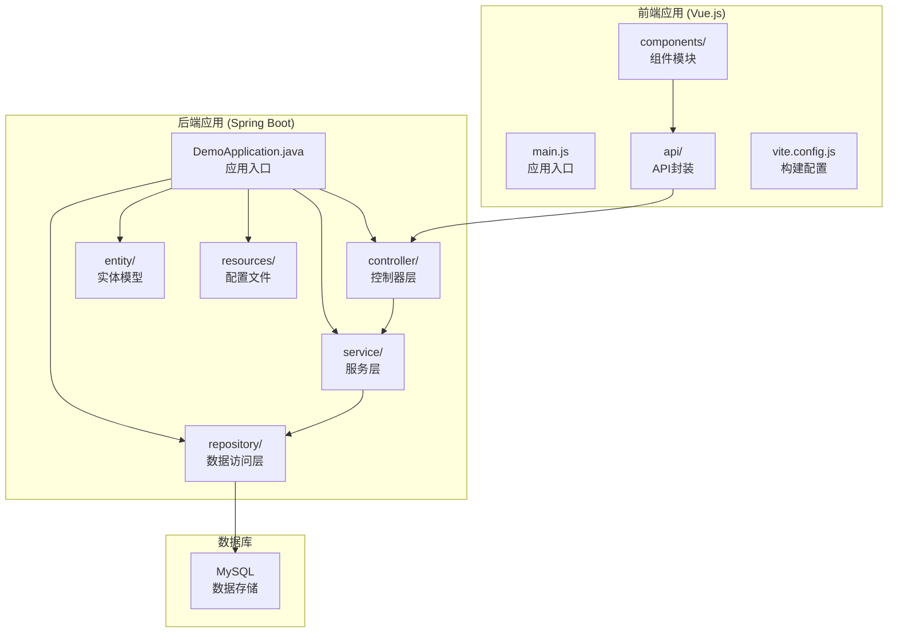
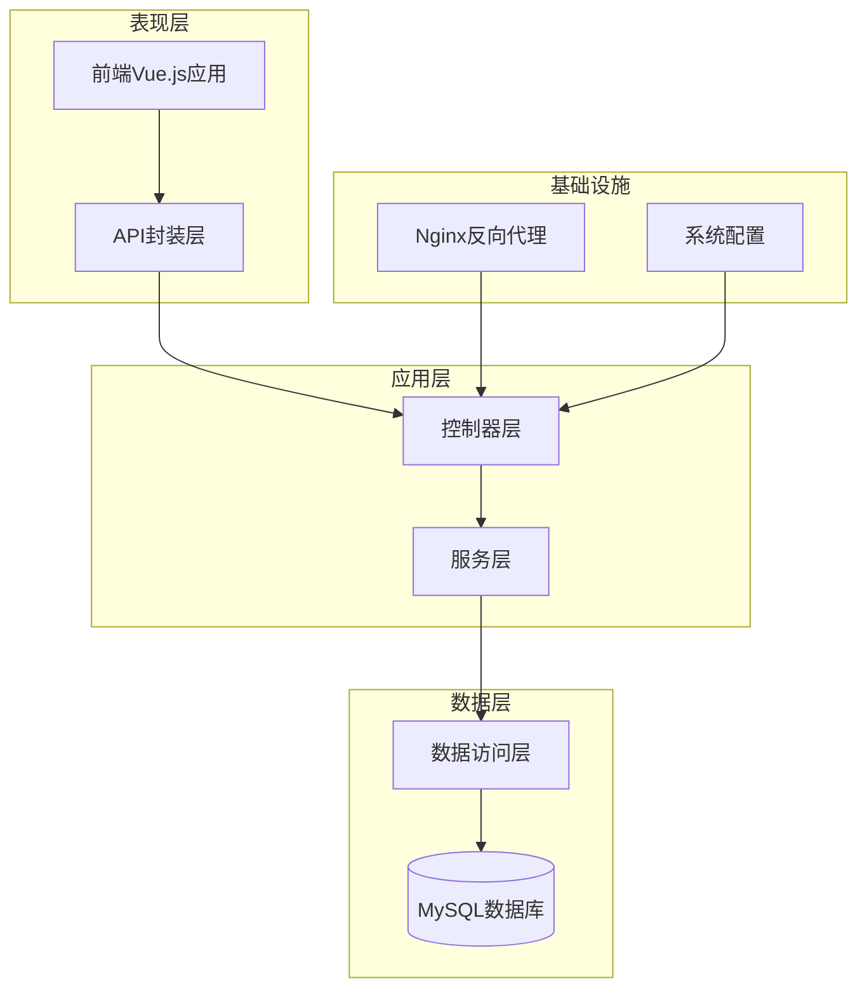
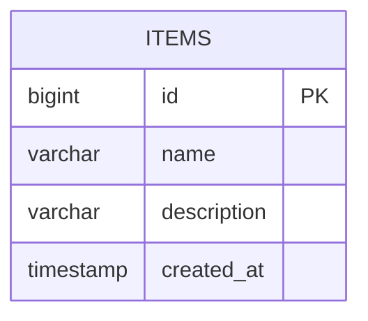
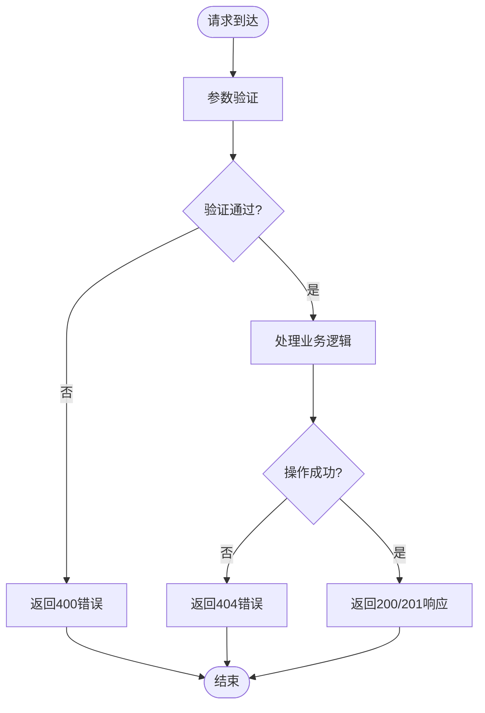
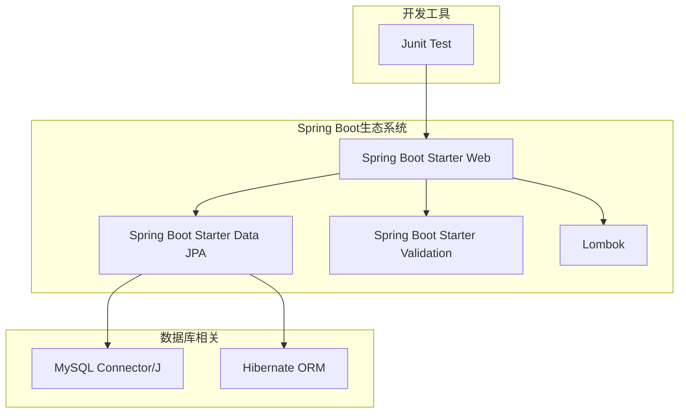
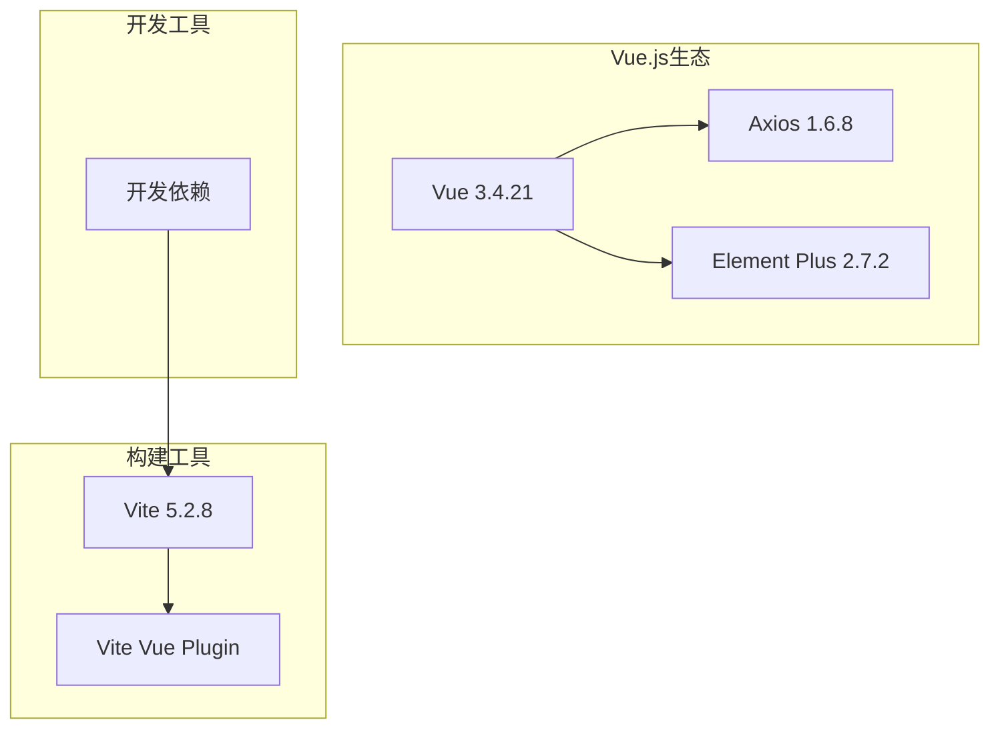
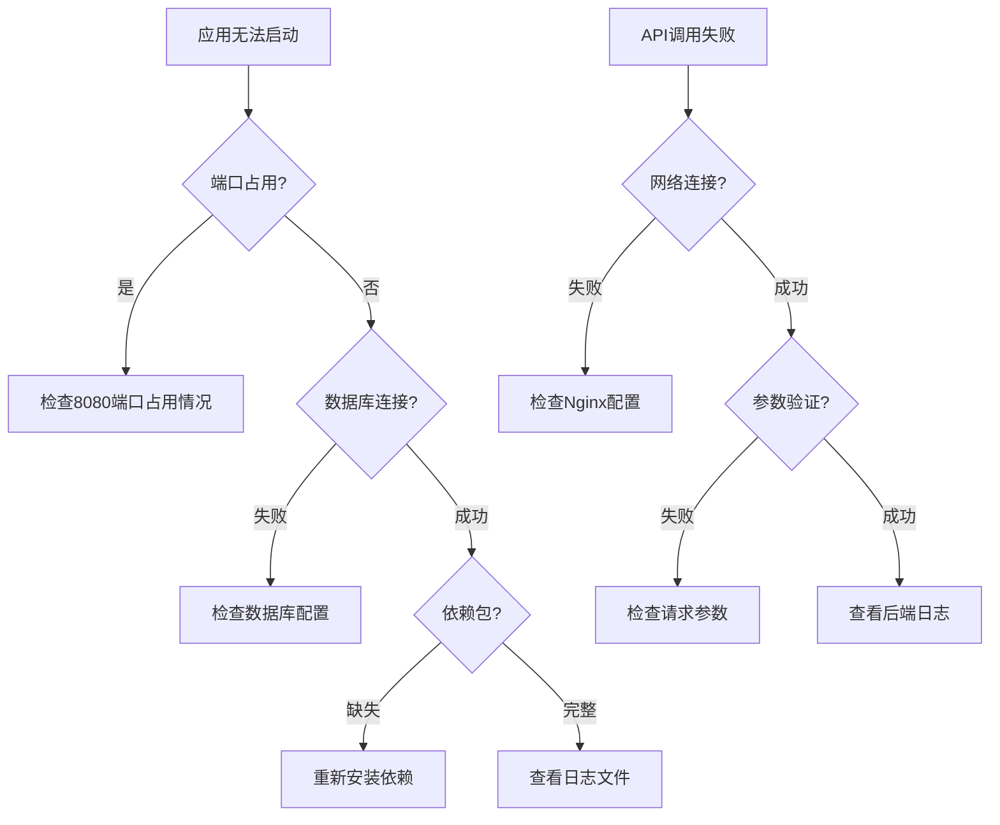

# API接口参考

<cite>
**本文档引用的文件**
- [ItemController.java](file://backend/src/main/java/com/example/demo/controller/ItemController.java)
- [ItemService.java](file://backend/src/main/java/com/example/demo/service/ItemService.java)
- [Item.java](file://backend/src/main/java/com/example/demo/entity/Item.java)
- [ItemRepository.java](file://backend/src/main/java/com/example/demo/repository/ItemRepository.java)
- [application.yml](file://backend/src/main/resources/application.yml)
- [DemoApplication.java](file://backend/src/main/java/com/example/demo/DemoApplication.java)
- [item.js](file://frontend/src/api/item.js)
- [ItemManager.vue](file://frontend/src/components/ItemManager.vue)
- [package.json](file://frontend/package.json)
- [pom.xml](file://backend/pom.xml)
- [README.deploy.md](file://README.deploy.md)
</cite>

## 目录
1. [简介](#简介)
2. [项目结构](#项目结构)
3. [核心组件](#核心组件)
4. [架构概览](#架构概览)
5. [详细组件分析](#详细组件分析)
6. [依赖分析](#依赖分析)
7. [性能考虑](#性能考虑)
8. [故障排除指南](#故障排除指南)
9. [结论](#结论)
10. [附录](#附录)

## 简介
本项目是一个基于Spring Boot的REST API示例应用，提供了完整的商品管理功能。该应用实现了标准的CRUD操作，包括列表查询、搜索、详情获取、创建、更新和删除功能。项目采用前后端分离架构，后端提供RESTful API接口，前端使用Vue.js进行数据展示和交互。

## 项目结构
该项目采用典型的分层架构设计，包含后端Spring Boot应用和前端Vue.js应用两个主要部分。



**图表来源**
- [DemoApplication.java:1-13](file://backend/src/main/java/com/example/demo/DemoApplication.java#L1-L13)
- [ItemController.java:1-59](file://backend/src/main/java/com/example/demo/controller/ItemController.java#L1-L59)
- [application.yml:1-18](file://backend/src/main/resources/application.yml#L1-L18)

**章节来源**
- [DemoApplication.java:1-13](file://backend/src/main/java/com/example/demo/DemoApplication.java#L1-L13)
- [pom.xml:1-71](file://backend/pom.xml#L1-L71)

## 核心组件
本项目的核心组件围绕商品管理展开，主要包括以下四个层次：

### 控制器层 (Controller Layer)
- **ItemController**: 提供REST API接口，处理HTTP请求和响应
- **跨域配置**: 使用@CrossOrigin注解允许所有域名访问

### 服务层 (Service Layer)
- **ItemService**: 实现业务逻辑，协调数据访问和事务管理
- **事务管理**: 使用@Transactional注解确保数据一致性

### 数据访问层 (Repository Layer)
- **ItemRepository**: 继承JpaRepository，提供数据持久化操作
- **查询方法**: 支持按名称模糊查询

### 实体模型层 (Entity Layer)
- **Item实体**: 映射到数据库items表，包含基础字段和时间戳

**章节来源**
- [ItemController.java:15-59](file://backend/src/main/java/com/example/demo/controller/ItemController.java#L15-L59)
- [ItemService.java:13-50](file://backend/src/main/java/com/example/demo/service/ItemService.java#L13-L50)
- [ItemRepository.java:1-13](file://backend/src/main/java/com/example/demo/repository/ItemRepository.java#L1-13)
- [Item.java:1-30](file://backend/src/main/java/com/example/demo/entity/Item.java#L1-L30)

## 架构概览
系统采用经典的三层架构模式，实现了清晰的职责分离和良好的可扩展性。



**图表来源**
- [ItemController.java:15-59](file://backend/src/main/java/com/example/demo/controller/ItemController.java#L15-L59)
- [ItemService.java:13-50](file://backend/src/main/java/com/example/demo/service/ItemService.java#L13-L50)
- [application.yml:1-18](file://backend/src/main/resources/application.yml#L1-L18)
- [README.deploy.md:275-312](file://README.deploy.md#L275-L312)

## 详细组件分析

### REST API接口规范

#### GET /api/items - 商品列表查询
**功能描述**: 获取商品分页列表，支持排序和过滤

**请求参数**:
- `page` (可选): 页码，默认值为0
- `size` (可选): 每页数量，默认值为10
- `sort` (可选): 排序字段，默认值为"id"
- `direction` (可选): 排序方向，默认值为"desc"

**响应格式**:
```json
{
  "content": [
    {
      "id": 1,
      "name": "示例商品",
      "description": "商品描述",
      "createdAt": "2024-01-01T12:00:00"
    }
  ],
  "pageable": {
    "sort": {"sorted": true, "unsorted": false},
    "pageNumber": 0,
    "pageSize": 10,
    "offset": 0,
    "paged": true,
    "unpaged": false
  },
  "last": false,
  "totalElements": 100,
  "totalPages": 10,
  "size": 10,
  "number": 0,
  "sort": {"sorted": true, "unsorted": false},
  "first": true,
  "numberOfElements": 10,
  "empty": false
}
```

**状态码**:
- 200 OK: 请求成功
- 400 Bad Request: 参数无效
- 500 Internal Server Error: 服务器内部错误

**请求示例**:
```bash
curl -X GET "http://localhost:8080/api/items?page=0&size=10&sort=id&direction=desc"
```

**响应示例**:
```json
{
  "content": [
    {
      "id": 1,
      "name": "笔记本电脑",
      "description": "高性能游戏笔记本",
      "createdAt": "2024-01-15T10:30:00"
    }
  ],
  "totalElements": 1,
  "totalPages": 1,
  "number": 0,
  "size": 10,
  "first": true,
  "last": true
}
```

#### GET /api/items/search - 商品搜索
**功能描述**: 根据关键词搜索商品名称

**请求参数**:
- `keyword` (必需): 搜索关键词

**响应格式**: 商品数组
```json
[
  {
    "id": 1,
    "name": "示例商品",
    "description": "商品描述",
    "createdAt": "2024-01-01T12:00:00"
  }
]
```

**状态码**:
- 200 OK: 请求成功
- 400 Bad Request: 缺少关键词参数
- 500 Internal Server Error: 服务器内部错误

**请求示例**:
```bash
curl -X GET "http://localhost:8080/api/items/search?keyword=笔记本"
```

#### GET /api/items/{id} - 获取单个商品
**功能描述**: 根据ID获取指定商品的详细信息

**路径参数**:
- `id` (必需): 商品ID

**响应格式**:
```json
{
  "id": 1,
  "name": "示例商品",
  "description": "商品描述",
  "createdAt": "2024-01-01T12:00:00"
}
```

**状态码**:
- 200 OK: 请求成功
- 404 Not Found: 商品不存在
- 500 Internal Server Error: 服务器内部错误

**请求示例**:
```bash
curl -X GET "http://localhost:8080/api/items/1"
```

#### POST /api/items - 创建商品
**功能描述**: 创建新的商品记录

**请求头**:
- Content-Type: application/json

**请求体**:
```json
{
  "name": "新商品名称",
  "description": "商品描述"
}
```

**响应格式**:
```json
{
  "id": 1,
  "name": "新商品名称",
  "description": "商品描述",
  "createdAt": "2024-01-01T12:00:00"
}
```

**状态码**:
- 201 Created: 创建成功
- 400 Bad Request: 请求参数无效
- 500 Internal Server Error: 服务器内部错误

**请求示例**:
```bash
curl -X POST "http://localhost:8080/api/items" \
  -H "Content-Type: application/json" \
  -d '{"name":"笔记本电脑","description":"高性能游戏笔记本"}'
```

#### PUT /api/items/{id} - 更新商品
**功能描述**: 更新现有商品的信息

**路径参数**:
- `id` (必需): 商品ID

**请求头**:
- Content-Type: application/json

**请求体**:
```json
{
  "name": "更新后的名称",
  "description": "更新后的描述"
}
```

**响应格式**:
```json
{
  "id": 1,
  "name": "更新后的名称",
  "description": "更新后的描述",
  "createdAt": "2024-01-01T12:00:00"
}
```

**状态码**:
- 200 OK: 更新成功
- 404 Not Found: 商品不存在
- 500 Internal Server Error: 服务器内部错误

**请求示例**:
```bash
curl -X PUT "http://localhost:8080/api/items/1" \
  -H "Content-Type: application/json" \
  -d '{"name":"更新后的笔记本","description":"更新后的描述"}'
```

#### DELETE /api/items/{id} - 删除商品
**功能描述**: 删除指定ID的商品记录

**路径参数**:
- `id` (必需): 商品ID

**响应格式**: 无内容

**状态码**:
- 204 No Content: 删除成功
- 404 Not Found: 商品不存在
- 500 Internal Server Error: 服务器内部错误

**请求示例**:
```bash
curl -X DELETE "http://localhost:8080/api/items/1"
```

**章节来源**
- [ItemController.java:23-57](file://backend/src/main/java/com/example/demo/controller/ItemController.java#L23-L57)
- [ItemService.java:19-48](file://backend/src/main/java/com/example/demo/service/ItemService.java#L19-L48)

### 数据模型定义

#### Item实体模型


**字段说明**:
- `id`: 主键，自增标识符
- `name`: 商品名称，必填，长度不超过100字符
- `description`: 商品描述，可选，长度不超过500字符
- `createdAt`: 创建时间，自动设置

**章节来源**
- [Item.java:10-29](file://backend/src/main/java/com/example/demo/entity/Item.java#L10-L29)

### 错误处理机制

#### 异常处理流程


**图表来源**
- [ItemService.java:27-30](file://backend/src/main/java/com/example/demo/service/ItemService.java#L27-L30)

**章节来源**
- [ItemService.java:27-30](file://backend/src/main/java/com/example/demo/service/ItemService.java#L27-L30)

## 依赖分析

### 后端技术栈依赖


**图表来源**
- [pom.xml:24-52](file://backend/pom.xml#L24-L52)

### 前端技术栈依赖


**图表来源**
- [package.json:11-19](file://frontend/package.json#L11-L19)

**章节来源**
- [pom.xml:24-52](file://backend/pom.xml#L24-L52)
- [package.json:11-19](file://frontend/package.json#L11-L19)

## 性能考虑
基于当前实现的性能特征分析：

### 数据库性能
- **分页查询**: 使用Spring Data JPA的Pageable接口实现高效分页
- **索引优化**: 建议在name字段上建立索引以提升搜索性能
- **连接池**: 默认连接池配置适用于小规模应用

### 缓存策略
- **无缓存**: 当前实现未包含缓存层
- **建议**: 对于频繁读取的数据可考虑添加Redis缓存

### 并发处理
- **线程安全**: Spring服务层默认单例模式，注意线程安全
- **事务管理**: 使用@Transactional确保数据一致性

## 故障排除指南

### 常见问题诊断


### 部署相关问题
- **Nginx反向代理**: 确保/proxy_pass配置正确指向后端8080端口
- **CORS配置**: 当前允许所有域名访问，生产环境建议限制特定域名
- **数据库权限**: 确保数据库用户具有足够的访问权限

**章节来源**
- [README.deploy.md:377-397](file://README.deploy.md#L377-L397)

## 结论
本项目提供了一个完整的REST API实现示例，展示了Spring Boot框架的最佳实践。系统具有清晰的分层架构、完善的CRUD功能和良好的扩展性。建议在生产环境中进一步完善安全配置、性能优化和监控机制。

## 附录

### 客户端集成指南

#### JavaScript SDK使用示例
```javascript
// 基础API封装
import axios from 'axios'

const request = axios.create({
  baseURL: '/api/items',
  timeout: 10000
})

// 获取商品列表
export function fetchItems(params) {
  return request.get('', { params })
}

// 搜索商品
export function searchItems(keyword) {
  return request.get('/search', { params: { keyword } })
}

// 创建商品
export function createItem(data) {
  return request.post('', data)
}

// 更新商品
export function updateItem(id, data) {
  return request.put(`/${id}`, data)
}

// 删除商品
export function deleteItem(id) {
  return request.delete(`/${id}`)
}
```

#### Vue.js组件集成
```javascript
// 在Vue组件中使用
import { fetchItems, createItem, updateItem, deleteItem } from '../api/item.js'

// 加载数据
async function loadData() {
  const res = await fetchItems({
    page: pagination.page - 1,
    size: pagination.size
  })
  tableData.value = res.data.content
  pagination.total = res.data.totalElements
}

// 创建新商品
async function handleSubmit() {
  try {
    await createItem({ name: form.name, description: form.description })
    // 成功处理
  } catch (err) {
    // 错误处理
  }
}
```

### 部署配置参考

#### 生产环境配置
```yaml
server:
  port: 8080

spring:
  datasource:
    url: jdbc:mysql://localhost:3306/demo_db?useSSL=false&allowPublicKeyRetrieval=true&serverTimezone=Asia/Shanghai&characterEncoding=utf-8
    username: demo
    password: YourStrongPwd@2026
    driver-class-name: com.mysql.cj.jdbc.Driver
  jpa:
    hibernate:
      ddl-auto: update
    show-sql: false
    properties:
      hibernate:
        dialect: org.hibernate.dialect.MySQLDialect
```

**章节来源**
- [item.js:1-31](file://frontend/src/api/item.js#L1-L31)
- [ItemManager.vue:87-220](file://frontend/src/components/ItemManager.vue#L87-L220)
- [application.yml:1-18](file://backend/src/main/resources/application.yml#L1-L18)
- [README.deploy.md:179-206](file://README.deploy.md#L179-L206)