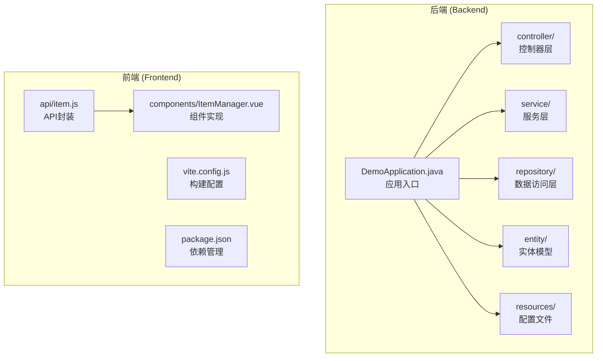
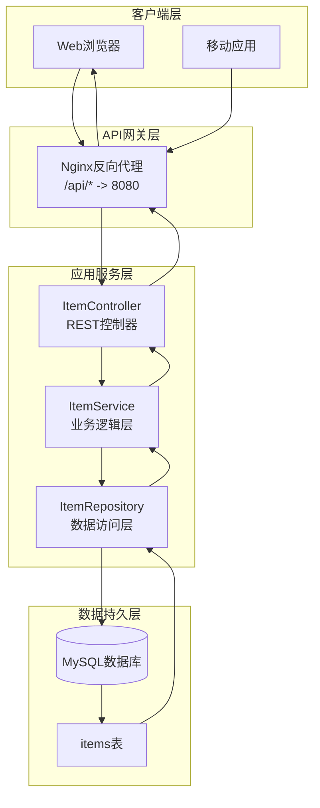
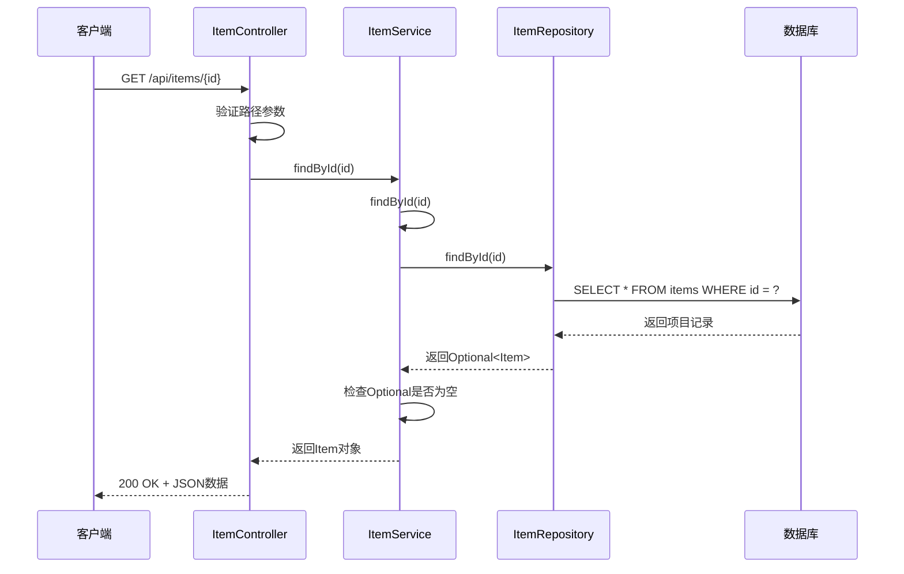
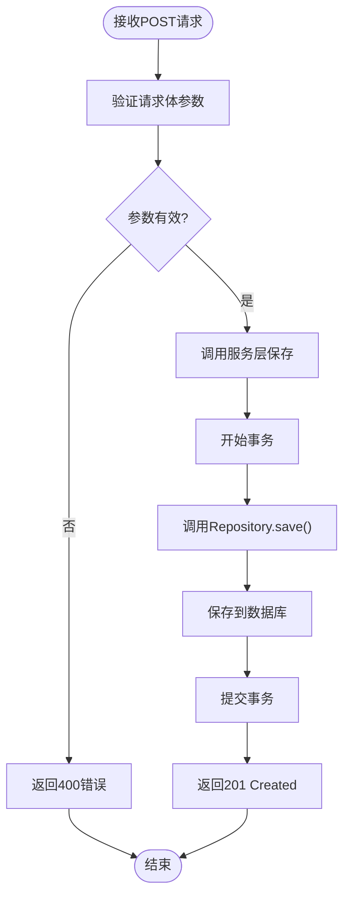
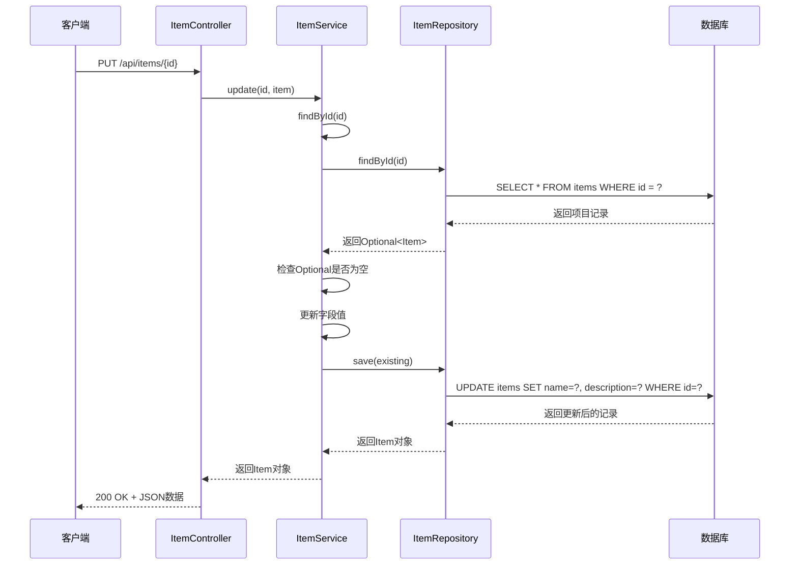
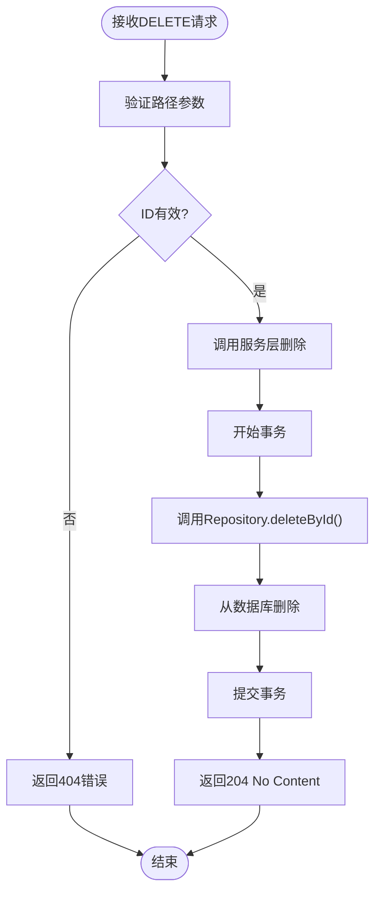
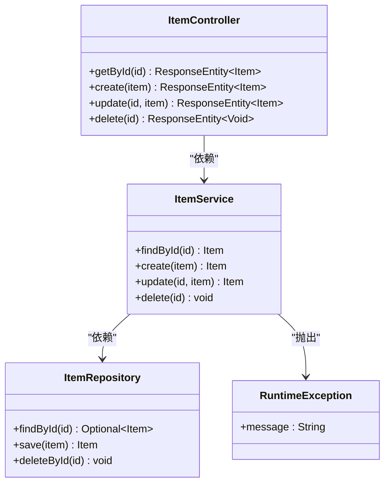
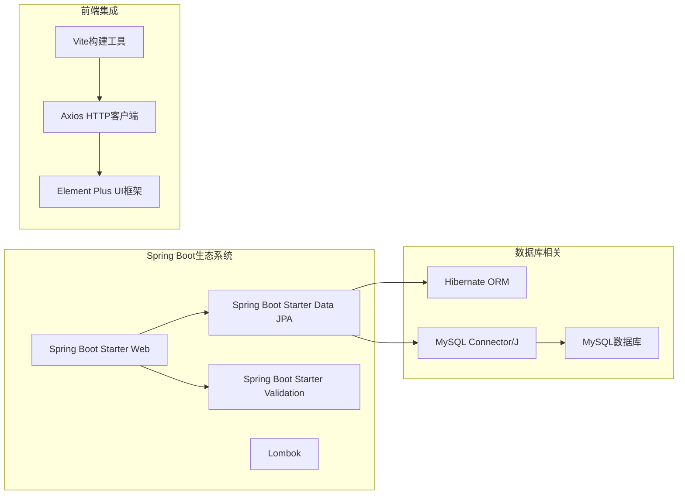
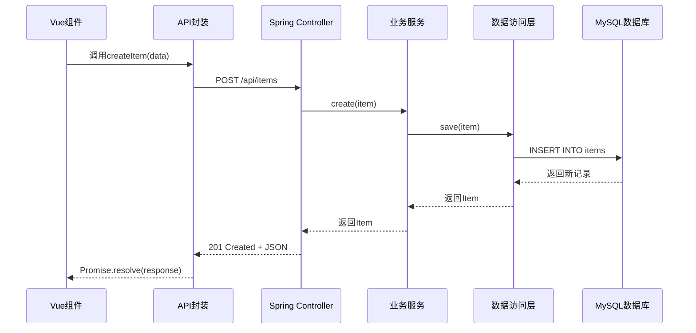

# CRUD操作接口

<cite>
**本文档引用的文件**
- [ItemController.java](file://backend/src/main/java/com/example/demo/controller/ItemController.java)
- [ItemService.java](file://backend/src/main/java/com/example/demo/service/ItemService.java)
- [ItemRepository.java](file://backend/src/main/java/com/example/demo/repository/ItemRepository.java)
- [Item.java](file://backend/src/main/java/com/example/demo/entity/Item.java)
- [application.yml](file://backend/src/main/resources/application.yml)
- [pom.xml](file://backend/pom.xml)
- [item.js](file://frontend/src/api/item.js)
- [ItemManager.vue](file://frontend/src/components/ItemManager.vue)
- [DemoApplication.java](file://backend/src/main/java/com/example/demo/DemoApplication.java)
</cite>

## 目录
1. [简介](#简介)
2. [项目结构](#项目结构)
3. [核心组件](#核心组件)
4. [架构概览](#架构概览)
5. [详细组件分析](#详细组件分析)
6. [依赖关系分析](#依赖关系分析)
7. [性能考虑](#性能考虑)
8. [故障排除指南](#故障排除指南)
9. [结论](#结论)

## 简介

这是一个基于Spring Boot的CRUD操作接口示例项目，提供了完整的RESTful API实现。该项目展示了标准的三层架构设计模式，包括控制器层、服务层和数据访问层，以及前后端分离的实现方式。

## 项目结构

该项目采用标准的Spring Boot项目结构，主要分为后端和前端两个部分：



**图表来源**
- [DemoApplication.java:1-13](file://backend/src/main/java/com/example/demo/DemoApplication.java#L1-L13)
- [ItemController.java:1-59](file://backend/src/main/java/com/example/demo/controller/ItemController.java#L1-L59)
- [ItemService.java:1-50](file://backend/src/main/java/com/example/demo/service/ItemService.java#L1-L50)
- [ItemRepository.java:1-13](file://backend/src/main/java/com/example/demo/repository/ItemRepository.java#L1-L13)
- [Item.java:1-30](file://backend/src/main/java/com/example/demo/entity/Item.java#L1-L30)

**章节来源**
- [DemoApplication.java:1-13](file://backend/src/main/java/com/example/demo/DemoApplication.java#L1-L13)
- [pom.xml:1-71](file://backend/pom.xml#L1-L71)

## 核心组件

### 数据模型定义

系统的核心数据模型是一个名为`Item`的实体，包含以下字段：

| 字段名 | 类型 | 约束条件 | 描述 |
|--------|------|----------|------|
| id | Long | 主键, 自增 | 项目唯一标识符 |
| name | String | 非空, 最大长度100 | 项目名称 |
| description | String | 最大长度500 | 项目描述 |
| createdAt | LocalDateTime | 只读 | 创建时间戳 |

### 依赖注入配置

项目使用Lombok简化代码，通过注解实现依赖注入和getter/setter生成。

**章节来源**
- [Item.java:1-30](file://backend/src/main/java/com/example/demo/entity/Item.java#L1-L30)
- [ItemController.java:1-59](file://backend/src/main/java/com/example/demo/controller/ItemController.java#L1-L59)
- [ItemService.java:1-50](file://backend/src/main/java/com/example/demo/service/ItemService.java#L1-L50)

## 架构概览

系统采用经典的MVC架构模式，通过RESTful API提供CRUD操作：



**图表来源**
- [ItemController.java:15-59](file://backend/src/main/java/com/example/demo/controller/ItemController.java#L15-L59)
- [ItemService.java:13-50](file://backend/src/main/java/com/example/demo/service/ItemService.java#L13-L50)
- [ItemRepository.java:1-13](file://backend/src/main/java/com/example/demo/repository/ItemRepository.java#L1-L13)
- [application.yml:1-18](file://backend/src/main/resources/application.yml#L1-L18)

## 详细组件分析

### GET /api/items/{id} - 获取单个项目

#### 接口规范

**HTTP方法**: GET  
**URL路径**: `/api/items/{id}`  
**路径参数**: 
- `id` (Long): 项目唯一标识符，必须为正整数

**请求头**: 
- Content-Type: application/json

**响应状态码**:
- 200 OK: 成功获取项目信息
- 404 Not Found: 项目不存在

**成功响应示例**:
```json
{
  "id": 1,
  "name": "示例项目",
  "description": "这是一个示例项目描述",
  "createdAt": "2024-01-15T10:30:00"
}
```

**失败响应示例**:
```json
{
  "timestamp": "2024-01-15T10:30:00Z",
  "status": 404,
  "error": "Not Found",
  "message": "Item not found with id: 999"
}
```

#### 处理流程



**图表来源**
- [ItemController.java:38-41](file://backend/src/main/java/com/example/demo/controller/ItemController.java#L38-L41)
- [ItemService.java:27-30](file://backend/src/main/java/com/example/demo/service/ItemService.java#L27-L30)
- [ItemRepository.java:9-13](file://backend/src/main/java/com/example/demo/repository/ItemRepository.java#L9-L13)

**章节来源**
- [ItemController.java:38-41](file://backend/src/main/java/com/example/demo/controller/ItemController.java#L38-L41)
- [ItemService.java:27-30](file://backend/src/main/java/com/example/demo/service/ItemService.java#L27-L30)

### POST /api/items - 创建新项目

#### 接口规范

**HTTP方法**: POST  
**URL路径**: `/api/items`  
**请求体**: 
```json
{
  "name": "字符串, 必填, 最大长度100",
  "description": "字符串, 可选, 最大长度500"
}
```

**响应状态码**:
- 201 Created: 成功创建项目
- 400 Bad Request: 请求参数无效

**成功响应示例**:
```json
{
  "id": 2,
  "name": "新创建的项目",
  "description": "项目描述",
  "createdAt": "2024-01-15T11:45:00"
}
```

**失败响应示例**:
```json
{
  "timestamp": "2024-01-15T11:45:00Z",
  "status": 400,
  "error": "Bad Request",
  "message": "Validation failed for argument"
}
```

#### 处理流程



**图表来源**
- [ItemController.java:43-46](file://backend/src/main/java/com/example/demo/controller/ItemController.java#L43-L46)
- [ItemService.java:32-35](file://backend/src/main/java/com/example/demo/service/ItemService.java#L32-L35)
- [ItemRepository.java:9-13](file://backend/src/main/java/com/example/demo/repository/ItemRepository.java#L9-L13)

**章节来源**
- [ItemController.java:43-46](file://backend/src/main/java/com/example/demo/controller/ItemController.java#L43-L46)
- [ItemService.java:32-35](file://backend/src/main/java/com/example/demo/service/ItemService.java#L32-L35)

### PUT /api/items/{id} - 更新项目

#### 接口规范

**HTTP方法**: PUT  
**URL路径**: `/api/items/{id}`  
**路径参数**: 
- `id` (Long): 要更新的项目ID

**请求体**: 
```json
{
  "name": "字符串, 必填, 最大长度100",
  "description": "字符串, 可选, 最大长度500"
}
```

**响应状态码**:
- 200 OK: 成功更新项目
- 404 Not Found: 项目不存在

**成功响应示例**:
```json
{
  "id": 1,
  "name": "更新后的项目名称",
  "description": "更新后的描述",
  "createdAt": "2024-01-15T10:30:00"
}
```

#### 处理流程



**图表来源**
- [ItemController.java:48-51](file://backend/src/main/java/com/example/demo/controller/ItemController.java#L48-L51)
- [ItemService.java:37-43](file://backend/src/main/java/com/example/demo/service/ItemService.java#L37-L43)
- [ItemRepository.java:9-13](file://backend/src/main/java/com/example/demo/repository/ItemRepository.java#L9-L13)

**章节来源**
- [ItemController.java:48-51](file://backend/src/main/java/com/example/demo/controller/ItemController.java#L48-L51)
- [ItemService.java:37-43](file://backend/src/main/java/com/example/demo/service/ItemService.java#L37-L43)

### DELETE /api/items/{id} - 删除项目

#### 接口规范

**HTTP方法**: DELETE  
**URL路径**: `/api/items/{id}`  
**路径参数**: 
- `id` (Long): 要删除的项目ID

**响应状态码**:
- 204 No Content: 成功删除项目
- 404 Not Found: 项目不存在

**成功响应示例**:
```json
// 无响应体
```

#### 处理流程



**图表来源**
- [ItemController.java:53-57](file://backend/src/main/java/com/example/demo/controller/ItemController.java#L53-L57)
- [ItemService.java:45-48](file://backend/src/main/java/com/example/demo/service/ItemService.java#L45-L48)
- [ItemRepository.java:9-13](file://backend/src/main/java/com/example/demo/repository/ItemRepository.java#L9-L13)

**章节来源**
- [ItemController.java:53-57](file://backend/src/main/java/com/example/demo/controller/ItemController.java#L53-L57)
- [ItemService.java:45-48](file://backend/src/main/java/com/example/demo/service/ItemService.java#L45-L48)

### 数据验证规则

系统实现了以下数据验证规则：

1. **名称字段 (name)**:
   - 必填: 不允许为空
   - 长度限制: 最大100字符
   - 类型: 字符串

2. **描述字段 (description)**:
   - 可选: 允许为空
   - 长度限制: 最大500字符
   - 类型: 字符串

3. **ID参数**:
   - 类型: Long (64位整数)
   - 范围: 必须为正整数 (> 0)
   - 格式: 无小数点或负号

### 错误处理机制

系统采用统一的错误处理策略：



**图表来源**
- [ItemController.java:15-59](file://backend/src/main/java/com/example/demo/controller/ItemController.java#L15-L59)
- [ItemService.java:13-50](file://backend/src/main/java/com/example/demo/service/ItemService.java#L13-L50)
- [ItemRepository.java:1-13](file://backend/src/main/java/com/example/demo/repository/ItemRepository.java#L1-L13)

## 依赖关系分析

### 后端技术栈

项目使用了以下核心技术组件：



**图表来源**
- [pom.xml:24-52](file://backend/pom.xml#L24-L52)

### 前后端交互



**图表来源**
- [item.js:20-22](file://frontend/src/api/item.js#L20-L22)
- [ItemManager.vue:182-187](file://frontend/src/components/ItemManager.vue#L182-L187)

**章节来源**
- [pom.xml:24-52](file://backend/pom.xml#L24-L52)
- [item.js:1-31](file://frontend/src/api/item.js#L1-L31)
- [ItemManager.vue:1-220](file://frontend/src/components/ItemManager.vue#L1-L220)

## 性能考虑

### 数据库优化

1. **连接池配置**: 使用Spring Boot默认的HikariCP连接池
2. **查询优化**: 使用JPA Specification进行高效查询
3. **索引策略**: 主键自动建立索引，可根据查询需求添加复合索引

### 缓存策略

当前实现未包含缓存层，建议在生产环境中考虑：
- Redis缓存热点数据
- HTTP缓存头配置
- 数据库查询结果缓存

### 并发处理

- 使用@Transactional注解确保数据一致性
- Spring Data JPA提供线程安全的数据访问
- 建议添加乐观锁防止并发更新冲突

## 故障排除指南

### 常见问题及解决方案

1. **数据库连接失败**
   - 检查application.yml中的数据库配置
   - 确认MySQL服务正在运行
   - 验证用户名和密码正确性

2. **CORS跨域问题**
   - 当前控制器已启用跨域支持
   - 生产环境建议指定具体域名

3. **前端无法访问API**
   - 确认Nginx反向代理配置正确
   - 检查后端服务端口(8080)是否开放

### 日志监控

系统配置了基本的日志输出：
- 控制台输出: 开发环境开启SQL显示
- 文件输出: 生产环境配置日志文件路径

**章节来源**
- [application.yml:1-18](file://backend/src/main/resources/application.yml#L1-L18)
- [ItemController.java:18](file://backend/src/main/java/com/example/demo/controller/ItemController.java#L18)

## 结论

本项目展示了现代Web应用的标准实现模式，具有以下特点：

1. **清晰的架构分层**: 控制器、服务、数据访问层职责明确
2. **完整的CRUD功能**: 支持所有基本的数据库操作
3. **前后端分离**: 清晰的API设计和前端集成
4. **可扩展性**: 基于Spring Boot的模块化设计便于功能扩展
5. **生产就绪**: 包含部署文档和运维建议

该实现为类似项目提供了良好的参考模板，可以根据具体需求进行功能扩展和性能优化。