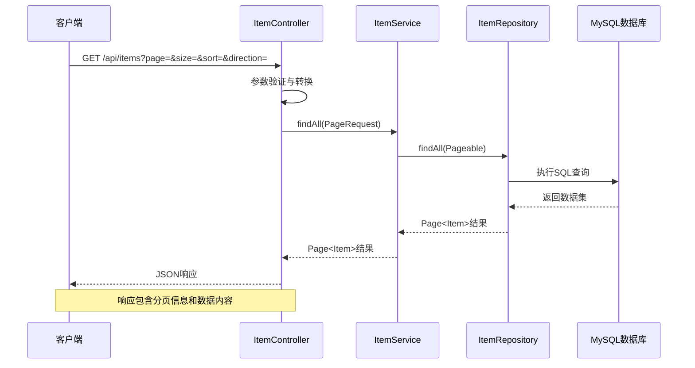
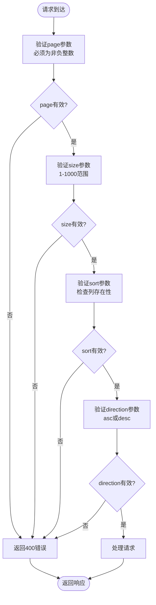
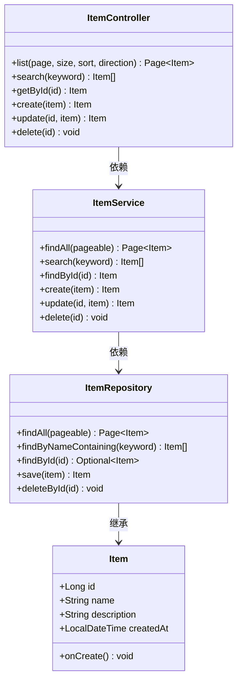
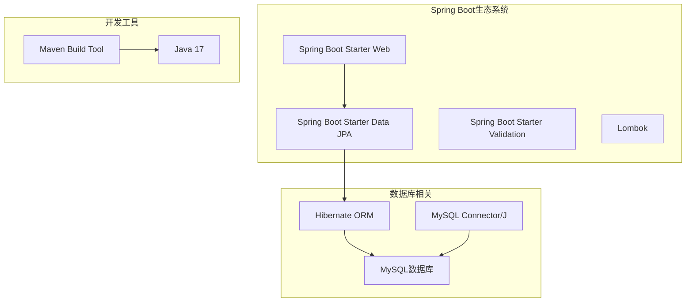

# 列表查询接口

<cite>
**本文档引用的文件**
- [ItemController.java](file://backend/src/main/java/com/example/demo/controller/ItemController.java)
- [ItemService.java](file://backend/src/main/java/com/example/demo/service/ItemService.java)
- [ItemRepository.java](file://backend/src/main/java/com/example/demo/repository/ItemRepository.java)
- [Item.java](file://backend/src/main/java/com/example/demo/entity/Item.java)
- [application.yml](file://backend/src/main/resources/application.yml)
- [item.js](file://frontend/src/api/item.js)
- [ItemManager.vue](file://frontend/src/components/ItemManager.vue)
- [pom.xml](file://backend/pom.xml)
</cite>

## 目录
1. [简介](#简介)
2. [项目结构](#项目结构)
3. [核心组件](#核心组件)
4. [架构概览](#架构概览)
5. [详细组件分析](#详细组件分析)
6. [依赖关系分析](#依赖关系分析)
7. [性能考虑](#性能考虑)
8. [故障排除指南](#故障排除指南)
9. [结论](#结论)

## 简介

本文档详细说明了基于Spring Boot的列表查询接口实现，重点介绍GET `/api/items`端点的功能特性、参数配置、响应格式以及实际使用示例。该系统采用经典的三层架构设计，包括控制器层、服务层和数据访问层，支持分页查询、排序功能，并提供了完整的前端集成示例。

## 项目结构

该项目采用标准的Maven多模块结构，主要包含后端Spring Boot应用和前端Vue.js界面：

```mermaid
graph TB
subgraph "后端应用"
A[DemoApplication<br/>主启动类]
B[controller/<br/>控制器层]
C[service/<br/>服务层]
D[repository/<br/>数据访问层]
E[entity/<br/>实体模型]
F[resources/<br/>配置文件]
end
subgraph "前端应用"
G[api/<br/>API封装]
H[components/<br/>组件页面]
I[vite.config.js<br/>构建配置]
end
subgraph "数据库"
J[(MySQL)<br/>数据存储]
end
A --> B
B --> C
C --> D
D --> J
F --> J
G --> B
H --> G
```

**图表来源**
- [DemoApplication.java:1-13](file://backend/src/main/java/com/example/demo/DemoApplication.java#L1-L13)
- [ItemController.java:1-59](file://backend/src/main/java/com/example/demo/controller/ItemController.java#L1-L59)

**章节来源**
- [DemoApplication.java:1-13](file://backend/src/main/java/com/example/demo/DemoApplication.java#L1-L13)
- [application.yml:1-18](file://backend/src/main/resources/application.yml#L1-L18)

## 核心组件

### 控制器层 - ItemController

控制器层负责处理HTTP请求和响应，实现了RESTful API规范：

- **端点路径**: `/api/items`
- **HTTP方法**: GET
- **功能**: 提供分页列表查询功能
- **参数验证**: 使用Spring框架内置的参数验证机制

### 服务层 - ItemService

服务层封装业务逻辑，提供数据访问接口：

- **核心方法**: `findAll(Pageable pageable)`
- **事务管理**: 使用`@Transactional`注解确保数据一致性
- **异常处理**: 对未找到的数据抛出运行时异常

### 数据访问层 - ItemRepository

数据访问层继承Spring Data JPA的接口，提供数据持久化能力：

- **基础接口**: `JpaRepository<Item, Long>`
- **扩展接口**: `JpaSpecificationExecutor<Item>`
- **自定义查询**: `findByNameContaining(String keyword)`

**章节来源**
- [ItemController.java:15-59](file://backend/src/main/java/com/example/demo/controller/ItemController.java#L15-L59)
- [ItemService.java:13-50](file://backend/src/main/java/com/example/demo/service/ItemService.java#L13-L50)
- [ItemRepository.java:9-12](file://backend/src/main/java/com/example/demo/repository/ItemRepository.java#L9-L12)

## 架构概览

系统采用经典的MVC架构模式，通过Spring MVC框架实现RESTful API：



**图表来源**
- [ItemController.java:23-31](file://backend/src/main/java/com/example/demo/controller/ItemController.java#L23-L31)
- [ItemService.java:19-21](file://backend/src/main/java/com/example/demo/service/ItemService.java#L19-L21)
- [ItemRepository.java:9-12](file://backend/src/main/java/com/example/demo/repository/ItemRepository.java#L9-L12)

## 详细组件分析

### GET /api/items 端点详解

#### 参数定义

| 参数名 | 类型 | 默认值 | 必填 | 描述 |
|--------|------|--------|------|------|
| page | int | 0 | 否 | 页码索引，从0开始 |
| size | int | 10 | 否 | 每页记录数 |
| sort | String | "id" | 否 | 排序列名 |
| direction | String | "desc" | 否 | 排序方向：asc或desc |

#### 参数验证规则



**图表来源**
- [ItemController.java:24-30](file://backend/src/main/java/com/example/demo/controller/ItemController.java#L24-L30)

#### 响应格式 - Page<Item>

响应采用Spring Data的Page对象格式，包含以下字段：

```json
{
  "content": [
    {
      "id": 1,
      "name": "示例名称",
      "description": "示例描述",
      "createdAt": "2024-01-01T12:00:00"
    }
  ],
  "pageable": {
    "pageNumber": 0,
    "pageSize": 10,
    "sort": {
      "empty": false,
      "sorted": true,
      "unsorted": false
    },
    "offset": 0,
    "paged": true,
    "unpaged": false
  },
  "last": false,
  "totalElements": 100,
  "totalPages": 10,
  "size": 10,
  "number": 0,
  "sort": {
    "empty": false,
    "sorted": true,
    "unsorted": false
  },
  "first": true,
  "numberOfElements": 10,
  "empty": false
}
```

#### 实际使用示例

**按创建时间降序排列**
```
GET /api/items?page=0&size=10&sort=created_at&direction=desc
```

**按名称升序排列**
```
GET /api/items?page=0&size=20&sort=name&direction=asc
```

**第一页查询（默认参数）**
```
GET /api/items
```

**前端集成示例**
```javascript
// Vue组件中的使用
async function loadData() {
  loading.value = true
  try {
    const res = await fetchItems({
      page: pagination.page - 1,  // 转换为0基索引
      size: pagination.size
    })
    tableData.value = res.data.content
    pagination.total = res.data.totalElements
  } catch (err) {
    ElMessage.error('加载数据失败')
  } finally {
    loading.value = false
  }
}
```

**章节来源**
- [ItemController.java:23-31](file://backend/src/main/java/com/example/demo/controller/ItemController.java#L23-L31)
- [ItemManager.vue:121-136](file://frontend/src/components/ItemManager.vue#L121-L136)

### 数据模型分析

#### Item实体类结构



**图表来源**
- [Item.java:10-29](file://backend/src/main/java/com/example/demo/entity/Item.java#L10-L29)
- [ItemController.java:19-58](file://backend/src/main/java/com/example/demo/controller/ItemController.java#L19-L58)
- [ItemService.java:15-49](file://backend/src/main/java/com/example/demo/service/ItemService.java#L15-L49)
- [ItemRepository.java:9-12](file://backend/src/main/java/com/example/demo/repository/ItemRepository.java#L9-L12)

**章节来源**
- [Item.java:1-30](file://backend/src/main/java/com/example/demo/entity/Item.java#L1-L30)

## 依赖关系分析

### 技术栈依赖



**图表来源**
- [pom.xml:24-51](file://backend/pom.xml#L24-L51)

### 外部依赖关系

系统对外部依赖主要包括：
- **Spring Boot**: 提供Web框架和依赖注入功能
- **MySQL**: 关系型数据库存储
- **Hibernate**: ORM映射和查询执行
- **Lombok**: 减少样板代码

**章节来源**
- [pom.xml:1-71](file://backend/pom.xml#L1-L71)

## 性能考虑

### 查询优化建议

1. **索引策略**: 在常用排序字段（如`created_at`、`name`）上建立数据库索引
2. **分页限制**: 设置合理的最大分页大小（当前为1000）
3. **查询缓存**: 对频繁访问的查询结果实施缓存策略
4. **连接池配置**: 优化数据库连接池参数以提高并发性能

### 前端性能优化

- **虚拟滚动**: 对大数据量列表实施虚拟滚动技术
- **懒加载**: 实施图片和其他资源的懒加载
- **防抖处理**: 对搜索和分页操作实施防抖机制

## 故障排除指南

### 常见错误及解决方案

| 错误类型 | 错误代码 | 可能原因 | 解决方案 |
|----------|----------|----------|----------|
| 参数错误 | 400 Bad Request | 无效的分页参数 | 验证page>=0，size在1-1000范围内 |
| 数据库连接 | 500 Internal Server Error | 数据库连接失败 | 检查application.yml中的数据库配置 |
| 未找到数据 | 404 Not Found | 查询条件无匹配结果 | 确认查询参数正确性和数据存在性 |
| 排序字段错误 | 400 Bad Request | 排序列不存在 | 检查实体类中字段定义 |

### 调试技巧

1. **启用SQL日志**: 在application.yml中设置`show-sql: true`
2. **查看请求响应**: 使用浏览器开发者工具监控网络请求
3. **日志分析**: 查看Spring Boot控制台输出的详细日志信息

**章节来源**
- [application.yml:10-17](file://backend/src/main/resources/application.yml#L10-L17)
- [ItemService.java](file://backend/src/main/java/com/example/demo/service/ItemService.java#L29)

## 结论

本列表查询接口实现了完整的分页查询功能，具有以下特点：

- **标准化**: 遵循RESTful API设计原则
- **可扩展**: 支持自定义排序和过滤条件
- **易用性**: 提供清晰的参数定义和响应格式
- **健壮性**: 包含完整的参数验证和错误处理机制

通过合理的设计和实现，该接口能够满足大多数数据列表展示的需求，同时为后续的功能扩展奠定了良好的基础。