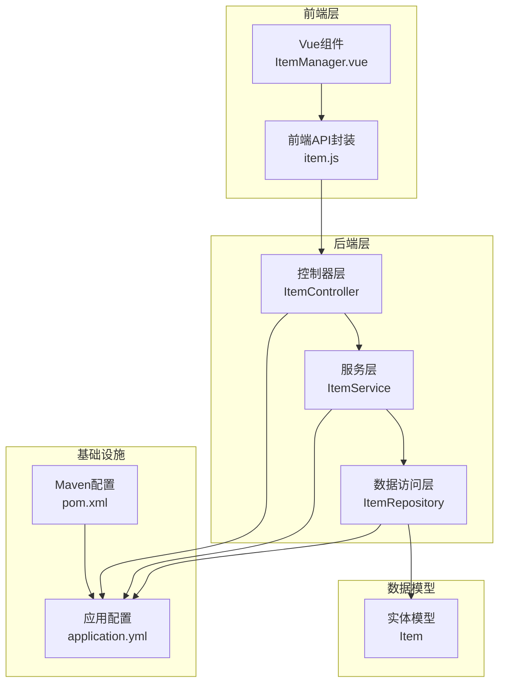
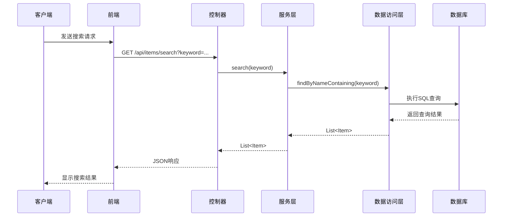
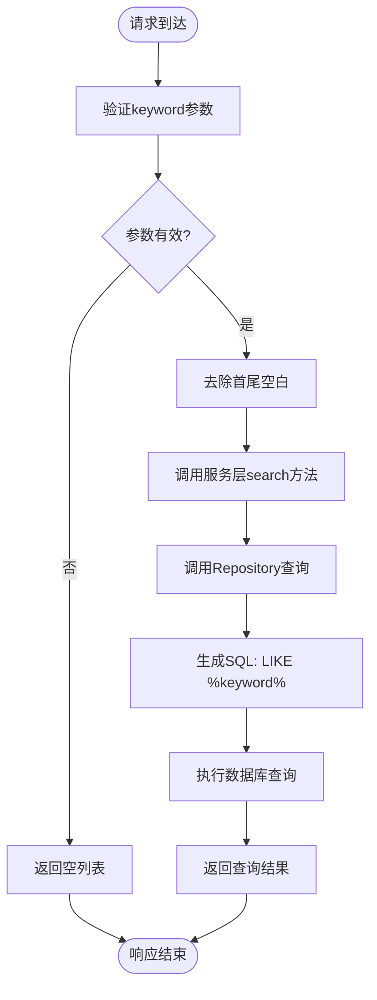
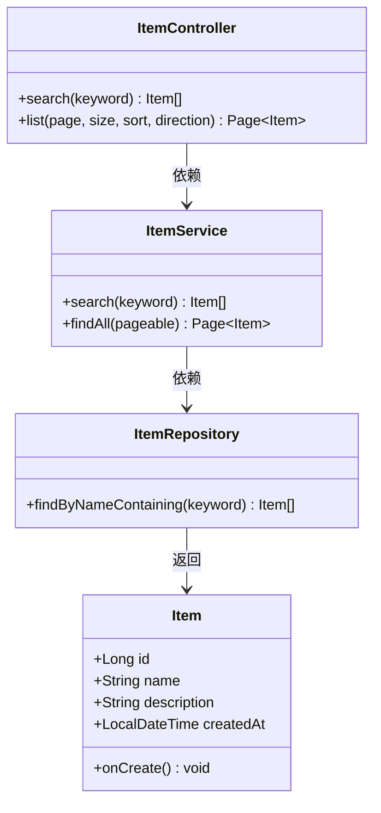
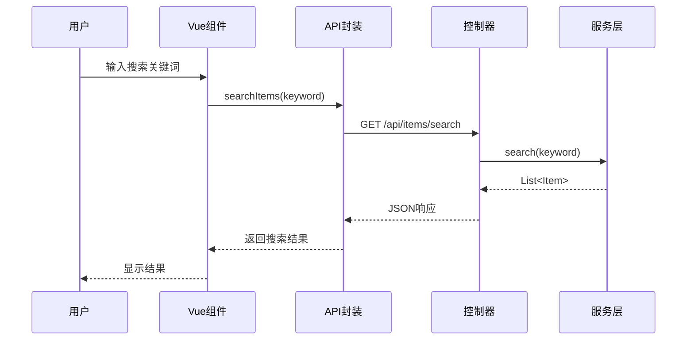
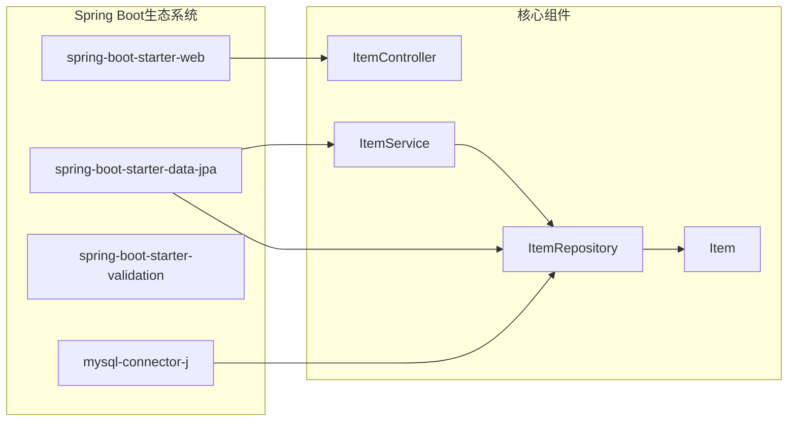

# 搜索查询接口

<cite>
**本文档引用的文件**
- [ItemController.java](file://backend/src/main/java/com/example/demo/controller/ItemController.java)
- [ItemService.java](file://backend/src/main/java/com/example/demo/service/ItemService.java)
- [ItemRepository.java](file://backend/src/main/java/com/example/demo/repository/ItemRepository.java)
- [Item.java](file://backend/src/main/java/com/example/demo/entity/Item.java)
- [application.yml](file://backend/src/main/resources/application.yml)
- [item.js](file://frontend/src/api/item.js)
- [ItemManager.vue](file://frontend/src/components/ItemManager.vue)
- [pom.xml](file://backend/pom.xml)
</cite>

## 目录
1. [简介](#简介)
2. [项目结构](#项目结构)
3. [核心组件](#核心组件)
4. [架构概览](#架构概览)
5. [详细组件分析](#详细组件分析)
6. [依赖关系分析](#依赖关系分析)
7. [性能考虑](#性能考虑)
8. [故障排除指南](#故障排除指南)
9. [结论](#结论)

## 简介

本文档详细说明了基于Spring Boot的搜索查询接口实现，重点关注GET /api/items/search端点的功能特性、参数规范、响应格式以及安全性和性能优化策略。该接口提供了基于名称字段的部分匹配搜索功能，支持模糊查询和灵活的参数配置。

## 项目结构

该项目采用标准的Spring Boot三层架构设计，包含以下核心模块：



**图表来源**
- [ItemController.java:15-59](file://backend/src/main/java/com/example/demo/controller/ItemController.java#L15-L59)
- [ItemService.java:13-50](file://backend/src/main/java/com/example/demo/service/ItemService.java#L13-L50)
- [ItemRepository.java:1-13](file://backend/src/main/java/com/example/demo/repository/ItemRepository.java#L1-L13)
- [Item.java:1-30](file://backend/src/main/java/com/example/demo/entity/Item.java#L1-L30)

**章节来源**
- [ItemController.java:15-59](file://backend/src/main/java/com/example/demo/controller/ItemController.java#L15-L59)
- [ItemService.java:13-50](file://backend/src/main/java/com/example/demo/service/ItemService.java#L13-L50)
- [ItemRepository.java:1-13](file://backend/src/main/java/com/example/demo/repository/ItemRepository.java#L1-L13)
- [Item.java:1-30](file://backend/src/main/java/com/example/demo/entity/Item.java#L1-L30)
- [application.yml:1-18](file://backend/src/main/resources/application.yml#L1-L18)
- [pom.xml:1-71](file://backend/pom.xml#L1-L71)

## 核心组件

### 控制器层 (ItemController)

控制器层负责HTTP请求的接收和响应的返回，实现了RESTful API接口：

- **GET /api/items/search**: 搜索端点，接受keyword参数进行模糊匹配
- **GET /api/items**: 列表端点，支持分页和排序
- **CRUD操作**: 支持完整的数据增删改查功能

### 服务层 (ItemService)

服务层封装业务逻辑，提供数据访问的抽象：

- **search方法**: 实现搜索逻辑，调用数据访问层执行查询
- **事务管理**: 使用@Transactional注解确保数据一致性
- **异常处理**: 提供统一的错误处理机制

### 数据访问层 (ItemRepository)

数据访问层基于Spring Data JPA实现：

- **findByNameContaining**: 基于名称字段的模糊查询方法
- **JpaRepository接口**: 提供标准的数据操作方法
- **Specification支持**: 支持复杂的查询条件

**章节来源**
- [ItemController.java:23-36](file://backend/src/main/java/com/example/demo/controller/ItemController.java#L23-L36)
- [ItemService.java:23-25](file://backend/src/main/java/com/example/demo/service/ItemService.java#L23-L25)
- [ItemRepository.java:11](file://backend/src/main/java/com/example/demo/repository/ItemRepository.java#L11)

## 架构概览

系统采用经典的MVC架构模式，通过清晰的层次分离实现关注点分离：



**图表来源**
- [ItemController.java:33-36](file://backend/src/main/java/com/example/demo/controller/ItemController.java#L33-L36)
- [ItemService.java:23-25](file://backend/src/main/java/com/example/demo/service/ItemService.java#L23-L25)
- [ItemRepository.java:11](file://backend/src/main/java/com/example/demo/repository/ItemRepository.java#L11)

## 详细组件分析

### 搜索端点实现

#### API定义

**端点**: `GET /api/items/search`
**参数**: 
- `keyword` (必需): 搜索关键词，类型为字符串

**响应**: `List<Item>` - 包含所有匹配项的数组

#### 参数处理流程



**图表来源**
- [ItemController.java:33-36](file://backend/src/main/java/com/example/demo/controller/ItemController.java#L33-L36)
- [ItemService.java:23-25](file://backend/src/main/java/com/example/demo/service/ItemService.java#L23-L25)
- [ItemRepository.java:11](file://backend/src/main/java/com/example/demo/repository/ItemRepository.java#L11)

#### 数据模型定义



**图表来源**
- [Item.java:10-29](file://backend/src/main/java/com/example/demo/entity/Item.java#L10-L29)
- [ItemController.java:21-36](file://backend/src/main/java/com/example/demo/controller/ItemController.java#L21-L36)
- [ItemService.java:17-25](file://backend/src/main/java/com/example/demo/service/ItemService.java#L17-L25)
- [ItemRepository.java:9-12](file://backend/src/main/java/com/example/demo/repository/ItemRepository.java#L9-L12)

**章节来源**
- [ItemController.java:33-36](file://backend/src/main/java/com/example/demo/controller/ItemController.java#L33-L36)
- [ItemService.java:23-25](file://backend/src/main/java/com/example/demo/service/ItemService.java#L23-L25)
- [ItemRepository.java:11](file://backend/src/main/java/com/example/demo/repository/ItemRepository.java#L11)
- [Item.java:16-20](file://backend/src/main/java/com/example/demo/entity/Item.java#L16-L20)

### 响应格式规范

#### List<Item> 响应结构

每个Item对象包含以下字段：

| 字段名 | 类型 | 必填 | 描述 |
|--------|------|------|------|
| id | Long | 是 | 项目唯一标识符 |
| name | String | 是 | 项目名称，最大长度100字符 |
| description | String | 否 | 项目描述，最大长度500字符 |
| createdAt | LocalDateTime | 否 | 创建时间戳 |

#### 排序逻辑

当前实现中，搜索结果不包含特定的排序逻辑。查询结果的顺序取决于数据库的默认排序行为。如果需要自定义排序，可以在服务层添加排序逻辑。

**章节来源**
- [Item.java:16-28](file://backend/src/main/java/com/example/demo/entity/Item.java#L16-L28)

### 搜索场景示例

#### 基础搜索场景

1. **部分名称匹配**
   - 请求: `GET /api/items/search?keyword=phone`
   - 结果: 返回所有名称包含"phone"的项目

2. **大小写不敏感匹配**
   - 请求: `GET /api/items/search?keyword=PHONE`
   - 结果: 与小写搜索相同

3. **特殊字符处理**
   - 请求: `GET /api/items/search?keyword=phone%20pro`
   - 结果: 返回名称包含"phone pro"的项目

#### 前端集成示例



**图表来源**
- [ItemManager.vue:138-154](file://frontend/src/components/ItemManager.vue#L138-L154)
- [item.js:12-14](file://frontend/src/api/item.js#L12-L14)

**章节来源**
- [ItemManager.vue:138-154](file://frontend/src/components/ItemManager.vue#L138-L154)
- [item.js:12-14](file://frontend/src/api/item.js#L12-L14)

## 依赖关系分析

### 技术栈依赖



**图表来源**
- [pom.xml:24-51](file://backend/pom.xml#L24-L51)
- [ItemController.java:15-18](file://backend/src/main/java/com/example/demo/controller/ItemController.java#L15-L18)
- [ItemService.java:13-14](file://backend/src/main/java/com/example/demo/service/ItemService.java#L13-L14)
- [ItemRepository.java:1-2](file://backend/src/main/java/com/example/demo/repository/ItemRepository.java#L1-L2)

### 外部依赖

- **MySQL数据库**: 使用MySQL作为数据存储
- **Lombok**: 简化Java代码，减少样板代码
- **Element Plus**: 前端UI组件库
- **Axios**: HTTP客户端库

**章节来源**
- [pom.xml:24-51](file://backend/pom.xml#L24-L51)
- [application.yml:5-9](file://backend/src/main/resources/application.yml#L5-L9)

## 性能考虑

### 当前实现的性能特征

1. **查询性能**: 使用LIKE操作符进行模糊匹配，可能影响查询性能
2. **索引利用**: 默认情况下，名称字段可能没有建立适当的索引
3. **内存使用**: 返回整个匹配结果集到内存中

### 性能优化建议

#### 数据库层面优化

1. **建立全文索引**
   ```sql
   CREATE FULLTEXT INDEX idx_item_name ON items(name);
   ```

2. **复合索引策略**
   ```sql
   CREATE INDEX idx_item_name_created ON items(name, created_at DESC);
   ```

3. **查询优化**
   - 考虑使用全文搜索查询
   - 实施查询结果缓存机制
   - 添加适当的LIMIT限制

#### 应用层面优化

1. **分页搜索**
   ```java
   // 在服务层添加分页支持
   public Page<Item> searchWithPagination(String keyword, Pageable pageable) {
       return itemRepository.findByNameContaining(keyword, pageable);
   }
   ```

2. **结果缓存**
   ```java
   @Cacheable(value = "searchResults", key = "#keyword")
   public List<Item> search(String keyword) {
       return itemRepository.findByNameContaining(keyword);
   }
   ```

3. **查询限制**
   ```java
   @GetMapping("/search")
   public List<Item> search(
           @RequestParam String keyword,
           @RequestParam(defaultValue = "100") int limit) {
       return itemService.search(keyword, limit);
   }
   ```

### 索引使用策略

#### 推荐索引配置

| 索引类型 | 字段 | 用途 | 性能收益 |
|----------|------|------|----------|
| B-tree索引 | name | 名称精确/范围查询 | 高 |
| 全文索引 | name | 模糊搜索 | 极高 |
| 复合索引 | (name, created_at) | 搜索+排序 | 中等 |
| 唯一索引 | id | 主键约束 | 高 |

**章节来源**
- [ItemRepository.java:11](file://backend/src/main/java/com/example/demo/repository/ItemRepository.java#L11)

## 故障排除指南

### 常见问题及解决方案

#### 1. SQL注入防护

**现状分析**: 当前实现使用Spring Data JPA的动态查询方法，自动转义参数，具备基本的SQL注入防护能力。

**增强建议**:
```java
// 使用@Param注解明确参数绑定
@Query("SELECT i FROM Item i WHERE i.name LIKE %:keyword% ESCAPE '\\\\'")
List<Item> findByNameContaining(@Param("keyword") String keyword);

// 或者使用Specification进行更安全的查询构建
public Specification<Item> hasNameContaining(String keyword) {
    return (root, query, criteriaBuilder) -> 
        criteriaBuilder.like(root.get("name"), "%" + keyword + "%");
}
```

#### 2. 参数验证

**增强的参数验证**:
```java
@GetMapping("/search")
public List<Item> search(
        @RequestParam @NotBlank(message = "关键词不能为空")
        @Size(min = 1, max = 100, message = "关键词长度必须在1-100之间")
        String keyword) {
    return itemService.search(keyword);
}
```

#### 3. 错误处理

**改进的错误处理**:
```java
@GetMapping("/search")
public ResponseEntity<List<Item>> search(
        @RequestParam String keyword) {
    try {
        if (keyword == null || keyword.trim().isEmpty()) {
            return ResponseEntity.badRequest().build();
        }
        List<Item> results = itemService.search(keyword.trim());
        return ResponseEntity.ok(results);
    } catch (Exception e) {
        return ResponseEntity.status(500).build();
    }
}
```

#### 4. 日志记录

**添加查询日志**:
```java
@Slf4j
@Service
public class ItemService {
    
    @PersistenceContext
    private EntityManager entityManager;
    
    public List<Item> search(String keyword) {
        log.info("执行搜索查询: keyword={}", keyword);
        long startTime = System.currentTimeMillis();
        
        try {
            List<Item> results = itemRepository.findByNameContaining(keyword);
            long endTime = System.currentTimeMillis();
            log.info("搜索完成，耗时: {}ms，结果数量: {}", 
                    (endTime - startTime), results.size());
            return results;
        } catch (Exception e) {
            log.error("搜索查询失败: keyword={}, error={}", keyword, e.getMessage());
            throw e;
        }
    }
}
```

### 性能监控

#### 查询性能指标

1. **响应时间**: 记录每次搜索的执行时间
2. **查询频率**: 统计热门搜索关键词
3. **错误率**: 监控查询失败的情况

#### 监控实现
```java
@EventListener
public void handleSearchEvent(SearchEvent event) {
    log.info("搜索事件: keyword={}, resultCount={}, durationMs={}", 
            event.getKeyword(), event.getResultCount(), event.getDurationMs());
}
```

**章节来源**
- [ItemController.java:33-36](file://backend/src/main/java/com/example/demo/controller/ItemController.java#L33-L36)
- [ItemService.java:23-25](file://backend/src/main/java/com/example/demo/service/ItemService.java#L23-L25)

## 结论

该搜索查询接口实现了基本的模糊匹配功能，具有以下特点：

**优势**:
- 实现简洁，易于理解和维护
- 使用Spring Data JPA简化了数据访问层开发
- 前后端分离，职责清晰
- 支持基本的CRUD操作

**改进方向**:
1. **性能优化**: 添加数据库索引和查询优化
2. **安全性增强**: 实施更严格的参数验证和SQL注入防护
3. **功能扩展**: 支持分页、排序和多字段搜索
4. **监控完善**: 添加查询性能监控和日志记录

该接口为后续的功能扩展和性能优化提供了良好的基础架构，通过合理的索引策略和查询优化，可以满足大多数应用场景的搜索需求。