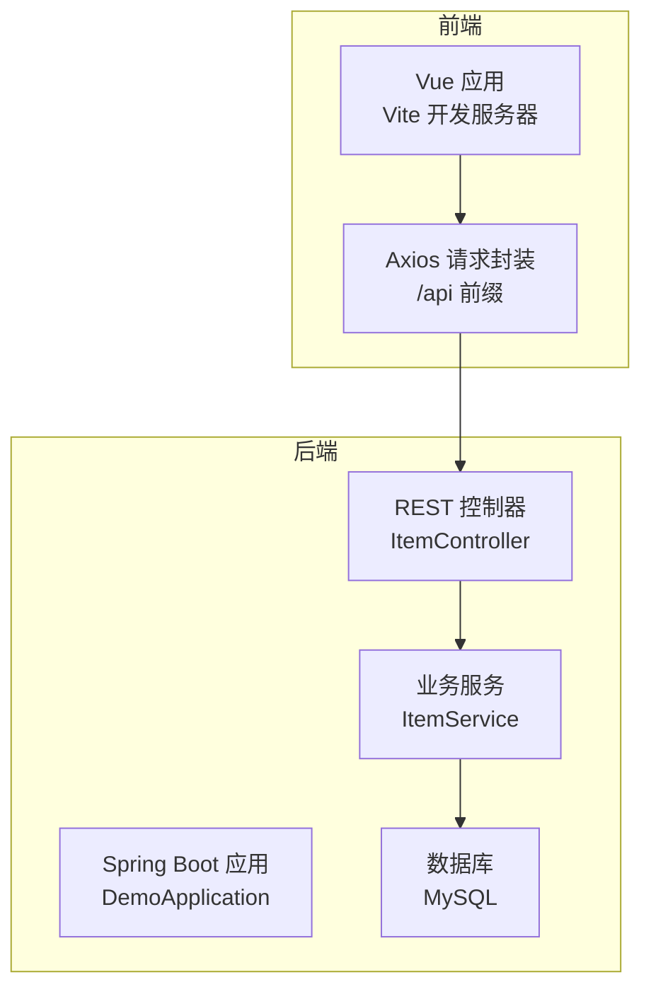
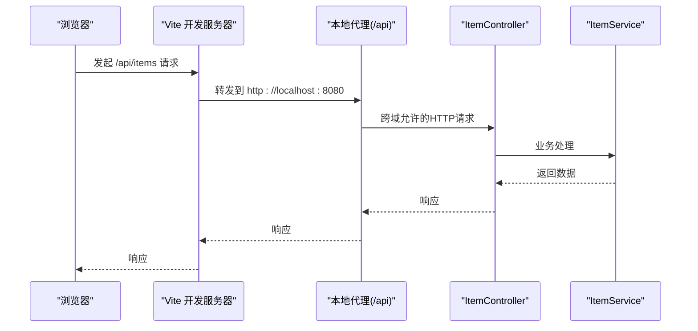
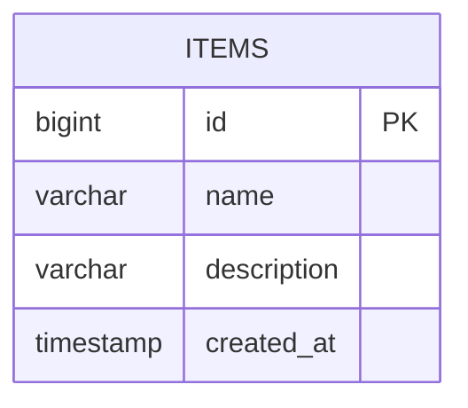
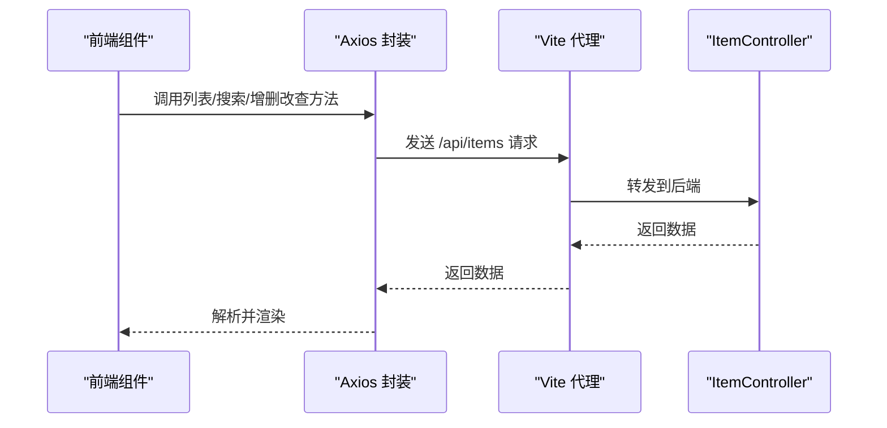
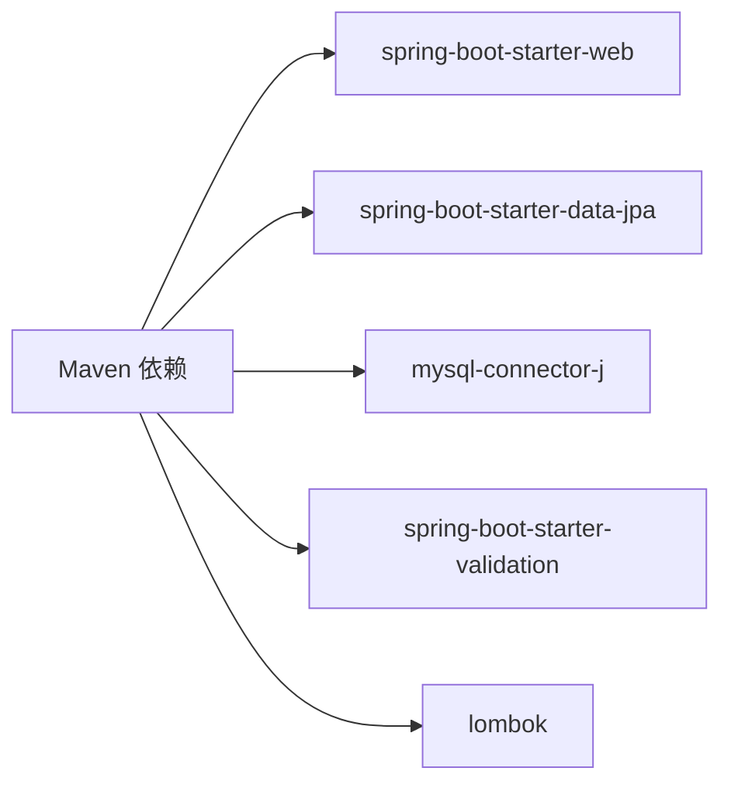

# 认证与安全

<cite>
**本文引用的文件**
- [DemoApplication.java](file://backend/src/main/java/com/example/demo/DemoApplication.java)
- [application.yml](file://backend/src/main/resources/application.yml)
- [ItemController.java](file://backend/src/main/java/com/example/demo/controller/ItemController.java)
- [ItemService.java](file://backend/src/main/java/com/example/demo/service/ItemService.java)
- [Item.java](file://backend/src/main/java/com/example/demo/entity/Item.java)
- [pom.xml](file://backend/pom.xml)
- [item.js](file://frontend/src/api/item.js)
- [ItemManager.vue](file://frontend/src/components/ItemManager.vue)
- [vite.config.js](file://frontend/vite.config.js)
</cite>

## 目录
1. [简介](#简介)
2. [项目结构](#项目结构)
3. [核心组件](#核心组件)
4. [架构总览](#架构总览)
5. [详细组件分析](#详细组件分析)
6. [依赖分析](#依赖分析)
7. [性能考量](#性能考量)
8. [故障排查指南](#故障排查指南)
9. [结论](#结论)
10. [附录](#附录)

## 简介
本文件聚焦于该Spring Boot后端与Vue前端联用场景下的API认证与安全配置现状与改进建议。当前仓库未包含任何显式的认证授权（如JWT、API Key）与安全加固（如CORS细粒度控制、CSRF/XSS防护、限流防刷）实现。本文基于现有代码，系统梳理跨域配置、前后端交互方式，并提出生产环境的安全加固路径与最佳实践。

## 项目结构
后端采用Spring Boot 3 + JPA + MySQL，前端使用Vite + Vue 3 + Axios。后端控制器通过全局跨域注解暴露接口；前端通过本地开发代理将/api前缀转发至后端服务。

图表来源
- [DemoApplication.java:1-13](file://backend/src/main/java/com/example/demo/DemoApplication.java#L1-L13)
- [ItemController.java:15-58](file://backend/src/main/java/com/example/demo/controller/ItemController.java#L15-L58)
- [ItemService.java:13-49](file://backend/src/main/java/com/example/demo/service/ItemService.java#L13-L49)
- [application.yml:1-18](file://backend/src/main/resources/application.yml#L1-L18)
- [vite.config.js:4-15](file://frontend/vite.config.js#L4-L15)
- [item.js:3-6](file://frontend/src/api/item.js#L3-L6)

章节来源
- [DemoApplication.java:1-13](file://backend/src/main/java/com/example/demo/DemoApplication.java#L1-L13)
- [application.yml:1-18](file://backend/src/main/resources/application.yml#L1-L18)
- [vite.config.js:4-15](file://frontend/vite.config.js#L4-L15)
- [item.js:3-6](file://frontend/src/api/item.js#L3-L6)

## 核心组件
- 后端应用入口：负责启动Spring Boot容器。
- 配置文件：定义数据库连接与JPA属性。
- 控制器：提供REST接口，使用全局跨域注解。
- 服务层：封装数据访问与事务处理。
- 实体：映射数据库表结构。
- 前端：Axios封装统一请求，Vite代理转发/api到后端。

章节来源
- [DemoApplication.java:1-13](file://backend/src/main/java/com/example/demo/DemoApplication.java#L1-L13)
- [application.yml:1-18](file://backend/src/main/resources/application.yml#L1-L18)
- [ItemController.java:15-58](file://backend/src/main/java/com/example/demo/controller/ItemController.java#L15-L58)
- [ItemService.java:13-49](file://backend/src/main/java/com/example/demo/service/ItemService.java#L13-L49)
- [Item.java:7-29](file://backend/src/main/java/com/example/demo/entity/Item.java#L7-L29)
- [pom.xml:24-51](file://backend/pom.xml#L24-L51)
- [item.js:3-6](file://frontend/src/api/item.js#L3-L6)

## 架构总览
下图展示从浏览器到后端的典型请求链路，包括跨域与代理环节。

图表来源
- [vite.config.js:8-13](file://frontend/vite.config.js#L8-L13)
- [item.js:3-6](file://frontend/src/api/item.js#L3-L6)
- [ItemController.java:18](file://backend/src/main/java/com/example/demo/controller/ItemController.java#L18)

## 详细组件分析

### 跨域配置与安全影响
- 当前实现：控制器类上使用全局跨域注解，允许任意源访问。
- 安全风险：
  - 任意源可直接访问后端接口，缺乏源站白名单校验。
  - 在生产环境默认放行所有源将导致潜在的跨站脚本与敏感数据泄露风险。
- 生产建议：
  - 将跨域注解限定为可信域名列表，避免使用通配符。
  - 对预检请求（OPTIONS）进行最小权限放行。
  - 结合HTTPS与安全响应头强化传输与站点安全。

章节来源
- [ItemController.java:18](file://backend/src/main/java/com/example/demo/controller/ItemController.java#L18)

### 认证与授权方案设计
- JWT令牌（推荐）
  - 登录成功返回短期有效的访问令牌与刷新令牌。
  - 接口统一通过拦截器校验令牌有效性与权限范围。
  - 刷新令牌独立存储与轮换，降低会话劫持风险。
- API密钥
  - 适用于服务间调用或自动化脚本，按资源维度分配密钥。
  - 密钥需加密存储与轮换，限制IP/子网白名单。
- 多因子认证（MFA）
  - 对高敏操作（删除、批量变更）启用二次验证。

说明：以上为通用安全实践建议，当前仓库未包含具体实现。

### CSRF防护
- 同源策略天然隔离不同源请求，但同源下的表单POST仍需防护。
- 建议：
  - 使用同源页面渲染与AJAX提交，避免传统表单POST。
  - 若必须使用表单，结合服务端Token校验与SameSite Cookie策略。

### XSS防护
- 输入输出均需进行严格的转义与白名单校验。
- 前端渲染模板时避免内联事件与动态eval。
- 设置安全响应头（如Content-Security-Policy）限制脚本执行来源。

### API访问频率限制与防滥用
- 建议策略：
  - 基于IP/用户维度的滑动窗口限流。
  - 区分读写操作与敏感接口的配额。
  - 异常流量触发熔断与告警。
- 可选技术栈：Redis + 限流算法（漏桶/令牌桶），或Spring Cloud Gateway限流。

### 数据模型与持久化安全
- 实体字段长度与非空约束有助于减少异常输入带来的注入风险。
- 建议：
  - 对外部输入进行参数校验与清洗。
  - 使用只读账户连接数据库，最小权限原则。

图表来源
- [Item.java:12-28](file://backend/src/main/java/com/example/demo/entity/Item.java#L12-L28)

章节来源
- [Item.java:12-28](file://backend/src/main/java/com/example/demo/entity/Item.java#L12-L28)

### 前后端交互流程
- 前端通过Axios封装统一请求，基础路径为/api/items。
- Vite开发服务器将/api前缀请求代理到后端8080端口。
- 控制器返回标准HTTP状态码与JSON响应。

图表来源
- [ItemManager.vue:121-136](file://frontend/src/components/ItemManager.vue#L121-L136)
- [item.js:8-30](file://frontend/src/api/item.js#L8-L30)
- [vite.config.js:8-13](file://frontend/vite.config.js#L8-L13)
- [ItemController.java:23-57](file://backend/src/main/java/com/example/demo/controller/ItemController.java#L23-L57)

章节来源
- [ItemManager.vue:121-136](file://frontend/src/components/ItemManager.vue#L121-L136)
- [item.js:8-30](file://frontend/src/api/item.js#L8-L30)
- [vite.config.js:8-13](file://frontend/vite.config.js#L8-L13)
- [ItemController.java:23-57](file://backend/src/main/java/com/example/demo/controller/ItemController.java#L23-L57)

## 依赖分析
- Spring Web：提供Web MVC与REST能力。
- Spring Data JPA：提供ORM与分页查询。
- MySQL Connector：数据库驱动。
- Lombok：简化实体与服务类代码。
- Validation：参数校验支持。

图表来源
- [pom.xml:24-51](file://backend/pom.xml#L24-L51)

章节来源
- [pom.xml:24-51](file://backend/pom.xml#L24-L51)

## 性能考量
- CORS配置应尽量精确，避免每次请求携带凭据或复杂头部导致额外开销。
- 限流与熔断策略需结合监控指标动态调整阈值。
- 数据库连接池与查询优化（索引、分页）是关键。

## 故障排查指南
- 跨域问题
  - 症状：浏览器控制台出现跨域错误。
  - 排查：确认后端是否允许对应源；若使用凭据，需指定具体源而非通配符。
- 代理不通
  - 症状：前端调用/api/items返回404或网络错误。
  - 排查：确认Vite代理target与changeOrigin配置；后端8080端口是否正常启动。
- 数据库连接
  - 症状：应用启动报错或查询失败。
  - 排查：核对数据库URL、用户名、密码与驱动版本；确保MySQL服务可用。

章节来源
- [application.yml:5-9](file://backend/src/main/resources/application.yml#L5-L9)
- [vite.config.js:8-13](file://frontend/vite.config.js#L8-L13)

## 结论
当前仓库未实现任何认证授权与安全加固机制，存在显著的安全隐患。建议立即引入生产级跨域白名单、HTTPS、CSRF/XSS防护与限流策略，并根据业务选择合适的认证方案（如JWT或API Key）。后续可进一步集成Spring Security以统一治理安全策略。

## 附录
- 开发环境启动顺序
  - 后端：启动Spring Boot应用。
  - 前端：启动Vite开发服务器，自动代理/api请求。
- 生产部署要点
  - 固定可信域名白名单，禁用通配符。
  - 强制HTTPS与安全响应头。
  - 实施访问日志与审计追踪。
  - 对数据库连接与敏感配置进行加密与最小权限管理。