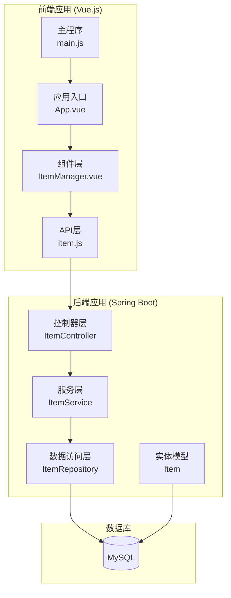
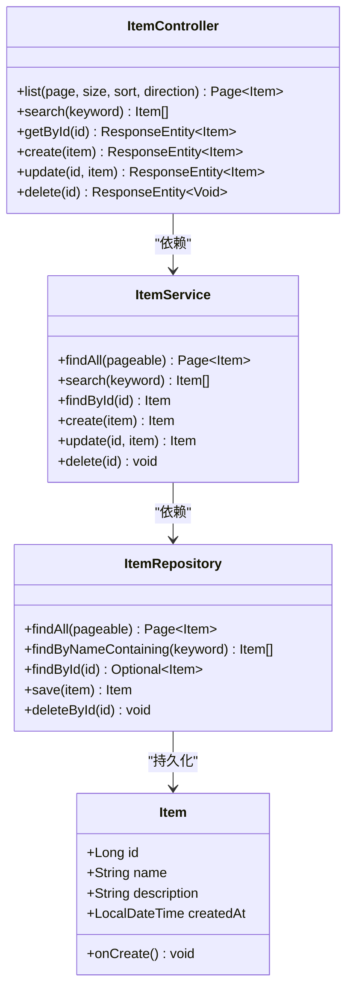
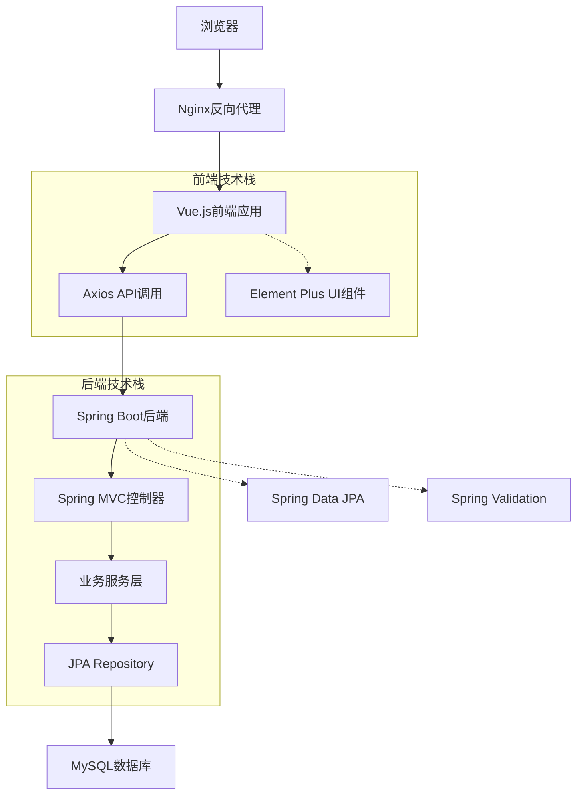
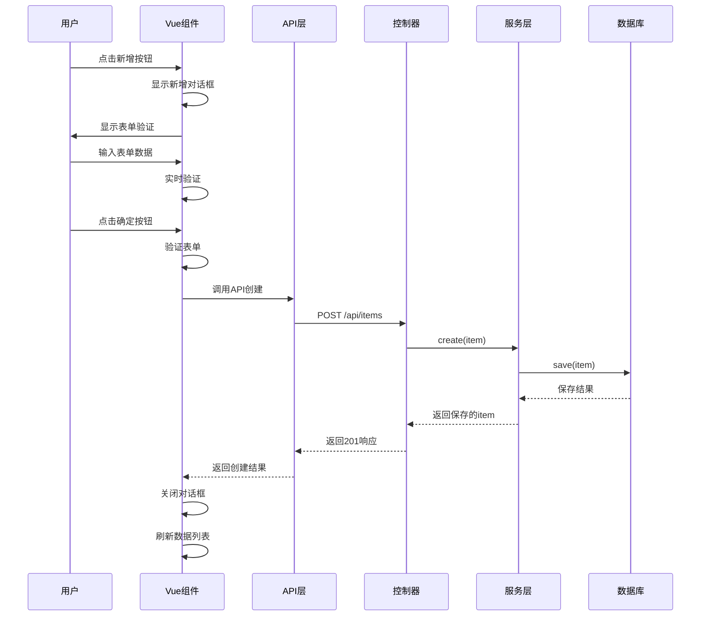
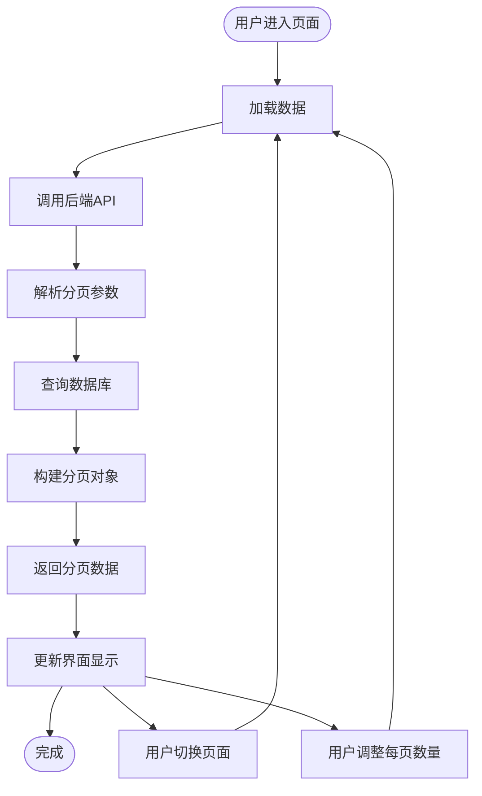
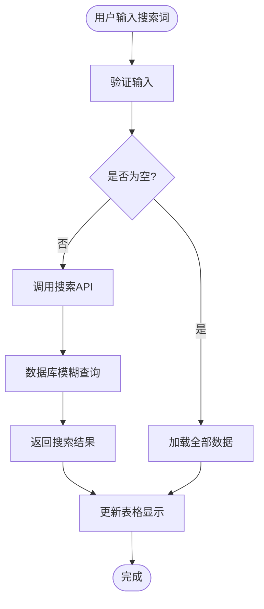
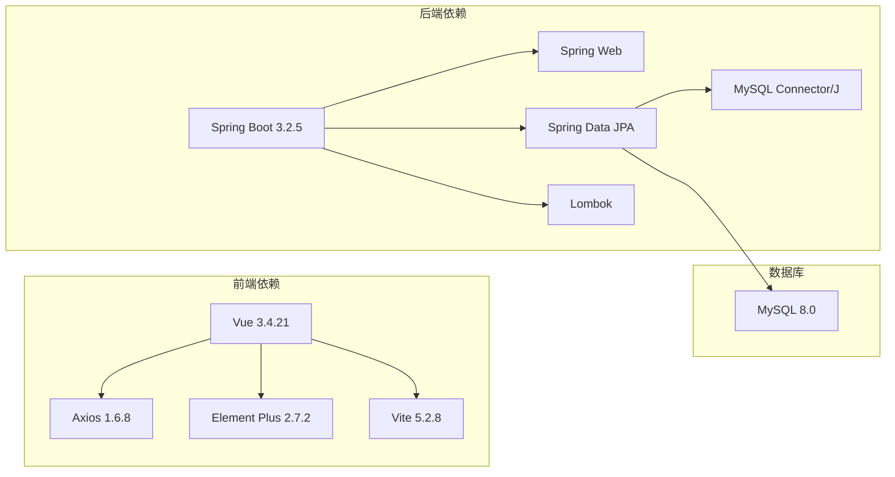
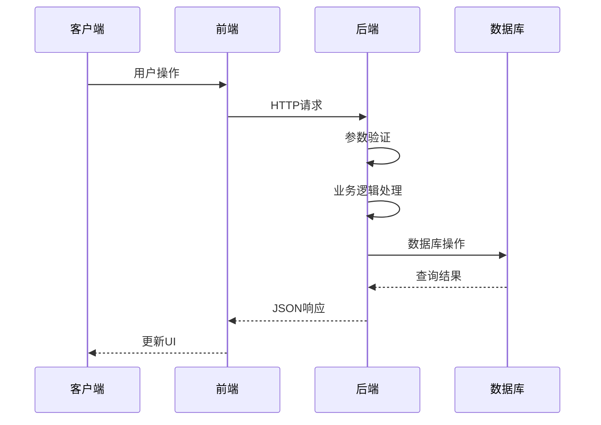

# CRUD操作实现

<cite>
**本文档引用的文件**
- [DemoApplication.java](file://backend/src/main/java/com/example/demo/DemoApplication.java)
- [ItemController.java](file://backend/src/main/java/com/example/demo/controller/ItemController.java)
- [ItemService.java](file://backend/src/main/java/com/example/demo/service/ItemService.java)
- [ItemRepository.java](file://backend/src/main/java/com/example/demo/repository/ItemRepository.java)
- [Item.java](file://backend/src/main/java/com/example/demo/entity/Item.java)
- [application.yml](file://backend/src/main/resources/application.yml)
- [pom.xml](file://backend/pom.xml)
- [item.js](file://frontend/src/api/item.js)
- [ItemManager.vue](file://frontend/src/components/ItemManager.vue)
- [App.vue](file://frontend/src/App.vue)
- [main.js](file://frontend/src/main.js)
- [package.json](file://frontend/package.json)
- [README.deploy.md](file://README.deploy.md)
</cite>

## 目录
1. [简介](#简介)
2. [项目结构](#项目结构)
3. [核心组件](#核心组件)
4. [架构概览](#架构概览)
5. [详细组件分析](#详细组件分析)
6. [依赖关系分析](#依赖关系分析)
7. [性能考虑](#性能考虑)
8. [故障排除指南](#故障排除指南)
9. [结论](#结论)
10. [附录](#附录)

## 简介
本项目是一个基于Spring Boot后端和Vue.js前端的完整CRUD操作示例应用。实现了标准的增删改查功能，包括分页查询、搜索功能和排序实现。项目采用前后端分离架构，后端提供RESTful API接口，前端通过Axios进行数据交互。

## 项目结构
项目采用经典的三层架构设计，分为后端Spring Boot应用和前端Vue.js应用两个主要部分。



**图表来源**
- [ItemController.java:15-58](file://backend/src/main/java/com/example/demo/controller/ItemController.java#L15-L58)
- [ItemService.java:13-49](file://backend/src/main/java/com/example/demo/service/ItemService.java#L13-L49)
- [ItemRepository.java:9-12](file://backend/src/main/java/com/example/demo/repository/ItemRepository.java#L9-L12)
- [Item.java:10-29](file://backend/src/main/java/com/example/demo/entity/Item.java#L10-L29)

**章节来源**
- [DemoApplication.java:6-11](file://backend/src/main/java/com/example/demo/DemoApplication.java#L6-L11)
- [pom.xml:24-51](file://backend/pom.xml#L24-L51)
- [package.json:11-19](file://frontend/package.json#L11-L19)

## 核心组件
项目的核心组件围绕CRUD操作展开，包括数据模型、控制器、服务层和数据访问层。

### 数据模型设计
实体类定义了数据结构和数据库映射关系，支持自动时间戳管理和数据验证。



**图表来源**
- [Item.java:10-29](file://backend/src/main/java/com/example/demo/entity/Item.java#L10-L29)
- [ItemController.java:21-57](file://backend/src/main/java/com/example/demo/controller/ItemController.java#L21-L57)
- [ItemService.java:17-48](file://backend/src/main/java/com/example/demo/service/ItemService.java#L17-L48)
- [ItemRepository.java:9-12](file://backend/src/main/java/com/example/demo/repository/ItemRepository.java#L9-L12)

**章节来源**
- [Item.java:16-28](file://backend/src/main/java/com/example/demo/entity/Item.java#L16-L28)
- [Item.java:25-28](file://backend/src/main/java/com/example/demo/entity/Item.java#L25-L28)

## 架构概览
系统采用分层架构设计，确保关注点分离和代码可维护性。



**图表来源**
- [ItemController.java:15-18](file://backend/src/main/java/com/example/demo/controller/ItemController.java#L15-L18)
- [ItemService.java:13-14](file://backend/src/main/java/com/example/demo/service/ItemService.java#L13-L14)
- [ItemRepository.java:9-12](file://backend/src/main/java/com/example/demo/repository/ItemRepository.java#L9-L12)
- [application.yml:4-17](file://backend/src/main/resources/application.yml#L4-L17)

## 详细组件分析

### REST API端点规范

#### 分页查询接口
- **HTTP方法**: GET
- **URL模式**: `/api/items`
- **请求参数**:
  - `page`: 页码，默认值为0
  - `size`: 页面大小，默认值为10
  - `sort`: 排序字段，默认值为"id"
  - `direction`: 排序方向，默认值为"desc"
- **响应格式**: 分页数据对象，包含内容数组和分页元数据

#### 搜索接口
- **HTTP方法**: GET
- **URL模式**: `/api/items/search`
- **请求参数**:
  - `keyword`: 搜索关键词
- **响应格式**: 符合条件的项目列表

#### 详情查询接口
- **HTTP方法**: GET
- **URL模式**: `/api/items/{id}`
- **路径参数**:
  - `id`: 项目ID
- **响应格式**: 单个Item对象

#### 创建接口
- **HTTP方法**: POST
- **URL模式**: `/api/items`
- **请求体**: Item对象
- **响应格式**: 创建成功的Item对象，状态码201

#### 更新接口
- **HTTP方法**: PUT
- **URL模式**: `/api/items/{id}`
- **路径参数**:
  - `id`: 项目ID
- **请求体**: Item对象
- **响应格式**: 更新后的Item对象

#### 删除接口
- **HTTP方法**: DELETE
- **URL模式**: `/api/items/{id}`
- **路径参数**:
  - `id`: 项目ID
- **响应格式**: 无内容，状态码204

**章节来源**
- [ItemController.java:23-57](file://backend/src/main/java/com/example/demo/controller/ItemController.java#L23-L57)

### 前端表单验证与用户交互

#### 表单验证机制
前端使用Element Plus的表单验证系统，实现了基础的数据验证规则：
- 名称字段必填验证
- 实时验证反馈
- 错误消息显示

#### 数据绑定与状态管理
- 使用Vue 3 Composition API进行响应式状态管理
- 表单数据双向绑定
- 对话框状态控制
- 加载状态指示

#### 用户交互流程


**图表来源**
- [ItemManager.vue:172-196](file://frontend/src/components/ItemManager.vue#L172-L196)
- [item.js:20-22](file://frontend/src/api/item.js#L20-L22)

**章节来源**
- [ItemManager.vue:112-114](file://frontend/src/components/ItemManager.vue#L112-L114)
- [ItemManager.vue:172-196](file://frontend/src/components/ItemManager.vue#L172-L196)

### 分页查询实现

#### 后端分页逻辑
- 使用Spring Data的Pageable接口处理分页参数
- 支持动态排序字段和方向
- 返回Page对象包含数据和分页元数据

#### 前端分页控制
- Element Plus分页组件集成
- 动态页面大小选择
- 页码切换事件处理



**图表来源**
- [ItemController.java:24-31](file://backend/src/main/java/com/example/demo/controller/ItemController.java#L24-L31)
- [ItemManager.vue:121-136](file://frontend/src/components/ItemManager.vue#L121-L136)

**章节来源**
- [ItemController.java:24-31](file://backend/src/main/java/com/example/demo/controller/ItemController.java#L24-L31)
- [ItemManager.vue:101-105](file://frontend/src/components/ItemManager.vue#L101-L105)

### 搜索功能实现

#### 搜索算法流程


**图表来源**
- [ItemController.java:33-36](file://backend/src/main/java/com/example/demo/controller/ItemController.java#L33-L36)
- [ItemService.java:23-25](file://backend/src/main/java/com/example/demo/service/ItemService.java#L23-L25)
- [ItemRepository.java:11](file://backend/src/main/java/com/example/demo/repository/ItemRepository.java#L11)

**章节来源**
- [ItemController.java:33-36](file://backend/src/main/java/com/example/demo/controller/ItemController.java#L33-L36)
- [ItemManager.vue:138-154](file://frontend/src/components/ItemManager.vue#L138-L154)

### 错误处理与并发控制

#### 错误处理策略
- **后端异常处理**: 使用RuntimeException处理未找到的资源
- **前端错误处理**: Element Plus消息提示和控制台日志记录
- **网络错误处理**: Axios拦截器和Promise链式错误处理

#### 并发控制机制
- **事务管理**: 使用@Transactional注解确保数据一致性
- **乐观锁**: 可扩展支持版本号字段
- **线程安全**: Spring服务层默认单例模式下的线程安全

**章节来源**
- [ItemService.java:29](file://backend/src/main/java/com/example/demo/service/ItemService.java#L29)
- [ItemService.java:32-48](file://backend/src/main/java/com/example/demo/service/ItemService.java#L32-L48)

## 依赖关系分析

### 技术栈依赖
项目使用现代化的全栈技术栈，各层之间保持清晰的依赖关系。



**图表来源**
- [pom.xml:24-51](file://backend/pom.xml#L24-L51)
- [package.json:11-19](file://frontend/package.json#L11-L19)

**章节来源**
- [pom.xml:24-51](file://backend/pom.xml#L24-L51)
- [package.json:11-19](file://frontend/package.json#L11-L19)

### 数据流分析


**图表来源**
- [item.js:8-10](file://frontend/src/api/item.js#L8-L10)
- [ItemController.java:23-31](file://backend/src/main/java/com/example/demo/controller/ItemController.java#L23-L31)

## 性能考虑
项目在设计时考虑了基本的性能优化需求：

### 数据库性能
- **索引优化**: 建议为常用查询字段建立索引
- **查询优化**: 使用JPA Specification进行复杂查询
- **连接池**: 配置合适的数据库连接池参数

### 缓存策略
- **前端缓存**: Element Plus组件的内置缓存机制
- **后端缓存**: 可扩展Redis缓存支持
- **数据库缓存**: Hibernate二级缓存配置

### 网络优化
- **请求合并**: 减少不必要的API调用
- **懒加载**: 按需加载数据
- **防抖处理**: 搜索功能的防抖实现

## 故障排除指南

### 常见问题诊断

#### 后端启动问题
- **端口冲突**: 检查application.yml中的端口配置
- **数据库连接**: 验证MySQL连接参数和数据库状态
- **依赖缺失**: 确认所有Maven依赖正确下载

#### 前端运行问题
- **包安装**: 使用npm ci确保依赖版本一致
- **代理配置**: 检查Vite开发服务器代理设置
- **浏览器兼容**: 确保浏览器支持ES模块

#### API调用问题
- **跨域配置**: 检查@CrossOrigin注解配置
- **参数传递**: 验证请求参数格式和类型
- **响应处理**: 检查前端API调用的错误处理

**章节来源**
- [application.yml:1-18](file://backend/src/main/resources/application.yml#L1-L18)
- [ItemController.java:18](file://backend/src/main/java/com/example/demo/controller/ItemController.java#L18)

### 部署相关问题
根据部署文档，项目支持阿里云ECS部署，包含完整的生产环境配置：

- **系统要求**: CentOS 7+ 或 Alibaba Cloud Linux
- **硬件配置**: 至少2核CPU和2GB内存
- **安全配置**: 防火墙规则和安全组设置
- **服务管理**: systemd服务配置和自动重启

**章节来源**
- [README.deploy.md:42-56](file://README.deploy.md#L42-L56)
- [README.deploy.md:179-206](file://README.deploy.md#L179-L206)

## 结论
本项目提供了一个完整的CRUD操作实现示例，展示了现代Web应用的标准架构模式。通过前后端分离的设计，实现了良好的代码组织和可维护性。项目涵盖了从基础的增删改查到高级功能如分页、搜索和排序的完整实现。

关键优势包括：
- 清晰的分层架构设计
- 完整的错误处理机制
- 用户友好的前端交互
- 可扩展的数据库设计
- 生产环境的部署指导

## 附录

### 开发环境搭建步骤
1. **后端环境**:
   - 安装JDK 17+
   - 配置MySQL数据库
   - 运行`mvn spring-boot:run`

2. **前端环境**:
   - 安装Node.js 16+
   - 运行`npm install`
   - 运行`npm run dev`

3. **数据库初始化**:
   - 创建数据库`demo_db`
   - 配置数据库连接信息
   - 启动应用自动创建表结构

### API使用示例
```javascript
// 获取分页数据
fetchItems({ page: 0, size: 10 })

// 搜索项目
searchItems('关键字')

// 创建新项目
createItem({ name: '项目名称', description: '项目描述' })

// 更新项目
updateItem(1, { name: '新名称', description: '新描述' })

// 删除项目
deleteItem(1)
```

### 扩展建议
- **认证授权**: 添加Spring Security支持
- **API文档**: 集成Swagger/OpenAPI
- **监控告警**: 添加Actuator和监控指标
- **测试覆盖**: 增加单元测试和集成测试
- **国际化**: 支持多语言界面