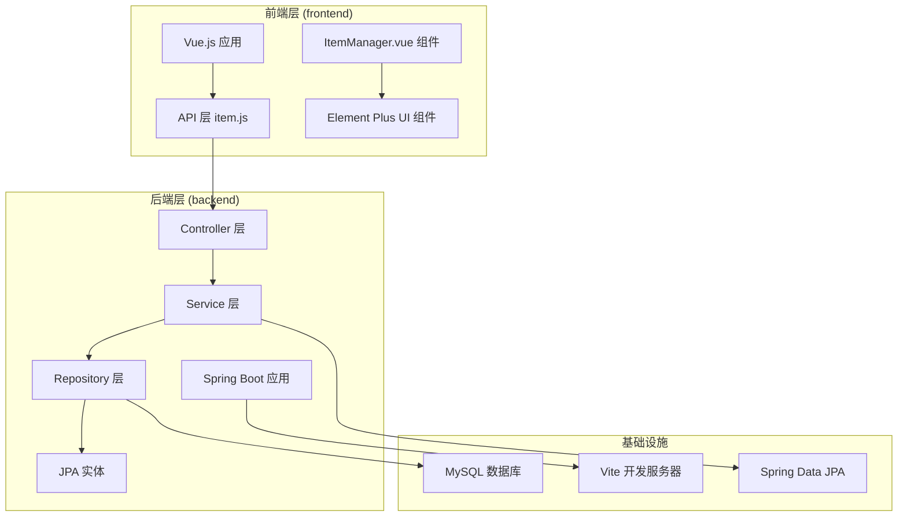
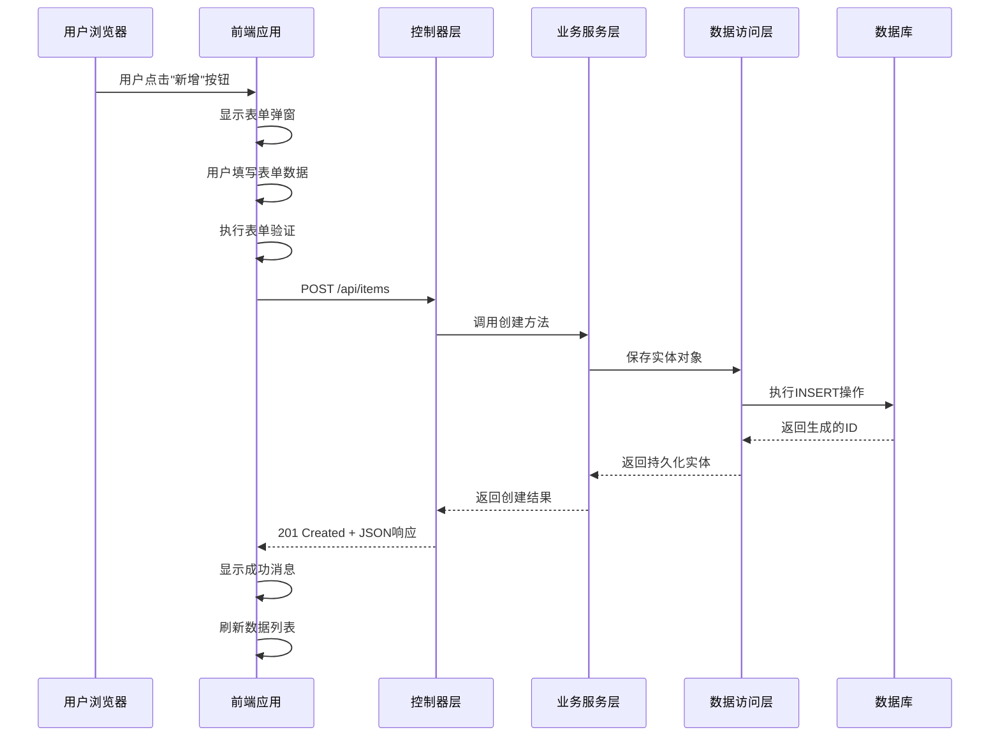
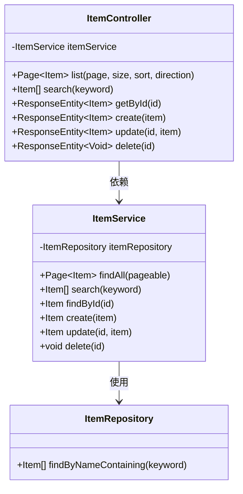
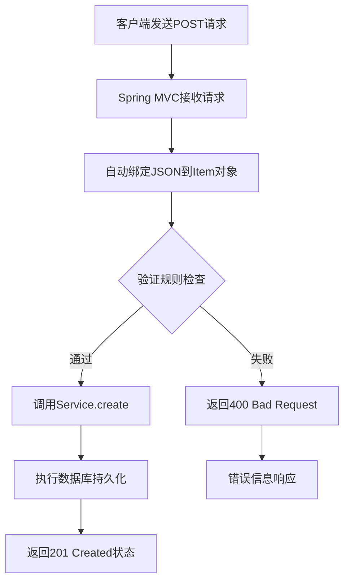
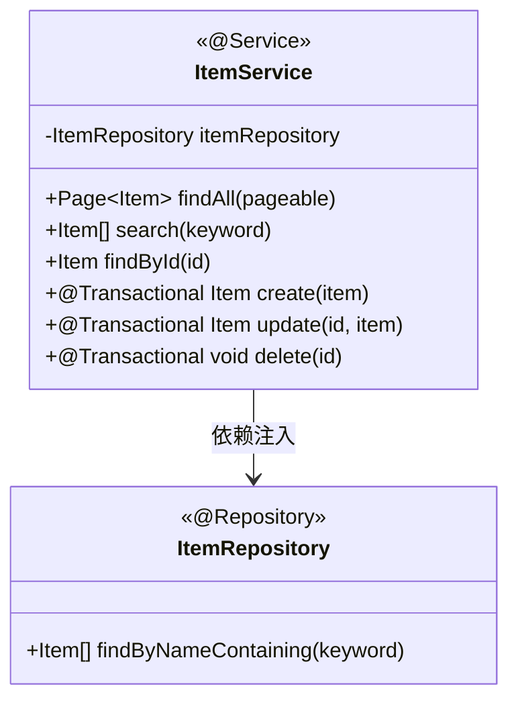
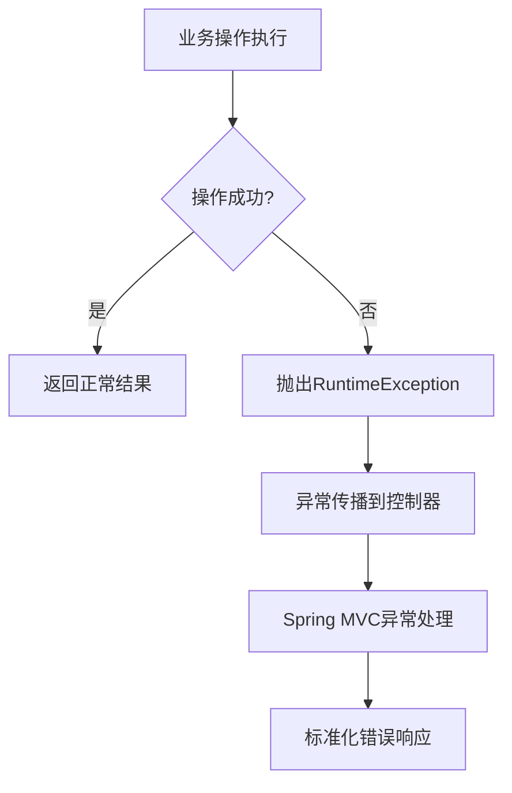
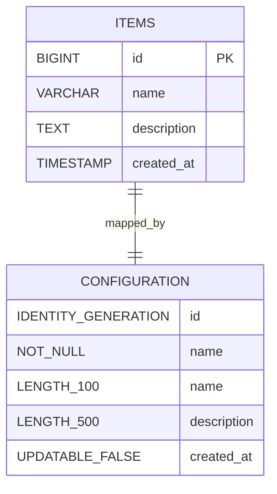
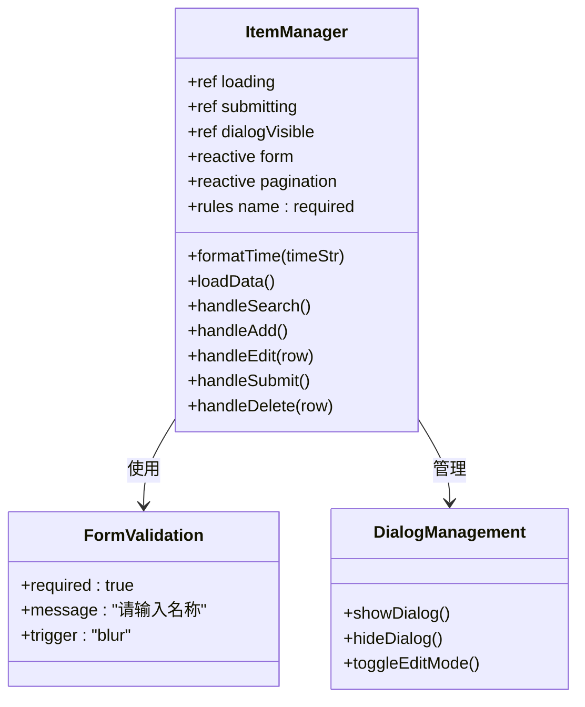
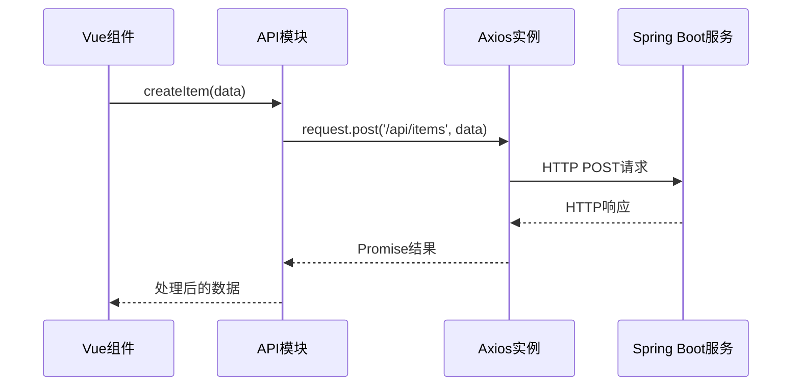
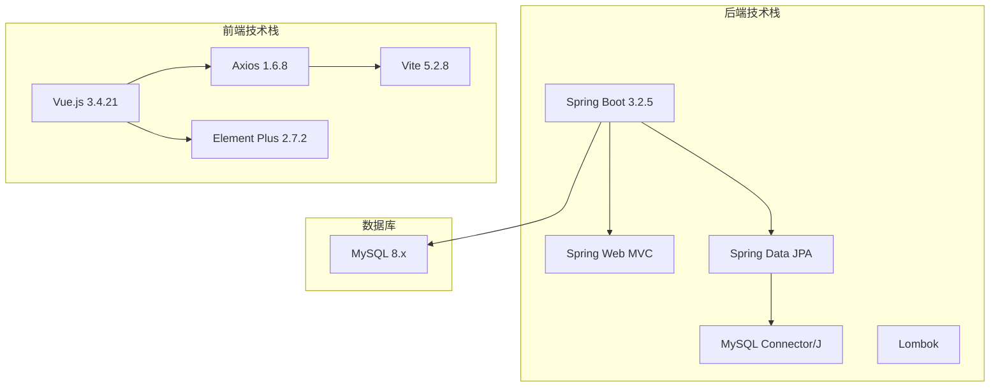

# 创建操作实现

<cite>
**本文档引用的文件**
- [ItemController.java](file://backend/src/main/java/com/example/demo/controller/ItemController.java)
- [ItemService.java](file://backend/src/main/java/com/example/demo/service/ItemService.java)
- [Item.java](file://backend/src/main/java/com/example/demo/entity/Item.java)
- [ItemRepository.java](file://backend/src/main/java/com/example/demo/repository/ItemRepository.java)
- [application.yml](file://backend/src/main/resources/application.yml)
- [pom.xml](file://backend/pom.xml)
- [ItemManager.vue](file://frontend/src/components/ItemManager.vue)
- [item.js](file://frontend/src/api/item.js)
- [package.json](file://frontend/package.json)
- [vite.config.js](file://frontend/vite.config.js)
</cite>

## 目录
1. [简介](#简介)
2. [项目结构](#项目结构)
3. [核心组件](#核心组件)
4. [架构概览](#架构概览)
5. [详细组件分析](#详细组件分析)
6. [依赖关系分析](#依赖关系分析)
7. [性能考虑](#性能考虑)
8. [故障排除指南](#故障排除指南)
9. [结论](#结论)

## 简介

本文档详细阐述了基于Spring Boot + Vue.js的完整创建操作实现，重点分析POST /api/items端点的完整数据流。该系统实现了从用户界面输入到数据库持久化的完整生命周期，包括请求参数验证、数据持久化和响应处理等关键环节。

系统采用前后端分离架构：后端使用Spring Boot提供RESTful API服务，前端使用Vue.js构建交互式用户界面。通过Element Plus组件库实现表单验证和用户交互，Axios进行HTTP通信，Vite作为开发服务器和构建工具。

## 项目结构

该项目采用标准的分层架构设计，清晰分离了表现层、业务逻辑层和数据访问层：

**图表来源**
- [ItemManager.vue:1-220](file://frontend/src/components/ItemManager.vue#L1-L220)
- [ItemController.java:15-59](file://backend/src/main/java/com/example/demo/controller/ItemController.java#L15-L59)
- [ItemService.java:13-50](file://backend/src/main/java/com/example/demo/service/ItemService.java#L13-L50)

**章节来源**
- [pom.xml:1-71](file://backend/pom.xml#L1-L71)
- [package.json:1-21](file://frontend/package.json#L1-L21)

## 核心组件

### 后端核心组件

#### 实体模型 (Item)
实体类定义了数据结构和数据库映射关系：
- 主键自增标识符
- 必填名称字段（最大长度100字符）
- 可选描述字段（最大长度500字符）
- 自动创建时间戳管理

#### 数据访问层 (ItemRepository)
继承Spring Data JPA接口，提供基础CRUD操作和自定义查询方法：
- 继承JpaRepository支持标准数据操作
- 继承JpaSpecificationExecutor支持复杂查询
- 提供按名称模糊查询功能

#### 业务逻辑层 (ItemService)
实现核心业务逻辑，包含事务管理和数据转换：
- 基于注解的声明式事务管理
- 统一的异常处理机制
- 数据持久化和查询操作封装

#### 控制器层 (ItemController)
提供RESTful API接口，处理HTTP请求：
- 支持GET、POST、PUT、DELETE四种HTTP方法
- 实现跨域资源共享配置
- 提供分页、排序和搜索功能

### 前端核心组件

#### 表单组件 (ItemManager.vue)
实现完整的用户交互界面：
- Element Plus表单组件集成
- 实时数据绑定和验证
- 弹窗对话框管理
- 分页和搜索功能

#### API封装 (item.js)
提供统一的HTTP请求接口：
- Axios实例配置和拦截器
- RESTful API方法封装
- 错误处理和响应格式化

**章节来源**
- [Item.java:1-30](file://backend/src/main/java/com/example/demo/entity/Item.java#L1-L30)
- [ItemRepository.java:1-13](file://backend/src/main/java/com/example/demo/repository/ItemRepository.java#L1-L13)
- [ItemService.java:13-50](file://backend/src/main/java/com/example/demo/service/ItemService.java#L13-L50)
- [ItemController.java:15-59](file://backend/src/main/java/com/example/demo/controller/ItemController.java#L15-L59)
- [ItemManager.vue:1-220](file://frontend/src/components/ItemManager.vue#L1-L220)
- [item.js:1-31](file://frontend/src/api/item.js#L1-L31)

## 架构概览

系统采用经典的三层架构模式，实现了清晰的关注点分离：

**图表来源**
- [ItemManager.vue:172-196](file://frontend/src/components/ItemManager.vue#L172-L196)
- [ItemController.java:43-46](file://backend/src/main/java/com/example/demo/controller/ItemController.java#L43-L46)
- [ItemService.java:32-35](file://backend/src/main/java/com/example/demo/service/ItemService.java#L32-L35)

**章节来源**
- [application.yml:1-18](file://backend/src/main/resources/application.yml#L1-L18)
- [vite.config.js:1-16](file://frontend/vite.config.js#L1-L16)

## 详细组件分析

### 后端控制器实现

#### POST /api/items 端点实现

控制器层负责HTTP请求处理和响应返回：

**图表来源**
- [ItemController.java:15-59](file://backend/src/main/java/com/example/demo/controller/ItemController.java#L15-L59)
- [ItemService.java:13-50](file://backend/src/main/java/com/example/demo/service/ItemService.java#L13-L50)
- [ItemRepository.java:1-13](file://backend/src/main/java/com/example/demo/repository/ItemRepository.java#L1-13)

#### 请求参数验证流程

当前实现采用Spring MVC自动验证机制：

**图表来源**
- [ItemController.java:43-46](file://backend/src/main/java/com/example/demo/controller/ItemController.java#L43-L46)
- [ItemService.java:32-35](file://backend/src/main/java/com/example/demo/service/ItemService.java#L32-L35)

**章节来源**
- [ItemController.java:43-46](file://backend/src/main/java/com/example/demo/controller/ItemController.java#L43-L46)

### 业务服务层实现

#### 事务管理策略

服务层采用声明式事务管理，确保数据一致性：

**图表来源**
- [ItemService.java:13-50](file://backend/src/main/java/com/example/demo/service/ItemService.java#L13-L50)
- [ItemRepository.java:1-13](file://backend/src/main/java/com/example/demo/repository/ItemRepository.java#L1-L13)

#### 异常处理机制

服务层实现了统一的异常处理策略：

**图表来源**
- [ItemService.java:27-30](file://backend/src/main/java/com/example/demo/service/ItemService.java#L27-L30)

**章节来源**
- [ItemService.java:32-35](file://backend/src/main/java/com/example/demo/service/ItemService.java#L32-L35)

### 数据持久化层

#### JPA实体映射

实体类定义了完整的数据模型：

**图表来源**
- [Item.java:10-29](file://backend/src/main/java/com/example/demo/entity/Item.java#L10-L29)

#### 数据库配置

应用程序配置了完整的数据库连接和JPA设置：

**章节来源**
- [application.yml:4-18](file://backend/src/main/resources/application.yml#L4-L18)

### 前端表单组件实现

#### 表单字段绑定和验证

前端组件实现了完整的表单管理功能：

**图表来源**
- [ItemManager.vue:87-220](file://frontend/src/components/ItemManager.vue#L87-L220)

#### 用户体验优化

组件实现了多项用户体验优化措施：

1. **实时表单验证**：基于Element Plus的表单验证系统
2. **加载状态指示**：使用loading和submitting状态变量
3. **确认对话框**：删除操作前的安全确认
4. **成功消息反馈**：操作成功后的即时提示
5. **错误处理**：统一的错误消息显示

**章节来源**
- [ItemManager.vue:172-196](file://frontend/src/components/ItemManager.vue#L172-L196)

### API通信层

#### HTTP请求封装

API模块提供了统一的HTTP请求接口：

**图表来源**
- [item.js:20-22](file://frontend/src/api/item.js#L20-L22)

#### 开发服务器配置

Vite配置实现了前后端分离开发环境：

**章节来源**
- [vite.config.js:8-13](file://frontend/vite.config.js#L8-L13)

## 依赖关系分析

### 技术栈依赖

系统采用了现代化的技术栈组合：

**图表来源**
- [pom.xml:24-52](file://backend/pom.xml#L24-L52)
- [package.json:11-19](file://frontend/package.json#L11-L19)

### 关键依赖特性

#### 后端依赖特性

1. **Spring Boot Starter**：简化依赖管理和自动配置
2. **Spring Validation**：提供Bean Validation支持
3. **MySQL Connector**：数据库连接驱动
4. **Lombok**：减少样板代码

#### 前端依赖特性

1. **Vue 3 Composition API**：现代化的组件开发
2. **Element Plus**：企业级UI组件库
3. **Axios**：HTTP客户端库
4. **Vite**：快速的开发服务器和构建工具

**章节来源**
- [pom.xml:24-52](file://backend/pom.xml#L24-L52)
- [package.json:11-19](file://frontend/package.json#L11-L19)

## 性能考虑

### 数据库性能优化

1. **索引策略**：建议在name字段上创建索引以优化搜索性能
2. **连接池配置**：合理配置数据库连接池大小
3. **查询优化**：使用分页查询避免大数据集加载

### 缓存策略

1. **前端缓存**：利用Element Plus的消息提示系统
2. **后端缓存**：可考虑添加Redis缓存层
3. **CDN优化**：静态资源可通过CDN加速

### 并发处理

1. **事务隔离**：合理设置事务隔离级别
2. **乐观锁**：对于高并发场景可考虑添加版本号字段
3. **限流策略**：实现API请求频率限制

## 故障排除指南

### 常见问题及解决方案

#### 后端启动问题

1. **数据库连接失败**
   - 检查application.yml中的数据库配置
   - 确认MySQL服务正在运行
   - 验证用户名和密码正确性

2. **端口冲突**
   - 修改application.yml中的server.port
   - 或停止占用8080端口的服务

#### 前端开发问题

1. **代理配置问题**
   - 检查vite.config.js中的代理配置
   - 确认后端服务地址正确

2. **CORS跨域问题**
   - 检查控制器中的@CrossOrigin注解
   - 验证允许的源地址配置

#### 数据库问题

1. **DDL自动更新**
   - application.yml中已配置ddl-auto: update
   - 生产环境中应谨慎使用此配置

2. **实体映射问题**
   - 确保@Entity注解正确配置
   - 验证字段类型映射关系

**章节来源**
- [application.yml:1-18](file://backend/src/main/resources/application.yml#L1-L18)
- [vite.config.js:6-14](file://frontend/vite.config.js#L6-L14)

## 结论

本项目成功实现了完整的创建操作功能，展现了现代Web应用的最佳实践。系统具有以下优势：

1. **架构清晰**：采用分层架构，职责分离明确
2. **技术先进**：使用Spring Boot和Vue.js等主流技术
3. **用户体验好**：提供丰富的交互功能和友好的用户界面
4. **可扩展性强**：模块化设计便于功能扩展和维护

### 改进建议

1. **增强验证**：添加更严格的字段验证规则
2. **错误处理**：实现全局异常处理器
3. **日志记录**：添加详细的日志记录机制
4. **测试覆盖**：增加单元测试和集成测试
5. **安全加固**：添加CSRF保护和输入过滤

该实现为类似的数据管理应用提供了良好的参考模板，展示了从需求分析到完整部署的全流程开发经验。