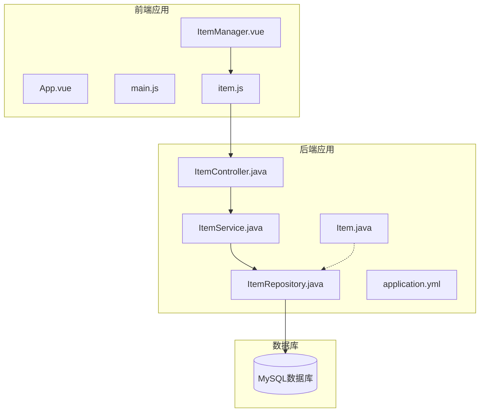
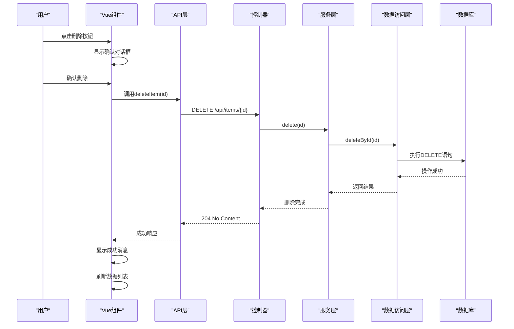
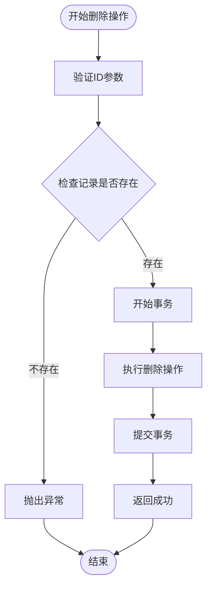
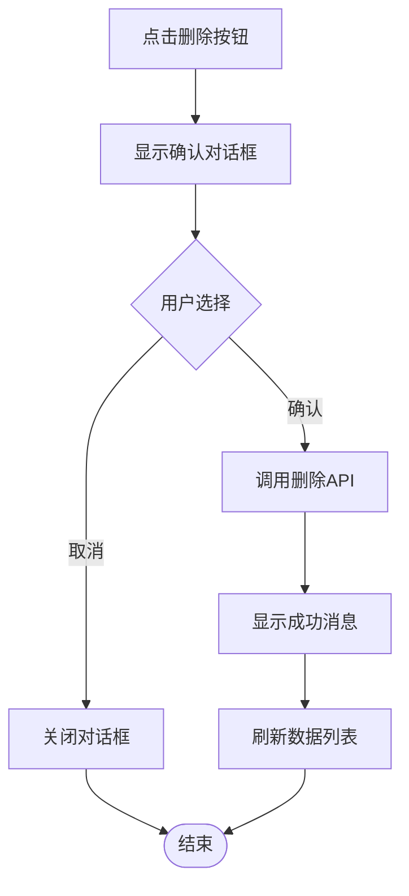
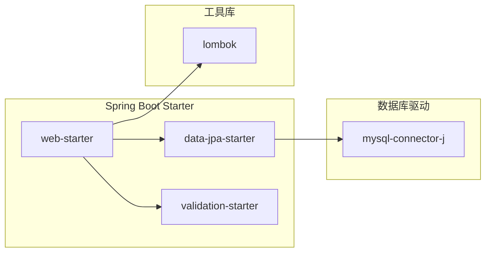

# 删除操作实现

<cite>
**本文档引用的文件**
- [ItemController.java](file://backend/src/main/java/com/example/demo/controller/ItemController.java)
- [ItemService.java](file://backend/src/main/java/com/example/demo/service/ItemService.java)
- [ItemRepository.java](file://backend/src/main/java/com/example/demo/repository/ItemRepository.java)
- [Item.java](file://backend/src/main/java/com/example/demo/entity/Item.java)
- [application.yml](file://backend/src/main/resources/application.yml)
- [item.js](file://frontend/src/api/item.js)
- [ItemManager.vue](file://frontend/src/components/ItemManager.vue)
- [App.vue](file://frontend/src/App.vue)
- [main.js](file://frontend/src/main.js)
- [pom.xml](file://backend/pom.xml)
</cite>

## 目录
1. [简介](#简介)
2. [项目结构](#项目结构)
3. [核心组件](#核心组件)
4. [架构概览](#架构概览)
5. [详细组件分析](#详细组件分析)
6. [依赖关系分析](#依赖关系分析)
7. [性能考虑](#性能考虑)
8. [故障排除指南](#故障排除指南)
9. [结论](#结论)

## 简介

本文件详细说明了基于Spring Boot和Vue.js的CRUD应用中DELETE /api/items/{id}端点的完整删除操作实现。该实现涵盖了从前端确认机制到后端服务层的完整流程，包括路径参数解析、数据删除、响应处理以及错误处理策略。

## 项目结构

该项目采用前后端分离架构，后端使用Spring Boot提供RESTful API，前端使用Vue.js构建用户界面。

**图表来源**
- [App.vue:1-18](file://frontend/src/App.vue#L1-L18)
- [main.js:1-9](file://frontend/src/main.js#L1-L9)
- [ItemManager.vue:1-220](file://frontend/src/components/ItemManager.vue#L1-L220)
- [item.js:1-31](file://frontend/src/api/item.js#L1-L31)
- [ItemController.java:1-59](file://backend/src/main/java/com/example/demo/controller/ItemController.java#L1-L59)
- [ItemService.java:1-50](file://backend/src/main/java/com/example/demo/service/ItemService.java#L1-L50)
- [ItemRepository.java:1-13](file://backend/src/main/java/com/example/demo/repository/ItemRepository.java#L1-L13)
- [application.yml:1-18](file://backend/src/main/resources/application.yml#L1-L18)

**章节来源**
- [App.vue:1-18](file://frontend/src/App.vue#L1-L18)
- [main.js:1-9](file://frontend/src/main.js#L1-L9)
- [ItemManager.vue:1-220](file://frontend/src/components/ItemManager.vue#L1-L220)
- [item.js:1-31](file://frontend/src/api/item.js#L1-L31)
- [ItemController.java:1-59](file://backend/src/main/java/com/example/demo/controller/ItemController.java#L1-L59)
- [ItemService.java:1-50](file://backend/src/main/java/com/example/demo/service/ItemService.java#L1-L50)
- [ItemRepository.java:1-13](file://backend/src/main/java/com/example/demo/repository/ItemRepository.java#L1-L13)
- [application.yml:1-18](file://backend/src/main/resources/application.yml#L1-L18)

## 核心组件

### 后端核心组件

#### 控制器层
- **ItemController**: 提供RESTful API接口，包含DELETE /api/items/{id}端点
- 路径参数解析：使用@PathVariable注解提取URL中的id参数
- 响应处理：返回204 No Content状态码表示删除成功

#### 服务层
- **ItemService**: 实现业务逻辑，包含删除操作的核心方法
- 事务管理：使用@Transactional注解确保数据一致性
- 异常处理：当找不到指定ID时抛出RuntimeException

#### 数据访问层
- **ItemRepository**: 继承JpaRepository，提供数据持久化操作
- 查询方法：继承基础的CRUD操作和分页查询能力

#### 实体模型
- **Item**: JPA实体类，映射到数据库的items表
- 字段：包含id、name、description和createdAt等字段
- 时间戳：使用@PrePersist注解自动设置创建时间

**章节来源**
- [ItemController.java:53-57](file://backend/src/main/java/com/example/demo/controller/ItemController.java#L53-L57)
- [ItemService.java:45-48](file://backend/src/main/java/com/example/demo/service/ItemService.java#L45-L48)
- [ItemRepository.java:9-12](file://backend/src/main/java/com/example/demo/repository/ItemRepository.java#L9-L12)
- [Item.java:10-29](file://backend/src/main/java/com/example/demo/entity/Item.java#L10-L29)

### 前端核心组件

#### API层
- **item.js**: 封装HTTP请求，提供deleteItem函数
- 基础配置：使用axios创建带baseURL的请求实例
- 请求方法：封装DELETE请求用于删除操作

#### 组件层
- **ItemManager.vue**: 主要的数据管理组件
- 用户界面：提供表格显示、搜索、分页等功能
- 删除确认：集成Element Plus的消息框组件进行用户确认

**章节来源**
- [item.js:28-30](file://frontend/src/api/item.js#L28-L30)
- [ItemManager.vue:198-214](file://frontend/src/components/ItemManager.vue#L198-L214)

## 架构概览

删除操作采用经典的三层架构模式，实现了清晰的职责分离。

**图表来源**
- [ItemManager.vue:198-214](file://frontend/src/components/ItemManager.vue#L198-L214)
- [item.js:28-30](file://frontend/src/api/item.js#L28-L30)
- [ItemController.java:53-57](file://backend/src/main/java/com/example/demo/controller/ItemController.java#L53-L57)
- [ItemService.java:45-48](file://backend/src/main/java/com/example/demo/service/ItemService.java#L45-L48)
- [ItemRepository.java:9-12](file://backend/src/main/java/com/example/demo/repository/ItemRepository.java#L9-L12)

## 详细组件分析

### 后端删除端点实现

#### 路径参数解析
控制器使用@PathVariable注解从URL路径中提取ID参数：
- 注解类型：@PathVariable Long id
- 参数绑定：自动将URL中的{id}部分转换为Long类型
- 类型安全：确保传入的ID为数值类型

#### 删除逻辑实现
服务层的delete方法实现了完整的删除流程：

**图表来源**
- [ItemService.java:45-48](file://backend/src/main/java/com/example/demo/service/ItemService.java#L45-L48)
- [ItemRepository.java:9-12](file://backend/src/main/java/com/example/demo/repository/ItemRepository.java#L9-L12)

#### 响应处理
控制器返回204 No Content状态码，表示删除成功但无响应体：
- 状态码：204 No Content
- 响应体：空内容
- 兼容性：符合RESTful API最佳实践

**章节来源**
- [ItemController.java:53-57](file://backend/src/main/java/com/example/demo/controller/ItemController.java#L53-L57)
- [ItemService.java:45-48](file://backend/src/main/java/com/example/demo/service/ItemService.java#L45-L48)

### 前端删除确认机制

#### 模态对话框实现
前端使用Element Plus的ElMessageBox组件实现删除确认：

**图表来源**
- [ItemManager.vue:198-214](file://frontend/src/components/ItemManager.vue#L198-L214)

#### 用户确认流程
确认对话框提供了标准的用户交互体验：
- 标题：'提示'
- 内容：`确定要删除「${row.name}」吗？`
- 按钮：'确定'(确认删除) 和 '取消'(取消操作)
- 样式：警告样式(type: 'warning')

#### 删除按钮状态管理
组件实现了完整的状态管理机制：
- 加载状态：loading - 控制表格加载指示器
- 提交状态：submitting - 控制表单提交按钮
- 对话框状态：dialogVisible - 控制新增/编辑对话框
- 编辑状态：isEdit - 区分新增和编辑模式

**章节来源**
- [ItemManager.vue:198-214](file://frontend/src/components/ItemManager.vue#L198-L214)
- [ItemManager.vue:92-105](file://frontend/src/components/ItemManager.vue#L92-L105)

### 数据安全保护

#### 路径参数验证
- 类型转换：@PathVariable确保URL参数转换为Long类型
- 空值检查：服务层通过findById方法处理不存在的ID
- 异常处理：找不到记录时抛出RuntimeException

#### 事务管理
- 原子性：@Transactional注解确保删除操作的原子性
- 回滚机制：发生异常时自动回滚事务
- 性能优化：避免长时间持有数据库连接

**章节来源**
- [ItemController.java:53-57](file://backend/src/main/java/com/example/demo/controller/ItemController.java#L53-L57)
- [ItemService.java:45-48](file://backend/src/main/java/com/example/demo/service/ItemService.java#L45-L48)

### 数据库配置与连接

#### 数据源配置
应用程序使用MySQL作为数据存储：
- 连接字符串：jdbc:mysql://localhost:3306/demo_db
- 驱动程序：com.mysql.cj.jdbc.Driver
- 认证信息：用户名root，密码root
- 连接属性：禁用SSL，启用公钥检索

#### JPA配置
- 自动DDL：hibernate.ddl-auto: update
- SQL显示：show-sql: true
- 方言设置：MySQLDialect
- 格式化：format_sql: true

**章节来源**
- [application.yml:4-17](file://backend/src/main/resources/application.yml#L4-L17)

## 依赖关系分析

### 后端技术栈依赖

**图表来源**
- [pom.xml:24-51](file://backend/pom.xml#L24-L51)

### 前端技术栈依赖

#### 核心依赖
- Vue.js 3.0+：响应式框架
- Element Plus：UI组件库
- Axios：HTTP客户端库

#### 开发依赖
- Vite：构建工具
- Vue Router：路由管理
- ESLint：代码质量检查

**章节来源**
- [pom.xml:24-51](file://backend/pom.xml#L24-L51)
- [main.js:1-9](file://frontend/src/main.js#L1-L9)

## 性能考虑

### 数据库性能优化
- 索引设计：建议在items表的id列上建立主键索引
- 连接池：Spring Boot自动配置数据库连接池
- 查询优化：使用JpaRepository提供的高效查询方法

### 前端性能优化
- 懒加载：组件按需加载
- 缓存策略：利用浏览器缓存静态资源
- 网络优化：合理设置超时时间和重试机制

### 并发控制
- 事务隔离：使用Spring的事务管理确保数据一致性
- 锁机制：数据库层面的行级锁防止并发修改冲突

## 故障排除指南

### 常见问题及解决方案

#### 后端异常处理
- 404 Not Found：当删除不存在的ID时，服务层抛出RuntimeException
- 500 Internal Server Error：数据库连接异常或事务失败
- 400 Bad Request：请求格式不正确或参数类型错误

#### 前端错误处理
- 网络错误：检查API端点是否正确配置
- 权限问题：确认CORS配置允许跨域请求
- 数据同步：删除后及时刷新本地数据状态

#### 数据库连接问题
- 连接超时：检查数据库服务器状态和网络连接
- 认证失败：验证用户名和密码配置
- 表结构不匹配：确认数据库迁移是否成功执行

**章节来源**
- [ItemService.java](file://backend/src/main/java/com/example/demo/service/ItemService.java#L29)
- [application.yml:4-17](file://backend/src/main/resources/application.yml#L4-L17)

## 结论

本删除操作实现展现了现代Web应用的最佳实践：

### 技术优势
- **清晰的架构分离**：前后端职责明确，便于维护和扩展
- **完整的错误处理**：前后端都有完善的异常处理机制
- **用户体验优化**：确认对话框和状态管理提升用户满意度
- **安全性保障**：参数验证和事务管理确保数据完整性

### 可扩展性
- **模块化设计**：各组件职责单一，易于单元测试和重构
- **配置灵活**：YAML配置文件便于环境切换
- **技术栈成熟**：Spring Boot和Vue.js都是主流技术栈

### 改进建议
- **软删除支持**：可添加deleted字段实现逻辑删除
- **批量删除**：扩展API支持多ID删除
- **审计日志**：记录删除操作的详细信息
- **权限控制**：添加基于角色的访问控制

该实现为类似的数据管理应用提供了完整的参考模板，涵盖了从基础CRUD操作到高级功能的各个方面。