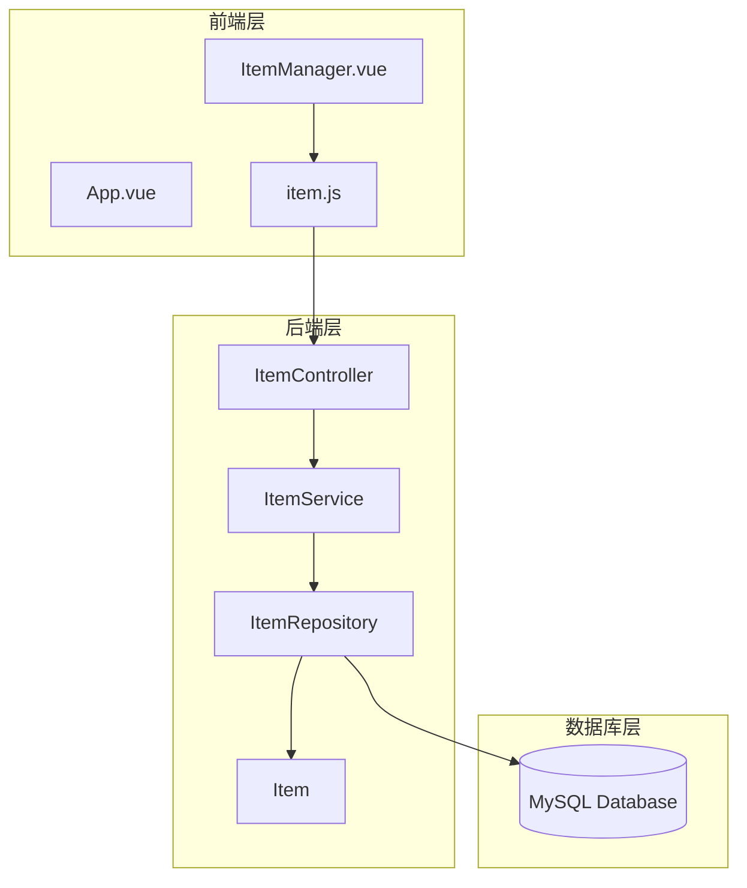
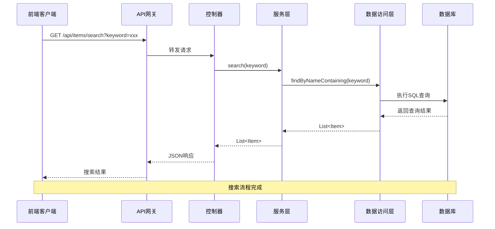
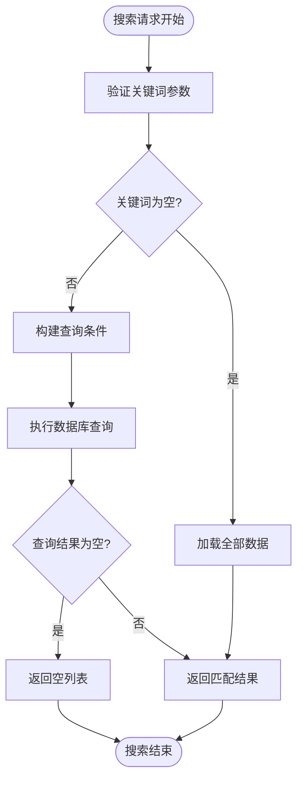
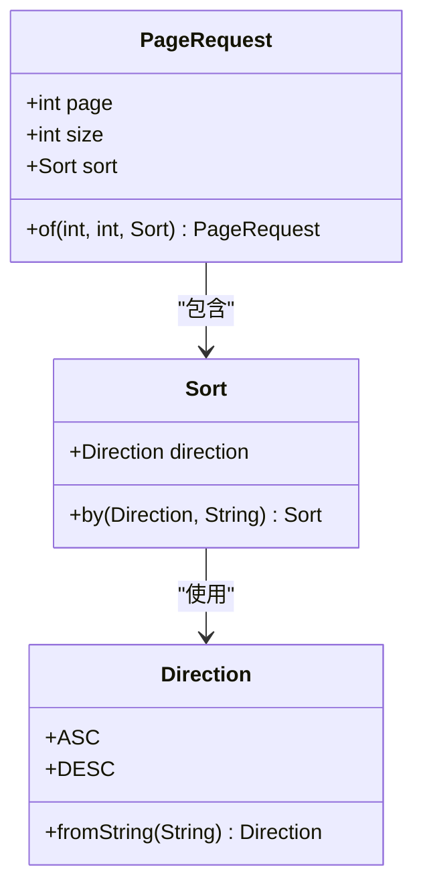
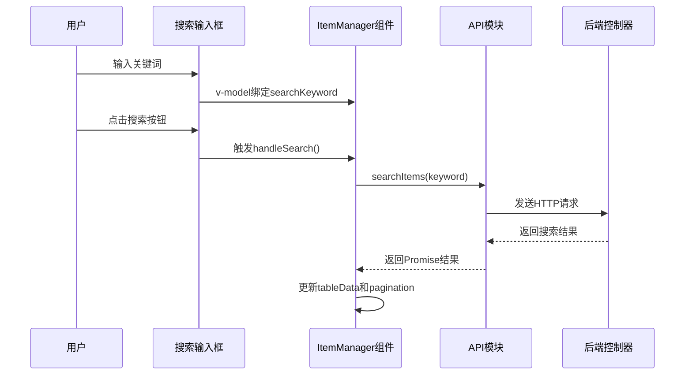
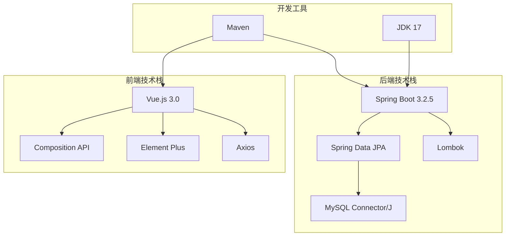
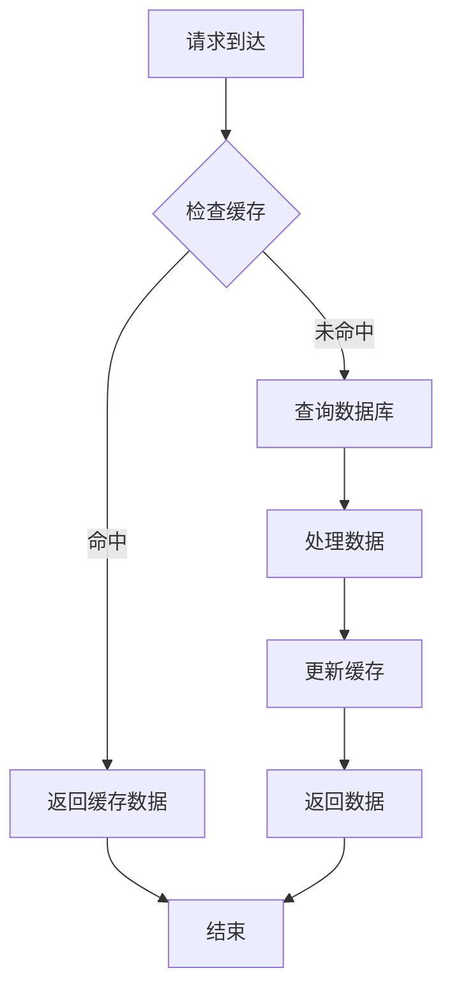

# 搜索与分页功能

<cite>
**本文档引用的文件**
- [ItemController.java](file://backend/src/main/java/com/example/demo/controller/ItemController.java)
- [ItemService.java](file://backend/src/main/java/com/example/demo/service/ItemService.java)
- [ItemRepository.java](file://backend/src/main/java/com/example/demo/repository/ItemRepository.java)
- [Item.java](file://backend/src/main/java/com/example/demo/entity/Item.java)
- [application.yml](file://backend/src/main/resources/application.yml)
- [item.js](file://frontend/src/api/item.js)
- [ItemManager.vue](file://frontend/src/components/ItemManager.vue)
- [App.vue](file://frontend/src/App.vue)
- [main.js](file://frontend/src/main.js)
- [pom.xml](file://backend/pom.xml)
</cite>

## 目录
1. [简介](#简介)
2. [项目结构](#项目结构)
3. [核心组件](#核心组件)
4. [架构概览](#架构概览)
5. [详细组件分析](#详细组件分析)
6. [依赖关系分析](#依赖关系分析)
7. [性能考虑](#性能考虑)
8. [故障排除指南](#故障排除指南)
9. [结论](#结论)

## 简介

本项目是一个基于Spring Boot和Vue.js的CRUD应用，实现了完整的搜索与分页功能。系统提供了RESTful API接口用于数据检索，支持关键词搜索、模糊匹配和分页查询。前端使用Element Plus组件库构建用户界面，实现了响应式的搜索和分页交互体验。

## 项目结构

项目采用前后端分离架构，后端使用Spring Boot框架，前端使用Vue.js 3.0 + Composition API。



**图表来源**
- [ItemController.java:15-59](file://backend/src/main/java/com/example/demo/controller/ItemController.java#L15-L59)
- [ItemService.java:13-50](file://backend/src/main/java/com/example/demo/service/ItemService.java#L13-L50)
- [ItemRepository.java:1-13](file://backend/src/main/java/com/example/demo/repository/ItemRepository.java#L1-L13)

**章节来源**
- [pom.xml:1-71](file://backend/pom.xml#L1-L71)
- [application.yml:1-18](file://backend/src/main/resources/application.yml#L1-L18)

## 核心组件

### 后端核心组件

#### 控制器层 (ItemController)
- 提供RESTful API接口：`GET /api/items`（分页列表）、`GET /api/items/search`（搜索）
- 处理HTTP请求参数：page、size、sort、direction
- 实现CORS跨域支持

#### 服务层 (ItemService)
- 封装业务逻辑，调用数据访问层
- 提供搜索方法和分页查询方法
- 使用事务管理确保数据一致性

#### 数据访问层 (ItemRepository)
- 继承JpaRepository和JpaSpecificationExecutor
- 提供自定义查询方法：`findByNameContaining`
- 支持复杂查询和分页操作

#### 实体层 (Item)
- JPA实体映射数据库表
- 包含基础字段：id、name、description、createdAt
- 使用Lombok简化代码

**章节来源**
- [ItemController.java:15-59](file://backend/src/main/java/com/example/demo/controller/ItemController.java#L15-L59)
- [ItemService.java:13-50](file://backend/src/main/java/com/example/demo/service/ItemService.java#L13-L50)
- [ItemRepository.java:1-13](file://backend/src/main/java/com/example/demo/repository/ItemRepository.java#L1-L13)
- [Item.java:1-30](file://backend/src/main/java/com/example/demo/entity/Item.java#L1-L30)

## 架构概览

系统采用经典的三层架构模式，实现了清晰的职责分离和良好的可扩展性。



**图表来源**
- [ItemController.java:33-36](file://backend/src/main/java/com/example/demo/controller/ItemController.java#L33-L36)
- [ItemService.java:23-25](file://backend/src/main/java/com/example/demo/service/ItemService.java#L23-L25)
- [ItemRepository.java:11](file://backend/src/main/java/com/example/demo/repository/ItemRepository.java#L11)

**章节来源**
- [ItemController.java:33-36](file://backend/src/main/java/com/example/demo/controller/ItemController.java#L33-L36)
- [ItemService.java:23-25](file://backend/src/main/java/com/example/demo/service/ItemService.java#L23-L25)

## 详细组件分析

### 搜索功能实现

#### 关键词匹配算法
系统使用简单的字符串包含匹配算法，通过JPA的`findByNameContaining`方法实现模糊搜索。



**图表来源**
- [ItemController.java:33-36](file://backend/src/main/java/com/example/demo/controller/ItemController.java#L33-L36)
- [ItemService.java:23-25](file://backend/src/main/java/com/example/demo/service/ItemService.java#L23-L25)

#### 模糊搜索实现
- 使用JPA的`Containing`关键字进行部分匹配
- 支持大小写不敏感的搜索（取决于数据库配置）
- 性能特点：简单高效，适合小到中等规模的数据集

**章节来源**
- [ItemRepository.java:11](file://backend/src/main/java/com/example/demo/repository/ItemRepository.java#L11)
- [ItemService.java:23-25](file://backend/src/main/java/com/example/demo/service/ItemService.java#L23-L25)

### 分页查询功能

#### 参数处理机制
系统支持以下分页参数：
- `page`: 当前页码（默认0，实际转换为page-1）
- `size`: 每页记录数（默认10）
- `sort`: 排序字段（默认id）
- `direction`: 排序方向（默认desc）



**图表来源**
- [ItemController.java:24-30](file://backend/src/main/java/com/example/demo/controller/ItemController.java#L24-L30)

#### Pageable对象构建
- 将前端传入的page参数减1，因为Spring Data的page从0开始计数
- 支持动态排序字段和方向
- 自动处理边界情况和默认值

**章节来源**
- [ItemController.java:24-31](file://backend/src/main/java/com/example/demo/controller/ItemController.java#L24-L31)

### 前端搜索组件实现

#### 输入框绑定机制
前端使用Vue 3.0的Composition API实现响应式数据绑定：



**图表来源**
- [ItemManager.vue:14-25](file://frontend/src/components/ItemManager.vue#L14-L25)
- [ItemManager.vue:138-154](file://frontend/src/components/ItemManager.vue#L138-L154)

#### 防抖处理策略
当前实现未包含防抖功能，建议在实际生产环境中添加：

```javascript
// 建议的防抖实现
function debounce(func, wait) {
    let timeout;
    return function executedFunction(...args) {
        const later = () => {
            clearTimeout(timeout);
            func(...args);
        };
        clearTimeout(timeout);
        timeout = setTimeout(later, wait);
    };
}

// 在handleSearch中使用
const debouncedSearch = debounce(handleSearch, 300);
```

#### 搜索结果展示
- 使用Element Plus的Table组件展示数据
- 支持加载状态指示器
- 实时更新分页信息

**章节来源**
- [ItemManager.vue:138-154](file://frontend/src/components/ItemManager.vue#L138-L154)
- [ItemManager.vue:29-44](file://frontend/src/components/ItemManager.vue#L29-L44)

### API接口设计

#### RESTful API规范
系统遵循RESTful设计原则，提供标准的HTTP方法：

| 方法 | 路径 | 功能 | 请求参数 | 响应 |
|------|------|------|----------|------|
| GET | `/api/items` | 获取分页列表 | page, size, sort, direction | Page<Item> |
| GET | `/api/items/search` | 搜索功能 | keyword | List<Item> |
| GET | `/api/items/{id}` | 获取单个记录 | id | Item |
| POST | `/api/items` | 创建新记录 | Item | Item |
| PUT | `/api/items/{id}` | 更新记录 | id, Item | Item |
| DELETE | `/api/items/{id}` | 删除记录 | id | 204 No Content |

**章节来源**
- [ItemController.java:23-57](file://backend/src/main/java/com/example/demo/controller/ItemController.java#L23-L57)

## 依赖关系分析

### 技术栈依赖



**图表来源**
- [pom.xml:24-51](file://backend/pom.xml#L24-L51)
- [main.js:1-9](file://frontend/src/main.js#L1-L9)

### 数据库设计

```mermaid
erDiagram
ITEMS {
bigint id PK
varchar name
varchar description
timestamp created_at
}
INDEXES {
PRIMARY KEY (id)
UNIQUE KEY uk_name (name)
}
```

**图表来源**
- [Item.java:10-29](file://backend/src/main/java/com/example/demo/entity/Item.java#L10-L29)

**章节来源**
- [pom.xml:24-51](file://backend/pom.xml#L24-L51)
- [Item.java:10-29](file://backend/src/main/java/com/example/demo/entity/Item.java#L10-L29)

## 性能考虑

### 数据库性能优化

#### 查询优化策略
1. **索引优化**
   - 为常用搜索字段建立索引
   - 考虑全文搜索引擎如Elasticsearch

2. **查询优化**
   - 使用select子句只查询必要字段
   - 避免N+1查询问题

3. **连接池配置**
   ```yaml
   spring:
     datasource:
       hikari:
         maximum-pool-size: 20
         minimum-idle: 5
         connection-timeout: 30000
   ```

#### 缓存机制
建议实现多级缓存：



### 前端性能优化

#### 加载优化
1. **懒加载**：仅在需要时加载组件
2. **虚拟滚动**：大数据量时使用虚拟滚动
3. **图片优化**：压缩和懒加载图片资源

#### 网络优化
1. **请求合并**：减少HTTP请求数量
2. **CDN加速**：静态资源使用CDN
3. **Gzip压缩**：启用服务器压缩

## 故障排除指南

### 常见问题及解决方案

#### 后端问题
1. **数据库连接失败**
   - 检查数据库URL、用户名、密码配置
   - 确认MySQL服务正常运行

2. **JPA查询异常**
   - 验证实体类注解配置
   - 检查数据库表结构是否匹配

3. **CORS跨域问题**
   - 确认@CrossOrigin注解配置
   - 检查浏览器控制台错误信息

#### 前端问题
1. **API请求失败**
   - 检查baseURL配置
   - 验证网络连接状态

2. **组件渲染异常**
   - 确认Vue版本兼容性
   - 检查Element Plus安装状态

**章节来源**
- [application.yml:4-17](file://backend/src/main/resources/application.yml#L4-L17)
- [ItemController.java:18](file://backend/src/main/java/com/example/demo/controller/ItemController.java#L18)

### 错误处理机制

#### 异常处理策略
1. **后端异常处理**
   - 使用@ExceptionHandler统一处理异常
   - 返回标准化的错误响应格式

2. **前端错误处理**
   - 使用try-catch捕获异步错误
   - 显示友好的错误提示信息

#### 日志记录
建议添加完整的日志记录机制：
- 请求日志：记录API调用详情
- 错误日志：记录异常堆栈信息
- 性能日志：记录查询耗时统计

## 结论

本项目成功实现了完整的搜索与分页功能，具有以下特点：

### 优势
1. **架构清晰**：采用分层架构，职责分离明确
2. **实现简洁**：使用Spring Data JPA简化数据访问
3. **用户体验好**：前端交互流畅，响应迅速
4. **可扩展性强**：支持后续功能扩展和性能优化

### 改进建议
1. **搜索增强**：实现更智能的搜索算法，支持多字段搜索
2. **性能优化**：添加缓存机制和数据库索引优化
3. **安全加固**：添加输入验证和SQL注入防护
4. **监控完善**：添加APM监控和性能指标收集

该系统为类似的数据管理应用场景提供了良好的参考实现，可以在保证功能完整性的基础上进一步优化性能和用户体验。