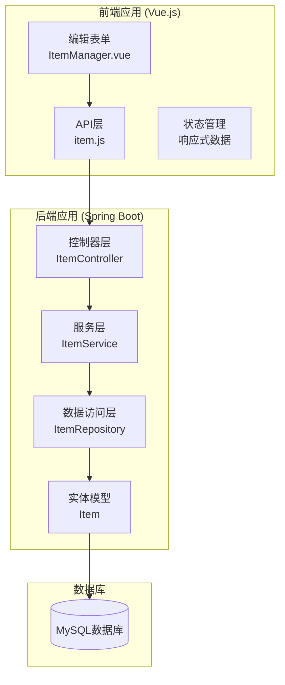
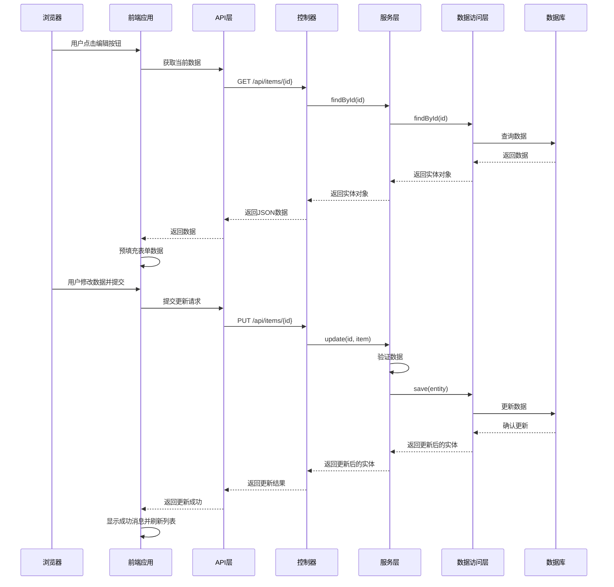
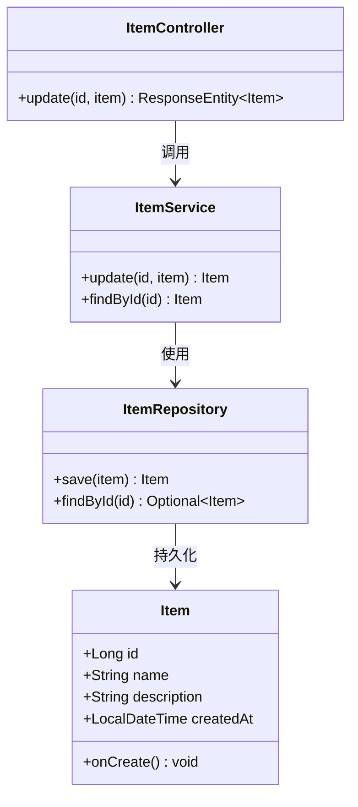
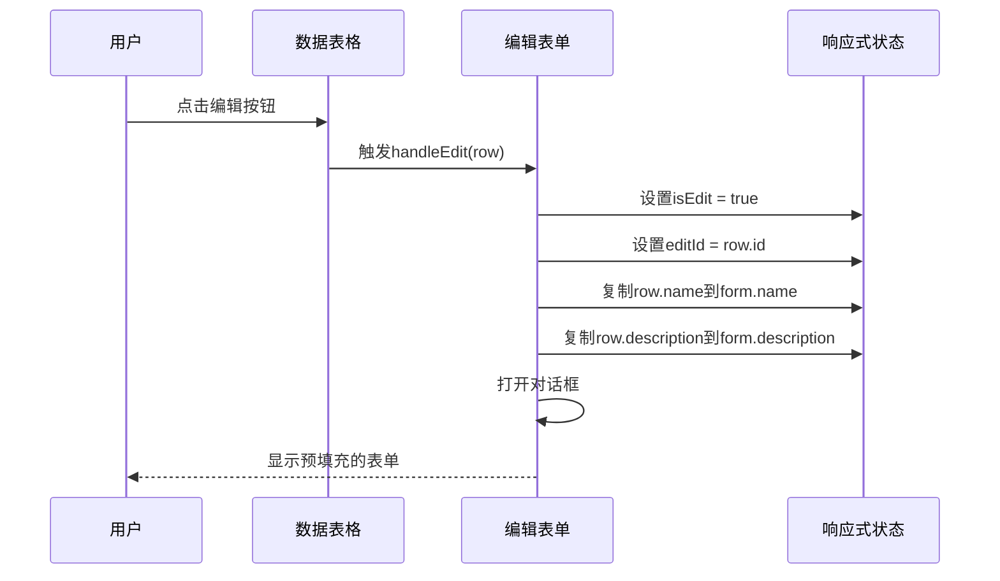
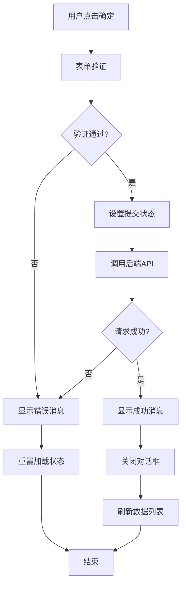
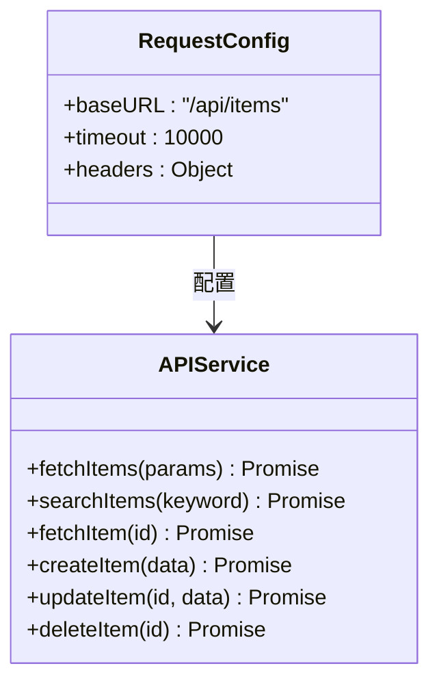
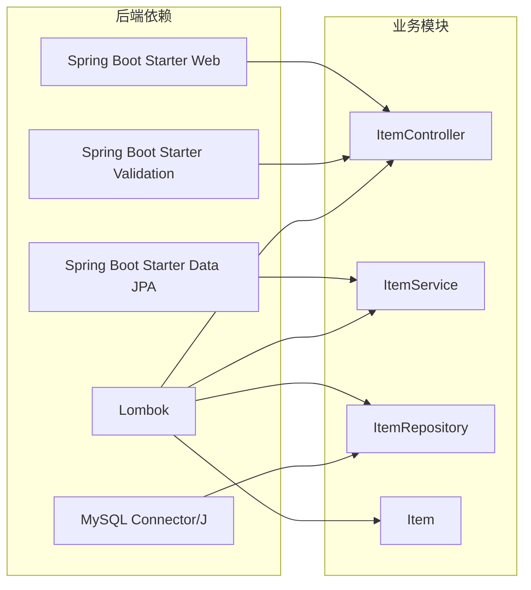
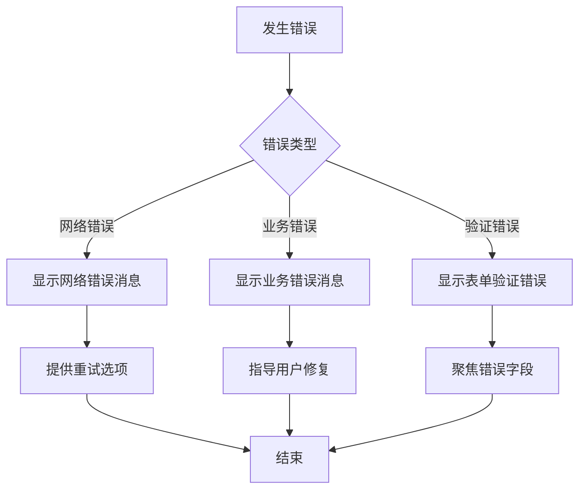

# 更新操作实现

<cite>
**本文档引用的文件**
- [ItemController.java](file://backend/src/main/java/com/example/demo/controller/ItemController.java)
- [ItemService.java](file://backend/src/main/java/com/example/demo/service/ItemService.java)
- [ItemRepository.java](file://backend/src/main/java/com/example/demo/repository/ItemRepository.java)
- [Item.java](file://backend/src/main/java/com/example/demo/entity/Item.java)
- [ItemManager.vue](file://frontend/src/components/ItemManager.vue)
- [item.js](file://frontend/src/api/item.js)
- [application.yml](file://backend/src/main/resources/application.yml)
- [pom.xml](file://backend/pom.xml)
</cite>

## 目录
1. [简介](#简介)
2. [项目结构](#项目结构)
3. [核心组件](#核心组件)
4. [架构概览](#架构概览)
5. [详细组件分析](#详细组件分析)
6. [依赖关系分析](#依赖关系分析)
7. [性能考虑](#性能考虑)
8. [故障排除指南](#故障排除指南)
9. [结论](#结论)

## 简介

本文档详细说明了基于Spring Boot + Vue.js的CRUD应用中PUT /api/items/{id}更新操作的完整实现流程。该系统实现了完整的数据管理功能，包括数据查询、搜索、创建、更新和删除操作。本文档重点分析更新操作的端到端实现，从前端编辑表单到后端服务层的完整数据流。

## 项目结构

该项目采用前后端分离架构，后端使用Spring Boot框架，前端使用Vue.js 3.0 + Element Plus组件库。



**图表来源**
- [ItemController.java:15-59](file://backend/src/main/java/com/example/demo/controller/ItemController.java#L15-L59)
- [ItemService.java:13-50](file://backend/src/main/java/com/example/demo/service/ItemService.java#L13-L50)
- [ItemRepository.java:1-13](file://backend/src/main/java/com/example/demo/repository/ItemRepository.java#L1-L13)
- [Item.java:1-30](file://backend/src/main/java/com/example/demo/entity/Item.java#L1-L30)

**章节来源**
- [application.yml:1-18](file://backend/src/main/resources/application.yml#L1-L18)
- [pom.xml:24-52](file://backend/pom.xml#L24-L52)

## 核心组件

### 后端核心组件

#### 控制器层 (ItemController)
负责HTTP请求处理和响应返回，实现了RESTful API接口。

#### 服务层 (ItemService)
包含业务逻辑，处理数据验证、事务管理和业务规则。

#### 数据访问层 (ItemRepository)
基于Spring Data JPA提供数据持久化操作。

#### 实体模型 (Item)
定义数据库表结构和JPA注解配置。

### 前端核心组件

#### 编辑表单 (ItemManager.vue)
实现数据管理界面，包含搜索、分页、编辑对话框等功能。

#### API封装 (item.js)
封装HTTP请求，提供统一的API调用接口。

**章节来源**
- [ItemController.java:15-59](file://backend/src/main/java/com/example/demo/controller/ItemController.java#L15-L59)
- [ItemService.java:13-50](file://backend/src/main/java/com/example/demo/service/ItemService.java#L13-L50)
- [ItemRepository.java:1-13](file://backend/src/main/java/com/example/demo/repository/ItemRepository.java#L1-L13)
- [Item.java:1-30](file://backend/src/main/java/com/example/demo/entity/Item.java#L1-L30)
- [ItemManager.vue:87-220](file://frontend/src/components/ItemManager.vue#L87-L220)
- [item.js:1-31](file://frontend/src/api/item.js#L1-L31)

## 架构概览

系统采用经典的三层架构设计，前后端通过RESTful API进行通信。



**图表来源**
- [ItemController.java:48-51](file://backend/src/main/java/com/example/demo/controller/ItemController.java#L48-L51)
- [ItemService.java:37-43](file://backend/src/main/java/com/example/demo/service/ItemService.java#L37-L43)
- [ItemManager.vue:164-196](file://frontend/src/components/ItemManager.vue#L164-L196)

## 详细组件分析

### 后端更新操作实现

#### 路径参数处理

后端通过Spring MVC的`@PathVariable`注解处理URL路径中的ID参数：

```mermaid
flowchart TD
Request[HTTP请求: PUT /api/items/{id}] --> PathVar[提取路径参数<br/>@PathVariable Long id]
PathVar --> Validation[参数验证<br/>检查ID有效性]
Validation --> Found{ID存在?}
Found --> |是| Process[处理更新请求]
Found --> |否| NotFound[返回404错误]
Process --> Success[返回200 OK]
NotFound --> End[结束]
Success --> End
```

**图表来源**
- [ItemController.java:48-51](file://backend/src/main/java/com/example/demo/controller/ItemController.java#L48-L51)

#### 请求数据验证

后端使用Spring Validation框架进行数据验证：



**图表来源**
- [Item.java:10-29](file://backend/src/main/java/com/example/demo/entity/Item.java#L10-L29)
- [ItemController.java:48-51](file://backend/src/main/java/com/example/demo/controller/ItemController.java#L48-L51)
- [ItemService.java:37-43](file://backend/src/main/java/com/example/demo/service/ItemService.java#L37-L43)

#### 更新逻辑实现

更新操作的核心流程：

1. **数据查找**: 通过ID查找现有记录
2. **字段更新**: 将新值复制到现有实体对象
3. **数据保存**: 通过JPA仓库保存更新后的实体

**章节来源**
- [ItemService.java:37-43](file://backend/src/main/java/com/example/demo/service/ItemService.java#L37-L43)
- [ItemRepository.java:9-12](file://backend/src/main/java/com/example/demo/repository/ItemRepository.java#L9-L12)

### 前端编辑表单实现

#### 数据预填充机制

前端通过`handleEdit`函数实现数据预填充：



**图表来源**
- [ItemManager.vue:164-170](file://frontend/src/components/ItemManager.vue#L164-L170)

#### 双向绑定实现

使用Vue 3的`reactive`和`ref`实现双向数据绑定：

| 绑定类型 | Vue 3语法 | 用途 |
|---------|----------|------|
| 表单数据 | `form = reactive({name: '', description: ''})` | 存储用户输入 |
| 输入控件 | `v-model="form.name"` | 实现双向绑定 |
| 对话框显示 | `v-model="dialogVisible"` | 控制对话框可见性 |
| 加载状态 | `v-model="loading"` | 显示加载指示器 |

#### 更新提交处理

提交流程包含完整的错误处理和用户体验优化：



**图表来源**
- [ItemManager.vue:172-196](file://frontend/src/components/ItemManager.vue#L172-L196)

**章节来源**
- [ItemManager.vue:164-196](file://frontend/src/components/ItemManager.vue#L164-L196)
- [item.js:24-26](file://frontend/src/api/item.js#L24-L26)

### API层实现

#### HTTP客户端配置

前端使用Axios创建HTTP客户端，配置基础URL和超时时间：



**图表来源**
- [item.js:3-6](file://frontend/src/api/item.js#L3-L6)
- [item.js:8-30](file://frontend/src/api/item.js#L8-L30)

**章节来源**
- [item.js:3-30](file://frontend/src/api/item.js#L3-L30)

## 依赖关系分析

### 后端依赖关系



**图表来源**
- [pom.xml:24-52](file://backend/pom.xml#L24-L52)

### 数据库配置

后端使用MySQL作为数据存储，配置了自动DDL更新和SQL格式化：

**章节来源**
- [application.yml:4-17](file://backend/src/main/resources/application.yml#L4-L17)

## 性能考虑

### 数据库性能优化

1. **实体映射优化**: 使用`@Column`注解指定列属性，避免不必要的字段映射
2. **查询优化**: 使用JPA Specification Executor支持复杂查询条件
3. **连接池配置**: Spring Boot自动配置MySQL连接池

### 前端性能优化

1. **懒加载**: 使用Element Plus组件按需加载
2. **虚拟滚动**: 大数据量时可考虑实现虚拟滚动
3. **缓存策略**: 列表数据在组件卸载前可考虑缓存

### 并发控制策略

当前实现采用以下并发控制措施：

1. **数据库层面**: 使用MySQL的行级锁确保数据一致性
2. **Spring事务**: 使用`@Transactional`注解确保更新操作的原子性
3. **HTTP幂等性**: PUT请求具有幂等性，重复请求不会产生副作用

## 故障排除指南

### 常见问题及解决方案

#### 后端异常处理

| 错误类型 | 异常信息 | 解决方案 |
|---------|---------|---------|
| 数据不存在 | `RuntimeException: Item not found with id: {id}` | 检查ID是否正确，确认数据是否存在 |
| 数据库连接失败 | 连接超时或拒绝 | 检查数据库配置和网络连接 |
| 参数验证失败 | Bean Validation异常 | 检查请求数据格式和必填字段 |

#### 前端错误处理



**图表来源**
- [ItemManager.vue:130-133](file://frontend/src/components/ItemManager.vue#L130-L133)
- [ItemManager.vue:190-193](file://frontend/src/components/ItemManager.vue#L190-L193)

**章节来源**
- [ItemManager.vue:130-133](file://frontend/src/components/ItemManager.vue#L130-L133)
- [ItemManager.vue:190-193](file://frontend/src/components/ItemManager.vue#L190-L193)

### 数据一致性保证

1. **事务边界**: 更新操作在单个事务中执行，确保原子性
2. **实体状态**: 使用JPA实体跟踪数据变更
3. **版本控制**: 可考虑添加乐观锁机制防止并发更新冲突

### 错误恢复处理方案

1. **自动重试**: 对于临时性网络错误提供自动重试机制
2. **回滚机制**: 事务失败时自动回滚到之前的状态
3. **降级策略**: 在服务不可用时提供基本功能降级

## 结论

本项目实现了完整的CRUD操作，其中更新操作具有以下特点：

1. **清晰的架构分层**: 前后端职责明确，便于维护和扩展
2. **完整的错误处理**: 前后端都有完善的错误处理机制
3. **良好的用户体验**: 包含加载状态、验证反馈和成功提示
4. **简洁的实现**: 代码结构清晰，易于理解和修改

对于生产环境，建议进一步增强的功能包括：
- 添加字段级别的数据验证
- 实现乐观锁防止并发更新冲突
- 增加日志记录和监控
- 实现更完善的错误恢复机制