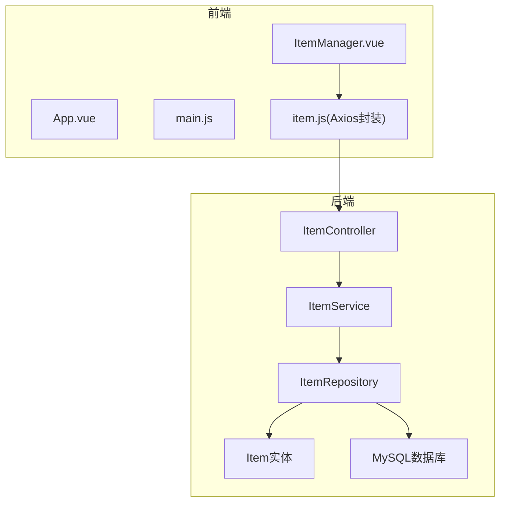
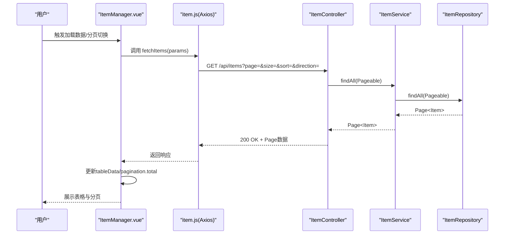
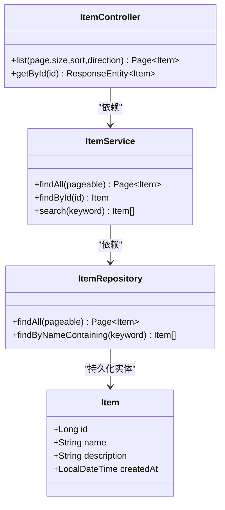
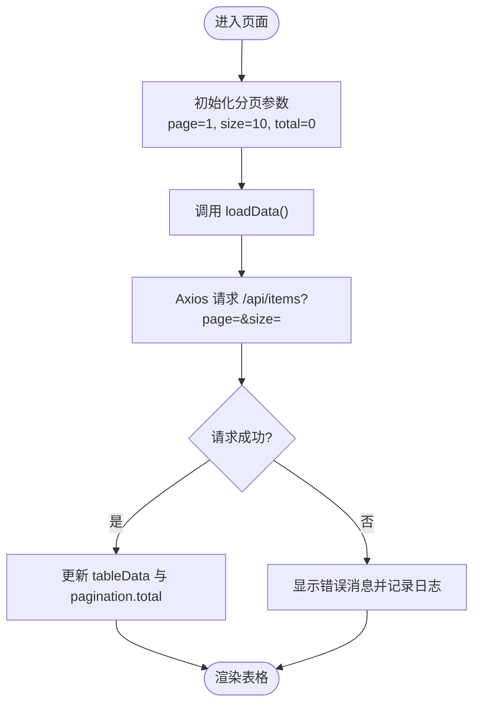
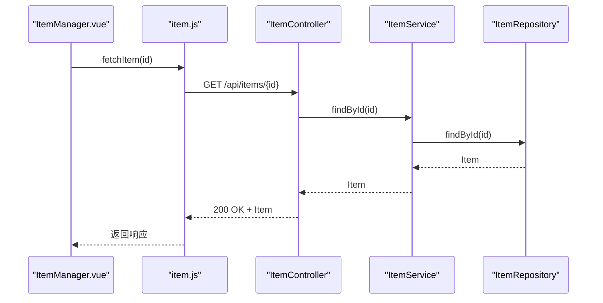
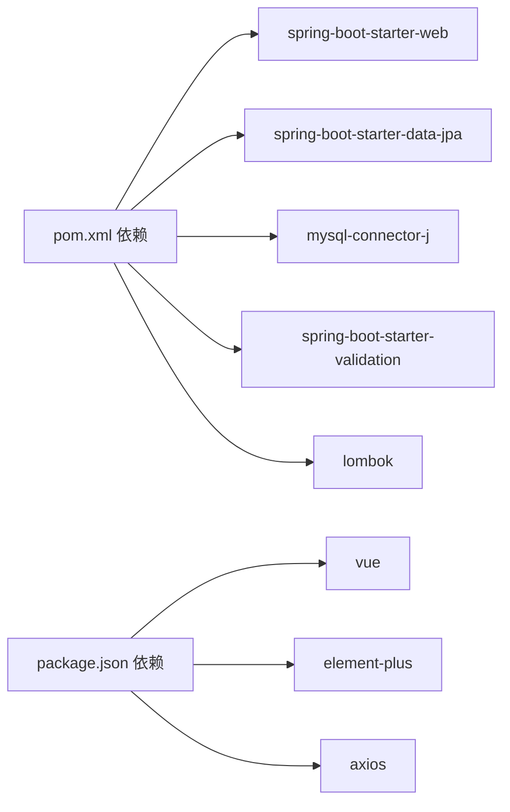

# 读取操作实现

<cite>
**本文引用的文件**
- [ItemController.java](file://backend/src/main/java/com/example/demo/controller/ItemController.java)
- [ItemService.java](file://backend/src/main/java/com/example/demo/service/ItemService.java)
- [ItemRepository.java](file://backend/src/main/java/com/example/demo/repository/ItemRepository.java)
- [Item.java](file://backend/src/main/java/com/example/demo/entity/Item.java)
- [application.yml](file://backend/src/main/resources/application.yml)
- [pom.xml](file://backend/pom.xml)
- [item.js](file://frontend/src/api/item.js)
- [ItemManager.vue](file://frontend/src/components/ItemManager.vue)
- [App.vue](file://frontend/src/App.vue)
- [main.js](file://frontend/src/main.js)
- [package.json](file://frontend/package.json)
</cite>

## 目录
1. [简介](#简介)
2. [项目结构](#项目结构)
3. [核心组件](#核心组件)
4. [架构总览](#架构总览)
5. [详细组件分析](#详细组件分析)
6. [依赖关系分析](#依赖关系分析)
7. [性能考虑](#性能考虑)
8. [故障排查指南](#故障排查指南)
9. [结论](#结论)
10. [附录](#附录)

## 简介
本文件聚焦于系统中“读取操作”的完整实现，涵盖以下内容：
- 后端 REST 接口：GET /api/items（分页查询）与 GET /api/items/{id}（单个记录获取）
- 前端数据表格组件：数据绑定、加载状态、分页交互与用户操作
- 服务层与数据访问层的查询逻辑：分页参数处理、排序配置与数据转换
- 完整的使用流程：列表展示、详情查看、数据刷新机制
- 性能优化策略与用户体验改进建议

## 项目结构
该项目采用前后端分离架构：
- 后端基于 Spring Boot 3.2.5 + Spring Data JPA，提供 REST API
- 前端基于 Vue 3 + Element Plus，通过 Axios 调用后端接口

图表来源
- [ItemController.java:15-58](file://backend/src/main/java/com/example/demo/controller/ItemController.java#L15-L58)
- [ItemService.java:13-49](file://backend/src/main/java/com/example/demo/service/ItemService.java#L13-L49)
- [ItemRepository.java:9-12](file://backend/src/main/java/com/example/demo/repository/ItemRepository.java#L9-L12)
- [Item.java:10-29](file://backend/src/main/java/com/example/demo/entity/Item.java#L10-L29)
- [item.js:1-31](file://frontend/src/api/item.js#L1-L31)
- [ItemManager.vue:87-219](file://frontend/src/components/ItemManager.vue#L87-L219)

章节来源
- [pom.xml:24-51](file://backend/pom.xml#L24-L51)
- [package.json:11-19](file://frontend/package.json#L11-L19)
- [application.yml:1-18](file://backend/src/main/resources/application.yml#L1-L18)

## 核心组件
- 后端控制器：提供 /api/items 的分页查询与单条记录查询接口
- 服务层：封装业务逻辑，负责分页、排序与数据转换
- 数据访问层：基于 Spring Data JPA 提供分页查询与条件查询
- 前端组件：数据表格、分页控件、对话框与表单，统一通过 Axios 封装调用后端

章节来源
- [ItemController.java:23-41](file://backend/src/main/java/com/example/demo/controller/ItemController.java#L23-L41)
- [ItemService.java:19-30](file://backend/src/main/java/com/example/demo/service/ItemService.java#L19-L30)
- [ItemRepository.java:11](file://backend/src/main/java/com/example/demo/repository/ItemRepository.java#L11)
- [item.js:8-18](file://frontend/src/api/item.js#L8-L18)
- [ItemManager.vue:121-136](file://frontend/src/components/ItemManager.vue#L121-L136)

## 架构总览
后端采用经典的三层架构：Controller -> Service -> Repository。前端通过 Axios 发起请求，组件负责渲染与交互。

图表来源
- [ItemController.java:23-31](file://backend/src/main/java/com/example/demo/controller/ItemController.java#L23-L31)
- [ItemService.java:19-21](file://backend/src/main/java/com/example/demo/service/ItemService.java#L19-L21)
- [ItemRepository.java:9-12](file://backend/src/main/java/com/example/demo/repository/ItemRepository.java#L9-L12)
- [item.js:8-10](file://frontend/src/api/item.js#L8-L10)
- [ItemManager.vue:121-136](file://frontend/src/components/ItemManager.vue#L121-L136)

## 详细组件分析

### 后端：分页查询与单条查询
- 控制器端点
  - GET /api/items：接收 page、size、sort、direction 参数，构造 PageRequest 并调用服务层
  - GET /api/items/{id}：根据路径参数查询单条记录，返回 200 或抛出异常
- 服务层逻辑
  - findAll(Pageable)：直接委托给仓库进行分页查询
  - findById(Long)：若不存在则抛出运行时异常
- 仓库层
  - 继承 JpaRepository 与 JpaSpecificationExecutor，支持分页与动态查询
  - 提供按名称模糊匹配的查询方法

图表来源
- [ItemController.java:23-41](file://backend/src/main/java/com/example/demo/controller/ItemController.java#L23-L41)
- [ItemService.java:19-30](file://backend/src/main/java/com/example/demo/service/ItemService.java#L19-L30)
- [ItemRepository.java:9-12](file://backend/src/main/java/com/example/demo/repository/ItemRepository.java#L9-L12)
- [Item.java:10-29](file://backend/src/main/java/com/example/demo/entity/Item.java#L10-L29)

章节来源
- [ItemController.java:23-41](file://backend/src/main/java/com/example/demo/controller/ItemController.java#L23-L41)
- [ItemService.java:19-30](file://backend/src/main/java/com/example/demo/service/ItemService.java#L19-L30)
- [ItemRepository.java:9-12](file://backend/src/main/java/com/example/demo/repository/ItemRepository.java#L9-L12)

### 前端：数据表格与交互
- 数据绑定
  - 表格数据 tableData 来源于后端分页结果的 content 字段
  - 分页信息 pagination 包含当前页、每页大小、总条数
- 加载状态
  - v-loading 控制表格加载动画；loading 在请求开始设置为 true，结束恢复为 false
- 用户交互
  - 分页事件：size-change 与 current-change 均触发 loadData
  - 搜索：输入回车或点击搜索按钮，调用 searchItems；清空搜索框后回到分页列表
  - 新增/编辑：打开对话框，校验表单后调用 createItem/updateItem，成功后关闭对话框并刷新数据
  - 删除：二次确认后调用 deleteItem，成功后刷新数据

图表来源
- [ItemManager.vue:121-136](file://frontend/src/components/ItemManager.vue#L121-L136)
- [item.js:8-10](file://frontend/src/api/item.js#L8-L10)

章节来源
- [ItemManager.vue:121-154](file://frontend/src/components/ItemManager.vue#L121-L154)
- [ItemManager.vue:172-196](file://frontend/src/components/ItemManager.vue#L172-L196)
- [ItemManager.vue:198-214](file://frontend/src/components/ItemManager.vue#L198-L214)

### 数据格式化与时间显示
- 前端在表格列中对 createdAt 进行本地格式化，将 ISO 时间字符串转换为可读格式
- 该逻辑位于组件内部，便于统一展示风格

章节来源
- [ItemManager.vue:116-119](file://frontend/src/components/ItemManager.vue#L116-L119)

### 单个记录获取流程
- 前端通过 fetchItem(id) 获取单条记录
- 控制器端点 GET /api/items/{id} 返回对应实体
- 服务层 findById 若未找到会抛出异常，由全局异常处理或调用方捕获

图表来源
- [ItemController.java:38-41](file://backend/src/main/java/com/example/demo/controller/ItemController.java#L38-L41)
- [ItemService.java:27-30](file://backend/src/main/java/com/example/demo/service/ItemService.java#L27-L30)
- [item.js:16-18](file://frontend/src/api/item.js#L16-L18)

## 依赖关系分析
- 后端依赖
  - Spring Boot Web、Spring Data JPA、MySQL Connector、Validation、Lombok
- 前端依赖
  - Vue 3、Element Plus、Axios
- 数据库配置
  - 使用 MySQL，JPA 自动建模，方言为 MySQLDialect

图表来源
- [pom.xml:24-51](file://backend/pom.xml#L24-L51)
- [package.json:11-19](file://frontend/package.json#L11-L19)

章节来源
- [pom.xml:24-51](file://backend/pom.xml#L24-L51)
- [package.json:11-19](file://frontend/package.json#L11-L19)
- [application.yml:4-17](file://backend/src/main/resources/application.yml#L4-L17)

## 性能考虑
- 分页与排序
  - 后端使用 PageRequest + Sort，避免一次性加载全量数据
  - 建议在数据库为常用查询字段建立索引（如 name），以提升排序与模糊查询性能
- 查询优化
  - 模糊查询使用 findByNameContaining，建议限制关键词长度或增加前缀索引策略
  - 对高频字段（如 id、name）建立索引
- 前端优化
  - 使用 v-loading 显示加载状态，减少闪烁
  - 分页变更仅触发一次请求，避免重复加载
- 缓存与并发
  - 对只读列表数据可引入 Redis 缓存，设置合理过期时间
  - 避免在高频刷新场景下重复请求相同参数

## 故障排查指南
- 常见问题
  - 分页参数无效：确认前端传入 page 从 0 开始，后端期望 page=size*(page-1) 的语义
  - 排序方向错误：direction 必须为 asc/desc，否则 Sort.Direction.fromString 可能抛异常
  - 数据库连接失败：检查 application.yml 中的数据库 URL、用户名与密码
  - CORS 问题：当前控制器允许跨域，若前端端口变化需同步调整
- 错误处理
  - 后端 findById 未找到时抛出运行时异常，前端应捕获并提示
  - Axios 封装设置了超时，网络异常时会触发错误回调

章节来源
- [ItemController.java:25-30](file://backend/src/main/java/com/example/demo/controller/ItemController.java#L25-L30)
- [ItemService.java:27-30](file://backend/src/main/java/com/example/demo/service/ItemService.java#L27-L30)
- [application.yml:4-17](file://backend/src/main/resources/application.yml#L4-L17)
- [item.js:3-6](file://frontend/src/api/item.js#L3-L6)

## 结论
本实现以清晰的分层架构与简洁的前端组件，提供了完整的读取操作能力。后端通过分页与排序参数控制查询范围，前端通过表格与分页控件实现良好的用户体验。建议在生产环境中进一步完善索引、缓存与错误处理，并持续优化交互细节。

## 附录

### 接口定义与参数说明
- GET /api/items
  - 查询参数
    - page: 页码（从 0 开始）
    - size: 每页数量
    - sort: 排序字段
    - direction: 排序方向（asc/desc）
  - 返回：Page<Item>（包含 content、totalElements、totalPages 等）

- GET /api/items/{id}
  - 路径参数：id（Long）
  - 返回：Item

- GET /api/items/search
  - 查询参数：keyword（String）
  - 返回：List<Item>

章节来源
- [ItemController.java:23-36](file://backend/src/main/java/com/example/demo/controller/ItemController.java#L23-L36)
- [ItemController.java:38-41](file://backend/src/main/java/com/example/demo/controller/ItemController.java#L38-L41)

### 前端调用示例（路径）
- 列表加载：[ItemManager.vue:121-136](file://frontend/src/components/ItemManager.vue#L121-L136)
- 搜索：[ItemManager.vue:138-154](file://frontend/src/components/ItemManager.vue#L138-L154)
- 单条查询：[item.js:16-18](file://frontend/src/api/item.js#L16-L18)

### 后端服务层实现要点
- 分页与排序：[ItemController.java:23-31](file://backend/src/main/java/com/example/demo/controller/ItemController.java#L23-L31)
- 查询与转换：[ItemService.java:19-30](file://backend/src/main/java/com/example/demo/service/ItemService.java#L19-L30)
- 数据访问：[ItemRepository.java:9-12](file://backend/src/main/java/com/example/demo/repository/ItemRepository.java#L9-L12)