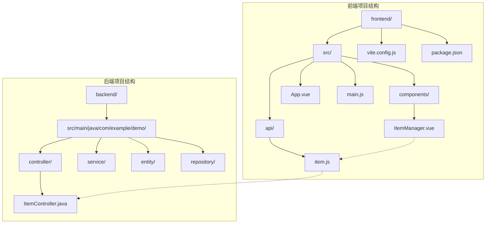
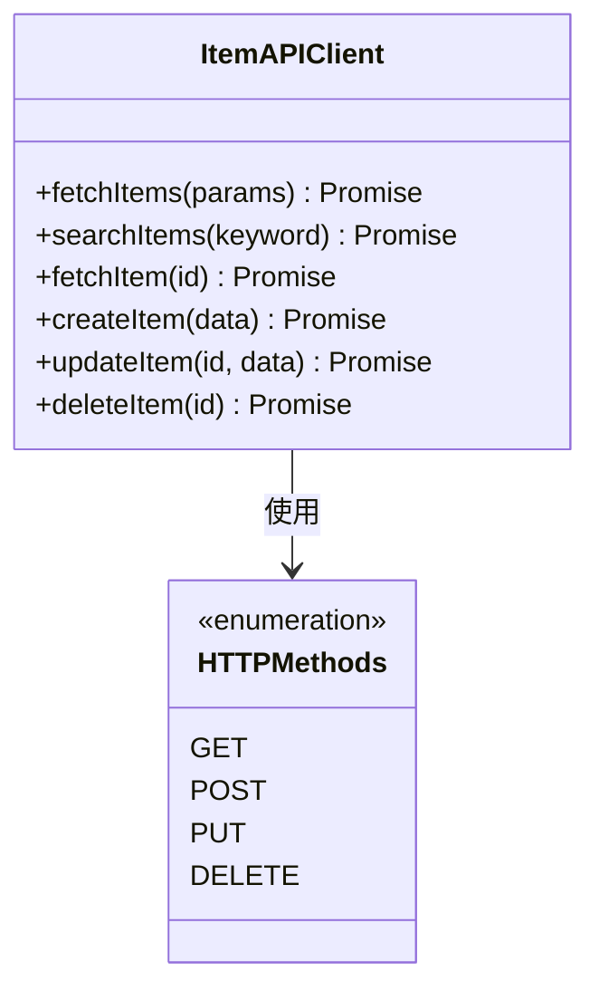
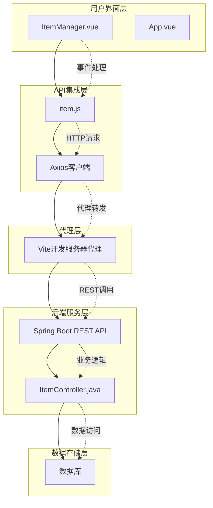
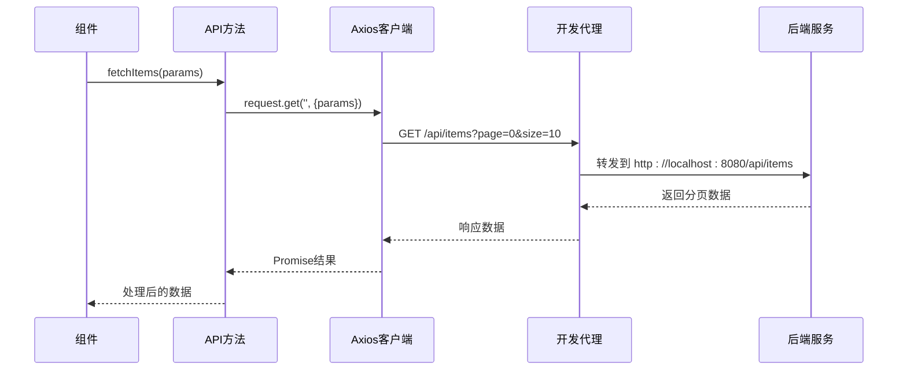
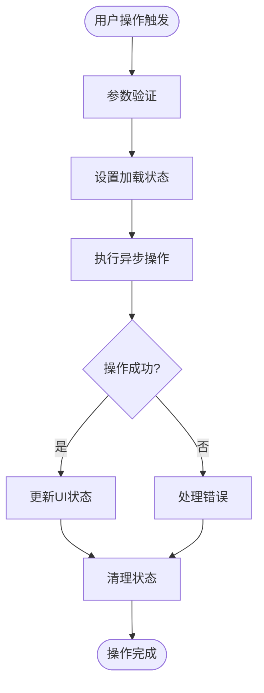
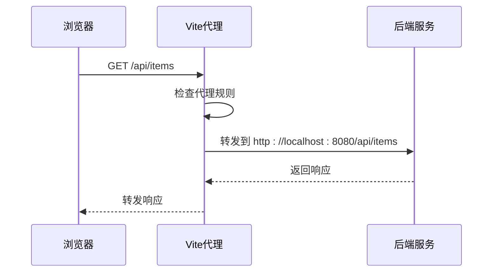
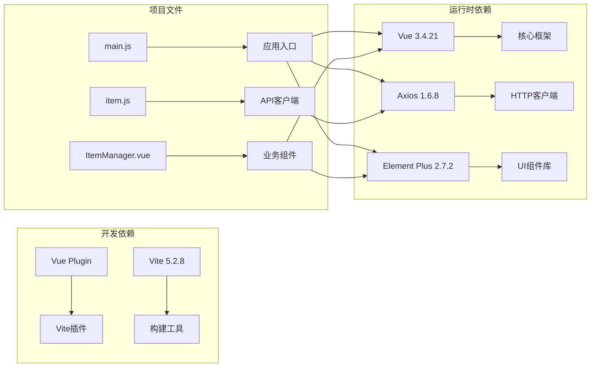

# API集成层

<cite>
**本文档引用的文件**
- [item.js](file://frontend/src/api/item.js)
- [ItemManager.vue](file://frontend/src/components/ItemManager.vue)
- [main.js](file://frontend/src/main.js)
- [vite.config.js](file://frontend/vite.config.js)
- [package.json](file://frontend/package.json)
- [App.vue](file://frontend/src/App.vue)
- [ItemController.java](file://backend/src/main/java/com/example/demo/controller/ItemController.java)
</cite>

## 目录
1. [简介](#简介)
2. [项目结构](#项目结构)
3. [核心组件](#核心组件)
4. [架构概览](#架构概览)
5. [详细组件分析](#详细组件分析)
6. [依赖关系分析](#依赖关系分析)
7. [性能考虑](#性能考虑)
8. [故障排除指南](#故障排除指南)
9. [结论](#结论)

## 简介

本文件为前端API集成层的详细技术文档，专注于Vue 3应用中的Axios客户端配置与使用。该系统采用前后端分离架构，前端通过Axios客户端与后端Spring Boot REST API进行通信，实现了完整的CRUD操作和数据管理功能。

## 项目结构

该项目采用标准的Vue 3 + Vite前端项目结构，API集成层位于`frontend/src/api/`目录下，主要包含以下关键文件：



**图表来源**
- [item.js:1-31](file://frontend/src/api/item.js#L1-L31)
- [ItemManager.vue:1-220](file://frontend/src/components/ItemManager.vue#L1-L220)
- [ItemController.java:1-59](file://backend/src/main/java/com/example/demo/controller/ItemController.java#L1-L59)

**章节来源**
- [package.json:1-21](file://frontend/package.json#L1-L21)
- [vite.config.js:1-16](file://frontend/vite.config.js#L1-L16)

## 核心组件

### Axios客户端配置

前端API集成层的核心是基于Axios的HTTP客户端配置，位于`frontend/src/api/item.js`文件中。该配置采用了工厂模式创建专用的HTTP客户端实例。

**关键配置特性：**
- **基础URL配置**：设置为`/api/items`，统一了所有API端点的基础路径
- **超时设置**：配置为10秒（10000毫秒），平衡了响应速度和网络稳定性
- **模块化导出**：通过ES6模块系统导出多个API方法，便于组件复用

### API方法实现

系统提供了完整的RESTful API方法集合，每个方法都针对特定的业务操作进行了封装：



**图表来源**
- [item.js:8-30](file://frontend/src/api/item.js#L8-L30)

**章节来源**
- [item.js:1-31](file://frontend/src/api/item.js#L1-L31)

## 架构概览

系统采用分层架构设计，清晰分离了API集成层、业务逻辑层和UI层：



**图表来源**
- [ItemManager.vue:87-218](file://frontend/src/components/ItemManager.vue#L87-L218)
- [item.js:1-6](file://frontend/src/api/item.js#L1-L6)
- [vite.config.js:6-14](file://frontend/vite.config.js#L6-L14)
- [ItemController.java:15-58](file://backend/src/main/java/com/example/demo/controller/ItemController.java#L15-L58)

## 详细组件分析

### Axios客户端配置分析

#### 基础配置
客户端通过`axios.create()`方法创建专用实例，配置了以下关键参数：

| 配置项 | 值 | 说明 |
|--------|-----|------|
| baseURL | `/api/items` | 统一的API基础路径前缀 |
| timeout | 10000 | 请求超时时间（毫秒） |

#### 方法封装策略
每个API方法都遵循一致的命名约定和返回模式：
- **查询方法**：`fetchItems()`、`searchItems()`、`fetchItem()`
- **变更方法**：`createItem()`、`updateItem()`、`deleteItem()`
- **参数传递**：查询参数使用`params`对象，请求体使用`data`对象

**章节来源**
- [item.js:3-6](file://frontend/src/api/item.js#L3-L6)

### API方法实现详解

#### 列表查询方法


**图表来源**
- [item.js:8-10](file://frontend/src/api/item.js#L8-L10)
- [ItemManager.vue:121-136](file://frontend/src/components/ItemManager.vue#L121-L136)

#### 搜索功能实现
搜索方法专门处理关键词查询，采用GET请求携带查询参数：

**章节来源**
- [item.js:12-14](file://frontend/src/api/item.js#L12-L14)

#### CRUD操作实现
系统支持完整的CRUD操作，每种操作都有对应的API方法：

| 操作类型 | HTTP方法 | API方法 | 参数说明 |
|----------|----------|---------|----------|
| 创建 | POST | `createItem(data)` | 请求体包含新数据 |
| 更新 | PUT | `updateItem(id, data)` | 路径参数+请求体 |
| 删除 | DELETE | `deleteItem(id)` | 路径参数标识资源 |
| 获取单个 | GET | `fetchItem(id)` | 路径参数标识资源 |

**章节来源**
- [item.js:16-30](file://frontend/src/api/item.js#L16-L30)

### 组件集成模式

#### 异步操作处理
`ItemManager.vue`组件展示了最佳的异步操作实践：



**图表来源**
- [ItemManager.vue:121-136](file://frontend/src/components/ItemManager.vue#L121-L136)

#### 错误处理机制
组件实现了多层次的错误处理策略：

1. **参数验证**：使用Element Plus表单验证
2. **异步错误捕获**：try-catch块处理Promise异常
3. **用户反馈**：使用ElMessage提供友好的错误提示
4. **日志记录**：控制台输出详细的错误信息

**章节来源**
- [ItemManager.vue:172-196](file://frontend/src/components/ItemManager.vue#L172-L196)

### 开发服务器代理配置

Vite开发服务器配置了API代理，将前端请求转发到后端服务：



**图表来源**
- [vite.config.js:8-13](file://frontend/vite.config.js#L8-L13)

**章节来源**
- [vite.config.js:1-16](file://frontend/vite.config.js#L1-L16)

## 依赖关系分析

### 外部依赖

项目的主要外部依赖包括：



**图表来源**
- [package.json:11-19](file://frontend/package.json#L11-L19)
- [main.js:1-9](file://frontend/src/main.js#L1-L9)

### 内部模块依赖

```mermaid
graph TB
subgraph "内部模块关系"
A[main.js] --> B[App.vue]
B --> C[ItemManager.vue]
C --> D[item.js]
C --> E[Element Plus]
D --> F[Axios]
end
subgraph "后端接口映射"
G[Spring Boot Controller] --> H[/api/items]
I[GET /api/items] --> J[分页查询]
K[GET /api/items/search] --> L[关键词搜索]
M[POST /api/items] --> N[创建资源]
O[PUT /api/items/{id}] --> P[更新资源]
Q[DELETE /api/items/{id}] --> R[删除资源]
end
D -.->|HTTP请求| G
C -.->|业务逻辑| D
```

**图表来源**
- [main.js:1-9](file://frontend/src/main.js#L1-L9)
- [ItemManager.vue:87-90](file://frontend/src/components/ItemManager.vue#L87-L90)
- [ItemController.java:15-58](file://backend/src/main/java/com/example/demo/controller/ItemController.java#L15-L58)

**章节来源**
- [package.json:1-21](file://frontend/package.json#L1-L21)

## 性能考虑

### 网络请求优化

1. **超时配置**：合理的10秒超时时间平衡了用户体验和资源占用
2. **代理配置**：开发环境下的本地代理避免了CORS问题
3. **请求合并**：批量操作时考虑合并请求减少网络开销

### 前端性能优化

1. **懒加载**：大型组件可以考虑按需加载
2. **缓存策略**：对于不频繁变化的数据可以实现客户端缓存
3. **虚拟滚动**：大数据量展示时使用虚拟滚动提升性能

### 错误恢复机制

当前实现缺少自动重试机制，建议在生产环境中添加：

```javascript
// 建议的重试策略实现
const retryConfig = {
  retries: 3,
  retryDelay: 1000,
  retryOn: [500, 502, 503, 504]
};
```

## 故障排除指南

### 常见问题诊断

#### 网络连接问题
1. **检查代理配置**：确认Vite代理是否正确指向后端服务
2. **验证端口冲突**：确保8080端口未被其他服务占用
3. **测试API连通性**：直接访问`http://localhost:8080/api/items`

#### CORS跨域问题
1. **后端配置**：确认`@CrossOrigin(origins = "*")`注解正确配置
2. **代理设置**：开发环境下使用Vite代理解决CORS问题

#### 数据格式问题
1. **检查响应结构**：确认后端返回的数据格式符合前端预期
2. **参数验证**：确保请求参数的类型和格式正确

### 调试技巧

#### 开发环境调试
1. **浏览器开发者工具**：监控Network面板中的API请求
2. **控制台日志**：利用console.error输出详细错误信息
3. **Vue DevTools**：检查组件状态和props传递

#### 错误处理最佳实践
1. **统一错误处理**：在API层集中处理HTTP错误状态
2. **用户友好提示**：使用ElMessage提供清晰的错误信息
3. **错误日志记录**：保存错误堆栈用于后续分析

**章节来源**
- [ItemManager.vue:130-133](file://frontend/src/components/ItemManager.vue#L130-L133)
- [ItemManager.vue:148-151](file://frontend/src/components/ItemManager.vue#L148-L151)

## 结论

该API集成层展现了现代前端开发的最佳实践，具有以下特点：

1. **模块化设计**：清晰的模块划分和职责分离
2. **异步处理**：完善的Promise和async/await使用模式
3. **错误处理**：多层次的错误处理和用户反馈机制
4. **开发体验**：良好的开发服务器代理配置
5. **可维护性**：简洁的代码结构和明确的命名约定

建议的改进方向：
- 添加请求拦截器用于统一的认证和请求头设置
- 实现响应拦截器处理通用的错误状态码
- 增加自动重试机制提升网络异常情况下的稳定性
- 考虑添加请求去重和缓存策略
- 完善TypeScript支持提升开发体验

该系统为后续的功能扩展奠定了良好的基础，能够支持更复杂的企业级应用场景。