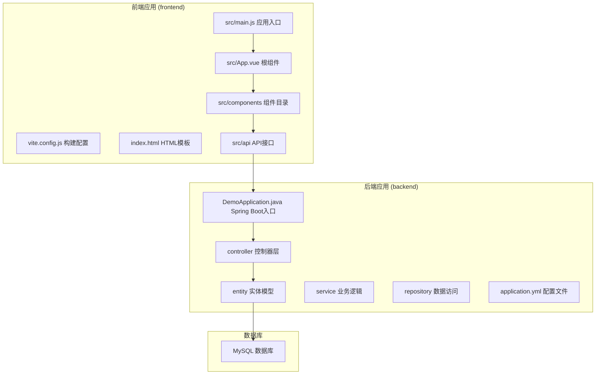
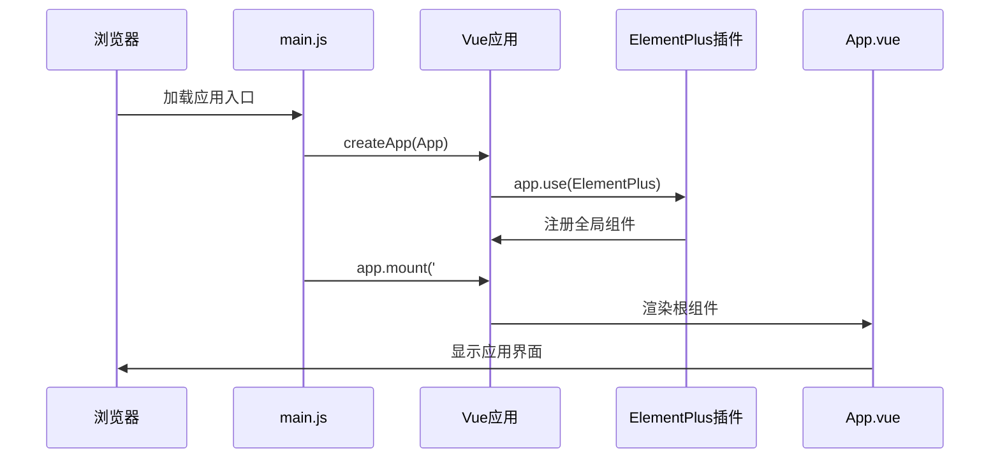
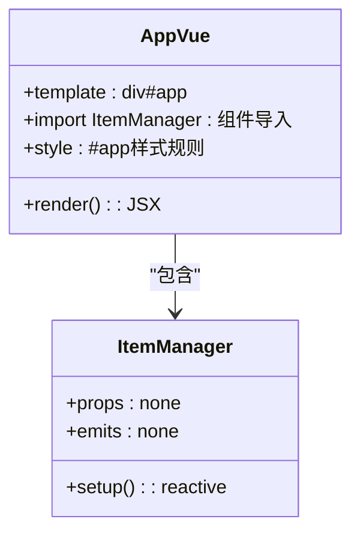
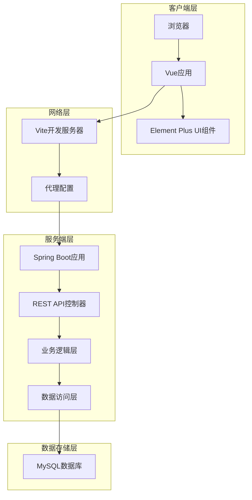
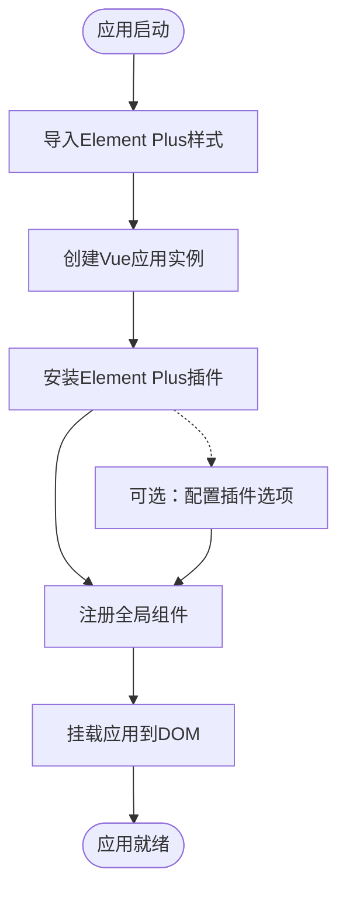
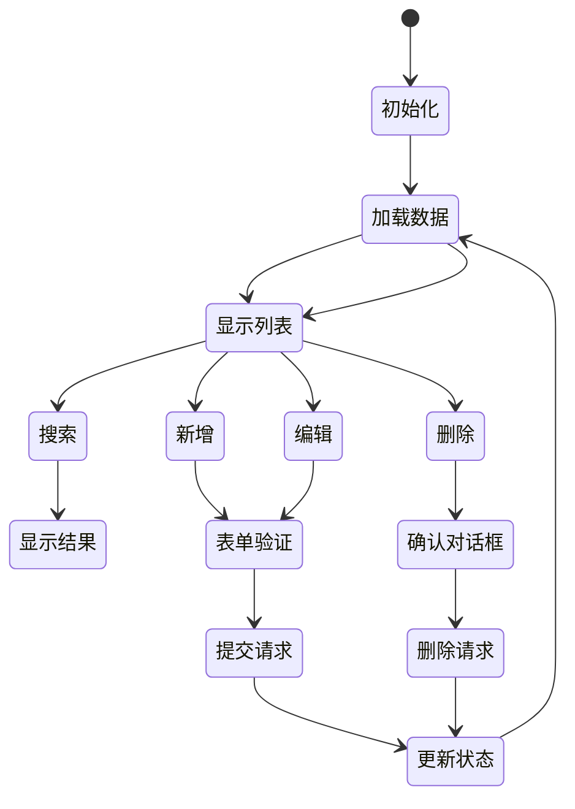
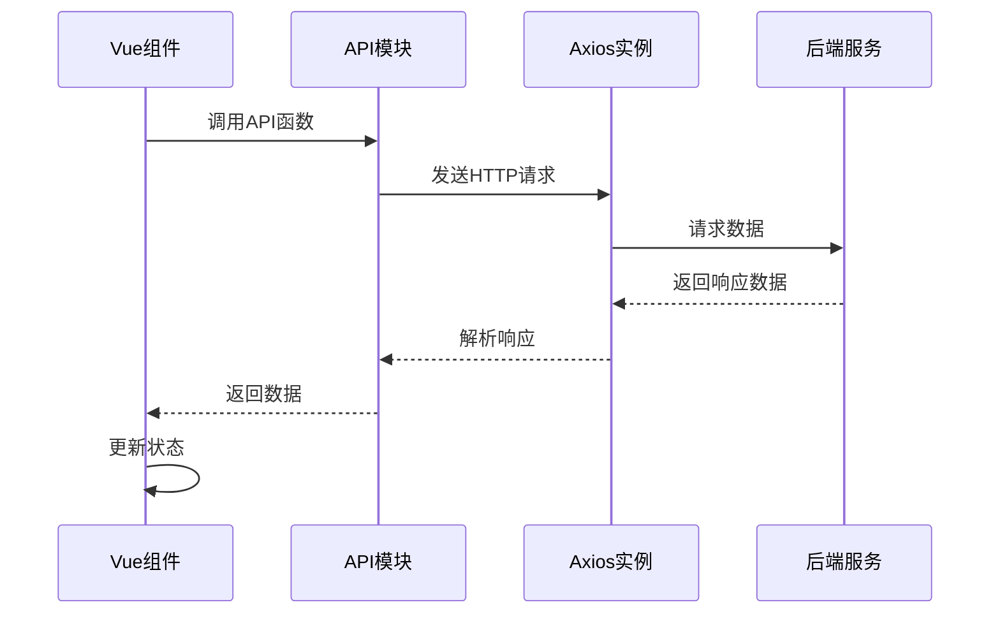
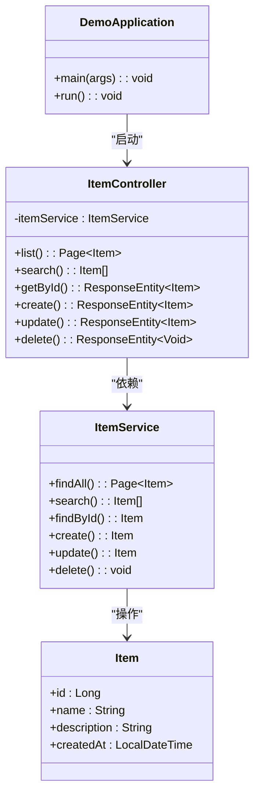
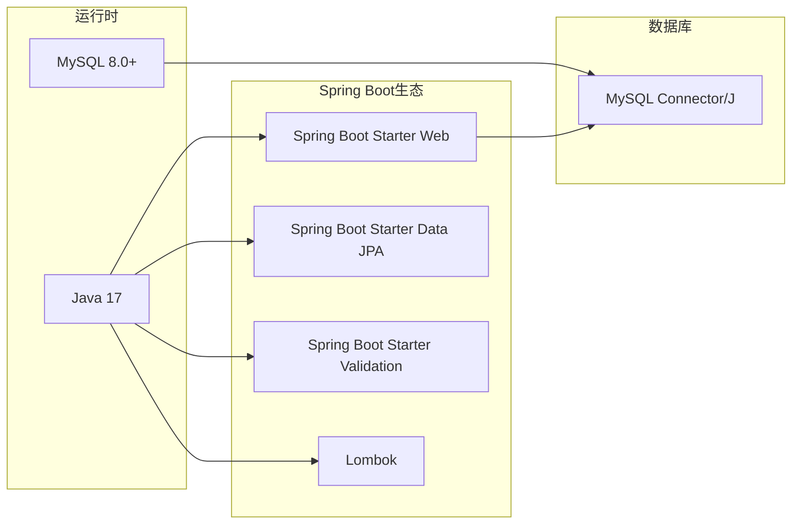

# Vue应用初始化

<cite>
**本文档引用的文件**
- [frontend/src/main.js](file://frontend/src/main.js)
- [frontend/src/App.vue](file://frontend/src/App.vue)
- [frontend/package.json](file://frontend/package.json)
- [frontend/vite.config.js](file://frontend/vite.config.js)
- [frontend/index.html](file://frontend/index.html)
- [frontend/src/components/ItemManager.vue](file://frontend/src/components/ItemManager.vue)
- [frontend/src/api/item.js](file://frontend/src/api/item.js)
- [backend/src/main/java/com/example/demo/DemoApplication.java](file://backend/src/main/java/com/example/demo/DemoApplication.java)
- [backend/src/main/java/com/example/demo/controller/ItemController.java](file://backend/src/main/java/com/example/demo/controller/ItemController.java)
- [backend/src/main/java/com/example/demo/entity/Item.java](file://backend/src/main/java/com/example/demo/entity/Item.java)
- [backend/src/main/resources/application.yml](file://backend/src/main/resources/application.yml)
- [backend/pom.xml](file://backend/pom.xml)
</cite>

## 目录
1. [简介](#简介)
2. [项目结构](#项目结构)
3. [核心组件](#核心组件)
4. [架构概览](#架构概览)
5. [详细组件分析](#详细组件分析)
6. [依赖关系分析](#依赖关系分析)
7. [性能考虑](#性能考虑)
8. [故障排除指南](#故障排除指南)
9. [结论](#结论)
10. [附录](#附录)

## 简介

这是一个基于Vue 3和Element Plus构建的全栈CRUD示例应用。该应用展示了现代前端开发的最佳实践，包括Vue 3应用的初始化、Element Plus插件集成、全局样式配置以及完整的前后端交互流程。

应用采用前后端分离架构，前端使用Vue 3 + Vite + Element Plus，后端使用Spring Boot + MySQL，实现了完整的数据增删改查功能。

## 项目结构

该项目采用清晰的分层结构，分为前端和后端两个独立的应用程序：



**图表来源**
- [frontend/src/main.js:1-9](file://frontend/src/main.js#L1-L9)
- [frontend/src/App.vue:1-18](file://frontend/src/App.vue#L1-L18)
- [backend/src/main/java/com/example/demo/DemoApplication.java:1-13](file://backend/src/main/java/com/example/demo/DemoApplication.java#L1-L13)

**章节来源**
- [frontend/src/main.js:1-9](file://frontend/src/main.js#L1-L9)
- [frontend/src/App.vue:1-18](file://frontend/src/App.vue#L1-L18)
- [frontend/package.json:1-21](file://frontend/package.json#L1-L21)

## 核心组件

### 应用入口点 (main.js)

应用入口文件是整个Vue应用的起点，负责创建应用实例、安装插件和挂载应用。



**图表来源**
- [frontend/src/main.js:1-9](file://frontend/src/main.js#L1-L9)

应用初始化的关键步骤：
1. **应用创建**：使用 `createApp` 创建Vue应用实例
2. **插件安装**：通过 `app.use(ElementPlus)` 安装Element Plus插件
3. **样式导入**：导入Element Plus的CSS样式文件
4. **应用挂载**：将应用挂载到DOM元素上

**章节来源**
- [frontend/src/main.js:1-9](file://frontend/src/main.js#L1-L9)

### 根组件 (App.vue)

App.vue作为应用的根组件，定义了应用的整体布局和样式。



**图表来源**
- [frontend/src/App.vue:1-18](file://frontend/src/App.vue#L1-L18)
- [frontend/src/components/ItemManager.vue:1-220](file://frontend/src/components/ItemManager.vue#L1-L220)

**章节来源**
- [frontend/src/App.vue:1-18](file://frontend/src/App.vue#L1-L18)

## 架构概览

该应用采用前后端分离的微服务架构，实现了完整的CRUD操作流程：



**图表来源**
- [frontend/vite.config.js:1-16](file://frontend/vite.config.js#L1-L16)
- [backend/src/main/java/com/example/demo/controller/ItemController.java:1-59](file://backend/src/main/java/com/example/demo/controller/ItemController.java#L1-L59)

## 详细组件分析

### Element Plus插件集成

Element Plus作为UI组件库，在应用中的集成遵循标准的Vue插件模式：



**图表来源**
- [frontend/src/main.js:2-8](file://frontend/src/main.js#L2-L8)

插件集成的关键特性：
- **全局样式**：导入完整的Element Plus CSS样式
- **插件安装**：通过 `app.use(ElementPlus)` 全局注册
- **组件可用性**：所有Element Plus组件可在应用中直接使用

**章节来源**
- [frontend/src/main.js:2-8](file://frontend/src/main.js#L2-L8)

### 数据管理组件 (ItemManager.vue)

ItemManager组件实现了完整的数据管理功能，包括CRUD操作、搜索和分页：



**图表来源**
- [frontend/src/components/ItemManager.vue:87-220](file://frontend/src/components/ItemManager.vue#L87-L220)

组件的核心功能模块：
1. **数据展示**：使用Element Plus表格组件显示数据
2. **搜索功能**：支持关键词搜索和实时过滤
3. **分页控制**：实现分页加载和页面大小切换
4. **表单管理**：新增和编辑操作的表单处理
5. **确认对话框**：删除操作的安全确认机制

**章节来源**
- [frontend/src/components/ItemManager.vue:1-220](file://frontend/src/components/ItemManager.vue#L1-L220)

### API通信层

API层封装了与后端服务的所有HTTP通信逻辑：



**图表来源**
- [frontend/src/api/item.js:1-31](file://frontend/src/api/item.js#L1-L31)

API配置的关键设置：
- **基础URL**：设置为 `/api/items`
- **超时时间**：10秒超时限制
- **请求方法**：支持GET、POST、PUT、DELETE四种HTTP方法

**章节来源**
- [frontend/src/api/item.js:1-31](file://frontend/src/api/item.js#L1-L31)

### 后端服务架构

后端采用Spring Boot框架，实现了RESTful API服务：



**图表来源**
- [backend/src/main/java/com/example/demo/DemoApplication.java:1-13](file://backend/src/main/java/com/example/demo/DemoApplication.java#L1-L13)
- [backend/src/main/java/com/example/demo/controller/ItemController.java:1-59](file://backend/src/main/java/com/example/demo/controller/ItemController.java#L1-L59)
- [backend/src/main/java/com/example/demo/entity/Item.java:1-30](file://backend/src/main/java/com/example/demo/entity/Item.java#L1-L30)

**章节来源**
- [backend/src/main/java/com/example/demo/controller/ItemController.java:1-59](file://backend/src/main/java/com/example/demo/controller/ItemController.java#L1-L59)
- [backend/src/main/java/com/example/demo/entity/Item.java:1-30](file://backend/src/main/java/com/example/demo/entity/Item.java#L1-L30)

## 依赖关系分析

### 前端依赖关系

```mermaid
graph LR
subgraph "Vue生态"
A[Vue 3.4.21]
B[Element Plus 2.7.2]
C[Axios 1.6.8]
end
subgraph "构建工具"
D[Vite 5.2.8]
E[@vitejs/plugin-vue 5.0.4]
end
subgraph "运行时"
F[浏览器]
end
A --> B
A --> C
D --> E
E --> A
F --> A
F --> B
F --> C
```

**图表来源**
- [frontend/package.json:11-19](file://frontend/package.json#L11-L19)

### 后端依赖关系



**图表来源**
- [backend/pom.xml:24-52](file://backend/pom.xml#L24-L52)

**章节来源**
- [frontend/package.json:11-21](file://frontend/package.json#L11-L21)
- [backend/pom.xml:24-71](file://backend/pom.xml#L24-L71)

## 性能考虑

### 前端性能优化

1. **懒加载策略**：对于大型组件可以考虑使用动态导入实现按需加载
2. **组件缓存**：合理使用 `keep-alive` 缓存频繁切换的组件
3. **虚拟滚动**：对于大量数据的表格可以考虑实现虚拟滚动
4. **图片优化**：使用现代格式如WebP，并设置适当的尺寸和质量

### 后端性能优化

1. **数据库连接池**：合理配置连接池大小和超时时间
2. **查询优化**：为常用查询字段建立索引
3. **分页查询**：避免一次性加载大量数据
4. **缓存策略**：对于静态数据可以考虑添加缓存层

## 故障排除指南

### 常见启动问题

**问题1：应用无法启动**
- 检查Node.js版本是否满足要求
- 确认依赖包已正确安装
- 验证Vite配置文件语法正确

**问题2：Element Plus样式不生效**
- 确认CSS文件导入路径正确
- 检查是否有样式冲突
- 验证浏览器开发者工具中的样式加载情况

**问题3：API请求失败**
- 检查代理配置是否正确
- 验证后端服务是否正常运行
- 查看网络面板中的请求响应

### 开发环境vs生产环境差异

| 配置项 | 开发环境 | 生产环境 |
|--------|----------|----------|
| 构建工具 | Vite开发服务器 | 生产构建 |
| 代理配置 | 本地代理到后端 | 通过Nginx或反向代理 |
| 调试工具 | 开启Vue DevTools | 移除调试代码 |
| 错误处理 | 详细错误信息 | 简化错误信息 |
| 性能优化 | 开发友好 | 最大化性能 |

**章节来源**
- [frontend/vite.config.js:6-14](file://frontend/vite.config.js#L6-L14)

## 结论

这个Vue 3应用展示了现代前端开发的最佳实践，包括：

1. **清晰的应用架构**：前后端分离的设计模式
2. **现代化的技术栈**：Vue 3 + Element Plus + Spring Boot
3. **完整的功能实现**：从UI组件到API服务的全流程
4. **良好的代码组织**：模块化的文件结构和职责分离

通过这个示例，开发者可以学习到如何构建一个可维护、可扩展的全栈应用，包括应用初始化、插件集成、组件设计和API通信等关键方面。

## 附录

### 开发环境设置

1. **前端环境**
   ```bash
   cd frontend
   npm install
   npm run dev
   ```

2. **后端环境**
   ```bash
   cd backend
   mvn spring-boot:run
   ```

3. **数据库准备**
   - 确保MySQL服务正在运行
   - 创建名为 `demo_db` 的数据库
   - 配置正确的数据库连接信息

### 部署建议

1. **前端部署**
   - 使用 `npm run build` 生成生产构建
   - 将构建产物部署到静态服务器
   - 配置CDN加速静态资源

2. **后端部署**
   - 打包为可执行JAR文件
   - 配置生产环境的数据库连接
   - 设置合适的JVM参数