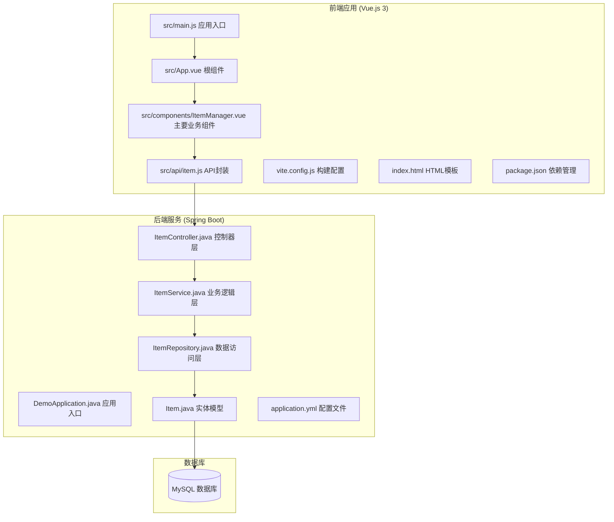
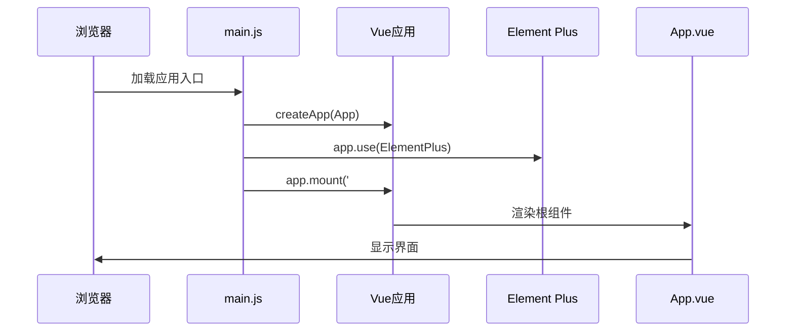
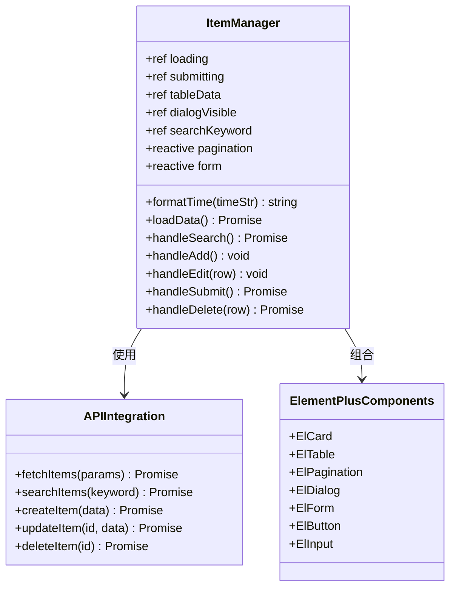
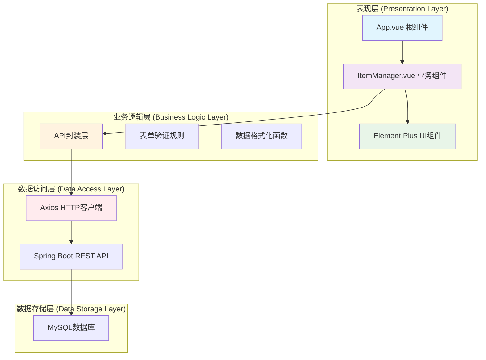
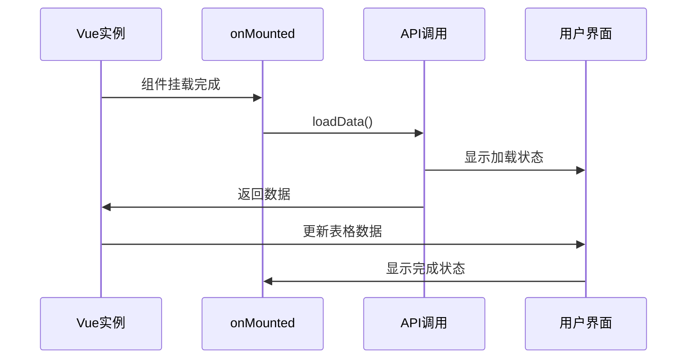
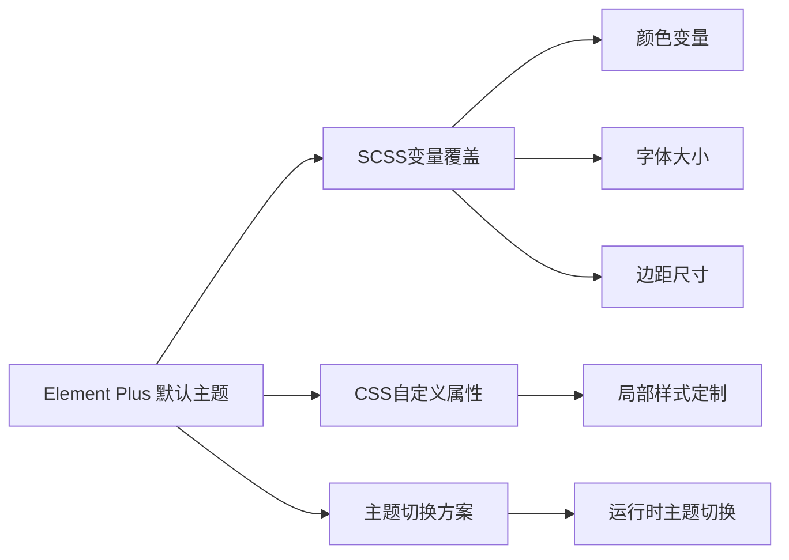
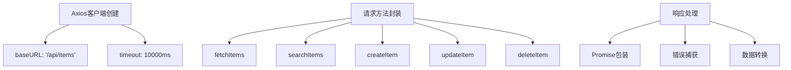
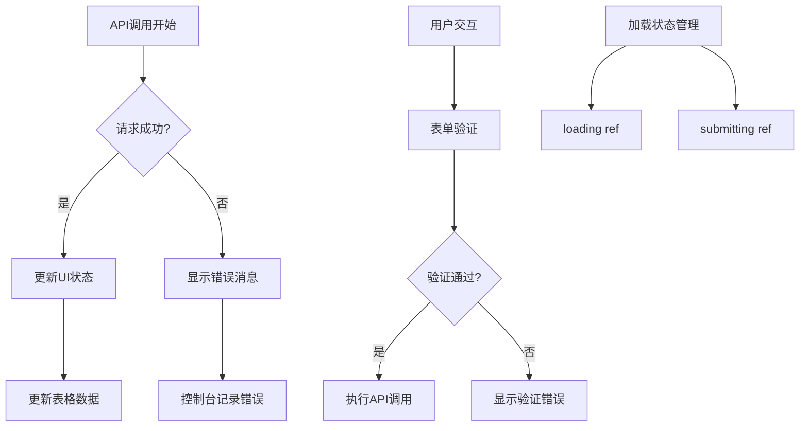
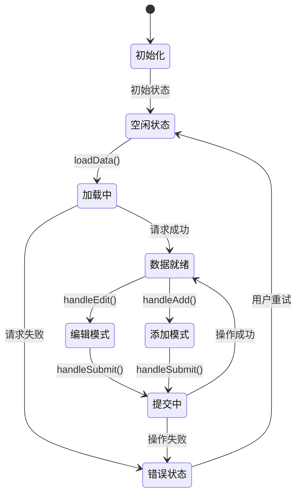
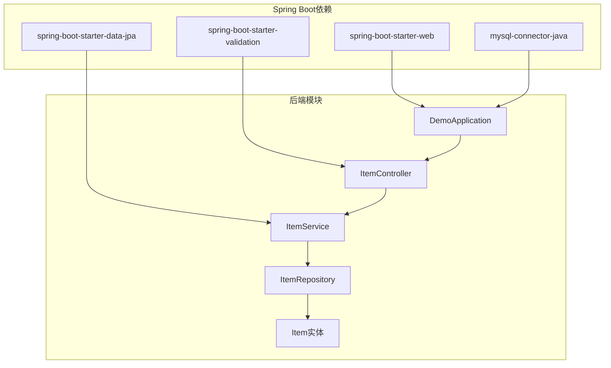

# 前端架构设计

<cite>
**本文档引用的文件**
- [main.js](file://frontend/src/main.js)
- [App.vue](file://frontend/src/App.vue)
- [ItemManager.vue](file://frontend/src/components/ItemManager.vue)
- [item.js](file://frontend/src/api/item.js)
- [package.json](file://frontend/package.json)
- [vite.config.js](file://frontend/vite.config.js)
- [index.html](file://frontend/index.html)
- [ItemController.java](file://backend/src/main/java/com/example/demo/controller/ItemController.java)
- [Item.java](file://backend/src/main/java/com/example/demo/entity/Item.java)
- [ItemRepository.java](file://backend/src/main/java/com/example/demo/repository/ItemRepository.java)
- [ItemService.java](file://backend/src/main/java/com/example/demo/service/ItemService.java)
- [application.yml](file://backend/src/main/resources/application.yml)
</cite>

## 目录
1. [简介](#简介)
2. [项目结构](#项目结构)
3. [核心组件](#核心组件)
4. [架构概览](#架构概览)
5. [详细组件分析](#详细组件分析)
6. [依赖关系分析](#依赖关系分析)
7. [性能考虑](#性能考虑)
8. [故障排除指南](#故障排除指南)
9. [结论](#结论)
10. [附录](#附录)

## 简介

这是一个基于Vue.js 3和Element Plus构建的单页面应用(SPA)项目，实现了完整的数据管理功能。项目采用前后端分离架构，前端使用Vue.js 3 Composition API进行组件开发，后端使用Spring Boot提供RESTful API服务。

该应用展示了现代前端开发的最佳实践，包括：
- Vue.js 3 Composition API的响应式数据管理
- Element Plus组件库的集成与使用
- 组件化架构模式
- API集成策略和错误处理
- 加载状态管理
- 分页和搜索功能实现

## 项目结构

项目采用清晰的分层结构，前后端分离部署：



**图表来源**
- [main.js:1-9](file://frontend/src/main.js#L1-L9)
- [App.vue:1-18](file://frontend/src/App.vue#L1-L18)
- [ItemManager.vue:1-220](file://frontend/src/components/ItemManager.vue#L1-L220)
- [item.js:1-31](file://frontend/src/api/item.js#L1-L31)

**章节来源**
- [main.js:1-9](file://frontend/src/main.js#L1-L9)
- [package.json:1-21](file://frontend/package.json#L1-L21)
- [vite.config.js:1-16](file://frontend/vite.config.js#L1-L16)

## 核心组件

### 应用入口与初始化

应用通过Vue 3的createApp函数创建根实例，并集成了Element Plus UI组件库：



**图表来源**
- [main.js:1-9](file://frontend/src/main.js#L1-L9)
- [App.vue:1-18](file://frontend/src/App.vue#L1-L18)

### 主要业务组件：数据管理器

ItemManager.vue是应用的核心组件，实现了完整的CRUD操作：



**图表来源**
- [ItemManager.vue:87-220](file://frontend/src/components/ItemManager.vue#L87-L220)
- [item.js:8-31](file://frontend/src/api/item.js#L8-L31)

**章节来源**
- [ItemManager.vue:1-220](file://frontend/src/components/ItemManager.vue#L1-L220)
- [item.js:1-31](file://frontend/src/api/item.js#L1-L31)

## 架构概览

应用采用经典的MVC架构模式，结合现代前端开发技术栈：



**图表来源**
- [App.vue:1-18](file://frontend/src/App.vue#L1-L18)
- [ItemManager.vue:87-220](file://frontend/src/components/ItemManager.vue#L87-L220)
- [item.js:1-31](file://frontend/src/api/item.js#L1-L31)

## 详细组件分析

### Vue.js 3 Composition API实现

#### 响应式数据管理

应用充分利用了Vue.js 3的Composition API特性：

```mermaid
flowchart TD
A[响应式数据声明] --> B[ref() 基础类型]
A --> C[reactive() 对象类型]
B --> D[loading: ref(false)]
B --> E[submitting: ref(false)]
B --> F[tableData: ref([])]
B --> G[dialogVisible: ref(false)]
B --> H[searchKeyword: ref('')]
C --> I[pagination: reactive({...})]
C --> J[form: reactive({...})]
K[生命周期钩子] --> L[onMounted]
L --> M[首次数据加载]
N[计算属性] --> O[formatTime函数]
O --> P[时间格式化处理]
```

**图表来源**
- [ItemManager.vue:92-114](file://frontend/src/components/ItemManager.vue#L92-L114)
- [ItemManager.vue:121-136](file://frontend/src/components/ItemManager.vue#L121-L136)

#### 组件通信机制

应用采用了多种组件通信方式：

1. **Props传递**: 父组件向子组件传递数据
2. **事件发射**: 子组件向父组件发送消息
3. **全局状态**: 通过Element Plus的消息提示系统

#### 生命周期钩子应用



**图表来源**
- [ItemManager.vue:216-218](file://frontend/src/components/ItemManager.vue#L216-L218)

**章节来源**
- [ItemManager.vue:87-220](file://frontend/src/components/ItemManager.vue#L87-L220)

### Element Plus组件库集成

#### 组件选择与配置

应用集成了多个Element Plus组件来构建用户界面：

| 组件类型 | 组件名称 | 用途 |
|---------|----------|------|
| 布局 | ElCard | 内容容器 |
| 表格 | ElTable | 数据展示 |
| 分页 | ElPagination | 页面导航 |
| 弹窗 | ElDialog | 表单对话框 |
| 表单 | ElForm/ElFormItem | 数据输入 |
| 输入 | ElInput | 文本输入 |
| 按钮 | ElButton | 操作按钮 |

#### 自定义主题配置

虽然当前项目使用Element Plus默认主题，但可以轻松扩展：



**章节来源**
- [main.js:2-3](file://frontend/src/main.js#L2-L3)
- [ItemManager.vue:3-84](file://frontend/src/components/ItemManager.vue#L3-L84)

### API集成策略

#### HTTP客户端配置

应用使用Axios创建了专门的HTTP客户端：



**图表来源**
- [item.js:3-6](file://frontend/src/api/item.js#L3-L6)
- [item.js:8-31](file://frontend/src/api/item.js#L8-L31)

#### 错误处理机制

应用实现了多层次的错误处理策略：



**图表来源**
- [ItemManager.vue:121-154](file://frontend/src/components/ItemManager.vue#L121-L154)
- [ItemManager.vue:172-196](file://frontend/src/components/ItemManager.vue#L172-L196)

**章节来源**
- [item.js:1-31](file://frontend/src/api/item.js#L1-L31)
- [ItemManager.vue:121-214](file://frontend/src/components/ItemManager.vue#L121-L214)

### 状态管理

#### 响应式状态设计

应用的状态管理遵循Vue.js 3的最佳实践：



**图表来源**
- [ItemManager.vue:92-114](file://frontend/src/components/ItemManager.vue#L92-L114)
- [ItemManager.vue:121-214](file://frontend/src/components/ItemManager.vue#L121-L214)

## 依赖关系分析

### 前端依赖关系

```mermaid
graph TB
subgraph "核心依赖"
A[vue@^3.4.21]
B[element-plus@^2.7.2]
C[axios@^1.6.8]
end
subgraph "开发依赖"
D[@vitejs/plugin-vue]
E[vite@^5.2.8]
end
subgraph "应用模块"
F[main.js]
G[App.vue]
H[ItemManager.vue]
I[item.js]
end
A --> F
B --> G
C --> I
D --> F
E --> F
F --> G
G --> H
H --> I
```

**图表来源**
- [package.json:11-19](file://frontend/package.json#L11-L19)
- [main.js:1-9](file://frontend/src/main.js#L1-L9)

### 后端依赖关系



**图表来源**
- [ItemController.java:15-59](file://backend/src/main/java/com/example/demo/controller/ItemController.java#L15-L59)
- [ItemService.java:13-50](file://backend/src/main/java/com/example/demo/service/ItemService.java#L13-L50)

**章节来源**
- [package.json:1-21](file://frontend/package.json#L1-L21)
- [application.yml:1-18](file://backend/src/main/resources/application.yml#L1-L18)

## 性能考虑

### 前端性能优化

1. **懒加载策略**: 可以考虑对大型组件进行动态导入
2. **虚拟滚动**: 对于大量数据的表格可以实现虚拟滚动
3. **缓存机制**: 实现API响应缓存减少重复请求
4. **组件卸载**: 在组件销毁时清理定时器和事件监听器

### 后端性能优化

1. **数据库索引**: 为常用查询字段建立索引
2. **分页查询**: 使用JPA分页避免全量数据传输
3. **连接池配置**: 优化数据库连接池参数
4. **查询优化**: 使用原生SQL或优化JPQL查询

## 故障排除指南

### 常见问题及解决方案

#### CORS跨域问题
- **症状**: API请求被浏览器阻止
- **解决方案**: 后端添加@CrossOrigin注解或配置CORS过滤器

#### 代理配置问题
- **症状**: 前端无法访问后端API
- **解决方案**: 检查Vite代理配置中的目标地址和端口

#### 数据格式问题
- **症状**: 时间字段显示异常
- **解决方案**: 在前端格式化函数中正确处理ISO时间字符串

#### 表单验证问题
- **症状**: 表单提交不触发验证
- **解决方案**: 确保表单引用正确绑定和验证规则设置

**章节来源**
- [vite.config.js:8-14](file://frontend/vite.config.js#L8-L14)
- [ItemManager.vue:116-119](file://frontend/src/components/ItemManager.vue#L116-L119)

## 结论

这个Vue.js 3前端架构项目展示了现代Web应用开发的最佳实践。通过合理使用Composition API、Element Plus组件库和清晰的项目结构，实现了功能完整且易于维护的数据管理应用。

主要优势包括：
- 清晰的组件化架构
- 完善的响应式数据管理
- 丰富的UI组件集成
- 完整的CRUD功能实现
- 良好的错误处理机制

对于进一步改进，建议考虑：
- 添加状态管理模式（如Pinia）
- 实现更完善的表单验证
- 增加单元测试覆盖率
- 优化性能和用户体验

## 附录

### 开发环境搭建

1. **安装Node.js**: 确保Node.js版本满足项目要求
2. **安装依赖**: 运行npm install安装所有依赖
3. **启动后端**: 在后端目录运行Spring Boot应用
4. **启动前端**: 在前端目录运行npm run dev

### 项目配置说明

- **前端端口**: 5173
- **后端端口**: 8080
- **API基础路径**: /api/items
- **数据库连接**: MySQL本地实例