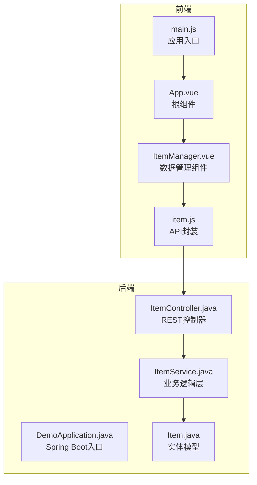
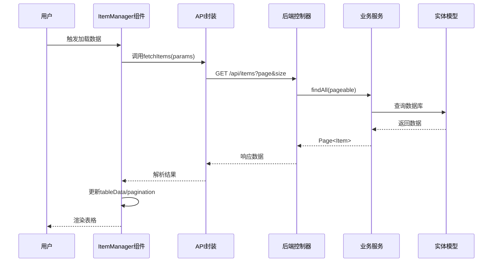
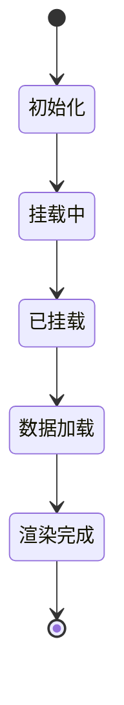
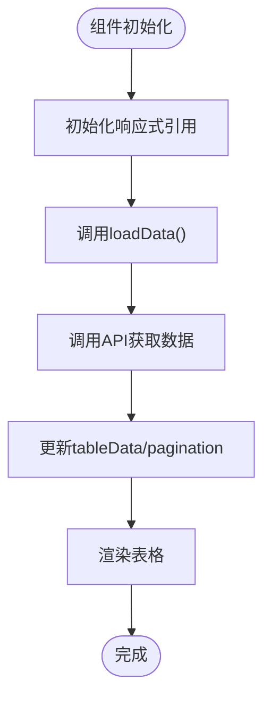
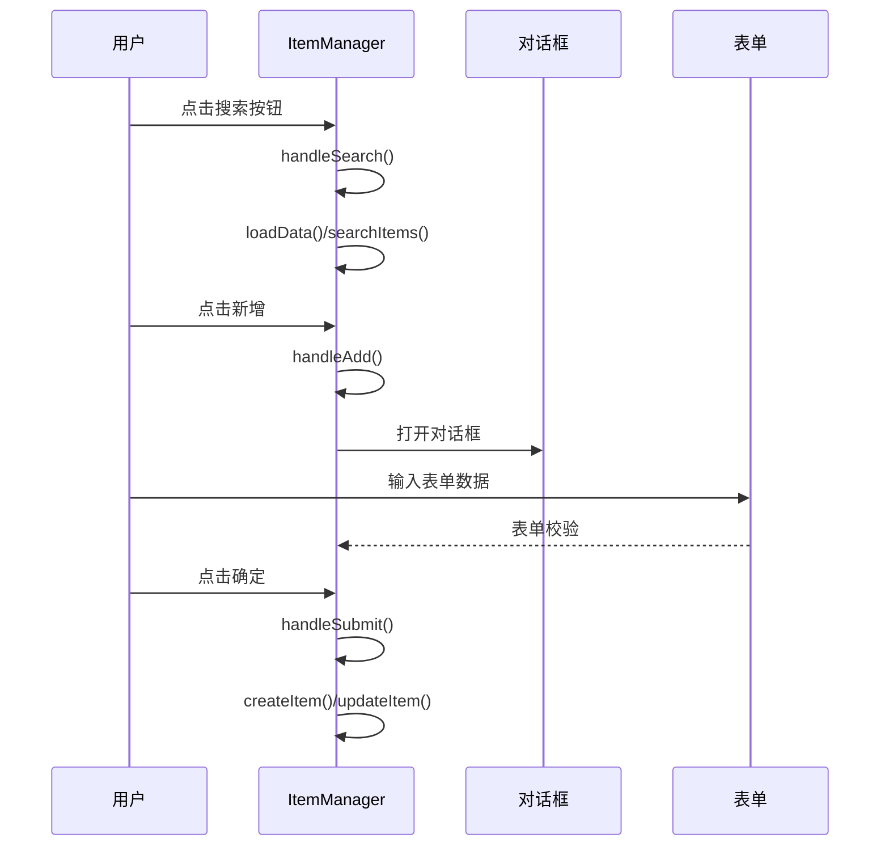
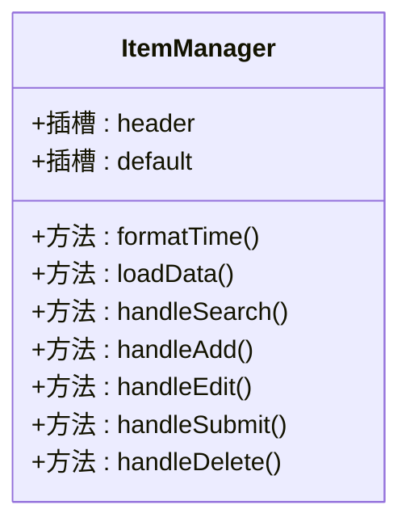
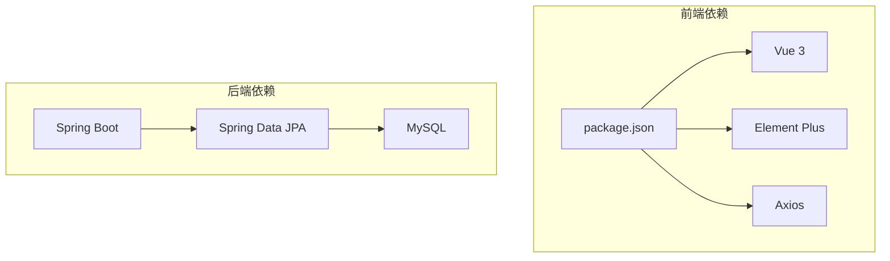

# 组件系统架构

<cite>
**本文档引用的文件**
- [ItemManager.vue](file://frontend/src/components/ItemManager.vue)
- [App.vue](file://frontend/src/App.vue)
- [main.js](file://frontend/src/main.js)
- [item.js](file://frontend/src/api/item.js)
- [ItemController.java](file://backend/src/main/java/com/example/demo/controller/ItemController.java)
- [ItemService.java](file://backend/src/main/java/com/example/demo/service/ItemService.java)
- [Item.java](file://backend/src/main/java/com/example/demo/entity/Item.java)
- [package.json](file://frontend/package.json)
- [DemoApplication.java](file://backend/src/main/java/com/example/demo/DemoApplication.java)
</cite>

## 目录
1. [简介](#简介)
2. [项目结构](#项目结构)
3. [核心组件](#核心组件)
4. [架构总览](#架构总览)
5. [详细组件分析](#详细组件分析)
6. [依赖关系分析](#依赖关系分析)
7. [性能考虑](#性能考虑)
8. [故障排除指南](#故障排除指南)
9. [结论](#结论)

## 简介
本项目是一个基于 Vue 3 的前端组件化应用，结合 Spring Boot 后端提供完整的数据管理功能。本文档聚焦于 ItemManager.vue 组件的架构设计，涵盖组件化开发模式、组件注册机制、生命周期管理、组件通信策略以及最佳实践。该组件实现了数据的增删改查、分页查询、搜索过滤、表单校验与弹窗交互等功能，展示了现代前端组件的典型设计模式。

## 项目结构
前端采用 Vite 构建工具，使用 Composition API 的 `<script setup>` 语法编写组件，配合 Element Plus UI 组件库实现丰富的交互界面。后端使用 Spring Boot 提供 RESTful API，数据持久化通过 Spring Data JPA 与 MySQL 完成。



**图表来源**
- [main.js:1-9](file://frontend/src/main.js#L1-L9)
- [App.vue:1-18](file://frontend/src/App.vue#L1-L18)
- [ItemManager.vue:1-220](file://frontend/src/components/ItemManager.vue#L1-L220)
- [item.js:1-31](file://frontend/src/api/item.js#L1-L31)
- [DemoApplication.java:1-13](file://backend/src/main/java/com/example/demo/DemoApplication.java#L1-L13)
- [ItemController.java:1-59](file://backend/src/main/java/com/example/demo/controller/ItemController.java#L1-L59)
- [ItemService.java:1-50](file://backend/src/main/java/com/example/demo/service/ItemService.java#L1-L50)
- [Item.java:1-30](file://backend/src/main/java/com/example/demo/entity/Item.java#L1-L30)

**章节来源**
- [package.json:1-21](file://frontend/package.json#L1-L21)
- [main.js:1-9](file://frontend/src/main.js#L1-L9)
- [App.vue:1-18](file://frontend/src/App.vue#L1-L18)

## 核心组件
ItemManager.vue 是本项目的核心组件，负责：
- 数据展示：使用 Element Plus 表格组件展示列表数据
- 搜索功能：支持关键词搜索并动态更新表格内容
- 分页控制：集成分页组件，支持页码与每页数量切换
- 表单交互：通过对话框进行新增/编辑操作，包含表单校验
- 删除确认：使用消息框进行二次确认，防止误操作
- 生命周期：在挂载时自动加载初始数据

该组件采用组合式 API 设计，通过响应式引用管理状态，异步函数处理数据请求，实现了清晰的数据流与用户交互。

**章节来源**
- [ItemManager.vue:87-220](file://frontend/src/components/ItemManager.vue#L87-L220)

## 架构总览
前端应用通过 Vite 构建，Element Plus 提供 UI 组件，Axios 封装网络请求。后端提供 REST API，Spring Data JPA 管理数据访问。组件间通信主要通过事件触发与状态共享实现。



**图表来源**
- [ItemManager.vue:121-136](file://frontend/src/components/ItemManager.vue#L121-L136)
- [item.js:8-10](file://frontend/src/api/item.js#L8-L10)
- [ItemController.java:23-31](file://backend/src/main/java/com/example/demo/controller/ItemController.java#L23-L31)
- [ItemService.java:19-21](file://backend/src/main/java/com/example/demo/service/ItemService.java#L19-L21)
- [Item.java:1-30](file://backend/src/main/java/com/example/demo/entity/Item.java#L1-L30)

## 详细组件分析

### 组件注册机制
应用通过根组件 App.vue 引入并渲染 ItemManager 组件，实现全局注册与使用。

```mermaid
graph LR
A[main.js] --> B[createApp(App)]
B --> C[App.vue]
C --> D[ItemManager.vue]
```

**图表来源**
- [main.js:4](file://frontend/src/main.js#L4)
- [App.vue:8](file://frontend/src/App.vue#L8)
- [ItemManager.vue:1](file://frontend/src/components/ItemManager.vue#L1)

**章节来源**
- [main.js:1-9](file://frontend/src/main.js#L1-L9)
- [App.vue:1-18](file://frontend/src/App.vue#L1-L18)

### 生命周期管理
组件在挂载阶段自动触发数据加载，确保页面初始化时具备完整数据。



**图表来源**
- [ItemManager.vue:216-218](file://frontend/src/components/ItemManager.vue#L216-L218)

**章节来源**
- [ItemManager.vue:87-90](file://frontend/src/components/ItemManager.vue#L87-L90)

### 数据流与状态管理
组件内部通过响应式引用管理状态，包括加载状态、提交状态、表格数据、分页参数、表单数据与搜索关键字等。



**图表来源**
- [ItemManager.vue:92-105](file://frontend/src/components/ItemManager.vue#L92-L105)
- [ItemManager.vue:121-136](file://frontend/src/components/ItemManager.vue#L121-L136)

**章节来源**
- [ItemManager.vue:92-114](file://frontend/src/components/ItemManager.vue#L92-L114)

### 事件处理与交互
组件实现了多种用户交互场景，包括搜索、新增、编辑、删除等操作，并通过消息提示与确认框提升用户体验。



**图表来源**
- [ItemManager.vue:138-154](file://frontend/src/components/ItemManager.vue#L138-L154)
- [ItemManager.vue:156-170](file://frontend/src/components/ItemManager.vue#L156-L170)
- [ItemManager.vue:172-196](file://frontend/src/components/ItemManager.vue#L172-L196)

**章节来源**
- [ItemManager.vue:138-196](file://frontend/src/components/ItemManager.vue#L138-L196)

### 插槽使用
组件使用了 Element Plus 的具名插槽来定制表格头部与操作列，体现了插槽在组件扩展中的作用。



**图表来源**
- [ItemManager.vue:4-8](file://frontend/src/components/ItemManager.vue#L4-L8)
- [ItemManager.vue:38-44](file://frontend/src/components/ItemManager.vue#L38-L44)

**章节来源**
- [ItemManager.vue:1-85](file://frontend/src/components/ItemManager.vue#L1-L85)

### 组件通信策略
- 父子组件交互：App.vue 作为父组件引入 ItemManager.vue，通过模板渲染实现数据绑定与事件传递
- 兄弟组件通信：本项目中兄弟组件较少，主要通过全局状态管理或事件总线实现，但当前实现采用局部状态管理
- 组件复用性：通过 props 传递配置，通过事件向上反馈，便于在不同场景下复用

**章节来源**
- [App.vue:1-18](file://frontend/src/App.vue#L1-L18)
- [ItemManager.vue:1-220](file://frontend/src/components/ItemManager.vue#L1-L220)

## 依赖关系分析
前端依赖关系清晰，主要依赖 Vue 3、Element Plus 和 Axios。后端依赖 Spring Boot、Spring Data JPA 和 MySQL。



**图表来源**
- [package.json:11-19](file://frontend/package.json#L11-L19)
- [DemoApplication.java:1-13](file://backend/src/main/java/com/example/demo/DemoApplication.java#L1-L13)

**章节来源**
- [package.json:1-21](file://frontend/package.json#L1-L21)
- [DemoApplication.java:1-13](file://backend/src/main/java/com/example/demo/DemoApplication.java#L1-L13)

## 性能考虑
- 异步加载：使用 loading 状态避免重复请求，提升用户体验
- 分页查询：后端分页减少一次性传输大量数据
- 表单校验：前端即时校验减少无效请求
- 缓存策略：可考虑在组件层面增加缓存机制，避免重复加载相同数据
- 图标与样式：合理使用 Element Plus 的图标与样式类，避免过度渲染

## 故障排除指南
- 网络请求失败：检查 API 地址配置与跨域设置
- 数据格式异常：验证后端返回的数据结构与前端解析逻辑
- 表单校验错误：检查表单规则与字段映射
- 权限问题：确认后端接口权限与前端认证状态

**章节来源**
- [item.js:3-6](file://frontend/src/api/item.js#L3-L6)
- [ItemController.java:18](file://backend/src/main/java/com/example/demo/controller/ItemController.java#L18)

## 结论
本项目展示了现代 Vue 3 组件化开发的最佳实践，通过清晰的组件职责划分、合理的状态管理与完善的错误处理，实现了稳定可靠的数据管理功能。ItemManager.vue 作为核心组件，体现了组件复用性、可维护性与性能优化的重要性。建议在实际项目中进一步完善单元测试、类型定义与国际化支持，以提升整体质量与可维护性。