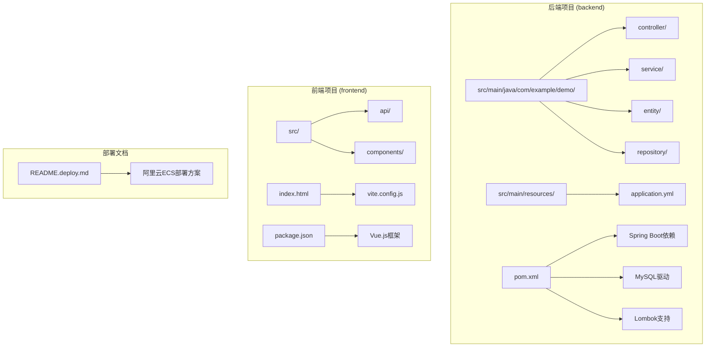
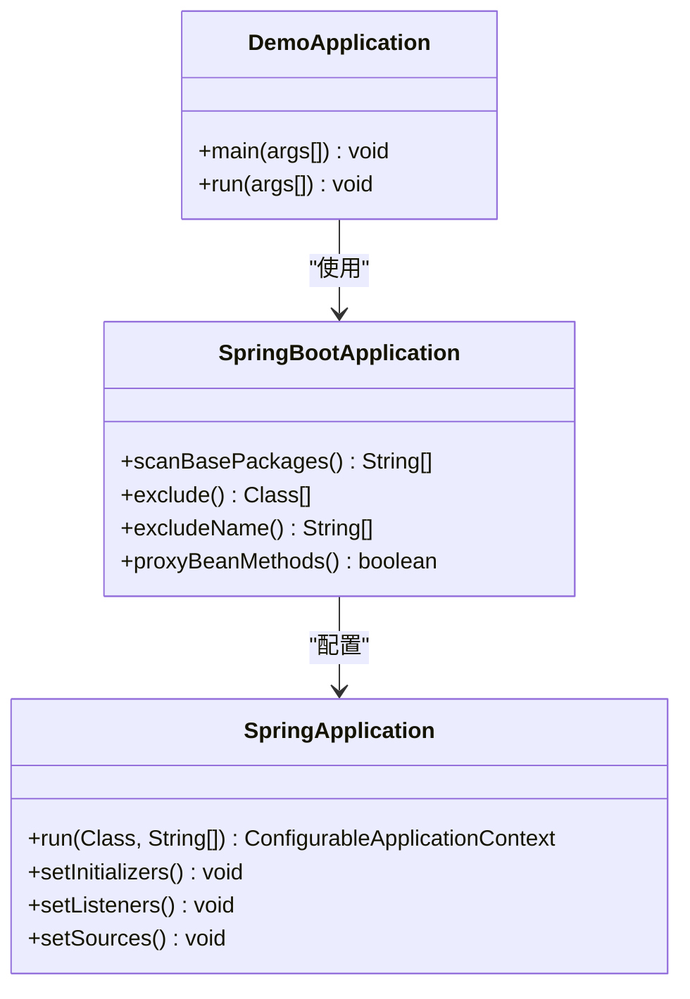
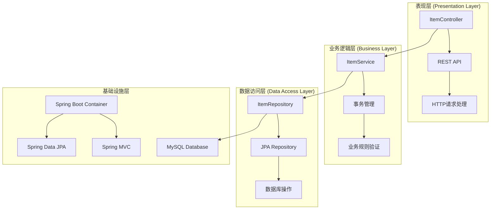
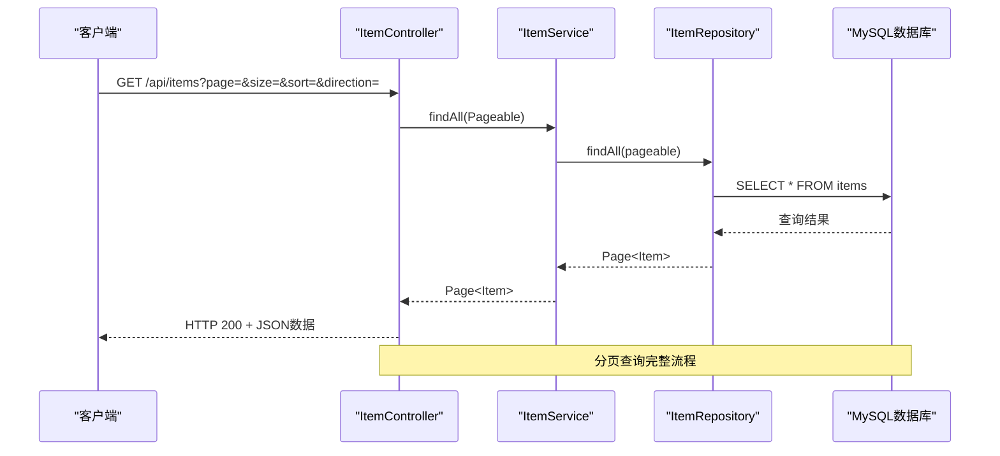
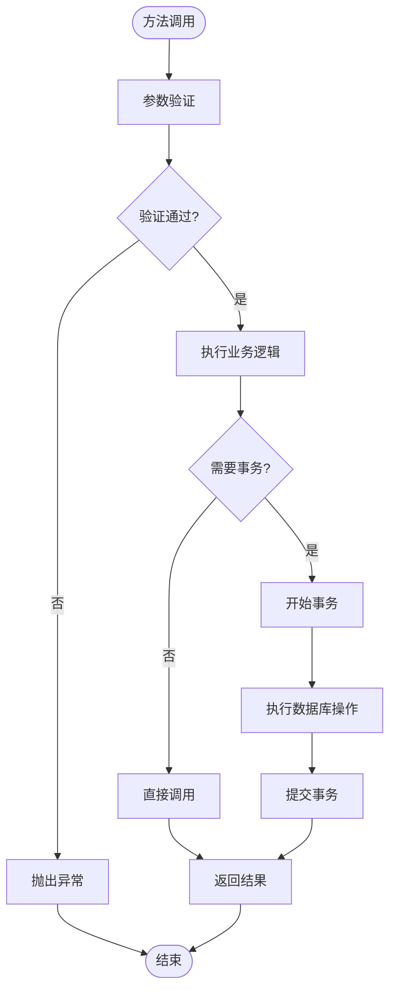
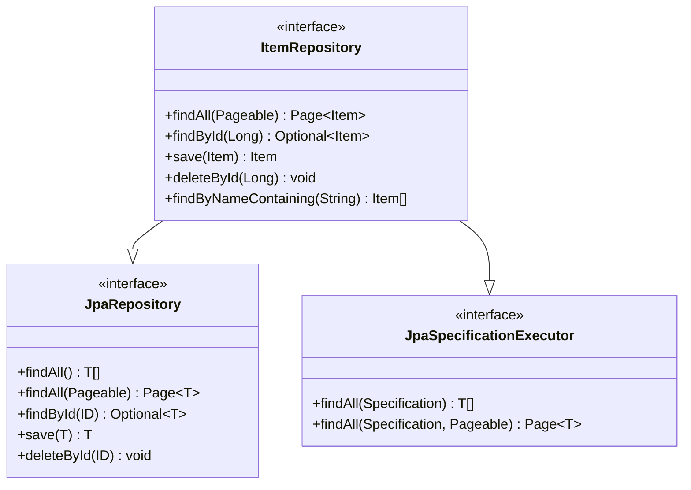
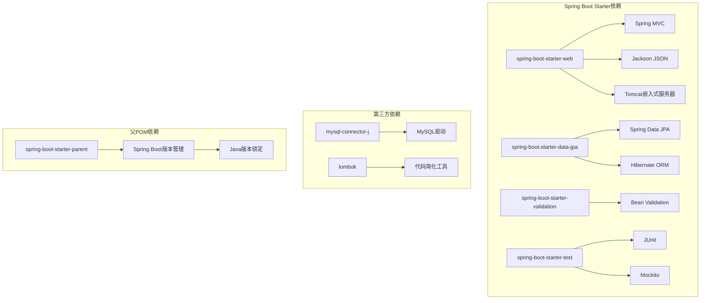

# Spring Boot应用配置

<cite>
**本文档引用的文件**
- [DemoApplication.java](file://backend/src/main/java/com/example/demo/DemoApplication.java)
- [application.yml](file://backend/src/main/resources/application.yml)
- [pom.xml](file://backend/pom.xml)
- [ItemController.java](file://backend/src/main/java/com/example/demo/controller/ItemController.java)
- [ItemService.java](file://backend/src/main/java/com/example/demo/service/ItemService.java)
- [Item.java](file://backend/src/main/java/com/example/demo/entity/Item.java)
- [ItemRepository.java](file://backend/src/main/java/com/example/demo/repository/ItemRepository.java)
- [README.deploy.md](file://README.deploy.md)
</cite>

## 目录
1. [简介](#简介)
2. [项目结构](#项目结构)
3. [核心组件](#核心组件)
4. [架构概览](#架构概览)
5. [详细组件分析](#详细组件分析)
6. [依赖分析](#依赖分析)
7. [性能考虑](#性能考虑)
8. [故障排除指南](#故障排除指南)
9. [结论](#结论)
10. [附录](#附录)

## 简介

这是一个基于Spring Boot的CRUD演示应用程序，展示了现代Java Web应用的最佳实践。该应用实现了完整的商品管理功能，包括RESTful API接口、数据持久化、分页查询和搜索功能。

应用采用前后端分离架构，后端使用Spring Boot 3.2.5和Java 17，数据库使用MySQL 8.0，通过JPA/Hibernate实现ORM映射。项目提供了完整的开发、测试和生产部署配置。

## 项目结构

该项目采用标准的Maven多模块结构，主要包含以下核心目录：



**图表来源**
- [DemoApplication.java:1-13](file://backend/src/main/java/com/example/demo/DemoApplication.java#L1-L13)
- [pom.xml:1-71](file://backend/pom.xml#L1-L71)

**章节来源**
- [DemoApplication.java:1-13](file://backend/src/main/java/com/example/demo/DemoApplication.java#L1-L13)
- [pom.xml:1-71](file://backend/pom.xml#L1-L71)

## 核心组件

### Spring Boot启动类

应用的核心启动类位于`DemoApplication.java`，使用了关键的`@SpringBootApplication`注解：



**图表来源**
- [DemoApplication.java:6-11](file://backend/src/main/java/com/example/demo/DemoApplication.java#L6-L11)

### 数据模型设计

实体类`Item.java`定义了商品的基本属性和JPA注解：

| 字段名称 | 类型 | 注解 | 描述 |
|---------|------|------|------|
| id | Long | @Id, @GeneratedValue | 主键标识符 |
| name | String | @Column(nullable=false, length=100) | 商品名称 |
| description | String | @Column(length=500) | 商品描述 |
| createdAt | LocalDateTime | @Column(name="created_at", updatable=false) | 创建时间 |

**章节来源**
- [Item.java:1-30](file://backend/src/main/java/com/example/demo/entity/Item.java#L1-L30)

## 架构概览

应用采用经典的三层架构模式，结合Spring Boot的自动配置特性：



**图表来源**
- [ItemController.java:15-59](file://backend/src/main/java/com/example/demo/controller/ItemController.java#L15-L59)
- [ItemService.java:13-50](file://backend/src/main/java/com/example/demo/service/ItemService.java#L13-L50)
- [ItemRepository.java:9-13](file://backend/src/main/java/com/example/demo/repository/ItemRepository.java#L9-L13)

## 详细组件分析

### 控制器层分析

`ItemController`实现了完整的CRUD操作，使用了现代化的Spring MVC特性：



**图表来源**
- [ItemController.java:23-31](file://backend/src/main/java/com/example/demo/controller/ItemController.java#L23-L31)
- [ItemService.java:19-21](file://backend/src/main/java/com/example/demo/service/ItemService.java#L19-L21)

#### 关键功能特性

1. **分页查询**：支持按页码、页面大小、排序字段和方向进行查询
2. **搜索功能**：提供关键词搜索，支持模糊匹配
3. **RESTful设计**：遵循REST API最佳实践
4. **CORS支持**：允许跨域请求，便于前端集成

**章节来源**
- [ItemController.java:15-59](file://backend/src/main/java/com/example/demo/controller/ItemController.java#L15-L59)

### 业务服务层分析

`ItemService`作为业务逻辑的核心，负责：
- 业务规则验证
- 事务管理
- 服务编排



**图表来源**
- [ItemService.java:32-48](file://backend/src/main/java/com/example/demo/service/ItemService.java#L32-L48)

**章节来源**
- [ItemService.java:13-50](file://backend/src/main/java/com/example/demo/service/ItemService.java#L13-L50)

### 数据访问层分析

`ItemRepository`继承了Spring Data JPA的`JpaRepository`，提供了丰富的数据访问能力：



**图表来源**
- [ItemRepository.java:9-13](file://backend/src/main/java/com/example/demo/repository/ItemRepository.java#L9-L13)

**章节来源**
- [ItemRepository.java:1-13](file://backend/src/main/java/com/example/demo/repository/ItemRepository.java#L1-L13)

## 依赖分析

### Maven依赖关系

项目使用了Spring Boot Starter机制，简化了依赖管理：



**图表来源**
- [pom.xml:24-51](file://backend/pom.xml#L24-L51)

### 核心依赖说明

| 依赖名称 | 版本 | 用途 | 关键特性 |
|---------|------|------|----------|
| spring-boot-starter-web | 3.2.5 | Web应用开发 | Spring MVC, Tomcat, Jackson |
| spring-boot-starter-data-jpa | 3.2.5 | 数据持久化 | Spring Data JPA, Hibernate |
| spring-boot-starter-validation | 3.2.5 | 参数验证 | Bean Validation API |
| mysql-connector-j | runtime | MySQL驱动 | JDBC连接 |
| lombok | compile | 代码简化 | 自动生成getter/setter |

**章节来源**
- [pom.xml:1-71](file://backend/pom.xml#L1-L71)

## 性能考虑

### 数据库性能优化

根据部署文档中的生产环境配置，建议采用以下优化策略：

1. **连接池配置**：合理设置最大连接数和超时时间
2. **查询优化**：使用索引和适当的查询策略
3. **缓存策略**：对于频繁读取的数据考虑使用二级缓存
4. **分页优化**：大数据量场景下使用游标分页而非偏移量分页

### JVM内存管理

针对2GB内存的服务器配置，建议：
- 最小堆内存：256MB
- 最大堆内存：512MB
- 启用压缩类加载以减少内存占用

### 应用监控

建议实现以下监控指标：
- 数据库连接池使用率
- 请求响应时间分布
- 内存使用情况
- GC频率和停顿时间

## 故障排除指南

### 常见启动问题

1. **端口冲突**
   - 检查`server.port`配置
   - 确认8080端口未被其他进程占用

2. **数据库连接失败**
   - 验证MySQL服务状态
   - 检查用户名和密码配置
   - 确认网络连通性

3. **JPA实体映射错误**
   - 检查@Entity注解
   - 验证字段类型映射
   - 确认主键生成策略

### 生产环境部署问题

根据部署文档，可能遇到的问题及解决方案：

```mermaid
flowchart TD
A[应用启动失败] --> B{检查日志}
B --> |有异常| C[查看错误堆栈]
B --> |无异常| D[检查端口监听]
C --> E[数据库连接问题]
C --> F[配置文件错误]
C --> G[依赖缺失]
E --> H[检查MySQL服务]
F --> I[验证application.yml]
G --> J[重新构建项目]
D --> K[ss -tlnp | grep 8080]
K --> L[确认端口占用]
```

**章节来源**
- [README.deploy.md:377-397](file://README.deploy.md#L377-L397)

### 数据库配置最佳实践

1. **生产环境配置**
   - 将`ddl-auto`从`update`改为`validate`
   - 禁用SQL日志输出
   - 配置独立的应用用户

2. **连接池配置**
   - 设置合理的最大连接数
   - 配置连接超时时间
   - 启用连接健康检查

3. **事务管理**
   - 对写操作使用@Transactional
   - 合理设置事务隔离级别
   - 避免长事务持有

## 结论

本Spring Boot应用展示了现代Java Web开发的最佳实践，包括：

1. **简洁的启动配置**：通过`@SpringBootApplication`注解实现自动配置
2. **清晰的分层架构**：控制器、服务、数据访问层职责明确
3. **完善的依赖管理**：使用Spring Boot Starter简化依赖配置
4. **生产就绪的部署**：提供完整的部署文档和运维指导

该应用为学习Spring Boot提供了良好的参考模板，涵盖了从开发到生产的完整流程。

## 附录

### 配置文件详解

#### application.yml配置项

| 配置路径 | 类型 | 默认值 | 说明 |
|---------|------|--------|------|
| server.port | Integer | 8080 | HTTP服务器端口 |
| spring.datasource.url | String | 无 | 数据库连接URL |
| spring.datasource.username | String | 无 | 数据库用户名 |
| spring.datasource.password | String | 无 | 数据库密码 |
| spring.jpa.hibernate.ddl-auto | String | update | 数据库DDL策略 |
| spring.jpa.show-sql | Boolean | true | 是否显示SQL语句 |
| spring.jpa.properties.hibernate.format_sql | Boolean | true | 是否格式化SQL输出 |

### 开发环境快速启动步骤

1. 确保MySQL服务已启动
2. 创建数据库`demo_db`
3. 运行`mvn spring-boot:run`
4. 访问`http://localhost:8080/api/items`

### 生产环境部署要点

1. 使用systemd管理服务进程
2. 配置独立的生产配置文件
3. 设置合理的JVM内存参数
4. 配置Nginx反向代理
5. 启用日志轮转和监控