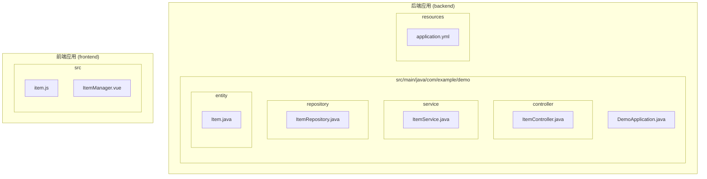
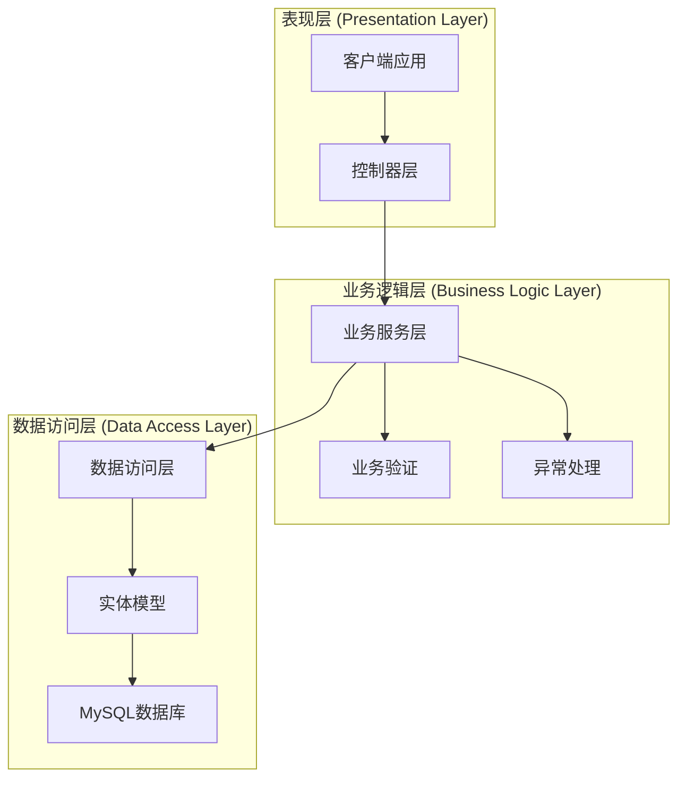
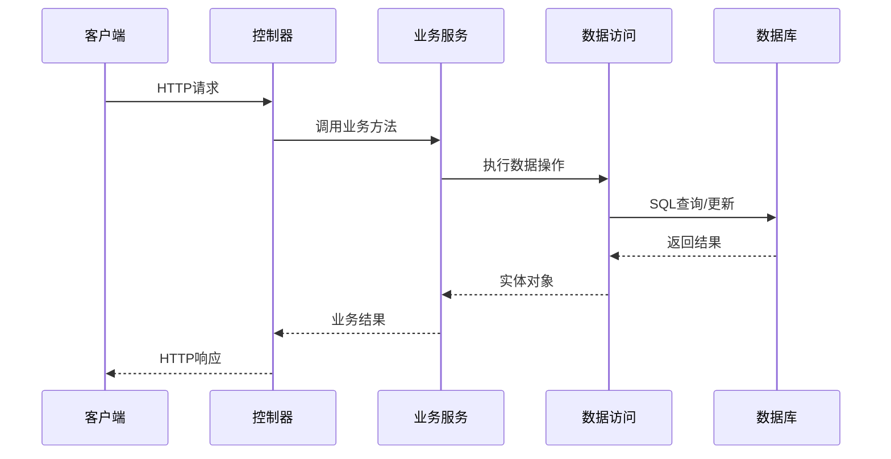
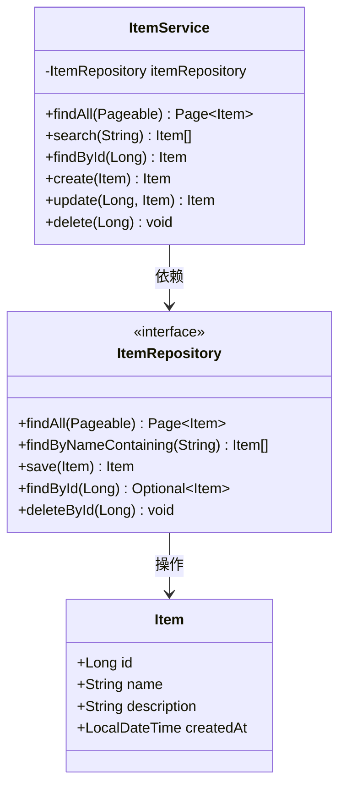
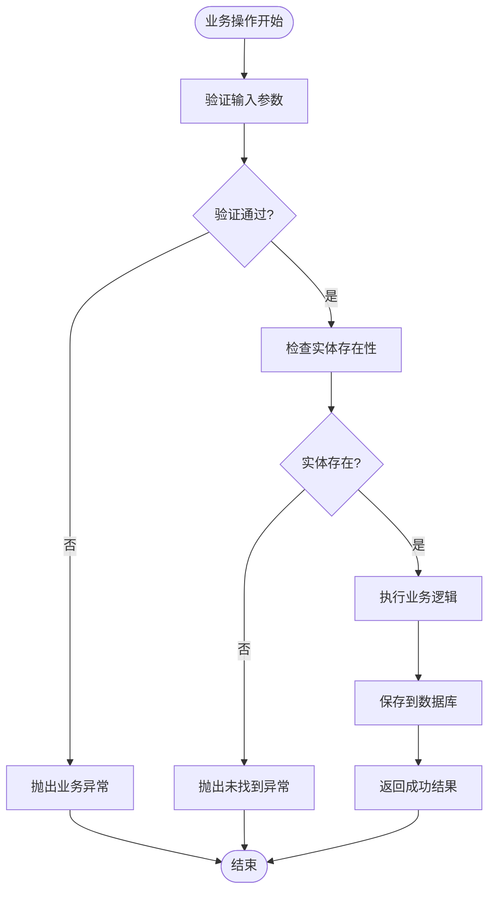
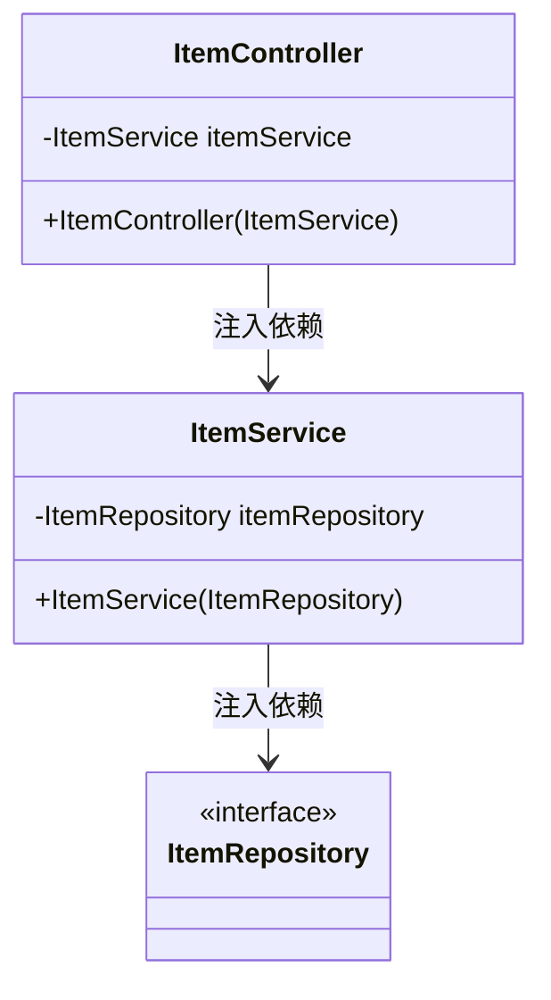
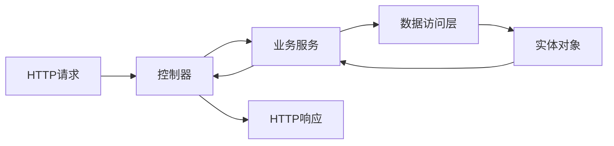
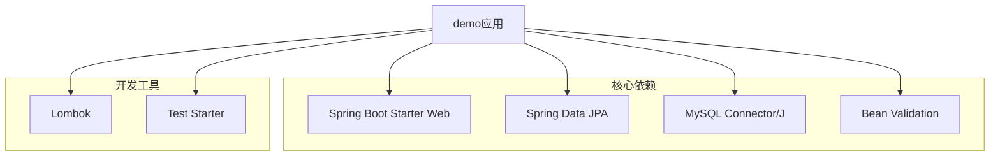

# 业务逻辑层设计

<cite>
**本文档引用的文件**
- [DemoApplication.java](file://backend/src/main/java/com/example/demo/DemoApplication.java)
- [ItemController.java](file://backend/src/main/java/com/example/demo/controller/ItemController.java)
- [ItemService.java](file://backend/src/main/java/com/example/demo/service/ItemService.java)
- [ItemRepository.java](file://backend/src/main/java/com/example/demo/repository/ItemRepository.java)
- [Item.java](file://backend/src/main/java/com/example/demo/entity/Item.java)
- [application.yml](file://backend/src/main/resources/application.yml)
- [pom.xml](file://backend/pom.xml)
</cite>

## 目录
1. [引言](#引言)
2. [项目结构](#项目结构)
3. [核心组件](#核心组件)
4. [架构概览](#架构概览)
5. [详细组件分析](#详细组件分析)
6. [依赖分析](#依赖分析)
7. [性能考虑](#性能考虑)
8. [故障排除指南](#故障排除指南)
9. [结论](#结论)

## 引言

本项目展示了一个典型的三层架构Spring Boot应用程序，重点关注业务逻辑层（Service Layer）的设计与实现。该系统通过清晰的分层分离关注点，实现了良好的可维护性和可扩展性。业务逻辑层作为系统的核心，负责协调数据访问、执行业务规则、管理事务以及处理业务异常。

## 项目结构

该项目采用标准的Spring Boot目录结构，实现了清晰的分层架构：

**图表来源**
- [DemoApplication.java:1-13](file://backend/src/main/java/com/example/demo/DemoApplication.java#L1-L13)
- [ItemController.java:1-59](file://backend/src/main/java/com/example/demo/controller/ItemController.java#L1-L59)
- [ItemService.java:1-50](file://backend/src/main/java/com/example/demo/service/ItemService.java#L1-L50)
- [ItemRepository.java:1-13](file://backend/src/main/java/com/example/demo/repository/ItemRepository.java#L1-L13)
- [Item.java:1-30](file://backend/src/main/java/com/example/demo/entity/Item.java#L1-L30)

**章节来源**
- [pom.xml:1-71](file://backend/pom.xml#L1-L71)
- [application.yml:1-18](file://backend/src/main/resources/application.yml#L1-L18)

## 核心组件

### 应用程序入口点

应用程序的启动类位于根包中，使用Spring Boot注解启用自动配置功能。

**章节来源**
- [DemoApplication.java:6-12](file://backend/src/main/java/com/example/demo/DemoApplication.java#L6-L12)

### 控制器层 (Controller Layer)

控制器层作为系统的入口点，负责HTTP请求的接收和响应的返回。每个控制器都使用RESTful设计原则，提供标准的CRUD操作接口。

**章节来源**
- [ItemController.java:15-59](file://backend/src/main/java/com/example/demo/controller/ItemController.java#L15-L59)

### 业务服务层 (Service Layer)

业务服务层是系统的核心，负责：
- 协调数据访问层的操作
- 执行业务规则和验证
- 管理事务边界
- 处理业务异常

**章节来源**
- [ItemService.java:13-50](file://backend/src/main/java/com/example/demo/service/ItemService.java#L13-L50)

### 数据访问层 (Repository Layer)

数据访问层使用Spring Data JPA简化数据库操作，提供类型安全的数据访问接口。

**章节来源**
- [ItemRepository.java:9-12](file://backend/src/main/java/com/example/demo/repository/ItemRepository.java#L9-L12)

### 实体模型层 (Entity Layer)

实体模型定义了数据结构和持久化映射关系，使用JPA注解进行配置。

**章节来源**
- [Item.java:7-30](file://backend/src/main/java/com/example/demo/entity/Item.java#L7-L30)

## 架构概览

该系统采用经典的三层架构模式，每层都有明确的职责分工：

**图表来源**
- [ItemController.java:21](file://backend/src/main/java/com/example/demo/controller/ItemController.java#L21)
- [ItemService.java:17](file://backend/src/main/java/com/example/demo/service/ItemService.java#L17)
- [ItemRepository.java:9](file://backend/src/main/java/com/example/demo/repository/ItemRepository.java#L9)

### 分层交互流程

**图表来源**
- [ItemController.java:23-57](file://backend/src/main/java/com/example/demo/controller/ItemController.java#L23-L57)
- [ItemService.java:19-48](file://backend/src/main/java/com/example/demo/service/ItemService.java#L19-L48)

## 详细组件分析

### ItemService 业务服务实现

ItemService是业务逻辑层的核心组件，实现了完整的CRUD操作和业务规则：

#### 类结构分析

**图表来源**
- [ItemService.java:13-50](file://backend/src/main/java/com/example/demo/service/ItemService.java#L13-L50)
- [ItemRepository.java:9-12](file://backend/src/main/java/com/example/demo/repository/ItemRepository.java#L9-L12)
- [Item.java:10-28](file://backend/src/main/java/com/example/demo/entity/Item.java#L10-L28)

#### 业务方法实现模式

**查找操作模式**：
- 使用分页和排序参数
- 支持关键字搜索
- 统一的异常处理机制

**创建和更新操作模式**：
- 使用@Transactional注解确保数据一致性
- 自动处理实体状态转换
- 支持部分字段更新

**删除操作模式**：
- 基于主键的级联删除
- 无返回值的void方法

**章节来源**
- [ItemService.java:19-48](file://backend/src/main/java/com/example/demo/service/ItemService.java#L19-L48)

### 业务规则实现

#### 数据验证规则

**图表来源**
- [ItemService.java:27-30](file://backend/src/main/java/com/example/demo/service/ItemService.java#L27-L30)

#### 事务管理策略

业务服务层使用声明式事务管理，确保数据一致性：

**章节来源**
- [ItemService.java:32-48](file://backend/src/main/java/com/example/demo/service/ItemService.java#L32-L48)

### 依赖注入应用

#### 构造函数注入模式

**图表来源**
- [ItemController.java:21](file://backend/src/main/java/com/example/demo/controller/ItemController.java#L21)
- [ItemService.java:17](file://backend/src/main/java/com/example/demo/service/ItemService.java#L17)

**章节来源**
- [ItemController.java:17](file://backend/src/main/java/com/example/demo/controller/ItemController.java#L17)
- [ItemService.java:14](file://backend/src/main/java/com/example/demo/service/ItemService.java#L14)

### 数据转换过程

#### 实体到DTO的转换

**图表来源**
- [ItemController.java:23-57](file://backend/src/main/java/com/example/demo/controller/ItemController.java#L23-L57)
- [ItemService.java:19-48](file://backend/src/main/java/com/example/demo/service/ItemService.java#L19-L48)

## 依赖分析

### Maven依赖关系

**图表来源**
- [pom.xml:24-51](file://backend/pom.xml#L24-L51)

### 运行时配置

**章节来源**
- [application.yml:4-17](file://backend/src/main/resources/application.yml#L4-L17)

## 性能考虑

### 数据访问优化

1. **分页查询优化**：使用PageRequest限制查询结果集大小
2. **批量操作**：对于大量数据操作考虑使用批量处理
3. **缓存策略**：对于频繁读取的数据可以考虑添加缓存层

### 事务管理优化

1. **最小化事务范围**：只在必要的操作上使用@Transactional
2. **避免长事务**：减少事务执行时间
3. **合理使用隔离级别**：根据业务需求选择合适的隔离级别

### 并发处理

1. **乐观锁机制**：对于高并发场景考虑添加版本号控制
2. **连接池配置**：合理配置数据库连接池参数
3. **异步处理**：对于耗时操作考虑使用异步处理

## 故障排除指南

### 常见问题诊断

#### 数据库连接问题

**症状**：应用启动失败或数据库操作异常
**解决方案**：
1. 检查数据库连接字符串配置
2. 验证数据库服务状态
3. 确认用户权限设置

#### 实体映射问题

**症状**：实体保存或查询异常
**解决方案**：
1. 检查实体注解配置
2. 验证数据库表结构
3. 确认字段类型匹配

#### 事务处理问题

**症状**：数据不一致或事务回滚异常
**解决方案**：
1. 检查@Transactional注解使用
2. 验证异常类型配置
3. 确认事务传播行为

**章节来源**
- [application.yml:6-8](file://backend/src/main/resources/application.yml#L6-L8)

### 日志和监控

建议添加以下监控指标：
- 数据库连接池使用情况
- 事务执行时间和成功率
- 请求响应时间和错误率
- 缓存命中率

## 结论

该业务逻辑层设计展现了Spring Boot框架下清晰的分层架构最佳实践。通过合理的依赖注入、声明式事务管理和统一的异常处理机制，实现了高内聚、低耦合的系统设计。

### 设计优势

1. **职责分离**：每层都有明确的职责边界
2. **可测试性**：依赖注入使得单元测试变得简单
3. **可扩展性**：易于添加新的业务规则和数据源
4. **可维护性**：清晰的代码结构便于维护和修改

### 改进建议

1. **添加业务异常类**：创建专门的业务异常类型
2. **实现数据传输对象**：分离实体和API响应格式
3. **添加缓存层**：提高高频数据访问性能
4. **实现审计日志**：记录重要的业务操作
5. **添加单元测试**：确保代码质量和稳定性

该架构为更复杂的业务场景提供了良好的基础，可以通过添加更多的业务规则、验证逻辑和监控机制来进一步增强系统的功能和可靠性。