# 后端架构设计

<cite>
**本文档引用的文件**
- [DemoApplication.java](file://backend/src/main/java/com/example/demo/DemoApplication.java)
- [ItemController.java](file://backend/src/main/java/com/example/demo/controller/ItemController.java)
- [ItemService.java](file://backend/src/main/java/com/example/demo/service/ItemService.java)
- [ItemRepository.java](file://backend/src/main/java/com/example/demo/repository/ItemRepository.java)
- [Item.java](file://backend/src/main/java/com/example/demo/entity/Item.java)
- [application.yml](file://backend/src/main/resources/application.yml)
- [pom.xml](file://backend/pom.xml)
- [item.js](file://frontend/src/api/item.js)
</cite>

## 目录
1. [引言](#引言)
2. [项目结构](#项目结构)
3. [核心组件](#核心组件)
4. [架构概览](#架构概览)
5. [详细组件分析](#详细组件分析)
6. [依赖分析](#依赖分析)
7. [性能考虑](#性能考虑)
8. [故障排除指南](#故障排除指南)
9. [结论](#结论)

## 引言

本项目是一个基于Spring Boot的后端架构示例，展示了现代Java Web应用的标准分层架构设计。该系统采用经典的MVC（Model-View-Controller）架构模式，通过清晰的分层职责分离实现了良好的可维护性和扩展性。

项目使用Spring Boot 3.2.5版本，集成了Spring Web、Spring Data JPA和MySQL数据库支持，提供了完整的CRUD操作功能。整个架构遵循RESTful API设计原则，通过HTTP端点提供标准的数据访问接口。

## 项目结构

该项目采用标准的Maven项目结构，按照功能模块进行组织：

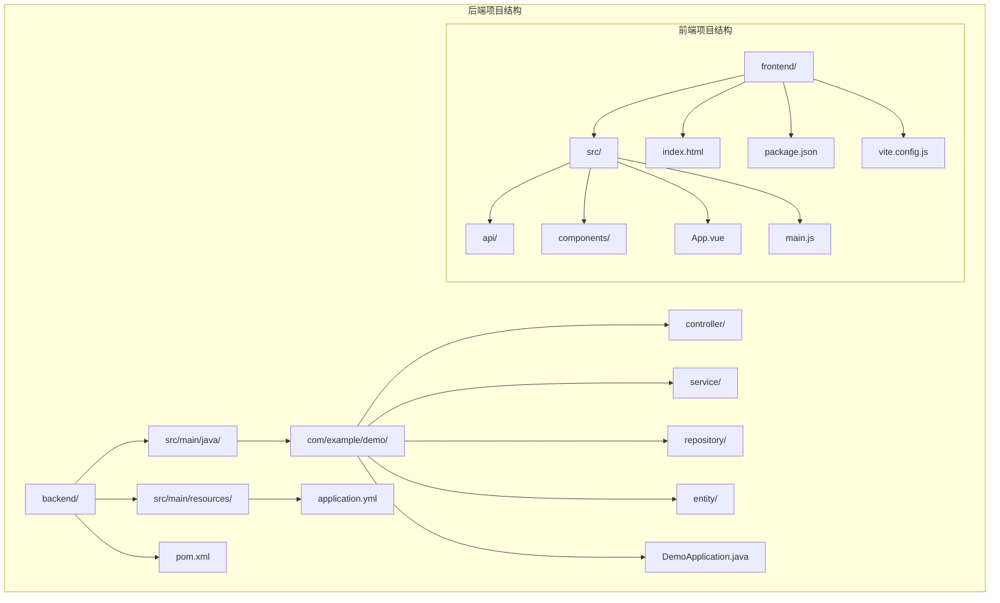

**图表来源**
- [DemoApplication.java:1-13](file://backend/src/main/java/com/example/demo/DemoApplication.java#L1-L13)
- [pom.xml:1-71](file://backend/pom.xml#L1-L71)

**章节来源**
- [DemoApplication.java:1-13](file://backend/src/main/java/com/example/demo/DemoApplication.java#L1-L13)
- [pom.xml:1-71](file://backend/pom.xml#L1-L71)

## 核心组件

### 分层架构设计

该系统采用四层架构模式，每层都有明确的职责分工：

**表现层（Controller Layer）**
- 负责处理HTTP请求和响应
- 实现RESTful API端点
- 处理参数验证和错误响应

**业务逻辑层（Service Layer）**
- 实现核心业务逻辑
- 管理事务边界
- 协调多个Repository操作

**数据访问层（Repository Layer）**
- 提供数据持久化操作
- 支持复杂查询和分页
- 封装JPA操作

**实体层（Entity Layer）**
- 定义数据模型
- 实现JPA注解映射
- 处理数据验证

### Spring Boot自动配置机制

系统通过`@SpringBootApplication`注解启用自动配置功能：

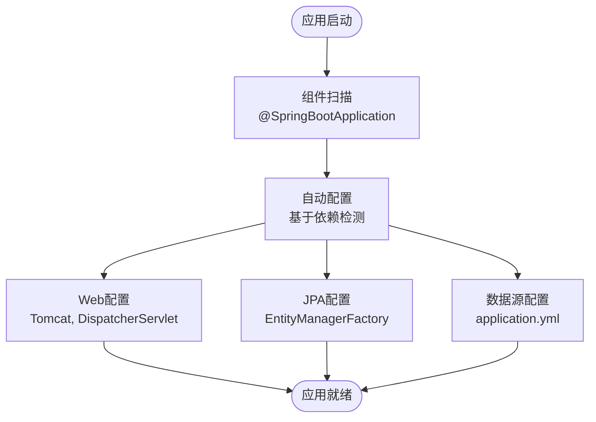

**图表来源**
- [DemoApplication.java:6-6](file://backend/src/main/java/com/example/demo/DemoApplication.java#L6-L6)
- [application.yml:1-18](file://backend/src/main/resources/application.yml#L1-L18)

**章节来源**
- [DemoApplication.java:1-13](file://backend/src/main/java/com/example/demo/DemoApplication.java#L1-L13)
- [application.yml:1-18](file://backend/src/main/resources/application.yml#L1-L18)

## 架构概览

### 整体架构图

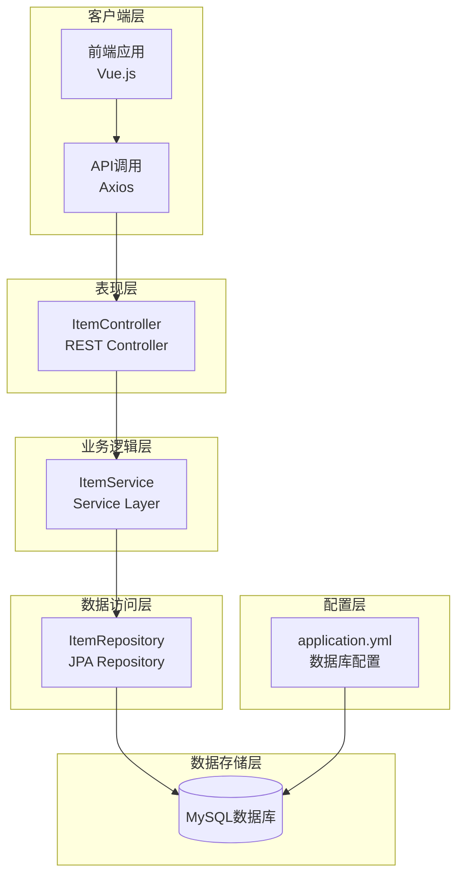

**图表来源**
- [ItemController.java:15-18](file://backend/src/main/java/com/example/demo/controller/ItemController.java#L15-L18)
- [ItemService.java:13-14](file://backend/src/main/java/com/example/demo/service/ItemService.java#L13-L14)
- [ItemRepository.java:9-12](file://backend/src/main/java/com/example/demo/repository/ItemRepository.java#L9-L12)
- [application.yml:4-17](file://backend/src/main/resources/application.yml#L4-L17)

### 数据流分析

系统的数据流遵循标准的请求-响应模式：

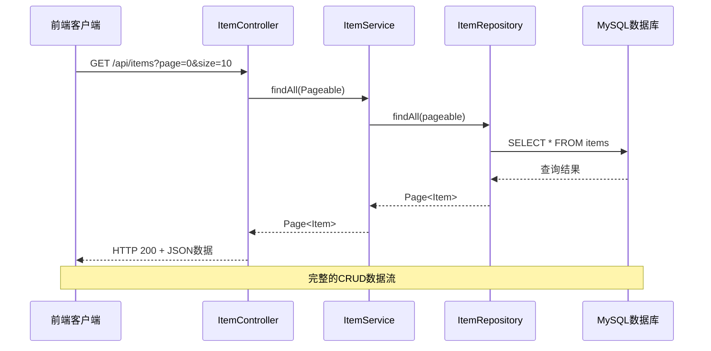

**图表来源**
- [ItemController.java:23-31](file://backend/src/main/java/com/example/demo/controller/ItemController.java#L23-L31)
- [ItemService.java:19-21](file://backend/src/main/java/com/example/demo/service/ItemService.java#L19-L21)
- [ItemRepository.java:9-12](file://backend/src/main/java/com/example/demo/repository/ItemRepository.java#L9-L12)

**章节来源**
- [ItemController.java:1-59](file://backend/src/main/java/com/example/demo/controller/ItemController.java#L1-L59)
- [ItemService.java:1-50](file://backend/src/main/java/com/example/demo/service/ItemService.java#L1-L50)
- [ItemRepository.java:1-13](file://backend/src/main/java/com/example/demo/repository/ItemRepository.java#L1-L13)

## 详细组件分析

### 控制器层（Controller）

ItemController负责处理所有与Item相关的HTTP请求：

#### 主要职责
- **REST API端点定义**：提供完整的CRUD操作接口
- **参数处理**：处理分页、排序和搜索参数
- **响应封装**：使用ResponseEntity提供标准化响应
- **跨域支持**：允许前端跨域访问

#### 关键端点设计

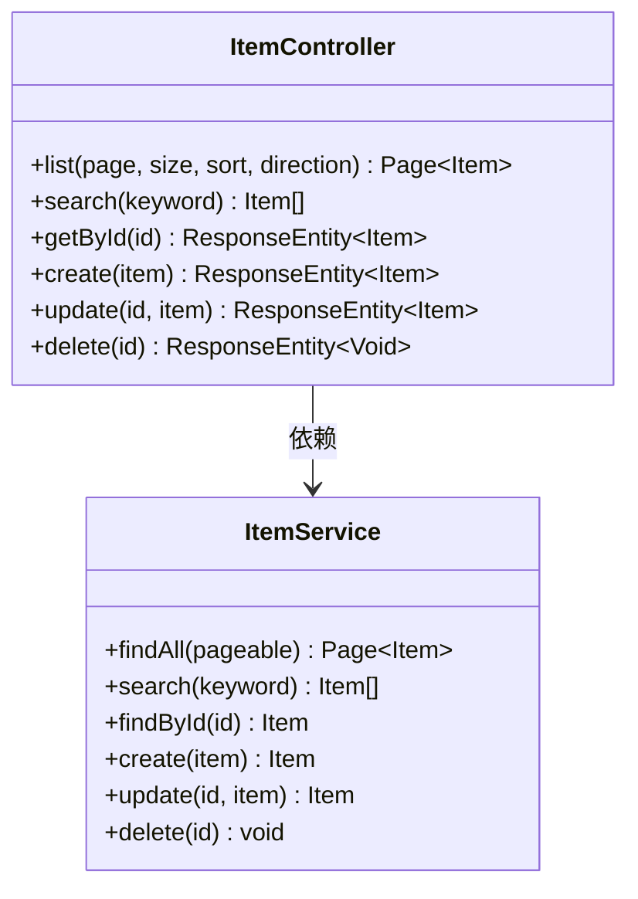

**图表来源**
- [ItemController.java:15-58](file://backend/src/main/java/com/example/demo/controller/ItemController.java#L15-L58)
- [ItemService.java:13-49](file://backend/src/main/java/com/example/demo/service/ItemService.java#L13-L49)

#### HTTP端点规范

| 方法 | 端点 | 功能 | 参数 | 返回值 |
|------|------|------|------|--------|
| GET | `/api/items` | 获取项目列表 | page, size, sort, direction | Page<Item> |
| GET | `/api/items/search` | 搜索项目 | keyword | List<Item> |
| GET | `/api/items/{id}` | 获取单个项目 | id | Item |
| POST | `/api/items` | 创建新项目 | Item对象 | Item |
| PUT | `/api/items/{id}` | 更新项目 | id, Item对象 | Item |
| DELETE | `/api/items/{id}` | 删除项目 | id | 204 No Content |

**章节来源**
- [ItemController.java:1-59](file://backend/src/main/java/com/example/demo/controller/ItemController.java#L1-L59)

### 服务层（Service）

ItemService实现核心业务逻辑，提供事务管理和业务规则：

#### 事务管理

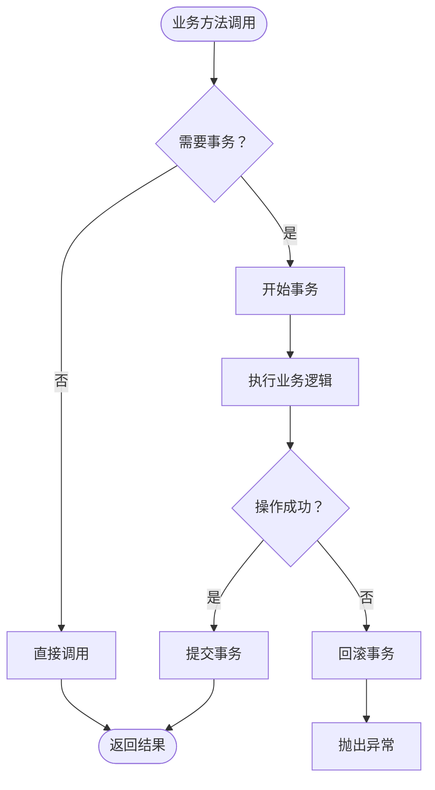

**图表来源**
- [ItemService.java:32-48](file://backend/src/main/java/com/example/demo/service/ItemService.java#L32-L48)

#### 业务逻辑设计

服务层确保了以下关键特性：
- **事务边界**：所有写操作都在事务中执行
- **数据一致性**：通过JPA保证数据完整性
- **业务规则**：集中处理业务逻辑
- **错误处理**：统一的异常处理机制

**章节来源**
- [ItemService.java:1-50](file://backend/src/main/java/com/example/demo/service/ItemService.java#L1-L50)

### 数据访问层（Repository）

ItemRepository继承Spring Data JPA提供的接口，提供丰富的数据访问能力：

#### JPA Repository特性

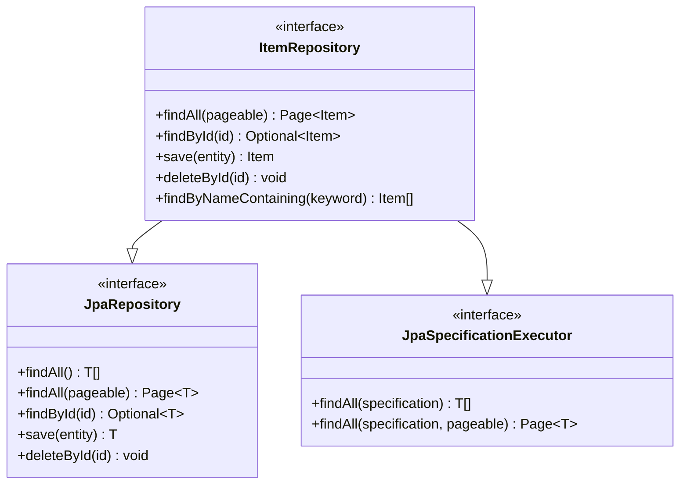

**图表来源**
- [ItemRepository.java:9-12](file://backend/src/main/java/com/example/demo/repository/ItemRepository.java#L9-L12)

#### 查询方法生成

Spring Data JPA根据方法命名自动生成SQL查询：
- `findByNameContaining` → `SELECT * FROM items WHERE name LIKE %keyword%`
- `findById` → `SELECT * FROM items WHERE id = ?`

**章节来源**
- [ItemRepository.java:1-13](file://backend/src/main/java/com/example/demo/repository/ItemRepository.java#L1-L13)

### 实体层（Entity）

Item实体类定义了数据模型和JPA映射关系：

#### JPA注解详解

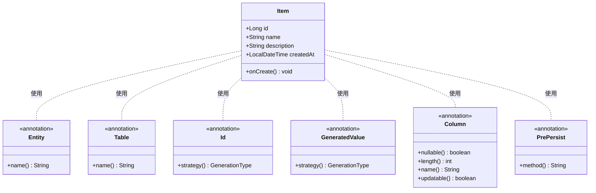

**图表来源**
- [Item.java:7-28](file://backend/src/main/java/com/example/demo/entity/Item.java#L7-L28)

#### 数据库映射关系

| Java属性 | 数据库列 | 注解 | 约束 |
|----------|----------|------|------|
| `id` | `id` | @Id, @GeneratedValue | 主键, 自增 |
| `name` | `name` | @Column | 非空, 长度100 |
| `description` | `description` | @Column | 长度500 |
| `createdAt` | `created_at` | @Column | 不可更新 |

**章节来源**
- [Item.java:1-30](file://backend/src/main/java/com/example/demo/entity/Item.java#L1-L30)

## 依赖分析

### Maven依赖关系

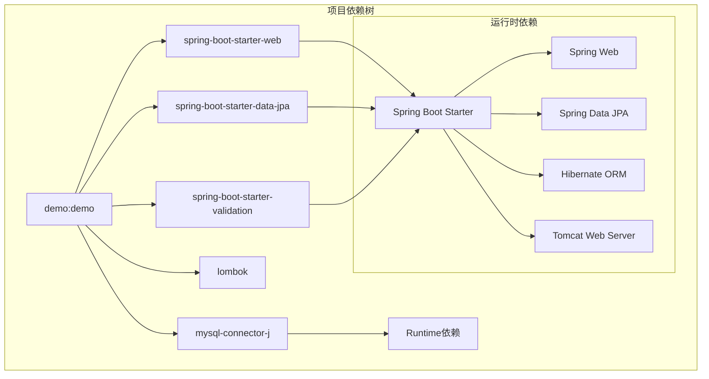

**图表来源**
- [pom.xml:24-51](file://backend/pom.xml#L24-L51)

### 组件耦合分析

系统采用了松耦合的设计模式：

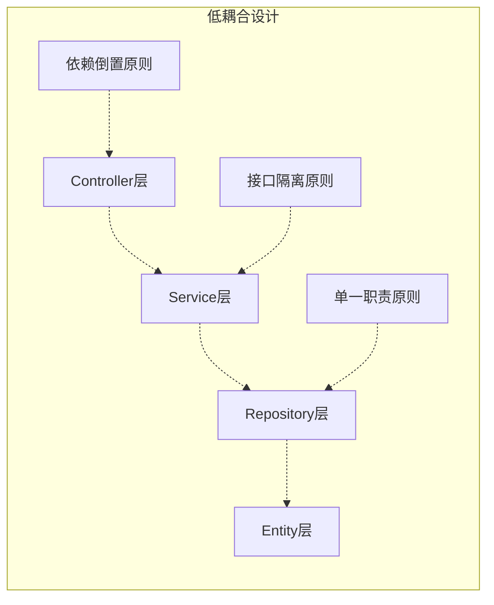

**图表来源**
- [ItemController.java:21-21](file://backend/src/main/java/com/example/demo/controller/ItemController.java#L21-L21)
- [ItemService.java:17-17](file://backend/src/main/java/com/example/demo/service/ItemService.java#L17-L17)
- [ItemRepository.java:9-9](file://backend/src/main/java/com/example/demo/repository/ItemRepository.java#L9-L9)

**章节来源**
- [pom.xml:1-71](file://backend/pom.xml#L1-L71)

## 性能考虑

### 数据库性能优化

1. **分页查询**：使用Pageable接口实现高效分页
2. **索引优化**：建议在常用查询字段上建立索引
3. **批量操作**：对于大量数据操作考虑批量处理

### 缓存策略

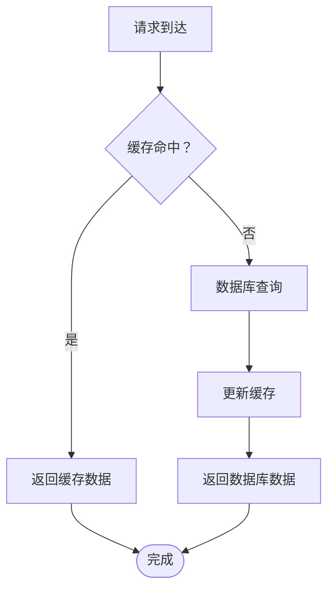

### 并发处理

- **线程安全**：Spring组件默认单例，注意线程安全
- **事务隔离**：合理设置事务隔离级别
- **连接池**：配置合适的数据库连接池参数

## 故障排除指南

### 常见问题诊断

#### 数据库连接问题

**症状**：应用启动失败，显示数据库连接错误

**排查步骤**：
1. 检查数据库服务状态
2. 验证连接URL配置
3. 确认用户名密码正确
4. 检查防火墙设置

#### JPA配置问题

**症状**：实体映射失败或DDL执行错误

**排查步骤**：
1. 检查实体类注解配置
2. 验证数据库方言设置
3. 确认表名和列名映射
4. 检查Hibernate配置

#### 事务管理问题

**症状**：数据不一致或事务回滚异常

**排查步骤**：
1. 检查@Transactional注解使用
2. 验证事务传播行为
3. 确认异常类型处理
4. 检查数据库引擎支持

**章节来源**
- [application.yml:4-17](file://backend/src/main/resources/application.yml#L4-L17)
- [ItemService.java:32-48](file://backend/src/main/java/com/example/demo/service/ItemService.java#L32-L48)

## 结论

本项目展示了一个完整、健壮且易于维护的Spring Boot后端架构。通过清晰的分层设计、合理的依赖管理和完善的错误处理机制，实现了高内聚、低耦合的系统结构。

### 架构优势

1. **清晰的职责分离**：每层都有明确的职责边界
2. **强大的数据访问能力**：Spring Data JPA简化了数据操作
3. **完善的事务管理**：确保数据一致性和完整性
4. **RESTful API设计**：符合现代Web应用标准
5. **自动配置机制**：减少样板代码，提高开发效率

### 最佳实践建议

1. **持续集成**：建立自动化测试和部署流程
2. **监控告警**：添加应用性能监控和日志记录
3. **安全加固**：实现身份认证和授权机制
4. **API文档**：使用OpenAPI规范生成API文档
5. **性能优化**：定期进行性能基准测试和优化

该架构为后续的功能扩展和团队协作奠定了坚实的基础，适合在生产环境中部署和维护。