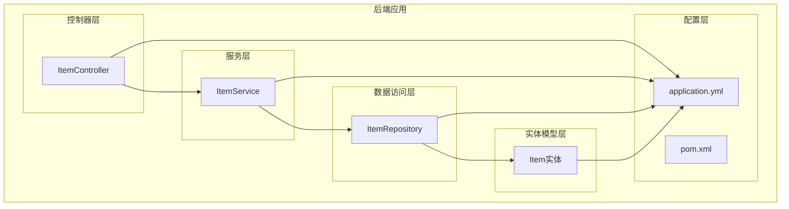
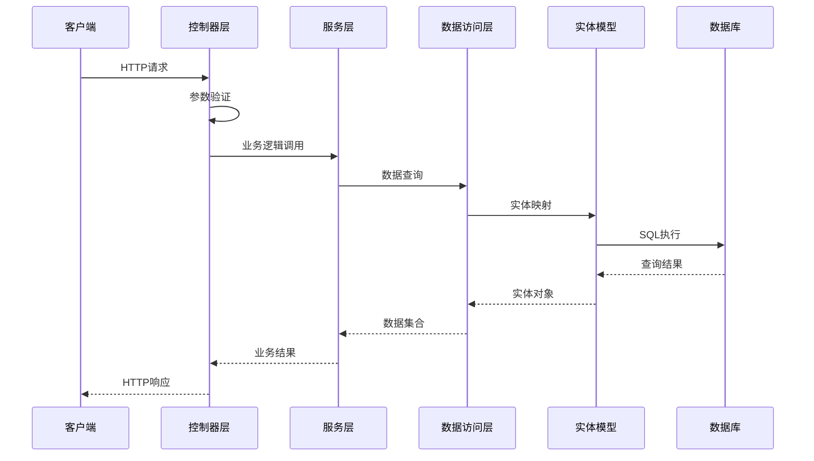
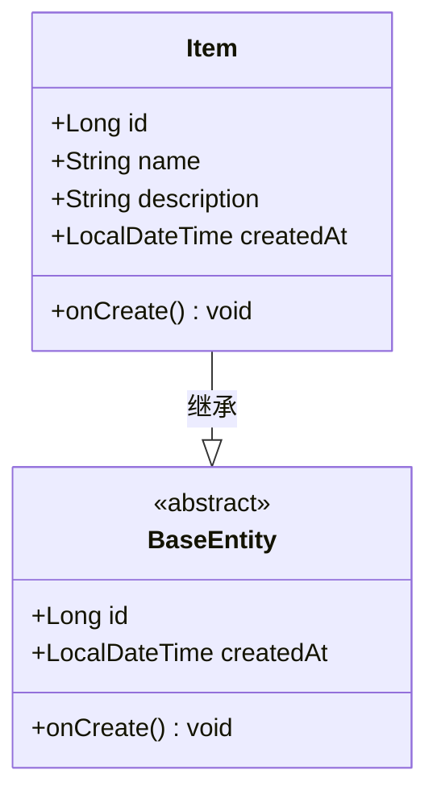
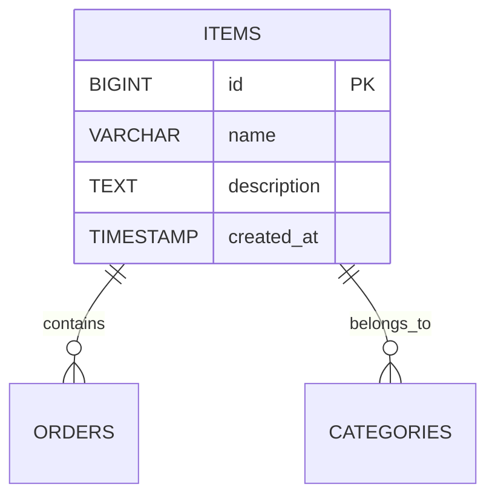
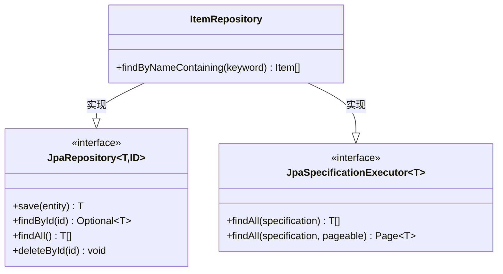
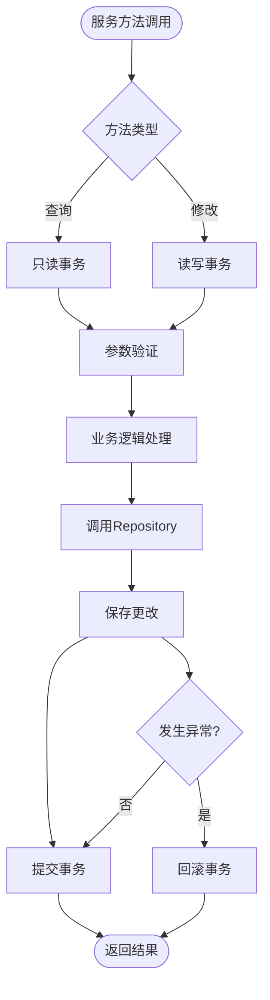
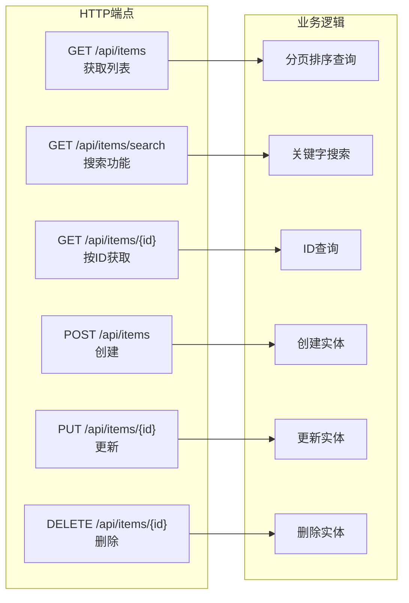
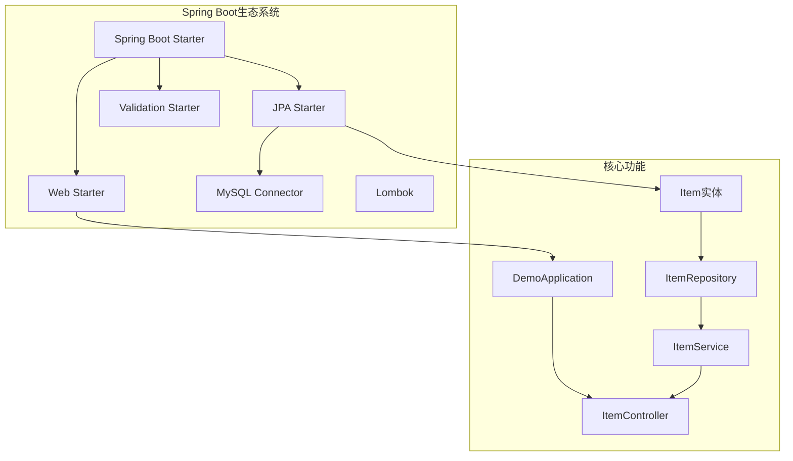
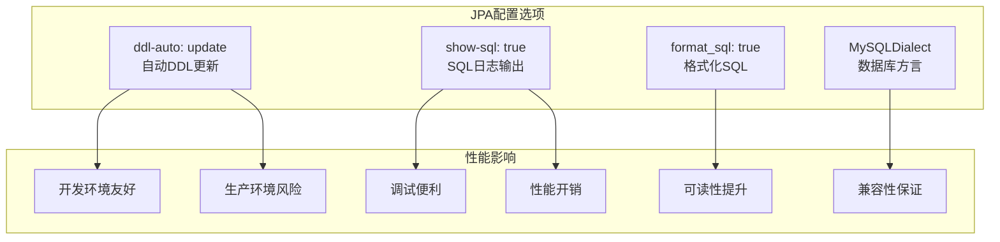
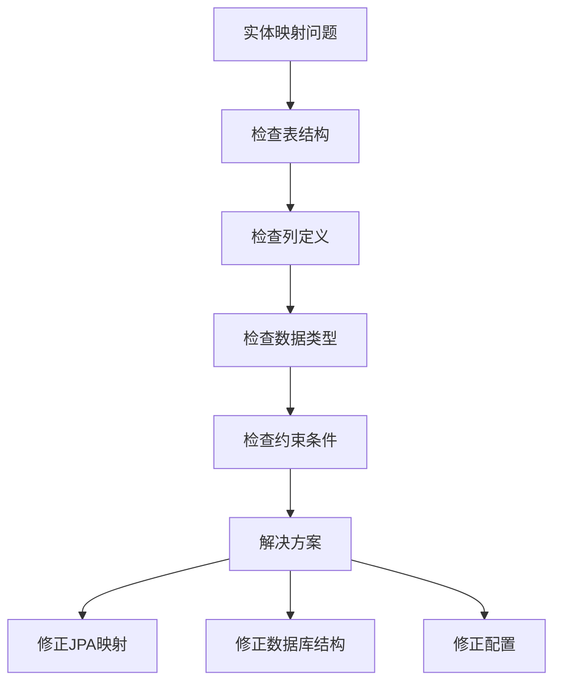

# 实体模型设计

<cite>
**本文档引用的文件**
- [Item.java](file://backend/src/main/java/com/example/demo/entity/Item.java)
- [ItemRepository.java](file://backend/src/main/java/com/example/demo/repository/ItemRepository.java)
- [ItemService.java](file://backend/src/main/java/com/example/demo/service/ItemService.java)
- [ItemController.java](file://backend/src/main/java/com/example/demo/controller/ItemController.java)
- [application.yml](file://backend/src/main/resources/application.yml)
- [pom.xml](file://backend/pom.xml)
- [DemoApplication.java](file://backend/src/main/java/com/example/demo/DemoApplication.java)
</cite>

## 目录
1. [简介](#简介)
2. [项目结构](#项目结构)
3. [核心组件](#核心组件)
4. [架构概览](#架构概览)
5. [详细组件分析](#详细组件分析)
6. [依赖分析](#依赖分析)
7. [性能考虑](#性能考虑)
8. [故障排除指南](#故障排除指南)
9. [结论](#结论)
10. [附录](#附录)

## 简介

本项目展示了基于Spring Boot和JPA的实体模型设计最佳实践。通过一个简单的商品管理示例，演示了完整的实体生命周期管理、数据库映射关系和CRUD操作实现。本文档将深入分析实体注解的使用、数据库映射策略、实体关系设计以及相关的验证和约束机制。

## 项目结构

该项目采用标准的Spring Boot分层架构，包含以下主要模块：

**图表来源**
- [DemoApplication.java:1-13](file://backend/src/main/java/com/example/demo/DemoApplication.java#L1-L13)
- [ItemController.java:1-59](file://backend/src/main/java/com/example/demo/controller/ItemController.java#L1-L59)
- [ItemService.java:1-50](file://backend/src/main/java/com/example/demo/service/ItemService.java#L1-L50)
- [ItemRepository.java:1-13](file://backend/src/main/java/com/example/demo/repository/ItemRepository.java#L1-L13)
- [Item.java:1-30](file://backend/src/main/java/com/example/demo/entity/Item.java#L1-L30)

**章节来源**
- [DemoApplication.java:1-13](file://backend/src/main/java/com/example/demo/DemoApplication.java#L1-L13)
- [pom.xml:1-71](file://backend/pom.xml#L1-L71)

## 核心组件

### 实体模型设计

项目中的实体模型相对简单但涵盖了JPA注解的核心使用场景。以下是对实体设计的关键要素分析：

#### 主键策略
- 使用`@Id`和`@GeneratedValue(strategy = GenerationType.IDENTITY)`实现自增主键
- 主键类型为Long，适用于大多数数据库系统

#### 字段映射
- 基础字段映射使用`@Column`注解
- 支持可空性控制、长度限制和列名映射
- 特殊字段如创建时间使用`updatable = false`防止更新

#### 生命周期管理
- 通过`@PrePersist`实现自动时间戳设置
- 确保数据的一致性和完整性

**章节来源**
- [Item.java:12-28](file://backend/src/main/java/com/example/demo/entity/Item.java#L12-L28)

## 架构概览

整个应用程序遵循经典的三层架构模式，实现了清晰的关注点分离：

**图表来源**
- [ItemController.java:23-57](file://backend/src/main/java/com/example/demo/controller/ItemController.java#L23-L57)
- [ItemService.java:19-48](file://backend/src/main/java/com/example/demo/service/ItemService.java#L19-L48)
- [ItemRepository.java:9-12](file://backend/src/main/java/com/example/demo/repository/ItemRepository.java#L9-L12)

## 详细组件分析

### 实体类详细分析

#### Item实体类结构

**图表来源**
- [Item.java:10-28](file://backend/src/main/java/com/example/demo/entity/Item.java#L10-L28)

##### 字段定义与映射

| 字段 | 注解 | 数据类型 | 映射属性 | 用途 |
|------|------|----------|----------|------|
| id | @Id, @GeneratedValue | Long | 自增主键 | 实体唯一标识 |
| name | @Column | String | 非空, 长度100 | 商品名称 |
| description | @Column | String | 长度500 | 商品描述 |
| createdAt | @Column | LocalDateTime | 不可更新 | 创建时间戳 |

##### 数据库映射关系

**图表来源**
- [Item.java:9-28](file://backend/src/main/java/com/example/demo/entity/Item.java#L9-L28)

**章节来源**
- [Item.java:1-30](file://backend/src/main/java/com/example/demo/entity/Item.java#L1-L30)

### 数据访问层设计

#### Repository接口设计

**图表来源**
- [ItemRepository.java:9-12](file://backend/src/main/java/com/example/demo/repository/ItemRepository.java#L9-L12)

##### 查询方法设计

Repository接口提供了以下查询能力：
- 基础CRUD操作继承自JpaRepository
- 条件查询：`findByNameContaining`支持模糊搜索
- 规格查询：继承JpaSpecificationExecutor支持复杂查询

**章节来源**
- [ItemRepository.java:1-13](file://backend/src/main/java/com/example/demo/repository/ItemRepository.java#L1-L13)

### 服务层业务逻辑

#### 事务管理策略

**图表来源**
- [ItemService.java:32-43](file://backend/src/main/java/com/example/demo/service/ItemService.java#L32-L43)

**章节来源**
- [ItemService.java:1-50](file://backend/src/main/java/com/example/demo/service/ItemService.java#L1-L50)

### 控制器层接口设计

#### REST API端点设计

**图表来源**
- [ItemController.java:23-57](file://backend/src/main/java/com/example/demo/controller/ItemController.java#L23-L57)

**章节来源**
- [ItemController.java:1-59](file://backend/src/main/java/com/example/demo/controller/ItemController.java#L1-L59)

## 依赖分析

### 技术栈依赖关系

**图表来源**
- [pom.xml:24-52](file://backend/pom.xml#L24-L52)
- [DemoApplication.java:6-11](file://backend/src/main/java/com/example/demo/DemoApplication.java#L6-L11)

### 外部依赖配置

| 依赖项 | 版本 | 用途 | 关键特性 |
|--------|------|------|----------|
| spring-boot-starter-web | 3.2.5 | Web应用 | REST API, 内嵌服务器 |
| spring-boot-starter-data-jpa | 3.2.5 | 数据访问 | JPA, Hibernate |
| spring-boot-starter-validation | 3.2.5 | 数据验证 | Bean Validation |
| mysql-connector-j | runtime | 数据库驱动 | MySQL连接 |
| lombok | 1.18.x | 代码简化 | 自动生成getter/setter |

**章节来源**
- [pom.xml:24-52](file://backend/pom.xml#L24-L52)

## 性能考虑

### 数据库配置优化

#### JPA配置策略

**图表来源**
- [application.yml:10-17](file://backend/src/main/resources/application.yml#L10-L17)

### 查询性能优化建议

1. **索引策略**：为常用查询字段建立数据库索引
2. **分页查询**：使用Pageable进行大数据量分页
3. **懒加载**：合理使用Eager/Lazy加载策略
4. **批量操作**：对于大量数据操作使用批量处理

## 故障排除指南

### 常见问题诊断

#### 实体映射问题

#### 连接池配置

| 问题症状 | 可能原因 | 解决方案 |
|----------|----------|----------|
| 连接超时 | 连接池配置不当 | 调整最大连接数和超时时间 |
| 连接泄漏 | 事务管理不当 | 检查事务边界和资源释放 |
| 性能下降 | 缺少索引 | 为查询字段添加索引 |
| 内存溢出 | 大数据量查询 | 实施分页和批量处理 |

**章节来源**
- [application.yml:4-17](file://backend/src/main/resources/application.yml#L4-L17)

## 结论

本项目展示了JPA实体模型设计的最佳实践，包括：

1. **简洁有效的实体设计**：通过最少的注解实现完整的数据映射
2. **清晰的分层架构**：控制器、服务、数据访问层职责明确
3. **完善的生命周期管理**：自动时间戳和实体状态管理
4. **灵活的查询机制**：基础CRUD和条件查询的结合
5. **良好的扩展性**：易于添加新的实体和关系

该设计为更复杂的实体关系模型提供了坚实的基础，可以轻松扩展到一对一、一对多、多对多等关系映射场景。

## 附录

### 实体模型设计原则

#### 基本设计原则
- **单一职责**：每个实体专注于特定业务领域
- **数据完整性**：通过注解确保数据约束
- **可维护性**：清晰的命名和结构
- **性能考虑**：合理的索引和查询策略

#### 扩展设计模式
- **继承层次**：使用`@Inheritance`实现实体继承
- **组合关系**：使用`@Embedded`实现复合属性
- **关系映射**：使用`@OneToOne`, `@OneToMany`, `@ManyToMany`实现复杂关系

### 数据库迁移策略

#### 开发环境策略
- 使用`ddl-auto: update`自动更新数据库结构
- 适合快速迭代和原型开发

#### 生产环境策略
- 使用`ddl-auto: validate`验证现有结构
- 通过独立的迁移脚本管理数据库变更
- 实施版本化的迁移策略

### 最佳实践清单

1. **实体设计**
   - 使用`@PrePersist`和`@PreUpdate`管理时间戳
   - 合理使用`@Column`注解定义约束
   - 为外键关系添加适当的索引

2. **查询优化**
   - 使用`@NamedQuery`或`@Query`优化复杂查询
   - 实施分页和排序策略
   - 避免N+1查询问题

3. **事务管理**
   - 明确事务边界
   - 使用合适的事务传播行为
   - 处理并发冲突

4. **性能监控**
   - 监控慢查询
   - 分析查询计划
   - 实施缓存策略