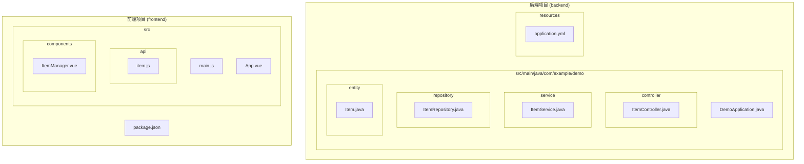
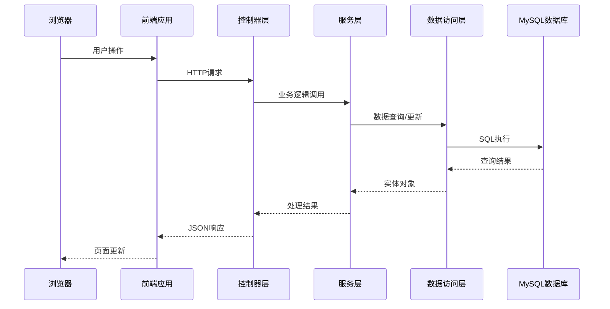
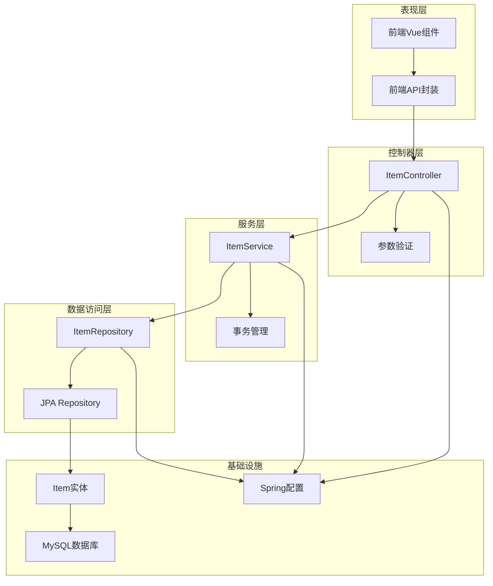

# 控制器层设计

<cite>
**本文档引用的文件**
- [ItemController.java](file://backend/src/main/java/com/example/demo/controller/ItemController.java)
- [ItemService.java](file://backend/src/main/java/com/example/demo/service/ItemService.java)
- [ItemRepository.java](file://backend/src/main/java/com/example/demo/repository/ItemRepository.java)
- [Item.java](file://backend/src/main/java/com/example/demo/entity/Item.java)
- [DemoApplication.java](file://backend/src/main/java/com/example/demo/DemoApplication.java)
- [application.yml](file://backend/src/main/resources/application.yml)
- [pom.xml](file://backend/pom.xml)
- [item.js](file://frontend/src/api/item.js)
- [ItemManager.vue](file://frontend/src/components/ItemManager.vue)
- [package.json](file://frontend/package.json)
</cite>

## 目录
1. [简介](#简介)
2. [项目结构](#项目结构)
3. [核心组件](#核心组件)
4. [架构概览](#架构概览)
5. [详细组件分析](#详细组件分析)
6. [依赖关系分析](#依赖关系分析)
7. [性能考虑](#性能考虑)
8. [故障排除指南](#故障排除指南)
9. [结论](#结论)
10. [附录](#附录)

## 简介

本文件为Spring Boot项目的控制器层架构文档，专注于RESTful API控制器的设计原则和实现模式。该系统采用经典的三层架构模式，包括控制器层（Controller）、服务层（Service）和数据访问层（Repository），通过清晰的职责分离实现了可维护、可扩展的企业级应用。

系统提供了完整的CRUD操作功能，支持分页查询、条件搜索、排序等功能，同时具备良好的前后端交互能力和错误处理机制。

## 项目结构

该项目采用标准的Spring Boot项目结构，遵循Maven多模块组织方式：



**图表来源**
- [DemoApplication.java:1-13](file://backend/src/main/java/com/example/demo/DemoApplication.java#L1-L13)
- [ItemController.java:1-59](file://backend/src/main/java/com/example/demo/controller/ItemController.java#L1-L59)
- [ItemService.java:1-50](file://backend/src/main/java/com/example/demo/service/ItemService.java#L1-L50)
- [ItemRepository.java:1-13](file://backend/src/main/java/com/example/demo/repository/ItemRepository.java#L1-L13)
- [Item.java:1-30](file://backend/src/main/java/com/example/demo/entity/Item.java#L1-L30)

**章节来源**
- [pom.xml:1-71](file://backend/pom.xml#L1-L71)
- [application.yml:1-18](file://backend/src/main/resources/application.yml#L1-L18)

## 核心组件

### 控制器层架构

控制器层作为系统的入口点，负责处理HTTP请求、参数绑定、请求验证和响应处理。该层采用@RestController注解，自动将返回值转换为JSON格式。

### 数据模型设计

系统使用JPA实体映射数据库表，支持自动DDL更新和SQL日志输出，便于开发和调试。

### 依赖注入与事务管理

服务层采用@Transactional注解确保数据一致性，Repository层继承JpaRepository提供标准的数据访问操作。

**章节来源**
- [ItemController.java:15-58](file://backend/src/main/java/com/example/demo/controller/ItemController.java#L15-L58)
- [ItemService.java:13-49](file://backend/src/main/java/com/example/demo/service/ItemService.java#L13-L49)
- [Item.java:7-29](file://backend/src/main/java/com/example/demo/entity/Item.java#L7-L29)

## 架构概览

系统采用经典的MVC架构模式，通过RESTful API实现前后端分离：



**图表来源**
- [ItemController.java:23-57](file://backend/src/main/java/com/example/demo/controller/ItemController.java#L23-L57)
- [ItemService.java:19-48](file://backend/src/main/java/com/example/demo/service/ItemService.java#L19-L48)
- [ItemRepository.java:9-12](file://backend/src/main/java/com/example/demo/repository/ItemRepository.java#L9-L12)

## 详细组件分析

### ItemController - 核心控制器

ItemController是系统的主要控制器，负责处理所有与Item实体相关的HTTP请求。

#### HTTP端点定义

控制器定义了以下RESTful端点：

| 方法 | 路径 | 功能 | 请求参数 | 响应类型 |
|------|------|------|----------|----------|
| GET | `/api/items` | 获取项目列表 | page, size, sort, direction | Page<Item> |
| GET | `/api/items/search` | 搜索项目 | keyword | List<Item> |
| GET | `/api/items/{id}` | 获取单个项目 | id (路径变量) | Item |
| POST | `/api/items` | 创建新项目 | Item实体 | Item |
| PUT | `/api/items/{id}` | 更新项目 | id, Item实体 | Item |
| DELETE | `/api/items/{id}` | 删除项目 | id | Void |

#### 参数绑定机制

控制器使用Spring MVC的参数绑定机制：

- **路径变量**：通过`@PathVariable`注解绑定URL中的动态参数
- **请求参数**：通过`@RequestParam`注解绑定查询字符串参数
- **请求体**：通过`@RequestBody`注解绑定POST/PUT请求体中的JSON数据

#### 响应处理策略

控制器采用统一的响应处理策略：

- **分页响应**：使用Spring Data的Page对象封装分页数据
- **状态码管理**：
  - 200 OK：成功获取或更新资源
  - 201 Created：成功创建资源
  - 204 No Content：成功删除资源
  - 404 Not Found：资源不存在时抛出异常

**章节来源**
- [ItemController.java:23-57](file://backend/src/main/java/com/example/demo/controller/ItemController.java#L23-L57)

### ItemService - 业务逻辑层

ItemService封装了所有业务逻辑，提供事务管理和数据验证。

#### 事务管理

服务层使用`@Transactional`注解确保数据操作的原子性：

- **创建操作**：保存新的Item实体
- **更新操作**：先查找现有实体，然后更新属性
- **删除操作**：删除指定ID的实体

#### 异常处理

服务层在找不到实体时抛出RuntimeException，交由Spring框架进行统一异常处理。

**章节来源**
- [ItemService.java:32-48](file://backend/src/main/java/com/example/demo/service/ItemService.java#L32-L48)

### ItemRepository - 数据访问层

ItemRepository继承JpaRepository，提供标准的数据访问操作。

#### 自定义查询

Repository定义了自定义查询方法：
- `findByNameContaining(String keyword)`：根据名称模糊查询

#### 分页支持

继承JpaRepository后自动获得分页查询能力，支持复杂查询条件。

**章节来源**
- [ItemRepository.java:9-12](file://backend/src/main/java/com/example/demo/repository/ItemRepository.java#L9-L12)

### 数据模型 - Item实体

Item实体使用JPA注解定义数据库映射关系。

#### 字段映射

| 字段名 | 注解 | 描述 | 约束 |
|--------|------|------|------|
| id | @Id, @GeneratedValue | 主键 | 自增 |
| name | @Column(nullable=false, length=100) | 名称 | 非空，长度100 |
| description | @Column(length=500) | 描述 | 长度500 |
| createdAt | @Column(name="created_at", updatable=false) | 创建时间 | 不可更新 |

#### 生命周期回调

使用`@PrePersist`注解在实体持久化前自动设置创建时间。

**章节来源**
- [Item.java:10-28](file://backend/src/main/java/com/example/demo/entity/Item.java#L10-L28)

## 依赖关系分析

系统采用清晰的依赖层次结构，每个层都有明确的职责边界：



**图表来源**
- [ItemController.java:15-18](file://backend/src/main/java/com/example/demo/controller/ItemController.java#L15-L18)
- [ItemService.java:13-14](file://backend/src/main/java/com/example/demo/service/ItemService.java#L13-L14)
- [ItemRepository.java:9-12](file://backend/src/main/java/com/example/demo/repository/ItemRepository.java#L9-L12)

### 外部依赖

系统主要依赖以下Spring Boot Starter：

- **spring-boot-starter-web**：Web应用基础
- **spring-boot-starter-data-jpa**：JPA数据访问
- **spring-boot-starter-validation**：Bean验证
- **mysql-connector-j**：MySQL驱动

**章节来源**
- [pom.xml:24-51](file://backend/pom.xml#L24-L51)

## 性能考虑

### 分页优化

系统实现了高效的分页查询机制：

- 使用Spring Data的PageRequest进行分页
- 支持自定义排序字段和方向
- 数据库层面的分页查询，避免全量数据传输

### 缓存策略

当前实现未包含缓存层，建议在生产环境中考虑：

- **Redis缓存**：缓存热点数据
- **数据库连接池**：优化数据库连接管理
- **查询优化**：添加适当的索引

### 并发控制

- 使用@Transactional确保数据一致性
- Spring MVC默认线程安全
- 建议添加乐观锁支持高并发场景

## 故障排除指南

### 常见问题及解决方案

#### 数据库连接问题

**症状**：应用启动失败，显示数据库连接错误
**原因**：数据库配置不正确或MySQL服务未启动
**解决**：检查application.yml中的数据库连接配置

#### 实体映射错误

**症状**：CRUD操作失败，出现实体映射异常
**原因**：数据库表结构与实体定义不匹配
**解决**：确认DDL自动更新配置或手动同步数据库结构

#### 参数绑定异常

**症状**：POST/PUT请求返回400错误
**原因**：请求体JSON格式不正确或缺少必需字段
**解决**：检查前端发送的数据格式和必填字段

### 调试技巧

#### 启用SQL日志

在application.yml中启用SQL日志输出，便于调试数据库操作：

```yaml
spring:
  jpa:
    show-sql: true
    properties:
      hibernate:
        format_sql: true
```

#### 前端调试

使用浏览器开发者工具监控网络请求：
- 查看请求URL和参数
- 检查响应状态码和数据格式
- 监控API调用频率和性能

**章节来源**
- [application.yml:10-17](file://backend/src/main/resources/application.yml#L10-L17)

## 结论

该控制器层设计体现了现代Spring Boot应用的最佳实践：

### 设计优势

1. **清晰的分层架构**：职责分离，便于维护和扩展
2. **RESTful API设计**：符合HTTP协议规范，易于集成
3. **参数绑定机制**：自动化的数据绑定，减少样板代码
4. **事务管理**：确保数据一致性和完整性
5. **分页查询**：支持大数据量的高效查询

### 改进建议

1. **添加统一异常处理**：实现全局异常处理器
2. **增强参数验证**：使用Bean Validation注解
3. **添加缓存层**：提升高并发场景下的性能
4. **完善测试覆盖**：添加单元测试和集成测试
5. **API文档生成**：使用Swagger/OpenAPI生成API文档

该架构为构建企业级应用提供了坚实的基础，通过合理的扩展可以满足更复杂的业务需求。

## 附录

### API端点完整列表

| 方法 | 路径 | 描述 | 请求参数 | 响应示例 |
|------|------|------|----------|----------|
| GET | `/api/items` | 获取项目列表 | page: 页码<br/>size: 每页数量<br/>sort: 排序字段<br/>direction: 排序方向 | Page对象 |
| GET | `/api/items/search` | 搜索项目 | keyword: 关键词 | Item数组 |
| GET | `/api/items/{id}` | 获取单个项目 | id: 项目ID | Item对象 |
| POST | `/api/items` | 创建新项目 | Item实体 | Created Item |
| PUT | `/api/items/{id}` | 更新项目 | id: 项目ID<br/>Item实体 | Updated Item |
| DELETE | `/api/items/{id}` | 删除项目 | id: 项目ID | 204 No Content |

### 前端集成示例

前端通过Axios封装了所有API调用，支持Promise链式调用和错误处理：

```javascript
// 基础配置
const request = axios.create({
  baseURL: '/api/items',
  timeout: 10000
})

// CRUD操作
export function fetchItems(params) {
  return request.get('', { params })
}

export function createItem(data) {
  return request.post('', data)
}

export function updateItem(id, data) {
  return request.put(`/${id}`, data)
}

export function deleteItem(id) {
  return request.delete(`/${id}`)
}
```