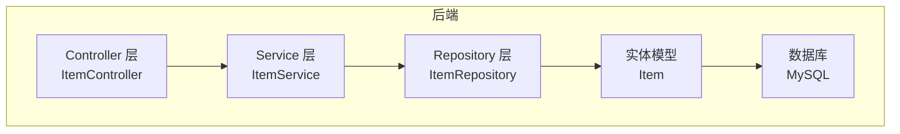
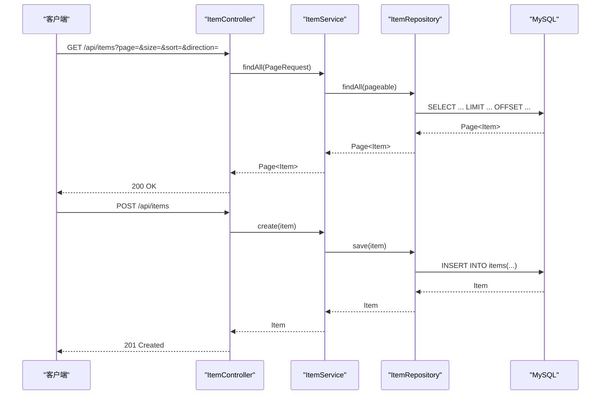
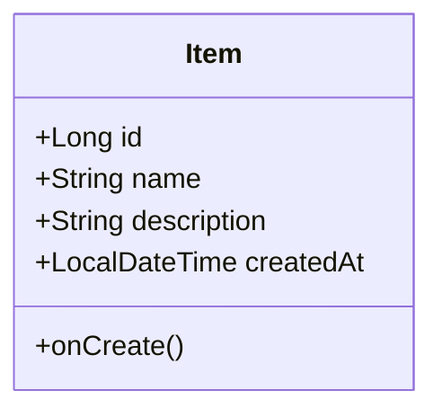
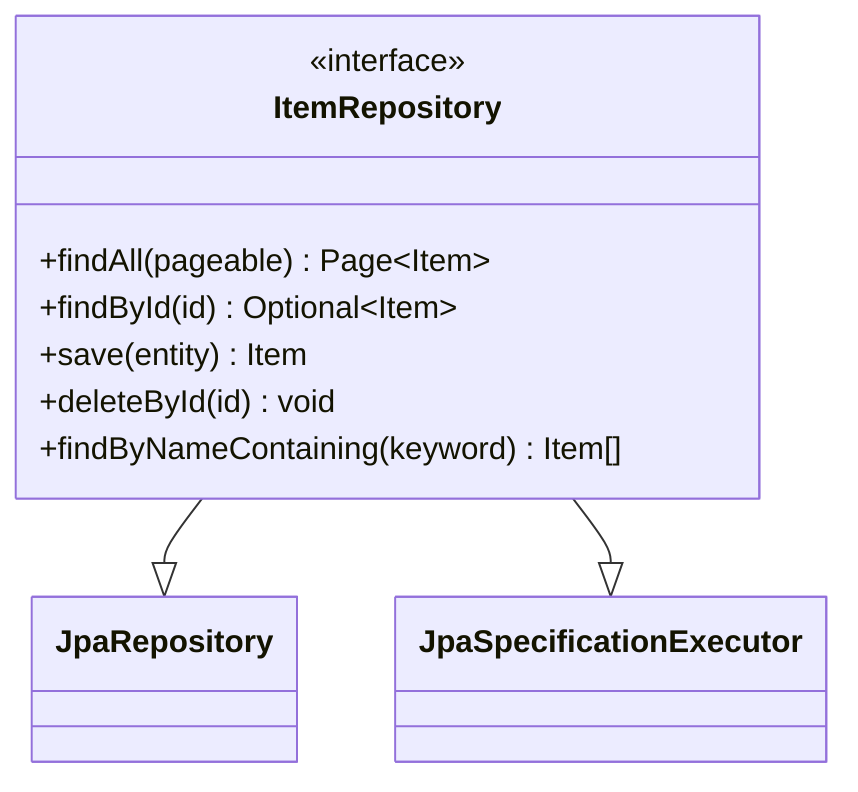
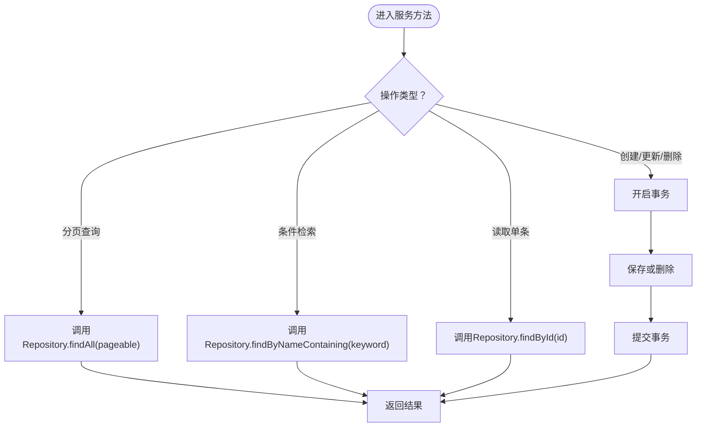
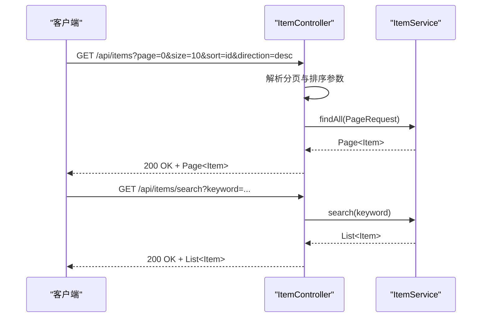
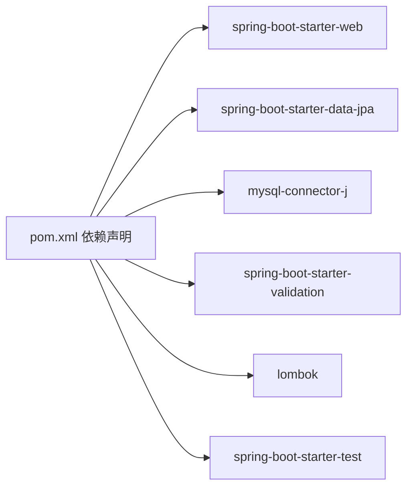

# 数据访问层设计

<cite>
**本文引用的文件**
- [DemoApplication.java](file://backend/src/main/java/com/example/demo/DemoApplication.java)
- [Item.java](file://backend/src/main/java/com/example/demo/entity/Item.java)
- [ItemRepository.java](file://backend/src/main/java/com/example/demo/repository/ItemRepository.java)
- [ItemService.java](file://backend/src/main/java/com/example/demo/service/ItemService.java)
- [ItemController.java](file://backend/src/main/java/com/example/demo/controller/ItemController.java)
- [application.yml](file://backend/src/main/resources/application.yml)
- [pom.xml](file://backend/pom.xml)
</cite>

## 目录
1. [简介](#简介)
2. [项目结构](#项目结构)
3. [核心组件](#核心组件)
4. [架构总览](#架构总览)
5. [详细组件分析](#详细组件分析)
6. [依赖分析](#依赖分析)
7. [性能考虑](#性能考虑)
8. [故障排查指南](#故障排查指南)
9. [结论](#结论)
10. [附录](#附录)

## 简介
本项目采用Spring Boot与Spring Data JPA构建，围绕数据访问层（Repository）模式进行设计，提供标准的CRUD能力、分页查询、排序、条件检索以及基础事务管理。本文档系统性阐述数据访问层的架构设计、实现机制与最佳实践，覆盖以下主题：
- Spring Data JPA Repository模式的设计理念与实现
- 数据访问接口定义、查询方法命名规范与自定义查询
- 分页查询、排序处理与批量操作
- 事务管理、连接池与性能优化策略
- 实体关系映射、级联与延迟加载
- 测试方法与调试技巧
- 查询优化建议与示例路径

## 项目结构
后端采用经典的分层架构：Controller（HTTP接口）、Service（业务逻辑）、Repository（数据访问）、Entity（领域模型）。数据源通过JPA/Hibernate持久化到MySQL数据库。

图表来源
- [ItemController.java:15-59](file://backend/src/main/java/com/example/demo/controller/ItemController.java#L15-L59)
- [ItemService.java:13-50](file://backend/src/main/java/com/example/demo/service/ItemService.java#L13-L50)
- [ItemRepository.java:1-13](file://backend/src/main/java/com/example/demo/repository/ItemRepository.java#L1-L13)
- [Item.java:1-30](file://backend/src/main/java/com/example/demo/entity/Item.java#L1-L30)

章节来源
- [DemoApplication.java:1-13](file://backend/src/main/java/com/example/demo/DemoApplication.java#L1-L13)
- [pom.xml:24-52](file://backend/pom.xml#L24-L52)
- [application.yml:1-18](file://backend/src/main/resources/application.yml#L1-L18)

## 核心组件
- 应用入口：Spring Boot启动类负责应用上下文初始化与自动装配。
- 控制器：提供REST接口，封装分页、排序参数，调用服务层。
- 服务层：组合业务规则与事务边界，协调Repository执行数据操作。
- Repository层：基于Spring Data JPA扩展JpaRepository与JpaSpecificationExecutor，提供标准CRUD与条件查询。
- 实体模型：使用JPA注解映射表结构，包含字段约束与生命周期回调。

章节来源
- [DemoApplication.java:6-12](file://backend/src/main/java/com/example/demo/DemoApplication.java#L6-L12)
- [ItemController.java:15-59](file://backend/src/main/java/com/example/demo/controller/ItemController.java#L15-L59)
- [ItemService.java:13-50](file://backend/src/main/java/com/example/demo/service/ItemService.java#L13-L50)
- [ItemRepository.java:9-12](file://backend/src/main/java/com/example/demo/repository/ItemRepository.java#L9-L12)
- [Item.java:7-28](file://backend/src/main/java/com/example/demo/entity/Item.java#L7-L28)

## 架构总览
下图展示从HTTP请求到数据库的完整调用链路与职责划分。

图表来源
- [ItemController.java:23-57](file://backend/src/main/java/com/example/demo/controller/ItemController.java#L23-L57)
- [ItemService.java:19-48](file://backend/src/main/java/com/example/demo/service/ItemService.java#L19-L48)
- [ItemRepository.java:9-12](file://backend/src/main/java/com/example/demo/repository/ItemRepository.java#L9-L12)

## 详细组件分析

### 实体模型：Item
- 表映射：实体类通过注解映射到数据库表，并设置主键生成策略。
- 字段约束：对必填字段与长度进行约束，保证数据一致性。
- 生命周期回调：在持久化前自动填充创建时间字段。

图表来源
- [Item.java:10-28](file://backend/src/main/java/com/example/demo/entity/Item.java#L10-L28)

章节来源
- [Item.java:7-28](file://backend/src/main/java/com/example/demo/entity/Item.java#L7-L28)

### 数据访问接口：ItemRepository
- 继承JpaRepository：获得标准CRUD与分页查询能力。
- 继承JpaSpecificationExecutor：支持动态条件查询（可扩展）。
- 自定义查询：提供按名称关键字模糊匹配的方法，遵循Spring Data JPA命名规范。

图表来源
- [ItemRepository.java:9-12](file://backend/src/main/java/com/example/demo/repository/ItemRepository.java#L9-L12)

章节来源
- [ItemRepository.java:9-12](file://backend/src/main/java/com/example/demo/repository/ItemRepository.java#L9-L12)

### 服务层：ItemService
- 分页与排序：接收Pageable参数，委托Repository执行分页查询。
- 条件查询：封装自定义查询方法，提供关键词检索。
- 事务管理：对创建、更新、删除等写操作标注@Transactional，确保ACID语义。
- 错误处理：未找到资源时抛出运行时异常，便于上层统一处理。

图表来源
- [ItemService.java:19-48](file://backend/src/main/java/com/example/demo/service/ItemService.java#L19-L48)

章节来源
- [ItemService.java:13-50](file://backend/src/main/java/com/example/demo/service/ItemService.java#L13-L50)

### 控制器：ItemController
- REST接口：提供列表、搜索、详情、创建、更新、删除等端点。
- 分页与排序：解析分页参数，构造PageRequest与Sort对象传入服务层。
- 响应状态：根据操作类型返回合适的HTTP状态码。

图表来源
- [ItemController.java:23-36](file://backend/src/main/java/com/example/demo/controller/ItemController.java#L23-L36)
- [ItemService.java:19-25](file://backend/src/main/java/com/example/demo/service/ItemService.java#L19-L25)

章节来源
- [ItemController.java:15-59](file://backend/src/main/java/com/example/demo/controller/ItemController.java#L15-L59)

### 查询方法命名规范与自定义查询
- 命名规范：Repository接口中以关键字开头的方法遵循Spring Data JPA约定，如“findByNameContaining”用于模糊匹配。
- 动态查询：可通过JpaSpecificationExecutor扩展复杂条件查询；当前示例仅使用简单命名查询。
- 自定义SQL/HQL：可在Repository中声明@Query注解实现复杂查询（本项目未涉及）。

章节来源
- [ItemRepository.java:11-11](file://backend/src/main/java/com/example/demo/repository/ItemRepository.java#L11-L11)

### 分页查询与排序处理
- 分页参数：控制器解析page、size参数，构造PageRequest；排序参数解析方向与字段，构造Sort。
- 服务层传递：将PageRequest直接传入Repository的findAll方法，由JPA/Hibernate生成分页SQL。
- 排序字段：支持多字段排序与方向控制，确保前端可灵活排序。

章节来源
- [ItemController.java:24-30](file://backend/src/main/java/com/example/demo/controller/ItemController.java#L24-L30)
- [ItemService.java:19-21](file://backend/src/main/java/com/example/demo/service/ItemService.java#L19-L21)

### 批量操作实现
- 当前实现：未提供批量插入/更新/删除的专用方法。
- 建议实现：可在Repository中新增批量方法或通过原生SQL/存储过程提升吞吐；服务层配合事务批处理。

章节来源
- [ItemRepository.java:9-12](file://backend/src/main/java/com/example/demo/repository/ItemRepository.java#L9-L12)
- [ItemService.java:32-48](file://backend/src/main/java/com/example/demo/service/ItemService.java#L32-L48)

### 事务管理
- 注解式事务：服务层对写操作使用@Transactional，确保失败回滚与一致性。
- 传播行为：默认传播行为适用于单服务内操作；跨服务或外部调用需关注事务边界。
- 异常处理：未捕获异常触发回滚，已捕获异常需谨慎决定是否回滚。

章节来源
- [ItemService.java:32-48](file://backend/src/main/java/com/example/demo/service/ItemService.java#L32-L48)

### 连接池与数据库配置
- 数据源：通过application.yml配置MySQL连接参数（URL、用户名、密码、驱动）。
- JPA/Hibernate：启用DDL自动更新、显示SQL、格式化SQL、指定方言。
- 连接池：默认使用HikariCP（Spring Boot Starter Data JPA已包含），可通过额外属性优化。

章节来源
- [application.yml:4-17](file://backend/src/main/resources/application.yml#L4-L17)
- [pom.xml:29-37](file://backend/pom.xml#L29-L37)

## 依赖分析
- Spring Boot Starter Web：提供Web MVC与嵌入式Tomcat。
- Spring Boot Starter Data JPA：提供JPA、Hibernate与Spring Data JPA支持。
- MySQL Connector/J：数据库驱动。
- Lombok：减少样板代码（getter/setter/构造器）。
- Spring Boot Starter Test：单元测试与集成测试支持。

图表来源
- [pom.xml:24-52](file://backend/pom.xml#L24-L52)

章节来源
- [pom.xml:24-52](file://backend/pom.xml#L24-L52)

## 性能考虑
- SQL日志：开启show-sql与format_sql便于诊断慢查询与重复查询。
- DDL策略：开发环境可使用update，生产环境建议显式迁移脚本。
- 索引与查询：对常用过滤与排序字段建立索引；避免N+1查询（延迟加载与JOIN策略）。
- 分页与排序：合理设置分页大小，避免超大offset；对排序字段建立复合索引。
- 连接池：调整连接池大小、空闲超时、最大生命周期等参数（在application.yml中添加相应属性）。
- 缓存：对只读数据引入二级缓存（需额外配置与注解）。

章节来源
- [application.yml:11-17](file://backend/src/main/resources/application.yml#L11-L17)

## 故障排查指南
- 数据库连接问题：检查URL、用户名、密码与驱动类名是否正确。
- 实体映射问题：确认实体类注解与数据库表结构一致，DDL策略是否允许自动更新。
- 查询异常：查看SQL日志定位具体查询；核对查询方法命名与参数类型。
- 事务问题：确保写操作方法被@Transactional标注且未被同类内部调用屏蔽代理；检查异常类型与回滚规则。
- 分页排序异常：确认排序字段存在于实体中，且与数据库列名一致。

章节来源
- [application.yml:4-17](file://backend/src/main/resources/application.yml#L4-L17)
- [ItemService.java:32-48](file://backend/src/main/java/com/example/demo/service/ItemService.java#L32-L48)

## 结论
本项目以Spring Data JPA为核心，实现了清晰的分层架构与标准的数据访问能力。通过Repository模式，结合命名查询与分页排序，满足了基本的CRUD与检索需求。建议在生产环境中完善索引、连接池与缓存配置，并扩展批量操作与复杂查询能力，以进一步提升性能与可维护性。

## 附录
- 实际代码示例与查询优化建议可参考以下路径：
  - [控制器分页与排序参数解析:24-30](file://backend/src/main/java/com/example/demo/controller/ItemController.java#L24-L30)
  - [服务层分页查询与条件查询:19-25](file://backend/src/main/java/com/example/demo/service/ItemService.java#L19-L25)
  - [Repository标准CRUD与自定义查询:9-12](file://backend/src/main/java/com/example/demo/repository/ItemRepository.java#L9-L12)
  - [实体字段映射与生命周期回调:10-28](file://backend/src/main/java/com/example/demo/entity/Item.java#L10-L28)
  - [数据库连接与JPA配置:4-17](file://backend/src/main/resources/application.yml#L4-L17)