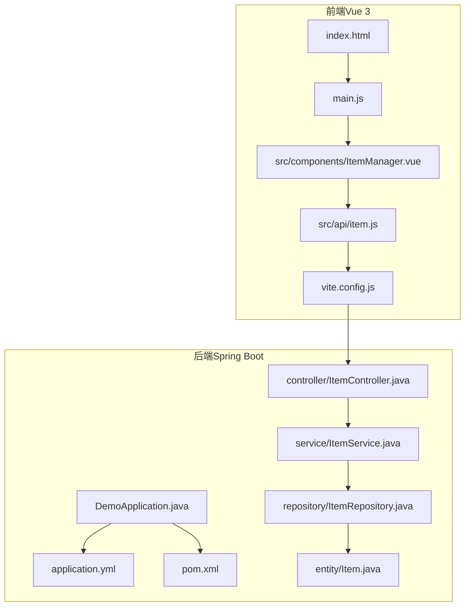
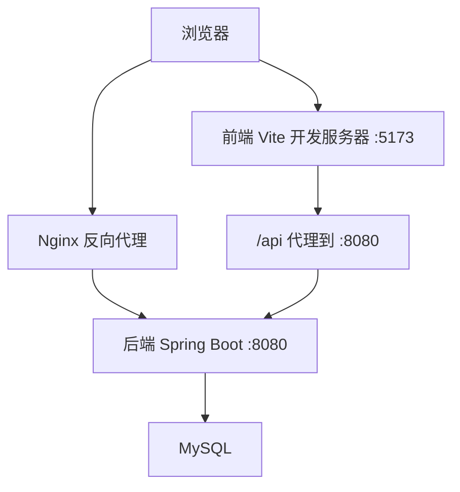
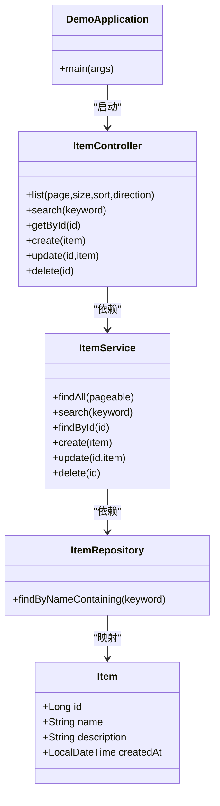
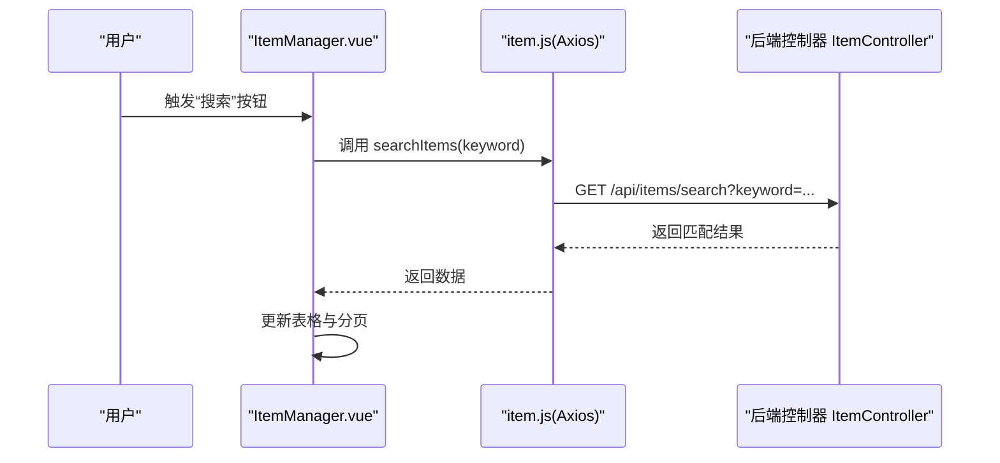
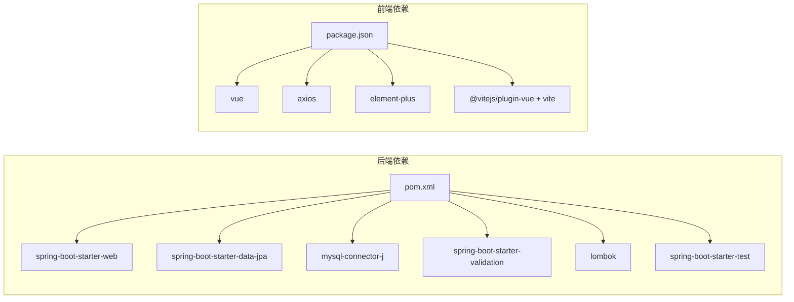

# 快速开始

<cite>
**本文引用的文件**
- [pom.xml](file://backend/pom.xml)
- [application.yml](file://backend/src/main/resources/application.yml)
- [DemoApplication.java](file://backend/src/main/java/com/example/demo/DemoApplication.java)
- [ItemController.java](file://backend/src/main/java/com/example/demo/controller/ItemController.java)
- [ItemService.java](file://backend/src/main/java/com/example/demo/service/ItemService.java)
- [ItemRepository.java](file://backend/src/main/java/com/example/demo/repository/ItemRepository.java)
- [Item.java](file://backend/src/main/java/com/example/demo/entity/Item.java)
- [package.json](file://frontend/package.json)
- [vite.config.js](file://frontend/vite.config.js)
- [item.js](file://frontend/src/api/item.js)
- [ItemManager.vue](file://frontend/src/components/ItemManager.vue)
- [index.html](file://frontend/index.html)
- [README.deploy.md](file://README.deploy.md)
</cite>

## 目录
1. [简介](#简介)
2. [项目结构](#项目结构)
3. [核心组件](#核心组件)
4. [架构总览](#架构总览)
5. [详细组件分析](#详细组件分析)
6. [依赖分析](#依赖分析)
7. [性能考虑](#性能考虑)
8. [故障排除指南](#故障排除指南)
9. [结论](#结论)
10. [附录](#附录)

## 简介
本指南面向希望快速搭建并运行该 Java CRUD 应用的开发者，覆盖从环境准备、依赖安装、数据库配置到前后端启动与联调的全流程。项目采用 Spring Boot（后端）+ Vue 3（前端）+ MySQL 的技术栈，提供本地开发与生产部署参考路径，帮助新手顺利起步，同时为有经验的开发者提供高效设置方法。

## 项目结构
项目采用前后端分离架构：
- 后端：Spring Boot 应用，使用 JPA/Hibernate 访问 MySQL，暴露 REST API。
- 前端：Vue 3 应用，使用 Element Plus 组件库，通过 Vite 开发服务器运行，开发时通过代理将 /api 请求转发到后端。

图表来源
- [index.html:1-14](file://frontend/index.html#L1-L14)
- [vite.config.js:1-16](file://frontend/vite.config.js#L1-L16)
- [item.js:1-31](file://frontend/src/api/item.js#L1-L31)
- [ItemManager.vue:1-220](file://frontend/src/components/ItemManager.vue#L1-L220)
- [DemoApplication.java:1-13](file://backend/src/main/java/com/example/demo/DemoApplication.java#L1-L13)
- [application.yml:1-18](file://backend/src/main/resources/application.yml#L1-L18)
- [ItemController.java:1-59](file://backend/src/main/java/com/example/demo/controller/ItemController.java#L1-L59)
- [ItemService.java:1-50](file://backend/src/main/java/com/example/demo/service/ItemService.java#L1-L50)
- [ItemRepository.java:1-13](file://backend/src/main/java/com/example/demo/repository/ItemRepository.java#L1-L13)
- [Item.java:1-30](file://backend/src/main/java/com/example/demo/entity/Item.java#L1-L30)
- [pom.xml:1-71](file://backend/pom.xml#L1-L71)

章节来源
- [pom.xml:1-71](file://backend/pom.xml#L1-L71)
- [application.yml:1-18](file://backend/src/main/resources/application.yml#L1-L18)
- [package.json:1-21](file://frontend/package.json#L1-L21)
- [vite.config.js:1-16](file://frontend/vite.config.js#L1-L16)

## 核心组件
- 后端核心：Spring Boot 应用入口负责启动，JPA 实体映射 MySQL 表，Repository 提供数据访问，Service 封装业务逻辑，Controller 暴露 REST 接口。
- 前端核心：Vite 开发服务器，Element Plus UI 组件，Axios 封装 API 请求，页面组件负责分页、搜索、增删改查交互。

章节来源
- [DemoApplication.java:1-13](file://backend/src/main/java/com/example/demo/DemoApplication.java#L1-L13)
- [Item.java:1-30](file://backend/src/main/java/com/example/demo/entity/Item.java#L1-L30)
- [ItemRepository.java:1-13](file://backend/src/main/java/com/example/demo/repository/ItemRepository.java#L1-L13)
- [ItemService.java:1-50](file://backend/src/main/java/com/example/demo/service/ItemService.java#L1-L50)
- [ItemController.java:1-59](file://backend/src/main/java/com/example/demo/controller/ItemController.java#L1-L59)
- [ItemManager.vue:1-220](file://frontend/src/components/ItemManager.vue#L1-L220)
- [item.js:1-31](file://frontend/src/api/item.js#L1-L31)

## 架构总览
前后端通过 /api 前缀进行通信，开发时前端通过 Vite 代理将 /api 请求转发到后端。生产部署时，Nginx 作为反向代理将 /api 转发到后端服务。

图表来源
- [vite.config.js:1-16](file://frontend/vite.config.js#L1-L16)
- [application.yml:1-18](file://backend/src/main/resources/application.yml#L1-L18)
- [README.deploy.md:277-312](file://README.deploy.md#L277-L312)

## 详细组件分析

### 后端：Spring Boot 应用
- 启动类负责应用引导，配置文件定义端口、数据库连接、JPA 行为等。
- 控制器提供分页列表、搜索、详情、创建、更新、删除接口。
- 服务层封装业务逻辑，事务性地处理数据变更。
- 仓储层基于 Spring Data JPA，提供分页查询与关键字搜索。
- 实体映射 items 表，包含自增主键、名称、描述、创建时间字段。

图表来源
- [DemoApplication.java:1-13](file://backend/src/main/java/com/example/demo/DemoApplication.java#L1-L13)
- [ItemController.java:1-59](file://backend/src/main/java/com/example/demo/controller/ItemController.java#L1-L59)
- [ItemService.java:1-50](file://backend/src/main/java/com/example/demo/service/ItemService.java#L1-L50)
- [ItemRepository.java:1-13](file://backend/src/main/java/com/example/demo/repository/ItemRepository.java#L1-L13)
- [Item.java:1-30](file://backend/src/main/java/com/example/demo/entity/Item.java#L1-L30)

章节来源
- [DemoApplication.java:1-13](file://backend/src/main/java/com/example/demo/DemoApplication.java#L1-L13)
- [ItemController.java:1-59](file://backend/src/main/java/com/example/demo/controller/ItemController.java#L1-L59)
- [ItemService.java:1-50](file://backend/src/main/java/com/example/demo/service/ItemService.java#L1-L50)
- [ItemRepository.java:1-13](file://backend/src/main/java/com/example/demo/repository/ItemRepository.java#L1-L13)
- [Item.java:1-30](file://backend/src/main/java/com/example/demo/entity/Item.java#L1-L30)

### 前端：Vue 3 应用
- 通过 Vite 提供开发服务器与代理，开发时将 /api 请求转发到后端。
- 使用 Element Plus 构建管理界面，实现分页、搜索、新增/编辑弹窗、删除确认。
- Axios 封装请求，统一 base URL 为 /api/items，便于与后端对接。
- 页面组件在挂载时加载数据，支持关键词搜索与分页切换。

图表来源
- [ItemManager.vue:138-154](file://frontend/src/components/ItemManager.vue#L138-L154)
- [item.js:12-14](file://frontend/src/api/item.js#L12-L14)
- [ItemController.java:33-36](file://backend/src/main/java/com/example/demo/controller/ItemController.java#L33-L36)

章节来源
- [vite.config.js:1-16](file://frontend/vite.config.js#L1-L16)
- [ItemManager.vue:1-220](file://frontend/src/components/ItemManager.vue#L1-L220)
- [item.js:1-31](file://frontend/src/api/item.js#L1-L31)

## 依赖分析
- 后端依赖：Spring Web、Spring Data JPA、MySQL Connector、校验、Lombok、测试。
- 前端依赖：Vue 3、Axios、Element Plus、Vite 插件与构建工具。
- 版本与工具链：后端 Java 17，前端 Node.js（用于构建），后端使用 Maven 管理依赖。

图表来源
- [pom.xml:24-51](file://backend/pom.xml#L24-L51)
- [package.json:11-19](file://frontend/package.json#L11-L19)

章节来源
- [pom.xml:1-71](file://backend/pom.xml#L1-L71)
- [package.json:1-21](file://frontend/package.json#L1-L21)

## 性能考虑
- 开发阶段：Vite 默认端口 5173，后端默认端口 8080，代理 /api 到后端，避免跨域问题。
- 生产阶段：Nginx 反向代理静态资源与 /api，后端通过 systemd 管理，JVM 堆内存按 2GB 内存机器建议限制。
- 数据库：生产配置中关闭 SQL 输出，使用方言与自动建表策略需谨慎，上线后建议改为校验或迁移工具管理。

章节来源
- [vite.config.js:1-16](file://frontend/vite.config.js#L1-L16)
- [application.yml:1-18](file://backend/src/main/resources/application.yml#L1-L18)
- [README.deploy.md:183-206](file://README.deploy.md#L183-L206)

## 故障排除指南
- 启动后端报数据库连接错误
  - 检查数据库是否已安装并启动，确认 application.yml 中的数据库 URL、用户名、密码与实际一致。
  - 若使用生产配置，注意生产配置中的用户名与密码与开发配置不同。
- 前端无法访问后端接口
  - 确认 Vite 代理配置正确，将 /api 代理到后端地址。
  - 确认后端已启动且端口未被占用。
- 前端页面空白或组件不显示
  - 检查 index.html 引入的入口脚本路径是否正确。
  - 确认 Element Plus 已正确安装并在页面中使用。
- 生产部署后访问异常
  - 检查 Nginx 是否正确配置反向代理到后端。
  - 检查后端 systemd 服务是否正常运行，查看日志定位问题。
- 数据库权限或字符集问题
  - 确保数据库字符集与连接参数一致，必要时调整连接字符串参数。
- 端口占用或安全组限制
  - 开发阶段检查 5173（前端）与 8080（后端）端口占用情况。
  - 生产阶段检查安全组放行 80/443 等端口，后端调试端口按需放行。

章节来源
- [application.yml:1-18](file://backend/src/main/resources/application.yml#L1-L18)
- [vite.config.js:1-16](file://frontend/vite.config.js#L1-L16)
- [index.html:1-14](file://frontend/index.html#L1-L14)
- [README.deploy.md:377-397](file://README.deploy.md#L377-L397)

## 结论
通过本快速开始指南，您可以完成从环境准备到本地开发与生产部署的全流程。建议先在本地完成数据库与后端启动、前端联调，再参考生产部署文档进行上线。遇到问题时，优先核对配置文件与端口占用，结合日志进行排查。

## 附录

### 环境要求
- 后端：Java 17（项目属性已指定）
- 前端：Node.js（用于构建与开发）
- 数据库：MySQL（后端使用 JPA/Hibernate）

章节来源
- [pom.xml:20-22](file://backend/pom.xml#L20-L22)
- [package.json:1-21](file://frontend/package.json#L1-L21)

### 依赖安装步骤
- 后端：使用 Maven 管理依赖，确保网络可访问中央仓库。
- 前端：使用 npm 安装依赖，构建与预览脚本已在 package.json 中定义。

章节来源
- [pom.xml:24-51](file://backend/pom.xml#L24-L51)
- [package.json:6-10](file://frontend/package.json#L6-L10)

### 数据库配置与初始化
- 开发配置：application.yml 中已内置数据库连接参数与 JPA 设置，首次启动会根据自动建表策略更新数据库结构。
- 生产配置：README 中提供了生产配置示例，包含数据库连接、日志输出与 profile 激活方式。

章节来源
- [application.yml:1-18](file://backend/src/main/resources/application.yml#L1-L18)
- [README.deploy.md:181-206](file://README.deploy.md#L181-L206)

### 应用启动流程（本地开发）
- 启动后端：运行 Spring Boot 应用入口类，监听 8080 端口。
- 启动前端：在前端目录执行开发命令，打开浏览器访问 Vite 默认端口。
- 联调：前端通过 /api 代理访问后端接口，完成 CRUD 功能验证。

章节来源
- [DemoApplication.java:1-13](file://backend/src/main/java/com/example/demo/DemoApplication.java#L1-L13)
- [vite.config.js:1-16](file://frontend/vite.config.js#L1-L16)
- [ItemController.java:1-59](file://backend/src/main/java/com/example/demo/controller/ItemController.java#L1-L59)

### 常见问题与解决方案
- 数据库连接失败：核对连接参数、数据库服务状态与权限。
- CORS 问题：开发阶段控制器已允许跨域，生产环境由 Nginx 处理。
- 前端构建失败：检查 Node.js 版本与网络可达性，清理缓存后重试。
- 生产服务不可用：检查 systemd 服务状态、日志与 Nginx 反向代理配置。

章节来源
- [ItemController.java:18-18](file://backend/src/main/java/com/example/demo/controller/ItemController.java#L18-L18)
- [README.deploy.md:377-397](file://README.deploy.md#L377-L397)