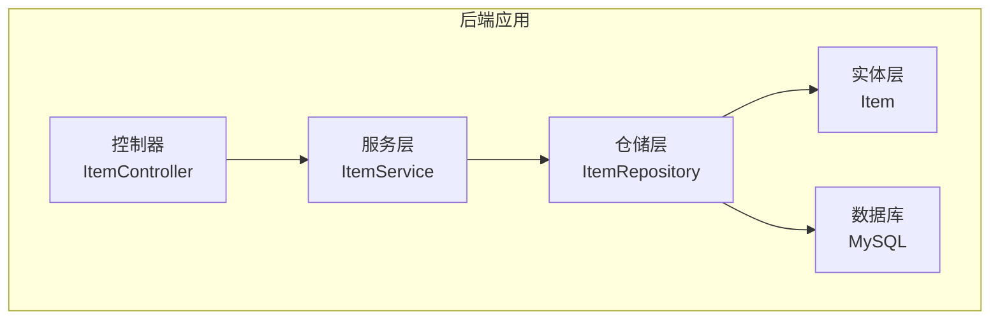
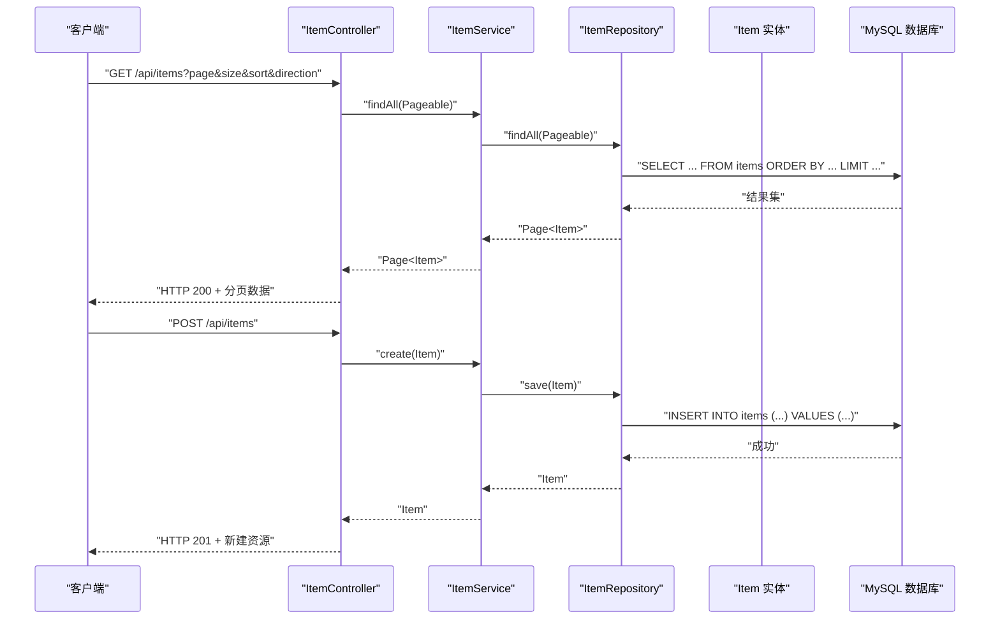
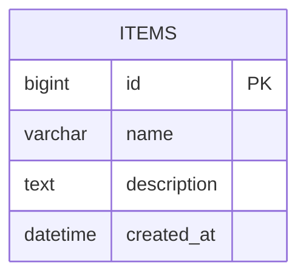
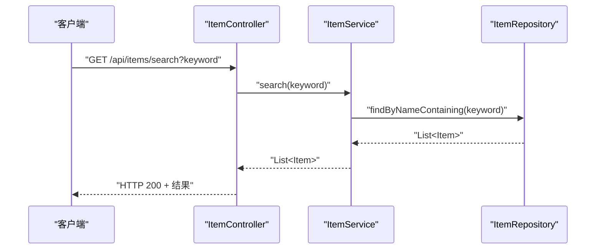
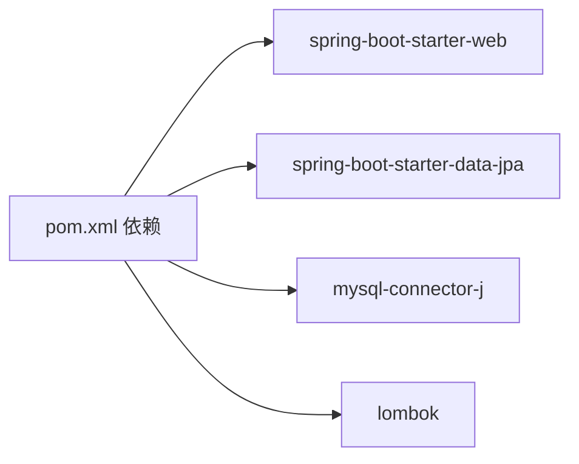

# 数据库设计

<cite>
**本文引用的文件**
- [Item.java](file://backend/src/main/java/com/example/demo/entity/Item.java)
- [ItemRepository.java](file://backend/src/main/java/com/example/demo/repository/ItemRepository.java)
- [ItemService.java](file://backend/src/main/java/com/example/demo/service/ItemService.java)
- [ItemController.java](file://backend/src/main/java/com/example/demo/controller/ItemController.java)
- [application.yml](file://backend/src/main/resources/application.yml)
- [pom.xml](file://backend/pom.xml)
- [README.deploy.md](file://README.deploy.md)
</cite>

## 目录
1. [简介](#简介)
2. [项目结构](#项目结构)
3. [核心组件](#核心组件)
4. [架构总览](#架构总览)
5. [详细组件分析](#详细组件分析)
6. [依赖分析](#依赖分析)
7. [性能考虑](#性能考虑)
8. [故障排查指南](#故障排查指南)
9. [结论](#结论)
10. [附录](#附录)

## 简介
本文件面向数据库设计与实现，围绕 Item 实体的数据库表结构进行系统化说明，涵盖字段定义、数据类型、约束与索引策略；解释 JPA 注解的使用方式与配置；文档化数据库连接与连接池配置、性能优化策略；提供数据迁移与版本管理建议、备份恢复方案；说明数据完整性与参照完整性；并给出查询优化与性能监控方法。本文所有技术细节均基于仓库中的实际代码与配置文件进行归纳总结。

## 项目结构
后端采用 Spring Boot + Spring Data JPA 的典型分层架构，数据库访问通过 JPA/Hibernate 实现，MySQL 作为持久化存储。核心文件分布如下：
- 实体层：Item 实体类定义了数据库表映射与字段约束
- 仓储层：ItemRepository 继承 JPA 基础接口，提供基础 CRUD 与自定义查询
- 服务层：ItemService 提供业务逻辑与事务控制
- 控制器层：ItemController 暴露 REST API，支持分页、排序、搜索
- 配置层：application.yml 定义数据源与 JPA 属性
- 构建层：pom.xml 引入 Spring Boot、Spring Data JPA、MySQL Connector/J、Lombok 等依赖

图表来源
- [ItemController.java:15-59](file://backend/src/main/java/com/example/demo/controller/ItemController.java#L15-L59)
- [ItemService.java:13-50](file://backend/src/main/java/com/example/demo/service/ItemService.java#L13-L50)
- [ItemRepository.java:9-13](file://backend/src/main/java/com/example/demo/repository/ItemRepository.java#L9-L13)
- [Item.java:8-29](file://backend/src/main/java/com/example/demo/entity/Item.java#L8-L29)

章节来源
- [ItemController.java:15-59](file://backend/src/main/java/com/example/demo/controller/ItemController.java#L15-L59)
- [ItemService.java:13-50](file://backend/src/main/java/com/example/demo/service/ItemService.java#L13-L50)
- [ItemRepository.java:9-13](file://backend/src/main/java/com/example/demo/repository/ItemRepository.java#L9-L13)
- [Item.java:8-29](file://backend/src/main/java/com/example/demo/entity/Item.java#L8-L29)
- [application.yml:4-17](file://backend/src/main/resources/application.yml#L4-L17)
- [pom.xml:24-51](file://backend/pom.xml#L24-L51)

## 核心组件
- Item 实体：定义了 items 表的结构与字段约束，包含主键、名称、描述、创建时间等字段，并通过生命周期回调设置默认值。
- ItemRepository：继承 JpaRepository 与 JpaSpecificationExecutor，提供基础 CRUD 与按名称模糊查询能力。
- ItemService：封装业务逻辑，提供分页查询、关键字搜索、增删改查等操作，并通过事务注解保证一致性。
- ItemController：暴露 REST API，支持分页、排序、搜索、CRUD 等功能。
- 数据源与 JPA 配置：application.yml 中配置了 MySQL 连接参数、JPA Hibernate 方言、DDL 自动更新策略与 SQL 输出格式化。

章节来源
- [Item.java:8-29](file://backend/src/main/java/com/example/demo/entity/Item.java#L8-L29)
- [ItemRepository.java:9-13](file://backend/src/main/java/com/example/demo/repository/ItemRepository.java#L9-L13)
- [ItemService.java:19-48](file://backend/src/main/java/com/example/demo/service/ItemService.java#L19-L48)
- [ItemController.java:23-57](file://backend/src/main/java/com/example/demo/controller/ItemController.java#L23-L57)
- [application.yml:4-17](file://backend/src/main/resources/application.yml#L4-L17)

## 架构总览
下图展示了从客户端到数据库的完整调用链路，以及 JPA/Hibernate 如何将实体映射到数据库表。

图表来源
- [ItemController.java:23-57](file://backend/src/main/java/com/example/demo/controller/ItemController.java#L23-L57)
- [ItemService.java:19-48](file://backend/src/main/java/com/example/demo/service/ItemService.java#L19-L48)
- [ItemRepository.java:9-13](file://backend/src/main/java/com/example/demo/repository/ItemRepository.java#L9-L13)
- [Item.java:8-29](file://backend/src/main/java/com/example/demo/entity/Item.java#L8-L29)

## 详细组件分析

### Item 实体与数据库表结构设计
- 表名映射：实体使用 @Table 注解映射到 items 表。
- 主键：@Id + @GeneratedValue(strategy = GenerationType.IDENTITY) 定义自增主键。
- 字段与约束：
  - 名称：非空、长度限制，适合存储商品或条目名称。
  - 描述：允许为空、长度限制，适合富文本或补充说明。
  - 创建时间：不可更新，插入时自动填充，便于审计与排序。
- 索引策略建议：
  - 主键索引：由自增主键自动建立。
  - 名称字段：若高频按名称检索或模糊匹配，建议在名称列建立普通索引。
  - 创建时间：若常用按时间排序或范围查询，可在 createdAt 建立索引。
- 外键关系：当前实体未定义外键，不涉及参照完整性约束。

图表来源
- [Item.java:12-28](file://backend/src/main/java/com/example/demo/entity/Item.java#L12-L28)

章节来源
- [Item.java:8-29](file://backend/src/main/java/com/example/demo/entity/Item.java#L8-L29)

### JPA 注解使用说明
- @Entity：声明该类为 JPA 实体，映射到数据库表。
- @Table(name = "items")：指定实体映射的表名。
- @Id：标识主键字段。
- @GeneratedValue(strategy = GenerationType.IDENTITY)：指定主键生成策略为数据库自增。
- @Column：定义字段映射的列属性，如 nullable、length、name、updatable 等。
- @PrePersist：在持久化前触发，用于设置默认值（如创建时间）。

章节来源
- [Item.java:8-29](file://backend/src/main/java/com/example/demo/entity/Item.java#L8-L29)

### 数据库连接与连接池配置
- 数据源配置：application.yml 中定义了 JDBC URL、用户名、密码、驱动类名。
- JPA 配置：Hibernate 方言、DDL 自动更新策略、SQL 输出与格式化。
- 连接池：Spring Boot 默认使用 HikariCP，可通过 spring.datasource.hikari.* 属性进一步优化（如连接超时、最大池大小、最小空闲等），当前仓库未显式配置，遵循默认行为。

章节来源
- [application.yml:4-17](file://backend/src/main/resources/application.yml#L4-L17)
- [pom.xml:29-37](file://backend/pom.xml#L29-L37)

### 查询与分页、搜索流程
- 分页与排序：控制器接收 page、size、sort、direction 参数，构造 PageRequest 并传递给服务层。
- 搜索：提供按名称模糊匹配的查询方法，返回列表。
- 事务：增删改查均通过 @Transactional 保证一致性。

图表来源
- [ItemController.java:33-36](file://backend/src/main/java/com/example/demo/controller/ItemController.java#L33-L36)
- [ItemService.java:23-25](file://backend/src/main/java/com/example/demo/service/ItemService.java#L23-L25)
- [ItemRepository.java:11](file://backend/src/main/java/com/example/demo/repository/ItemRepository.java#L11)

章节来源
- [ItemController.java:23-57](file://backend/src/main/java/com/example/demo/controller/ItemController.java#L23-L57)
- [ItemService.java:19-48](file://backend/src/main/java/com/example/demo/service/ItemService.java#L19-L48)
- [ItemRepository.java:9-13](file://backend/src/main/java/com/example/demo/repository/ItemRepository.java#L9-L13)

### 数据完整性与参照完整性
- 当前 Item 实体未定义外键，不存在跨表参照关系。
- 若未来扩展关联表（如 Category、Brand 等），应在实体中通过 @ManyToOne/@JoinColumn 等注解定义外键约束，并在数据库层面建立对应索引与约束。

章节来源
- [Item.java:8-29](file://backend/src/main/java/com/example/demo/entity/Item.java#L8-L29)

### 数据迁移脚本、版本管理与备份恢复
- 迁移与版本管理：当前配置使用 Hibernate DDL 自动更新（update），适用于开发环境。生产环境建议改为 validate 或使用 Flyway/Liquibase 管理 Schema 变更，确保变更可控、可回滚。
- 备份与恢复：部署文档提供了使用 mysqldump 进行备份的建议，并建议结合对象存储做异地备份；同时建议将自建 MySQL 升级为 RDS 以获得更高可用性与自动化备份能力。

章节来源
- [application.yml:12](file://backend/src/main/resources/application.yml#L12)
- [README.deploy.md:408](file://README.deploy.md#L408)
- [README.deploy.md:123-135](file://README.deploy.md#L123-L135)
- [README.deploy.md:407](file://README.deploy.md#L407)

## 依赖分析
- Spring Data JPA：提供基于接口的仓储抽象，简化数据库访问。
- MySQL Connector/J：MySQL 驱动，配合数据源配置使用。
- Lombok：减少样板代码，简化实体类的 getter/setter/toString 等。
- Spring Boot Starter Web：提供 REST API 能力。

图表来源
- [pom.xml:24-51](file://backend/pom.xml#L24-L51)

章节来源
- [pom.xml:24-51](file://backend/pom.xml#L24-L51)

## 性能考虑
- SQL 输出与格式化：开发环境开启 show-sql 与 format_sql 便于调试；生产环境建议关闭以降低日志开销。
- DDL 策略：开发环境使用 update，生产环境建议改为 validate 或引入迁移工具。
- 连接池：默认 HikariCP 已较优，可根据并发与连接数调整池大小、连接超时等参数。
- 索引：对高频查询字段（如名称、创建时间）建立索引；避免过度索引导致写入性能下降。
- 查询优化：优先使用分页与排序，避免一次性加载大量数据；对模糊查询使用合适的 LIKE 模式与索引策略。
- 监控：生产环境建议接入数据库慢查询日志与性能监控工具，持续观察热点 SQL。

章节来源
- [application.yml:11-17](file://backend/src/main/resources/application.yml#L11-L17)
- [README.deploy.md:408](file://README.deploy.md#L408)

## 故障排查指南
- 连接失败：检查 JDBC URL、用户名、密码与驱动类名是否正确；确认 MySQL 服务运行状态与网络连通性。
- DDL 不生效：确认 hibernate.ddl-auto 设置；生产环境应避免使用 update，改用 validate 或迁移工具。
- SQL 输出过多：生产环境关闭 show-sql 与 format_sql，减少日志开销。
- 性能问题：启用慢查询日志，定位热点 SQL；根据查询模式增加索引；评估分页与排序策略。
- 事务异常：确认 @Transactional 使用位置与传播行为；避免在同一个类内调用同类事务方法导致代理失效。

章节来源
- [application.yml:4-17](file://backend/src/main/resources/application.yml#L4-L17)
- [README.deploy.md:408](file://README.deploy.md#L408)

## 结论
本项目以简洁的 Item 实体为核心，通过 JPA/Hibernate 实现了标准的数据库映射与访问层。开发环境配置便于快速迭代，生产环境建议引入迁移工具与严格的 DDL 策略，并配套索引与监控手段提升性能与稳定性。未来如需扩展关联关系，应在实体层明确外键约束并在数据库层面落实索引与约束，确保数据完整性与查询效率。

## 附录
- 数据库表结构（基于 Item 实体）
  - 表名：items
  - 字段：
    - id：自增主键
    - name：非空，长度限制
    - description：可空，长度限制
    - created_at：不可更新，插入时自动填充
  - 索引建议：
    - 主键索引：默认存在
    - name：建议建立普通索引（若存在高频查询）
    - created_at：建议建立索引（若存在按时间排序/范围查询）

章节来源
- [Item.java:8-29](file://backend/src/main/java/com/example/demo/entity/Item.java#L8-L29)