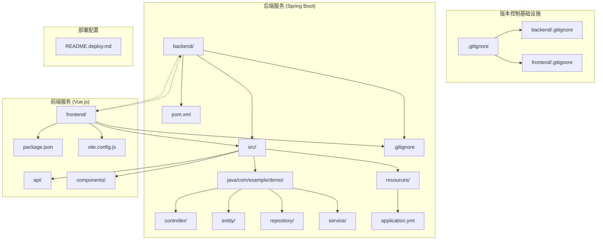
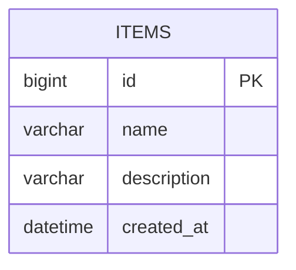
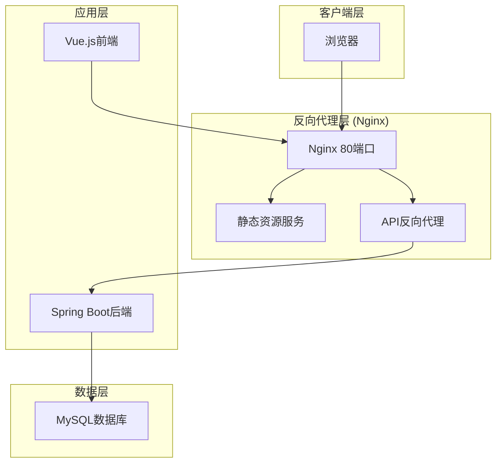
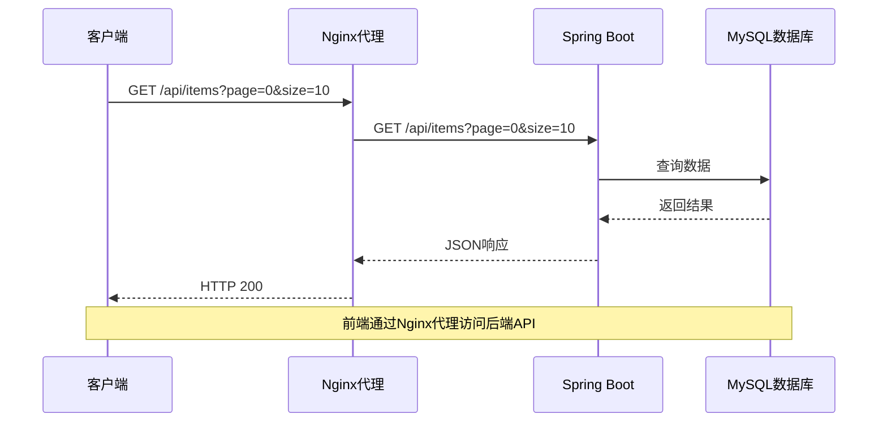
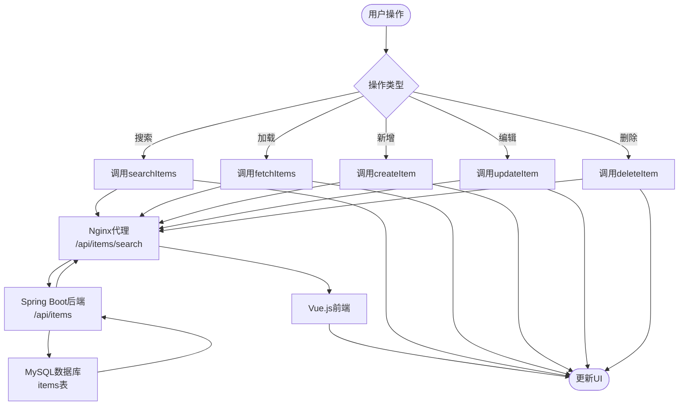
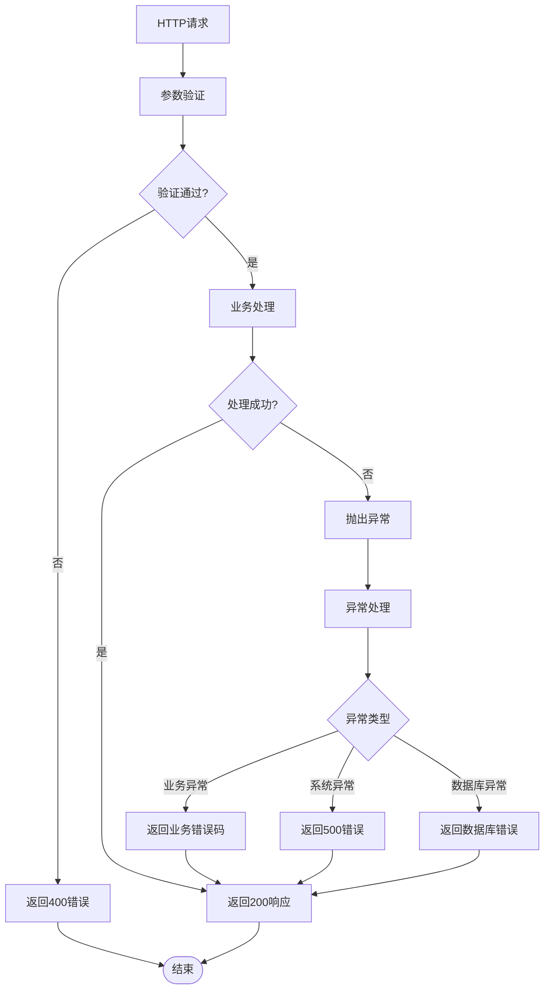
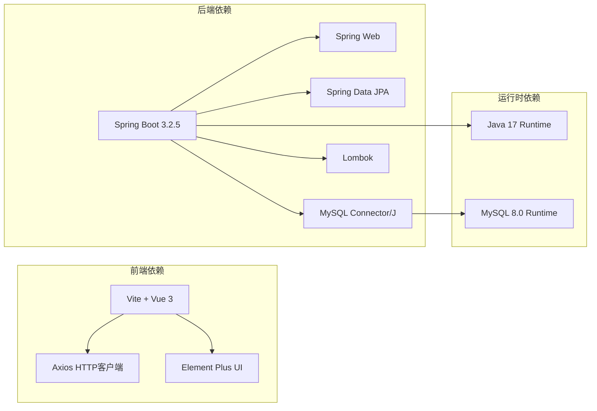

# Docker容器化部署

<cite>
**本文档引用的文件**
- [pom.xml](file://backend/pom.xml)
- [application.yml](file://backend/src/main/resources/application.yml)
- [ItemController.java](file://backend/src/main/java/com/example/demo/controller/ItemController.java)
- [Item.java](file://backend/src/main/java/com/example/demo/entity/Item.java)
- [package.json](file://frontend/package.json)
- [vite.config.js](file://frontend/vite.config.js)
- [item.js](file://frontend/src/api/item.js)
- [ItemManager.vue](file://frontend/src/components/ItemManager.vue)
- [README.deploy.md](file://README.deploy.md)
- [.gitignore](file://backend/.gitignore)
- [.gitignore](file://frontend/.gitignore)
</cite>

## 更新摘要
**变更内容**
- 新增Git版本控制基础设施章节，详细说明.gitignore配置和标准化的部署流程
- 更新项目结构图，反映版本控制文件的存在
- 增加版本控制最佳实践和代码管理建议
- 完善部署流程说明，强调版本控制在CI/CD中的作用

## 目录
1. [简介](#简介)
2. [项目结构](#项目结构)
3. [版本控制基础设施](#版本控制基础设施)
4. [核心组件](#核心组件)
5. [架构概览](#架构概览)
6. [详细组件分析](#详细组件分析)
7. [依赖关系分析](#依赖关系分析)
8. [性能考虑](#性能考虑)
9. [故障排除指南](#故障排除指南)
10. [结论](#结论)

## 简介

本文档提供了基于现有Spring Boot + Vue.js项目的完整Docker容器化部署方案。该应用是一个简单的CRUD演示程序，包含MySQL数据库、Spring Boot后端服务和Vue.js前端界面。文档详细说明了多阶段Docker构建、docker-compose编排、Nginx反向代理配置以及最佳实践。

**更新** 项目现已建立完整的Git版本控制基础设施，包括标准化的.gitignore配置和规范化的部署流程，为后续的容器化部署提供了可靠的版本管理基础。

## 项目结构

该项目采用前后端分离的架构设计，具有清晰的模块化组织，并配备了完整的版本控制系统：

**图表来源**
- [pom.xml:1-71](file://backend/pom.xml#L1-L71)
- [application.yml:1-18](file://backend/src/main/resources/application.yml#L1-L18)
- [package.json:1-21](file://frontend/package.json#L1-L21)
- [.gitignore:1-44](file://backend/.gitignore#L1-44)
- [.gitignore:1-43](file://frontend/.gitignore#L1-43)

**章节来源**
- [pom.xml:1-71](file://backend/pom.xml#L1-L71)
- [application.yml:1-18](file://backend/src/main/resources/application.yml#L1-L18)
- [package.json:1-21](file://frontend/package.json#L1-L21)
- [.gitignore:1-44](file://backend/.gitignore#L1-44)
- [.gitignore:1-43](file://frontend/.gitignore#L1-43)

## 版本控制基础设施

### Git忽略文件配置

项目建立了标准化的.gitignore配置，确保版本控制仓库的整洁性和安全性：

#### 后端.gitignore配置要点
- **Maven构建产物**：排除/target/目录，保留.mvn/wrapper/maven-wrapper.jar
- **IDE配置文件**：排除IntelliJ IDEA、Eclipse等开发工具配置
- **日志文件**：排除*.log和logs/目录
- **操作系统文件**：排除.DS_Store和Thumbs.db
- **编译文件**：排除*.class文件
- **本地配置**：排除application-local.yml和application-dev.yml等本地配置文件

#### 前端.gitignore配置要点
- **依赖包**：排除/node_modules/目录
- **构建输出**：排除/dist/和/dist-ssr/目录
- **IDE配置**：排除各种IDE的配置文件
- **日志文件**：排除npm、yarn、pnpm等包管理器的日志
- **环境文件**：排除.env和.env.local等环境配置
- **缓存文件**：排除/coverage/和.pnpm-store等缓存目录

**章节来源**
- [.gitignore:1-44](file://backend/.gitignore#L1-44)
- [.gitignore:1-43](file://frontend/.gitignore#L1-43)

### 版本控制最佳实践

**分支管理策略**：
- `main/master`：生产环境分支
- `develop`：开发环境分支
- `feature/*`：功能开发分支
- `hotfix/*`：紧急修复分支

**提交规范**：
- 使用清晰的提交信息格式
- 遵循Conventional Commits规范
- 每次提交只包含相关更改

**代码审查流程**：
- Pull Request必须经过至少一次代码审查
- 确保所有测试通过后再合并
- 保持分支的清洁和可追溯性

## 核心组件

### 后端服务 (Spring Boot)

后端采用Spring Boot 3.2.5框架，使用Java 17开发，集成了Spring Web、JPA、MySQL驱动和数据验证功能。

**主要技术栈特性：**
- Spring Boot Starter Web：提供RESTful API服务
- Spring Data JPA：ORM映射和数据库操作
- MySQL Connector/J：数据库连接驱动
- Lombok：简化实体类代码生成
- Spring Validation：参数验证

**数据库配置要点：**
- 默认使用localhost:3306连接MySQL
- 数据库名为demo_db
- 用户名和密码在application.yml中配置
- Hibernate自动DDL更新模式

**章节来源**
- [pom.xml:24-52](file://backend/pom.xml#L24-L52)
- [application.yml:4-17](file://backend/src/main/resources/application.yml#L4-L17)

### 前端服务 (Vue.js)

前端使用Vue 3.4.21配合Vite构建工具，提供现代化的用户界面。

**前端技术栈：**
- Vue 3：响应式前端框架
- Element Plus：UI组件库
- Axios：HTTP客户端
- Vite：现代构建工具

**开发服务器配置：**
- 开发端口：5173
- API代理：将/api前缀转发到http://localhost:8080
- 热重载：开发时自动刷新

**章节来源**
- [package.json:11-19](file://frontend/package.json#L11-L19)
- [vite.config.js:6-14](file://frontend/vite.config.js#L6-L14)

### 数据模型

应用使用简单的Item实体进行数据管理：

**图表来源**
- [Item.java:10-28](file://backend/src/main/java/com/example/demo/entity/Item.java#L10-L28)

**章节来源**
- [Item.java:1-30](file://backend/src/main/java/com/example/demo/entity/Item.java#L1-L30)

## 架构概览

基于现有部署方案，系统采用三层架构设计：

**图表来源**
- [README.deploy.md:17-38](file://README.deploy.md#L17-L38)

**章节来源**
- [README.deploy.md:17-38](file://README.deploy.md#L17-L38)

## 详细组件分析

### API接口设计

后端提供完整的CRUD操作接口：

**图表来源**
- [ItemController.java:23-36](file://backend/src/main/java/com/example/demo/controller/ItemController.java#L23-L36)
- [item.js:3-6](file://frontend/src/api/item.js#L3-L6)

**API端点规范：**
- GET `/api/items`：分页获取所有项目
- GET `/api/items/search`：按关键词搜索
- GET `/api/items/{id}`：根据ID获取单个项目
- POST `/api/items`：创建新项目
- PUT `/api/items/{id}`：更新项目
- DELETE `/api/items/{id}`：删除项目

**章节来源**
- [ItemController.java:15-58](file://backend/src/main/java/com/example/demo/controller/ItemController.java#L15-L58)
- [item.js:8-30](file://frontend/src/api/item.js#L8-L30)

### 数据流处理

前端与后端的数据交互流程：

**图表来源**
- [ItemManager.vue:121-136](file://frontend/src/components/ItemManager.vue#L121-L136)
- [ItemController.java:23-57](file://backend/src/main/java/com/example/demo/controller/ItemController.java#L23-L57)

**章节来源**
- [ItemManager.vue:87-218](file://frontend/src/components/ItemManager.vue#L87-L218)
- [ItemController.java:15-58](file://backend/src/main/java/com/example/demo/controller/ItemController.java#L15-L58)

### 错误处理机制

系统采用分层错误处理策略：

**章节来源**
- [ItemController.java:23-57](file://backend/src/main/java/com/example/demo/controller/ItemController.java#L23-L57)

## 依赖关系分析

### 技术栈依赖图

**图表来源**
- [pom.xml:24-51](file://backend/pom.xml#L24-L51)
- [package.json:11-19](file://frontend/package.json#L11-L19)

### 数据库连接配置

后端应用的数据库连接参数：

| 配置项 | 值 | 说明 |
|--------|-----|------|
| JDBC URL | jdbc:mysql://localhost:3306/demo_db | 数据库连接地址 |
| 用户名 | root | 数据库用户名 |
| 密码 | root | 数据库密码 |
| 驱动类 | com.mysql.cj.jdbc.Driver | MySQL驱动 |
| 时区 | Asia/Shanghai | 时区设置 |
| 字符编码 | utf-8 | 字符集 |

**章节来源**
- [application.yml:5-9](file://backend/src/main/resources/application.yml#L5-L9)

## 性能考虑

### 内存优化策略

基于2GB内存的服务器配置，系统采用了多项内存优化措施：

**MySQL优化配置：**
- innodb_buffer_pool_size: 256M
- max_connections: 50
- performance_schema: OFF

**JVM内存限制：**
- 最小堆内存: 256M
- 最大堆内存: 512M

### 缓存策略

**Nginx静态资源缓存：**
- JS/CSS文件: 7天缓存
- 图片资源: 7天缓存
- 动态内容: 不缓存

**前端构建优化：**
- 生产环境构建
- 代码分割
- 资源压缩

## 故障排除指南

### 常见问题诊断

**数据库连接问题：**
1. 检查MySQL服务状态
2. 验证数据库凭据
3. 确认网络连通性
4. 查看连接池配置

**API接口问题：**
1. 检查后端服务状态
2. 验证CORS配置
3. 查看请求日志
4. 确认端口映射

**前端访问问题：**
1. 检查Nginx配置
2. 验证API代理设置
3. 查看浏览器开发者工具
4. 确认静态资源路径

### 日志监控

**后端日志位置：**
- 应用日志: /opt/demo/logs/app.log
- 系统日志: journalctl -u demo-backend

**前端日志：**
- 浏览器控制台
- Nginx访问日志: /var/log/nginx/demo-access.log

**章节来源**
- [README.deploy.md:377-397](file://README.deploy.md#L377-L397)

## 结论

本Docker容器化部署方案基于现有的阿里云ECS部署经验，提供了完整的微服务架构解决方案。通过容器化部署，可以实现：

1. **环境一致性**：确保开发、测试、生产环境的一致性
2. **资源隔离**：每个服务独立运行，互不干扰
3. **弹性扩展**：支持水平扩展和负载均衡
4. **快速部署**：标准化的构建和部署流程
5. **运维简化**：统一的监控和日志管理

**更新** 项目现已建立完善的Git版本控制基础设施，为容器化部署提供了可靠的基础。版本控制文件的标准化配置确保了：
- 开发环境的整洁性，避免不必要的文件被提交
- 配置文件的安全性，敏感信息不会泄露到版本库
- 部署流程的规范化，便于团队协作和持续集成

建议在生产环境中进一步完善：
- 使用Docker Compose进行服务编排
- 配置健康检查和自动重启
- 实施CI/CD流水线
- 部署监控和告警系统
- 实现数据库备份和恢复策略
- 建立完整的版本发布和回滚机制