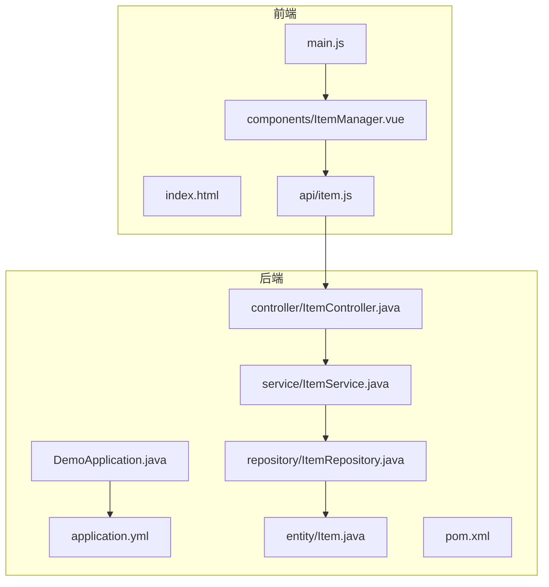
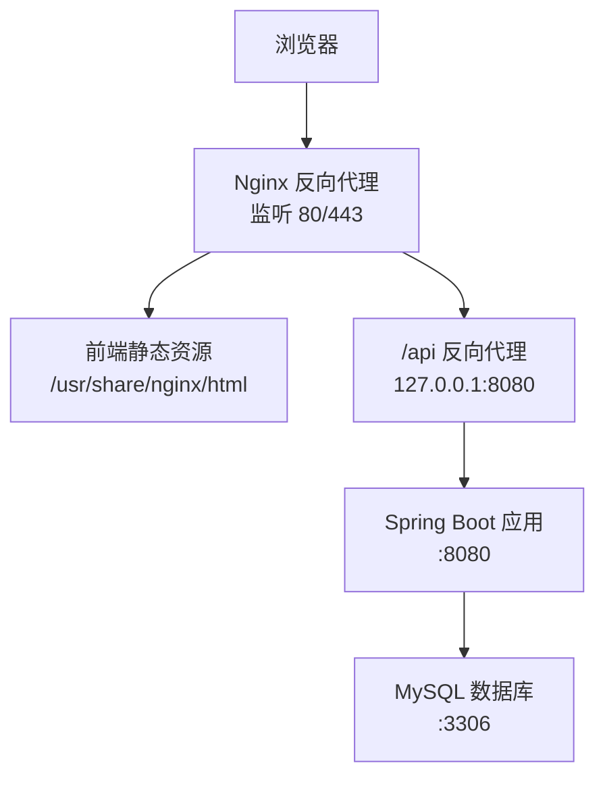
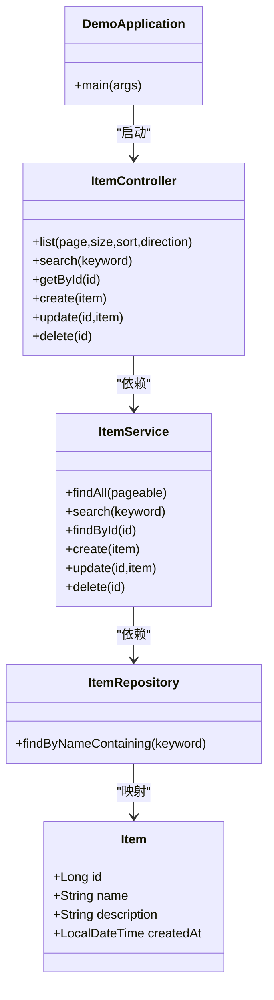
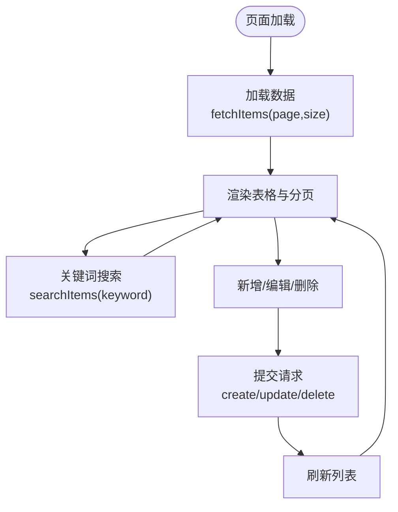
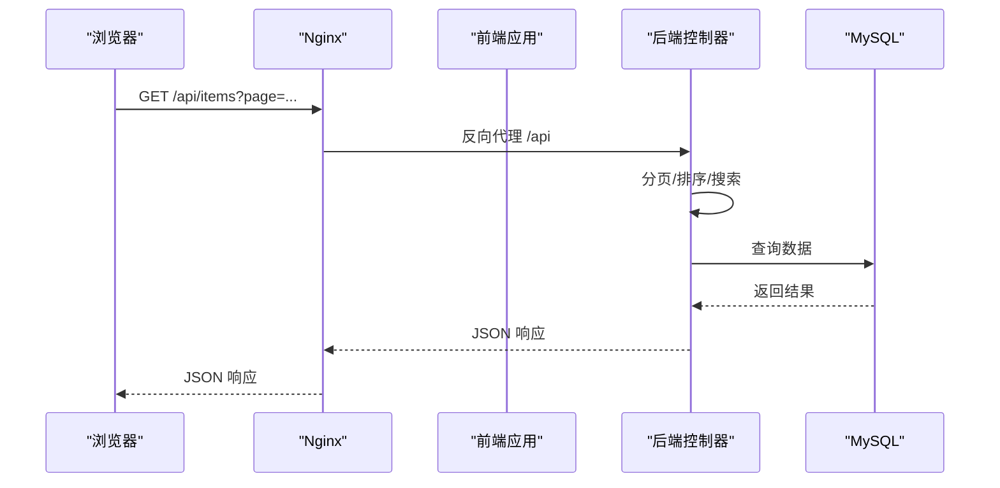
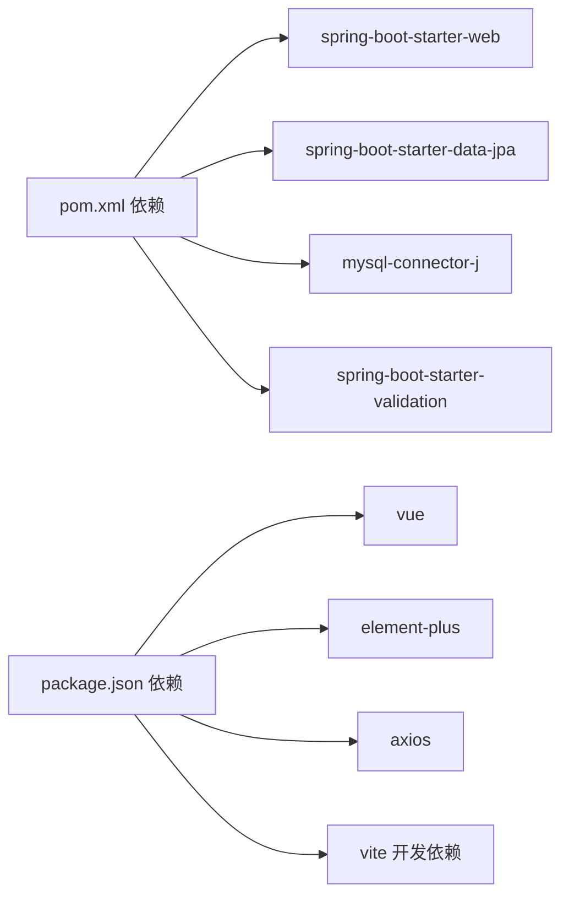

# 云平台部署

<cite>
**本文引用的文件**
- [DemoApplication.java](file://backend/src/main/java/com/example/demo/DemoApplication.java)
- [application.yml](file://backend/src/main/resources/application.yml)
- [ItemController.java](file://backend/src/main/java/com/example/demo/controller/ItemController.java)
- [ItemService.java](file://backend/src/main/java/com/example/demo/service/ItemService.java)
- [ItemRepository.java](file://backend/src/main/java/com/example/demo/repository/ItemRepository.java)
- [Item.java](file://backend/src/main/java/com/example/demo/entity/Item.java)
- [pom.xml](file://backend/pom.xml)
- [package.json](file://frontend/package.json)
- [vite.config.js](file://frontend/vite.config.js)
- [item.js](file://frontend/src/api/item.js)
- [ItemManager.vue](file://frontend/src/components/ItemManager.vue)
- [index.html](file://frontend/index.html)
- [README.deploy.md](file://README.deploy.md)
</cite>

## 目录
1. [简介](#简介)
2. [项目结构](#项目结构)
3. [核心组件](#核心组件)
4. [架构总览](#架构总览)
5. [详细组件分析](#详细组件分析)
6. [依赖关系分析](#依赖关系分析)
7. [性能考虑](#性能考虑)
8. [故障排查指南](#故障排查指南)
9. [结论](#结论)
10. [附录](#附录)

## 简介
本文件面向云平台部署场景，基于现有代码库提供阿里云与腾讯云的部署参考方案，涵盖：
- ECS/CVM 服务器部署与容器服务运行
- 前端静态网站托管与 CDN 加速
- 云数据库 RDS 的使用优势与配置要点
- Vercel 与云服务器的混合部署模式（前端构建、后端部署、API 代理）
- 云平台特有的安全配置、负载均衡与自动扩缩容建议
- 成本优化、监控告警与备份恢复策略

该文档以仓库中的 Spring Boot 后端与 Vue 前端代码为基础，结合 README 中的阿里云部署实践，给出可落地的云平台部署与运维建议。

## 项目结构
项目采用前后端分离架构：
- 后端：Spring Boot + Spring Data JPA + MySQL，提供 REST API
- 前端：Vue 3 + Element Plus，通过 Axios 访问后端 /api 前缀接口
- 构建工具：后端使用 Maven，前端使用 Vite

图表来源
- [DemoApplication.java:1-13](file://backend/src/main/java/com/example/demo/DemoApplication.java#L1-L13)
- [application.yml:1-18](file://backend/src/main/resources/application.yml#L1-L18)
- [ItemController.java:1-59](file://backend/src/main/java/com/example/demo/controller/ItemController.java#L1-L59)
- [ItemService.java:1-50](file://backend/src/main/java/com/example/demo/service/ItemService.java#L1-L50)
- [ItemRepository.java:1-13](file://backend/src/main/java/com/example/demo/repository/ItemRepository.java#L1-L13)
- [Item.java:1-30](file://backend/src/main/java/com/example/demo/entity/Item.java#L1-L30)
- [pom.xml:1-71](file://backend/pom.xml#L1-L71)
- [index.html:1-14](file://frontend/index.html#L1-L14)
- [item.js:1-31](file://frontend/src/api/item.js#L1-L31)
- [ItemManager.vue:1-220](file://frontend/src/components/ItemManager.vue#L1-L220)

章节来源
- [DemoApplication.java:1-13](file://backend/src/main/java/com/example/demo/DemoApplication.java#L1-L13)
- [application.yml:1-18](file://backend/src/main/resources/application.yml#L1-L18)
- [pom.xml:1-71](file://backend/pom.xml#L1-L71)
- [package.json:1-21](file://frontend/package.json#L1-L21)
- [vite.config.js:1-16](file://frontend/vite.config.js#L1-L16)
- [index.html:1-14](file://frontend/index.html#L1-L14)

## 核心组件
- 后端应用入口与配置
  - 应用入口：Spring Boot 启动类负责应用生命周期管理
  - 数据源与 JPA：通过 YAML 配置 MySQL 连接、JPA 方言与 DDL 行为
- 控制层与服务层
  - 控制器：提供 /api/items REST 接口，支持分页、排序、搜索、CRUD
  - 服务层：封装业务逻辑，事务性保存与更新
  - 数据访问层：基于 Spring Data JPA，提供分页查询与关键字搜索
- 前端组件与 API
  - 组件：基于 Element Plus 的数据管理界面，支持分页、搜索、增删改
  - API：Axios 封装，统一前缀 /api/items，配合 Nginx 反向代理

章节来源
- [DemoApplication.java:1-13](file://backend/src/main/java/com/example/demo/DemoApplication.java#L1-L13)
- [application.yml:1-18](file://backend/src/main/resources/application.yml#L1-L18)
- [ItemController.java:1-59](file://backend/src/main/java/com/example/demo/controller/ItemController.java#L1-L59)
- [ItemService.java:1-50](file://backend/src/main/java/com/example/demo/service/ItemService.java#L1-L50)
- [ItemRepository.java:1-13](file://backend/src/main/java/com/example/demo/repository/ItemRepository.java#L1-L13)
- [Item.java:1-30](file://backend/src/main/java/com/example/demo/entity/Item.java#L1-L30)
- [item.js:1-31](file://frontend/src/api/item.js#L1-L31)
- [ItemManager.vue:1-220](file://frontend/src/components/ItemManager.vue#L1-L220)

## 架构总览
下图展示从浏览器到后端数据库的典型请求链路，以及 Nginx 在部署中的作用。

图表来源
- [README.deploy.md:19-38](file://README.deploy.md#L19-L38)
- [vite.config.js:1-16](file://frontend/vite.config.js#L1-L16)
- [application.yml:1-18](file://backend/src/main/resources/application.yml#L1-L18)

## 详细组件分析

### 后端组件分析
- 应用与配置
  - 启动类：负责应用上下文初始化
  - YAML 配置：定义端口、数据源、JPA 属性（方言、DDL 行为、SQL 输出）
- 控制器
  - 提供分页列表、搜索、详情、创建、更新、删除接口
  - 开放跨域以便前端调用
- 服务与仓储
  - 服务层封装业务与事务
  - 仓储层提供分页与关键字查询能力
- 依赖与构建
  - Maven 依赖包含 Web、JPA、MySQL Connector、校验与测试
  - Java 版本要求 17

图表来源
- [DemoApplication.java:1-13](file://backend/src/main/java/com/example/demo/DemoApplication.java#L1-L13)
- [ItemController.java:1-59](file://backend/src/main/java/com/example/demo/controller/ItemController.java#L1-L59)
- [ItemService.java:1-50](file://backend/src/main/java/com/example/demo/service/ItemService.java#L1-L50)
- [ItemRepository.java:1-13](file://backend/src/main/java/com/example/demo/repository/ItemRepository.java#L1-L13)
- [Item.java:1-30](file://backend/src/main/java/com/example/demo/entity/Item.java#L1-L30)

章节来源
- [DemoApplication.java:1-13](file://backend/src/main/java/com/example/demo/DemoApplication.java#L1-L13)
- [application.yml:1-18](file://backend/src/main/resources/application.yml#L1-L18)
- [ItemController.java:1-59](file://backend/src/main/java/com/example/demo/controller/ItemController.java#L1-L59)
- [ItemService.java:1-50](file://backend/src/main/java/com/example/demo/service/ItemService.java#L1-L50)
- [ItemRepository.java:1-13](file://backend/src/main/java/com/example/demo/repository/ItemRepository.java#L1-L13)
- [Item.java:1-30](file://backend/src/main/java/com/example/demo/entity/Item.java#L1-L30)
- [pom.xml:1-71](file://backend/pom.xml#L1-L71)

### 前端组件分析
- 页面与路由
  - 单页应用入口，SPA 路由通过 Nginx try_files 支持
- 组件与交互
  - 数据表格、分页、搜索、对话框、表单校验
- API 调用
  - Axios 统一前缀 /api/items，开发时通过 Vite 代理到后端 :8080
- 构建与代理
  - Vite 默认端口 5173，开发代理目标为后端 :8080

图表来源
- [ItemManager.vue:121-136](file://frontend/src/components/ItemManager.vue#L121-L136)
- [ItemManager.vue:138-154](file://frontend/src/components/ItemManager.vue#L138-L154)
- [ItemManager.vue:172-196](file://frontend/src/components/ItemManager.vue#L172-L196)
- [item.js:8-30](file://frontend/src/api/item.js#L8-L30)

章节来源
- [index.html:1-14](file://frontend/index.html#L1-L14)
- [ItemManager.vue:1-220](file://frontend/src/components/ItemManager.vue#L1-L220)
- [item.js:1-31](file://frontend/src/api/item.js#L1-L31)
- [vite.config.js:1-16](file://frontend/vite.config.js#L1-L16)
- [package.json:1-21](file://frontend/package.json#L1-L21)

### API 请求序列（开发与生产）
- 开发阶段：Vite 代理将 /api 前缀转发到后端 :8080
- 生产阶段：Nginx 将 /api 前缀转发到后端 :8080，前端静态资源由 Nginx 提供

图表来源
- [vite.config.js:8-14](file://frontend/vite.config.js#L8-L14)
- [README.deploy.md:292-300](file://README.deploy.md#L292-L300)
- [ItemController.java:23-31](file://backend/src/main/java/com/example/demo/controller/ItemController.java#L23-L31)
- [application.yml:1-18](file://backend/src/main/resources/application.yml#L1-L18)

## 依赖关系分析
- 后端依赖
  - Spring Boot Web、Data JPA、MySQL Connector、校验、测试
  - Java 17
- 前端依赖
  - Vue 3、Element Plus、Axios
  - Vite 开发与构建

图表来源
- [pom.xml:24-51](file://backend/pom.xml#L24-L51)
- [package.json:11-19](file://frontend/package.json#L11-L19)

章节来源
- [pom.xml:1-71](file://backend/pom.xml#L1-L71)
- [package.json:1-21](file://frontend/package.json#L1-L21)

## 性能考虑
- 后端
  - 生产环境建议关闭 SQL 输出，降低日志开销
  - 上线后将 JPA DDL 行为从 update 改为 validate，并使用迁移工具管理结构变更
  - JVM 堆内存根据实例规格合理设置，避免频繁 GC
- 数据库
  - 生产环境使用云数据库（如 RDS），开启自动备份与高可用
  - 优化连接池参数与查询索引，避免慢查询
- 前端
  - 静态资源开启长期缓存与 immutable 标记
  - 通过 CDN 加速静态资源，减少回源压力
- 部署
  - 使用反向代理统一处理静态资源与 API 路由
  - 对外仅暴露必要端口，内部服务尽量内网访问

## 故障排查指南
- 常见问题定位
  - 后端状态与日志：systemd 状态、journalctl、应用日志
  - Nginx 日志：访问与错误日志
  - 端口监听：检查 80/8080/3306 是否正常
  - 内存与 Swap：2GB 内存实例建议启用 Swap
  - Java 进程内存：查看 RSS/Vsz
- 建议命令
  - 后端：systemctl status、journalctl、tail -f
  - Nginx：nginx -t、systemctl reload
  - 网络：ss -tlnp、firewalld 状态
  - 数据库：mysql 命令行、show processlist

章节来源
- [README.deploy.md:377-397](file://README.deploy.md#L377-L397)

## 结论
本项目具备良好的云平台部署基础：前后端分离、REST API 清晰、静态资源易于托管与加速。结合 README 中的阿里云部署实践，可快速在阿里云或腾讯云上完成 ECS/CVM 服务器部署与容器化演进。建议后续逐步引入 RDS、CDN、自动化 CI/CD、集中日志与监控告警体系，以提升稳定性与可维护性。

## 附录

### 阿里云 ECS 部署要点（基于仓库实践）
- 安全组开放：22（SSH，建议限制来源）、80（HTTP）、443（HTTPS）、8080（后端调试）
- 服务器初始化：创建部署用户、启用 Swap、安装 JDK 17、MySQL 8.0、Nginx
- 后端部署：本地打包 JAR，systemd 管理，生产配置独立文件，JVM 堆内存限制
- 前端部署：本地构建，上传至 Nginx 根目录，配置 SPA 路由与 /api 代理
- HTTPS 与域名：阿里云免费证书或 Let's Encrypt，配置自动续期
- 运维与升级：后端/前端更新流程、常用排障命令、安全加固建议、升级建议（RDS、SLB、CDN、SLS）

章节来源
- [README.deploy.md:42-64](file://README.deploy.md#L42-L64)
- [README.deploy.md:137-150](file://README.deploy.md#L137-L150)
- [README.deploy.md:179-245](file://README.deploy.md#L179-L245)
- [README.deploy.md:275-320](file://README.deploy.md#L275-L320)
- [README.deploy.md:327-352](file://README.deploy.md#L327-L352)
- [README.deploy.md:355-422](file://README.deploy.md#L355-L422)

### 腾讯云部署建议（通用实践）
- ECS/CVM 部署
  - 安全组：开放 22/80/443，限制来源 IP
  - 初始化：部署用户、Swap、JDK 17、MySQL 8.0、Nginx
  - 后端：systemd 管理，生产配置与日志路径
  - 前端：静态托管，SPA 路由与 /api 代理
- 容器服务运行
  - Docker 镜像：后端 JAR 打包为镜像，前端构建产物放入 Nginx 镜像
  - Kubernetes：Deployment + Service，Ingress 暴露 80/443
- 前端静态网站托管与 CDN 加速
  - 对象存储：上传 dist 目录，开启静态网站托管
  - CDN：绑定自定义域名，开启 HTTPS 与缓存策略
- 云数据库 RDS
  - 优势：自动备份、高可用、只读副本、性能监控
  - 配置要点：字符集、时区、连接数、慢查询日志
- 混合部署（Vercel + 云服务器）
  - 前端：Vercel 托管，API 代理指向云服务器后端
  - 后端：云服务器部署，Nginx 反向代理 /api
  - CORS：后端允许前端域名或通配符（生产建议精确域名）
- 安全配置、负载均衡与自动扩缩容
  - 安全：密钥登录、禁用 root、数据库仅内网访问、强密码
  - 负载均衡：SLB/Tencent CLB，多实例后端
  - 自动扩缩容：基于 CPU/内存/请求量阈值的弹性伸缩
- 成本优化、监控告警与备份恢复
  - 成本：按需实例、预留券、CDN 缓存命中率优化
  - 监控：云监控指标、日志服务、告警策略
  - 备份：RDS 自动备份、对象存储归档、异地容灾

### 云平台特性与最佳实践对照
- 阿里云
  - ECS：安全组、快照、云监控、云市场镜像
  - RDS：高可用、只读实例、备份策略、审计日志
  - OSS+CDN：静态网站托管、全球加速、HTTPS
  - SLB：四层/七层负载均衡、健康检查
  - SLS：日志采集、检索、投递、告警
- 腾讯云
  - CVM：安全组、快照、云拨测、云 API
  - RDS：高可用架构、跨可用区、备份保留周期
  - COS+CDN：静态托管、防盗链、压缩传输
  - CLB：流量分发、会话保持、灰度发布
  - 云监控：指标、告警、事件通知、可观测性