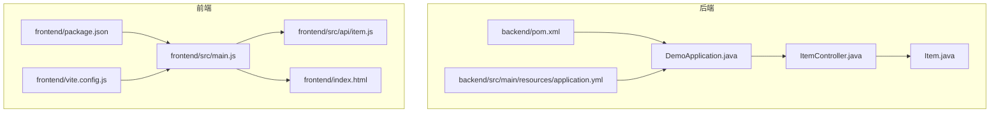
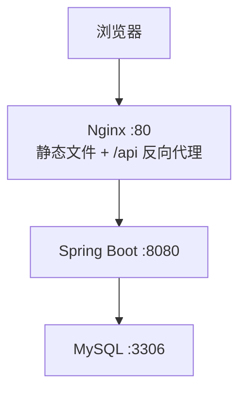
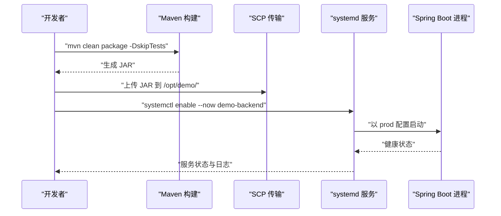
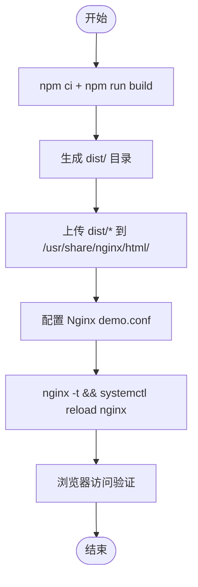
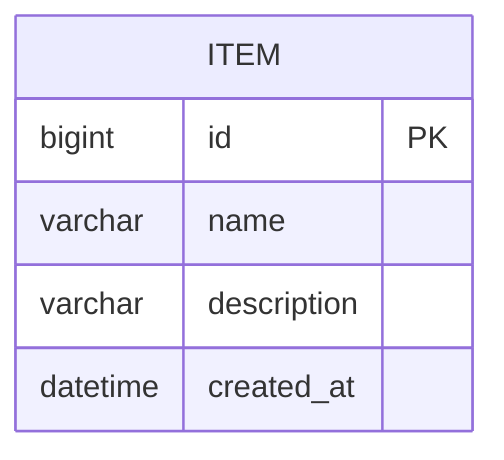
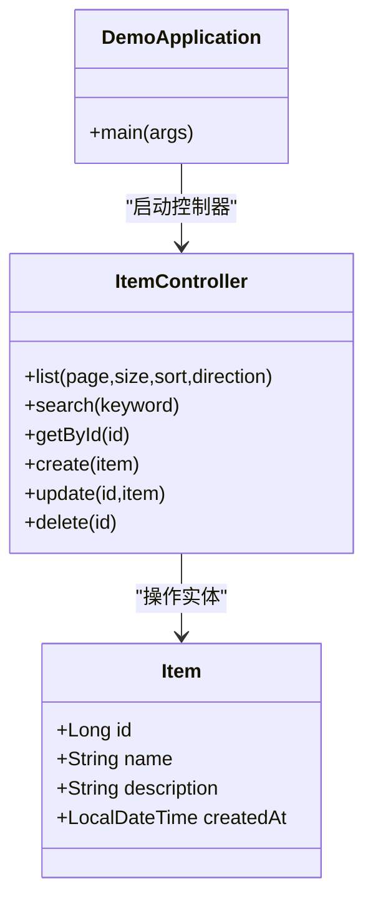
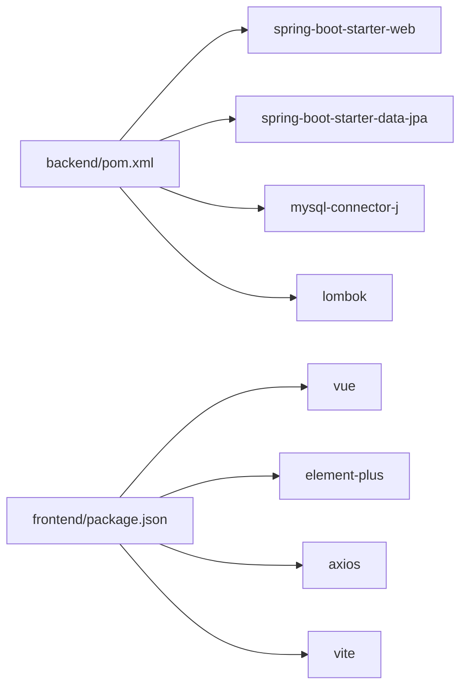

# 传统服务器部署

<cite>
**本文引用的文件**
- [backend/pom.xml](file://backend/pom.xml)
- [backend/src/main/resources/application.yml](file://backend/src/main/resources/application.yml)
- [backend/src/main/java/com/example/demo/DemoApplication.java](file://backend/src/main/java/com/example/demo/DemoApplication.java)
- [backend/src/main/java/com/example/demo/controller/ItemController.java](file://backend/src/main/java/com/example/demo/controller/ItemController.java)
- [backend/src/main/java/com/example/demo/entity/Item.java](file://backend/src/main/java/com/example/demo/entity/Item.java)
- [frontend/package.json](file://frontend/package.json)
- [frontend/vite.config.js](file://frontend/vite.config.js)
- [frontend/src/main.js](file://frontend/src/main.js)
- [frontend/src/api/item.js](file://frontend/src/api/item.js)
- [frontend/index.html](file://frontend/index.html)
- [README.deploy.md](file://README.deploy.md)
</cite>

## 目录
1. [简介](#简介)
2. [项目结构](#项目结构)
3. [核心组件](#核心组件)
4. [架构总览](#架构总览)
5. [详细组件分析](#详细组件分析)
6. [依赖关系分析](#依赖关系分析)
7. [性能考虑](#性能考虑)
8. [故障排除指南](#故障排除指南)
9. [结论](#结论)
10. [附录](#附录)

## 简介
本部署文档面向传统服务器环境，提供从零开始的后端与前端应用打包、部署与运维全流程指导。内容涵盖：
- 后端应用的 Maven 构建、JAR 包生成与 nohup/systemd 后台运行方式
- systemd 服务配置文件编写，包括服务单元文件、启动参数与重启策略
- 前端应用的 npm ci 安装、构建产物生成与 Nginx 静态文件配置
- 服务器环境准备、文件传输与权限配置步骤
- 日志管理、进程监控与故障排除指南

## 项目结构
该项目采用前后端分离架构，后端基于 Spring Boot，前端基于 Vue 3 + Vite。整体目录结构如下：
- 后端模块：backend
  - 源代码位于 src/main/java，资源位于 src/main/resources
  - 构建配置位于 pom.xml
- 前端模块：frontend
  - 源代码位于 src，入口文件 main.js，API 请求封装位于 src/api
  - 构建配置位于 package.json 与 vite.config.js
- 部署参考文档：README.deploy.md

图表来源
- [backend/pom.xml:1-71](file://backend/pom.xml#L1-L71)
- [backend/src/main/resources/application.yml:1-18](file://backend/src/main/resources/application.yml#L1-L18)
- [backend/src/main/java/com/example/demo/DemoApplication.java:1-13](file://backend/src/main/java/com/example/demo/DemoApplication.java#L1-L13)
- [backend/src/main/java/com/example/demo/controller/ItemController.java:1-59](file://backend/src/main/java/com/example/demo/controller/ItemController.java#L1-L59)
- [backend/src/main/java/com/example/demo/entity/Item.java:1-30](file://backend/src/main/java/com/example/demo/entity/Item.java#L1-L30)
- [frontend/package.json:1-21](file://frontend/package.json#L1-L21)
- [frontend/vite.config.js:1-16](file://frontend/vite.config.js#L1-L16)
- [frontend/src/main.js:1-9](file://frontend/src/main.js#L1-L9)
- [frontend/src/api/item.js:1-31](file://frontend/src/api/item.js#L1-L31)
- [frontend/index.html:1-14](file://frontend/index.html#L1-L14)

章节来源
- [backend/pom.xml:1-71](file://backend/pom.xml#L1-L71)
- [backend/src/main/resources/application.yml:1-18](file://backend/src/main/resources/application.yml#L1-L18)
- [frontend/package.json:1-21](file://frontend/package.json#L1-L21)
- [frontend/vite.config.js:1-16](file://frontend/vite.config.js#L1-L16)
- [README.deploy.md:17-422](file://README.deploy.md#L17-L422)

## 核心组件
- 后端应用
  - Spring Boot 应用入口类负责启动应用
  - 数据源与 JPA 配置位于 application.yml
  - 提供 REST API 控制器用于 CRUD 操作
- 前端应用
  - Vue 3 应用入口与 Element Plus 组件库集成
  - Axios 封装统一的 API 请求，基础路径指向 /api/items
  - Vite 开发服务器与代理配置，开发时将 /api 代理到后端

章节来源
- [backend/src/main/java/com/example/demo/DemoApplication.java:1-13](file://backend/src/main/java/com/example/demo/DemoApplication.java#L1-L13)
- [backend/src/main/resources/application.yml:1-18](file://backend/src/main/resources/application.yml#L1-L18)
- [backend/src/main/java/com/example/demo/controller/ItemController.java:1-59](file://backend/src/main/java/com/example/demo/controller/ItemController.java#L1-L59)
- [frontend/src/main.js:1-9](file://frontend/src/main.js#L1-L9)
- [frontend/src/api/item.js:1-31](file://frontend/src/api/item.js#L1-L31)
- [frontend/vite.config.js:1-16](file://frontend/vite.config.js#L1-L16)

## 架构总览
部署采用 Nginx 作为反向代理与静态资源服务器，后端 Spring Boot 应用监听 8080 端口，前端构建产物托管于 Nginx 的静态目录。安全组仅开放 80 端口，MySQL 仅本机访问，确保最小暴露面。

图表来源
- [README.deploy.md:19-38](file://README.deploy.md#L19-L38)

章节来源
- [README.deploy.md:17-422](file://README.deploy.md#L17-L422)

## 详细组件分析

### 后端应用打包与部署
- Maven 构建
  - 使用 spring-boot-maven-plugin 生成可执行 JAR
  - 构建命令：在 backend 目录执行 mvn clean package -DskipTests
  - 产物：target/demo-0.0.1-SNAPSHOT.jar
- 服务器准备
  - 准备 /opt/demo 目录并赋予 deploy 用户权限
  - 上传 JAR 至 /opt/demo/
- 生产配置
  - 在 /opt/demo/application-prod.yml 中配置数据源、JPA、日志输出路径与级别
- systemd 服务配置
  - 单元文件：/etc/systemd/system/demo-backend.service
  - 启动参数：指定 JVM 堆内存、激活 prod 配置文件、加载额外配置文件
  - 重启策略：on-failure，失败后 10 秒重试，成功退出码 143
- 启动与验证
  - systemctl daemon-reload
  - systemctl enable --now demo-backend
  - journalctl -u demo-backend -f 查看实时日志
  - curl http://localhost:8080/api/items 验证接口

图表来源
- [README.deploy.md:155-251](file://README.deploy.md#L155-L251)
- [backend/pom.xml:54-69](file://backend/pom.xml#L54-L69)

章节来源
- [backend/pom.xml:54-69](file://backend/pom.xml#L54-L69)
- [README.deploy.md:155-251](file://README.deploy.md#L155-L251)

### 前端应用构建与部署
- 本地构建
  - 在 frontend 目录执行 npm ci 与 npm run build
  - 产物：dist/ 目录
- 上传与托管
  - 将 dist/* 上传至 /usr/share/nginx/html/
- Nginx 配置
  - 静态根目录与首页索引
  - SPA 路由支持：try_files $uri $uri/ /index.html
  - /api 代理到后端 127.0.0.1:8080/api/
  - 静态资源缓存与日志配置
- 访问验证
  - 浏览器打开 http://服务器公网IP

图表来源
- [README.deploy.md:255-324](file://README.deploy.md#L255-L324)
- [frontend/package.json:6-10](file://frontend/package.json#L6-L10)

章节来源
- [frontend/package.json:1-21](file://frontend/package.json#L1-L21)
- [frontend/vite.config.js:1-16](file://frontend/vite.config.js#L1-L16)
- [README.deploy.md:255-324](file://README.deploy.md#L255-L324)

### 数据模型与 API 设计
后端提供标准的 REST API，前端通过统一的 API 封装进行调用。

图表来源
- [backend/src/main/java/com/example/demo/entity/Item.java:1-30](file://backend/src/main/java/com/example/demo/entity/Item.java#L1-L30)

图表来源
- [backend/src/main/java/com/example/demo/DemoApplication.java:1-13](file://backend/src/main/java/com/example/demo/DemoApplication.java#L1-L13)
- [backend/src/main/java/com/example/demo/controller/ItemController.java:1-59](file://backend/src/main/java/com/example/demo/controller/ItemController.java#L1-L59)
- [backend/src/main/java/com/example/demo/entity/Item.java:1-30](file://backend/src/main/java/com/example/demo/entity/Item.java#L1-L30)

章节来源
- [backend/src/main/java/com/example/demo/controller/ItemController.java:1-59](file://backend/src/main/java/com/example/demo/controller/ItemController.java#L1-L59)
- [backend/src/main/java/com/example/demo/entity/Item.java:1-30](file://backend/src/main/java/com/example/demo/entity/Item.java#L1-L30)

## 依赖关系分析
- 后端依赖
  - Spring Boot Web、Data JPA、MySQL Connector、Validation、Lombok、Test
- 前端依赖
  - Vue 3、Element Plus、Axios、Vite 插件
- 构建工具
  - Maven（后端）、Vite（前端）

图表来源
- [backend/pom.xml:24-52](file://backend/pom.xml#L24-L52)
- [frontend/package.json:11-19](file://frontend/package.json#L11-L19)

章节来源
- [backend/pom.xml:24-52](file://backend/pom.xml#L24-L52)
- [frontend/package.json:11-19](file://frontend/package.json#L11-L19)

## 性能考虑
- 内存与 Swap
  - 2GB 内存服务器建议添加 2GB Swap，限制 JVM 堆内存为 512MB
- MySQL 优化
  - 针对 2GB 内存优化 innodb_buffer_pool_size、max_connections 等参数
- 日志与监控
  - 后端日志输出到 /opt/demo/logs/app.log
  - Nginx 访问与错误日志分别记录
- 前端缓存
  - 对静态资源设置长缓存与 immutable 标记

章节来源
- [README.deploy.md:13,110-121,201-206,303-311:13-13](file://README.deploy.md#L13-L13)
- [README.deploy.md:110-121](file://README.deploy.md#L110-L121)
- [README.deploy.md:201-206](file://README.deploy.md#L201-L206)
- [README.deploy.md:303-311](file://README.deploy.md#L303-L311)

## 故障排除指南
- 后端常见问题
  - 服务未启动：检查 systemd 状态与 journalctl 日志
  - 数据库连接失败：核对 application-prod.yml 中的数据库 URL、用户名与密码
  - 端口占用：确认 8080 端口未被其他进程占用
- 前端常见问题
  - SPA 路由 404：确认 Nginx demo.conf 中的 try_files 配置
  - API 代理失败：检查 /api 代理到 127.0.0.1:8080 的配置
- 通用排查命令
  - systemctl status demo-backend
  - journalctl -u demo-backend -n 200 --no-pager
  - tail -f /opt/demo/logs/app.log
  - tail -f /var/log/nginx/demo-access.log
  - ss -tlnp | grep -E '80|8080|3306'
  - free -h
  - ps -p $(pgrep -f demo-0.0.1) -o pid,rss,vsz,cmd

章节来源
- [README.deploy.md:377-397](file://README.deploy.md#L377-L397)

## 结论
本部署文档提供了从服务器环境准备到应用上线的完整流程，结合 systemd 与 Nginx 实现稳定可靠的生产部署。通过合理的内存与数据库优化、完善的日志与监控以及标准化的故障排除流程，可在传统服务器环境下高效运行该 Spring Boot + Vue 3 应用。

## 附录
- 安全加固建议
  - 禁止 root 远程登录，启用密钥登录
  - MySQL 仅本机访问，安全组不开放 3306
  - 使用高强度数据库密码
  - 定期备份与云盾防护
- 升级建议
  - 业务增长后可升级为 RDS、SLB、OSS+CDN、自动化 CI/CD 与集中日志服务

章节来源
- [README.deploy.md:401-422](file://README.deploy.md#L401-L422)