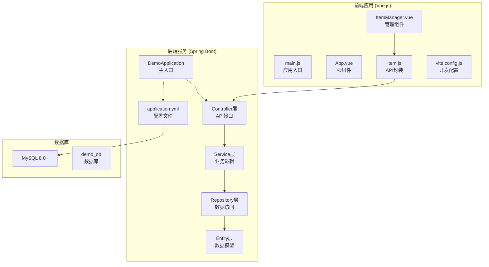
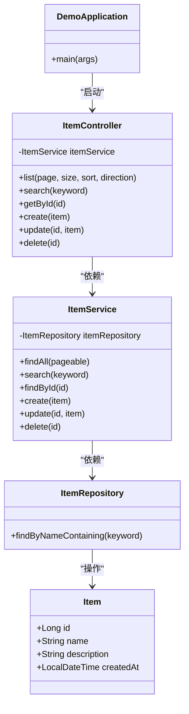
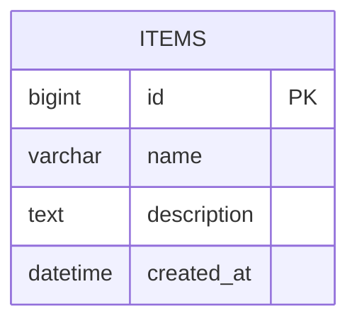
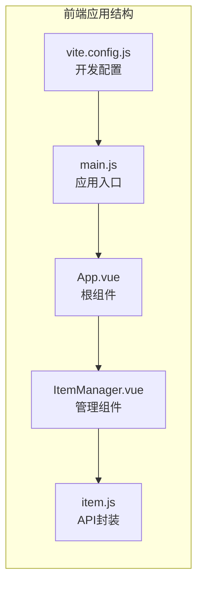
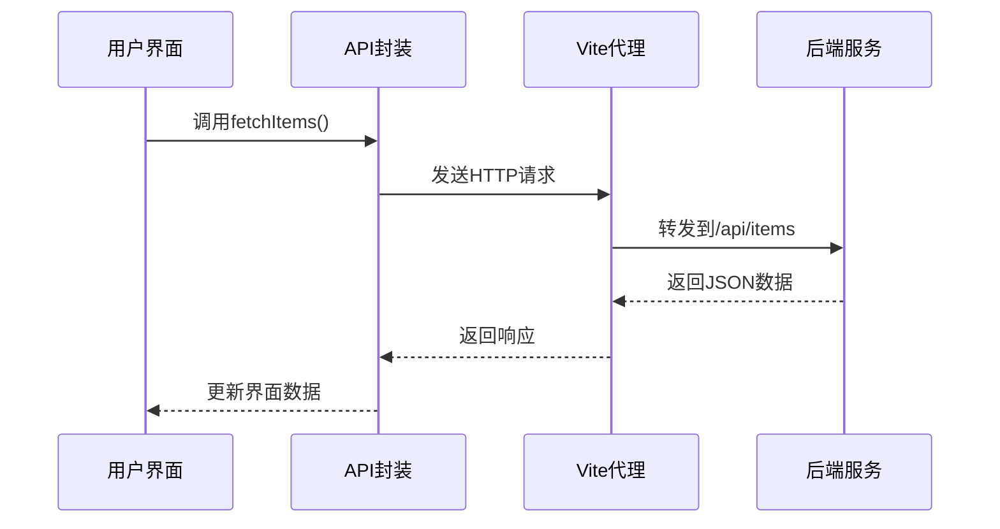

# 本地开发部署

<cite>
**本文档引用的文件**
- [pom.xml](file://backend/pom.xml)
- [application.yml](file://backend/src/main/resources/application.yml)
- [DemoApplication.java](file://backend/src/main/java/com/example/demo/DemoApplication.java)
- [ItemController.java](file://backend/src/main/java/com/example/demo/controller/ItemController.java)
- [ItemService.java](file://backend/src/main/java/com/example/demo/service/ItemService.java)
- [ItemRepository.java](file://backend/src/main/java/com/example/demo/repository/ItemRepository.java)
- [Item.java](file://backend/src/main/java/com/example/demo/entity/Item.java)
- [package.json](file://frontend/package.json)
- [vite.config.js](file://frontend/vite.config.js)
- [item.js](file://frontend/src/api/item.js)
- [ItemManager.vue](file://frontend/src/components/ItemManager.vue)
- [App.vue](file://frontend/src/App.vue)
- [main.js](file://frontend/src/main.js)
- [README.deploy.md](file://README.deploy.md)
</cite>

## 目录
1. [简介](#简介)
2. [项目结构](#项目结构)
3. [前置条件](#前置条件)
4. [数据库配置](#数据库配置)
5. [后端Spring Boot应用](#后端spring-boot应用)
6. [前端Vue.js应用](#前端vuejs应用)
7. [完整部署流程](#完整部署流程)
8. [常见问题解决](#常见问题解决)
9. [性能优化建议](#性能优化建议)
10. [故障排除指南](#故障排除指南)
11. [结论](#结论)

## 简介

这是一个基于Spring Boot和Vue.js的CRUD演示项目，提供了完整的本地开发环境搭建指南。项目包含后端RESTful API服务和前端管理界面，支持数据的增删改查操作。

## 项目结构

该项目采用前后端分离的架构设计，具有清晰的模块划分：



**图表来源**
- [DemoApplication.java:1-13](file://backend/src/main/java/com/example/demo/DemoApplication.java#L1-L13)
- [ItemController.java:1-59](file://backend/src/main/java/com/example/demo/controller/ItemController.java#L1-L59)
- [application.yml:1-18](file://backend/src/main/resources/application.yml#L1-L18)
- [main.js:1-9](file://frontend/src/main.js#L1-L9)

**章节来源**
- [pom.xml:1-71](file://backend/pom.xml#L1-L71)
- [package.json:1-21](file://frontend/package.json#L1-L21)

## 前置条件

### 系统要求

开发此项目需要以下软件环境：

#### JDK 17+
- **版本要求**: Java 17或更高版本
- **用途**: 编译和运行Spring Boot后端应用
- **验证命令**: `java -version`

#### Node.js 18+
- **版本要求**: Node.js 18或更高版本
- **用途**: 构建和运行Vue.js前端应用
- **验证命令**: `node -v`

#### MySQL 8.0+
- **版本要求**: MySQL 8.0或更高版本
- **用途**: 存储应用程序数据
- **验证命令**: `mysql --version`

### 开发工具
- **IDE**: IntelliJ IDEA或Eclipse (推荐)
- **数据库工具**: MySQL Workbench或Navicat
- **包管理器**: Maven (后端) 和 npm (前端)

## 数据库配置

### 数据库创建步骤

1. **连接MySQL服务器**
   ```bash
   mysql -u root -p
   ```

2. **创建数据库**
   ```sql
   CREATE DATABASE IF NOT EXISTS demo_db 
   CHARACTER SET utf8mb4 
   COLLATE utf8mb4_unicode_ci;
   ```

3. **创建数据库用户**
   ```sql
   CREATE USER IF NOT EXISTS 'demo_user'@'localhost' 
   IDENTIFIED BY 'YourSecurePassword123!';
   ```

4. **授权数据库权限**
   ```sql
   GRANT ALL PRIVILEGES ON demo_db.* 
   TO 'demo_user'@'localhost';
   FLUSH PRIVILEGES;
   ```

5. **验证数据库创建**
   ```sql
   SHOW DATABASES;
   SELECT User, Host FROM mysql.user WHERE User='demo_user';
   ```

### 数据库连接配置

后端应用的数据库连接配置位于`application.yml`文件中：

```yaml
spring:
  datasource:
    url: jdbc:mysql://localhost:3306/demo_db?useSSL=false&allowPublicKeyRetrieval=true&serverTimezone=Asia/Shanghai&characterEncoding=utf-8
    username: demo_user
    password: YourSecurePassword123!
    driver-class-name: com.mysql.cj.jdbc.Driver
  jpa:
    hibernate:
      ddl-auto: update
    show-sql: true
    properties:
      hibernate:
        format_sql: true
        dialect: org.hibernate.dialect.MySQLDialect
```

**章节来源**
- [application.yml:4-18](file://backend/src/main/resources/application.yml#L4-L18)

## 后端Spring Boot应用

### 项目结构分析

后端采用标准的Spring Boot三层架构：



**图表来源**
- [DemoApplication.java:1-13](file://backend/src/main/java/com/example/demo/DemoApplication.java#L1-L13)
- [ItemController.java:1-59](file://backend/src/main/java/com/example/demo/controller/ItemController.java#L1-L59)
- [ItemService.java:1-50](file://backend/src/main/java/com/example/demo/service/ItemService.java#L1-L50)
- [ItemRepository.java:1-13](file://backend/src/main/java/com/example/demo/repository/ItemRepository.java#L1-L13)
- [Item.java:1-30](file://backend/src/main/java/com/example/demo/entity/Item.java#L1-L30)

### 核心功能实现

#### REST API接口

后端提供完整的CRUD操作接口：

| 方法 | 路径 | 功能 | 参数 |
|------|------|------|------|
| GET | `/api/items` | 获取分页数据 | page, size, sort, direction |
| GET | `/api/items/search` | 搜索数据 | keyword |
| GET | `/api/items/{id}` | 获取单条数据 | id |
| POST | `/api/items` | 创建数据 | Item对象 |
| PUT | `/api/items/{id}` | 更新数据 | id + Item对象 |
| DELETE | `/api/items/{id}` | 删除数据 | id |

#### 数据模型



**图表来源**
- [Item.java:10-28](file://backend/src/main/java/com/example/demo/entity/Item.java#L10-L28)

### 启动方式

#### 直接运行模式

1. **确保数据库已启动**
   ```bash
   # Windows
   net start mysql
   
   # macOS/Linux
   sudo systemctl start mysql
   ```

2. **启动后端应用**
   ```bash
   cd backend
   mvn spring-boot:run
   ```

3. **验证服务启动**
   ```
   http://localhost:8080/api/items
   ```

#### 打包运行模式

1. **构建可执行JAR文件**
   ```bash
   cd backend
   mvn clean package -DskipTests
   ```

2. **运行JAR文件**
   ```bash
   java -jar target/demo-0.0.1-SNAPSHOT.jar
   ```

3. **指定配置文件运行**
   ```bash
   java -jar -Dspring.profiles.active=dev target/demo-0.0.1-SNAPSHOT.jar
   ```

**章节来源**
- [pom.xml:54-69](file://backend/pom.xml#L54-L69)
- [DemoApplication.java:9-11](file://backend/src/main/java/com/example/demo/DemoApplication.java#L9-L11)

## 前端Vue.js应用

### 项目结构分析

前端采用Vue 3 Composition API和Element Plus组件库：



**图表来源**
- [main.js:1-9](file://frontend/src/main.js#L1-L9)
- [App.vue:1-18](file://frontend/src/App.vue#L1-L18)
- [ItemManager.vue:1-220](file://frontend/src/components/ItemManager.vue#L1-L220)
- [item.js:1-31](file://frontend/src/api/item.js#L1-L31)

### 核心功能实现

#### 数据管理组件

前端提供完整的数据管理界面：

1. **数据表格展示**
   - 支持分页显示
   - 显示ID、名称、描述、创建时间
   - 支持排序和筛选

2. **搜索功能**
   - 实时搜索名称字段
   - 支持清空搜索

3. **CRUD操作**
   - 新增数据弹窗
   - 编辑数据弹窗
   - 删除确认对话框
   - 表单验证

#### API封装



**图表来源**
- [item.js:8-10](file://frontend/src/api/item.js#L8-L10)
- [vite.config.js:8-13](file://frontend/vite.config.js#L8-L13)

### 启动流程

#### 开发环境启动

1. **安装依赖**
   ```bash
   cd frontend
   npm install
   ```

2. **启动开发服务器**
   ```bash
   npm run dev
   ```

3. **访问应用**
   ```
   http://localhost:5173
   ```

#### 生产环境构建

1. **构建静态资源**
   ```bash
   npm run build
   ```

2. **预览构建结果**
   ```bash
   npm run preview
   ```

### Vite代理配置

前端开发服务器配置了API代理：

```javascript
export default defineConfig({
  server: {
    port: 5173,
    proxy: {
      '/api': {
        target: 'http://localhost:8080',
        changeOrigin: true
      }
    }
  }
})
```

**章节来源**
- [package.json:6-10](file://frontend/package.json#L6-L10)
- [vite.config.js:4-15](file://frontend/vite.config.js#L4-L15)

## 完整部署流程

### 环境准备

1. **安装必要软件**
   ```bash
   # JDK 17+
   # Node.js 18+
   # MySQL 8.0+
   ```

2. **验证安装**
   ```bash
   java -version
   node -v
   mysql --version
   ```

### 数据库初始化

1. **创建数据库和用户**
   ```sql
   CREATE DATABASE demo_db CHARACTER SET utf8mb4 COLLATE utf8mb4_unicode_ci;
   CREATE USER 'demo_user'@'localhost' IDENTIFIED BY 'YourSecurePassword123!';
   GRANT ALL PRIVILEGES ON demo_db.* TO 'demo_user'@'localhost';
   FLUSH PRIVILEGES;
   ```

2. **更新配置文件**
   修改`backend/src/main/resources/application.yml`中的数据库连接信息

### 后端启动

1. **启动数据库服务**
   ```bash
   # Windows
   net start mysql
   
   # macOS/Linux
   sudo systemctl start mysql
   ```

2. **启动Spring Boot应用**
   ```bash
   cd backend
   mvn spring-boot:run
   ```

### 前端启动

1. **安装依赖**
   ```bash
   cd frontend
   npm install
   ```

2. **启动开发服务器**
   ```bash
   npm run dev
   ```

3. **访问应用**
   ```
   http://localhost:5173
   ```

## 常见问题解决

### 数据库连接问题

**问题**: 连接MySQL失败
**解决方案**:
1. 检查MySQL服务是否启动
2. 验证用户名和密码
3. 确认数据库名称正确
4. 检查防火墙设置

**问题**: 字符集编码问题
**解决方案**:
1. 确保数据库创建时使用utf8mb4字符集
2. 在连接URL中指定字符编码参数
3. 检查MySQL配置文件

### 端口冲突问题

**问题**: 端口被占用
**解决方案**:
1. **后端端口冲突** (8080)
   ```bash
   # 修改application.yml中的server.port
   server:
     port: 8081
   ```

2. **前端端口冲突** (5173)
   ```bash
   # 修改vite.config.js中的server.port
   export default defineConfig({
     server: {
       port: 5174
     }
   })
   ```

### CORS跨域问题

**问题**: 前后端跨域访问失败
**解决方案**:
1. 检查后端CORS配置
2. 确认Vite代理配置正确
3. 验证代理路径匹配

### 依赖安装问题

**问题**: npm install失败
**解决方案**:
1. 清理npm缓存
   ```bash
   npm cache clean --force
   ```

2. 删除node_modules重新安装
   ```bash
   rm -rf node_modules
   npm install
   ```

3. 检查网络连接
   ```bash
   npm config set registry https://registry.npmjs.org/
   ```

## 性能优化建议

### 数据库优化

1. **索引优化**
   - 为常用查询字段建立索引
   - 优化WHERE和ORDER BY子句

2. **连接池配置**
   ```yaml
   spring:
     datasource:
       hikari:
         maximum-pool-size: 20
         connection-timeout: 30000
   ```

### 应用性能

1. **分页查询**
   - 后端默认支持分页
   - 前端实现虚拟滚动

2. **缓存策略**
   - 对频繁访问的数据进行缓存
   - 合理设置缓存过期时间

### 前端优化

1. **懒加载**
   - 组件按需加载
   - 图片懒加载

2. **代码分割**
   - 路由级别的代码分割
   - 第三方库单独打包

## 故障排除指南

### 启动失败排查

**后端启动失败**:
1. 检查JDK版本兼容性
2. 验证数据库连接配置
3. 查看启动日志输出

**前端启动失败**:
1. 检查Node.js版本
2. 验证依赖安装完整性
3. 检查端口占用情况

### 数据库问题排查

**连接超时**:
```sql
SHOW VARIABLES LIKE 'wait_timeout';
SET GLOBAL wait_timeout=28800;
```

**查询慢**:
```sql
EXPLAIN SELECT * FROM items WHERE name LIKE '%keyword%';
```

### 网络问题排查

**代理配置检查**:
1. 确认Vite代理配置正确
2. 检查后端API路径
3. 验证CORS设置

**防火墙配置**:
```bash
# Windows防火墙
netsh advfirewall firewall add rule name="MySQL" dir=in action=allow protocol=TCP localport=3306
netsh advfirewall firewall add rule name="Spring Boot" dir=in action=allow protocol=TCP localport=8080
netsh advfirewall firewall add rule name="Vite Dev" dir=in action=allow protocol=TCP localport=5173
```

## 结论

本项目提供了一个完整的本地开发环境搭建指南，涵盖了从环境准备到应用部署的全过程。通过遵循本文档的步骤，开发者可以快速搭建起一个功能完整的CRUD应用开发环境。

关键要点：
- 严格遵循版本要求（JDK 17+, Node.js 18+, MySQL 8.0+）
- 正确配置数据库连接和字符集
- 理解前后端分离架构的工作原理
- 掌握两种启动模式（直接运行和打包运行）
- 具备基本的问题排查能力

建议在实际开发中：
1. 使用版本控制系统管理代码
2. 建立完善的测试体系
3. 配置持续集成和部署流程
4. 定期备份数据库和代码
5. 关注应用性能监控和优化