# 生产环境配置

<cite>
**本文档引用的文件**
- [application.yml](file://backend/src/main/resources/application.yml)
- [pom.xml](file://backend/pom.xml)
- [DemoApplication.java](file://backend/src/main/java/com/example/demo/DemoApplication.java)
- [ItemController.java](file://backend/src/main/java/com/example/demo/controller/ItemController.java)
- [ItemService.java](file://backend/src/main/java/com/example/demo/service/ItemService.java)
- [ItemRepository.java](file://backend/src/main/java/com/example/demo/repository/ItemRepository.java)
- [Item.java](file://backend/src/main/java/com/example/demo/entity/Item.java)
- [README.deploy.md](file://README.deploy.md)
</cite>

## 目录
1. [简介](#简介)
2. [项目结构](#项目结构)
3. [核心组件](#核心组件)
4. [架构概览](#架构概览)
5. [详细组件分析](#详细组件分析)
6. [依赖关系分析](#依赖关系分析)
7. [性能考虑](#性能考虑)
8. [故障排除指南](#故障排除指南)
9. [结论](#结论)
10. [附录](#附录)

## 简介

这是一个基于Spring Boot的CRUD示例项目的生产环境配置指南。项目采用前后端分离架构，后端使用Spring Boot + JPA + MySQL，前端使用Vue.js，通过Nginx进行反向代理。本文档将详细说明生产环境的安全加固措施、配置优化、性能调优、监控方案以及运维管理。

## 项目结构

该项目采用标准的Spring Boot项目结构，包含后端API服务和前端静态资源：

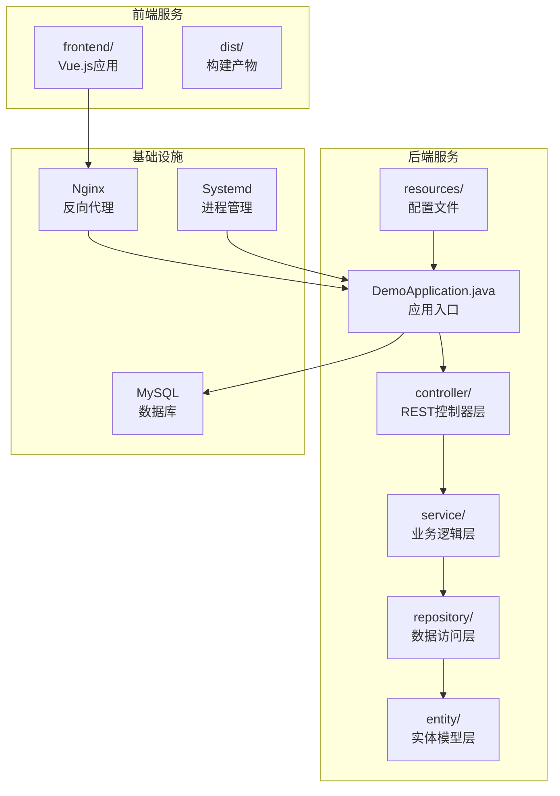

**图表来源**
- [DemoApplication.java:1-13](file://backend/src/main/java/com/example/demo/DemoApplication.java#L1-L13)
- [ItemController.java:1-59](file://backend/src/main/java/com/example/demo/controller/ItemController.java#L1-L59)
- [ItemService.java:1-50](file://backend/src/main/java/com/example/demo/service/ItemService.java#L1-L50)
- [ItemRepository.java:1-13](file://backend/src/main/java/com/example/demo/repository/ItemRepository.java#L1-L13)

**章节来源**
- [DemoApplication.java:1-13](file://backend/src/main/java/com/example/demo/DemoApplication.java#L1-L13)
- [pom.xml:1-71](file://backend/pom.xml#L1-L71)

## 核心组件

### 数据模型设计

系统采用简洁的数据模型设计，主要包含Item实体，支持基本的CRUD操作：

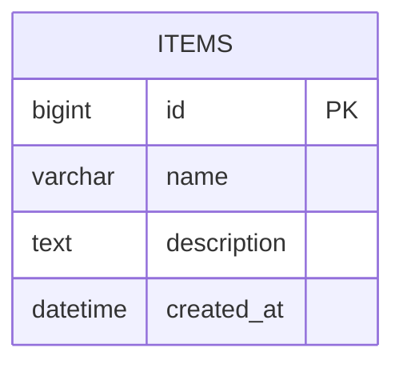

**图表来源**
- [Item.java:10-28](file://backend/src/main/java/com/example/demo/entity/Item.java#L10-L28)

### 控制器层架构

REST控制器提供统一的API接口，支持分页查询、搜索、增删改查等操作：

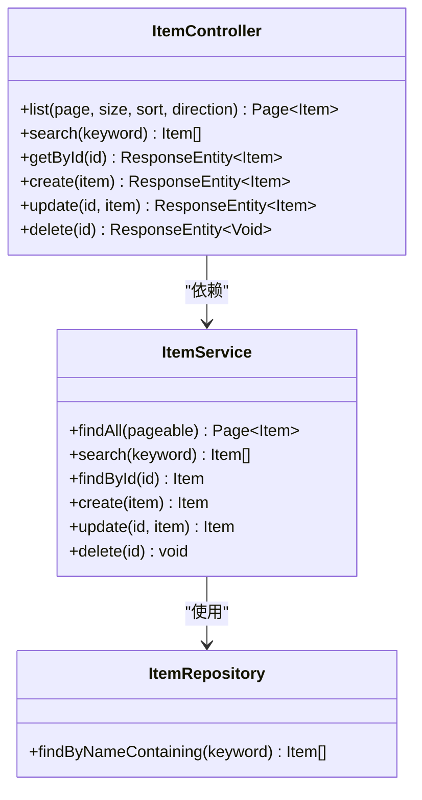

**图表来源**
- [ItemController.java:15-59](file://backend/src/main/java/com/example/demo/controller/ItemController.java#L15-L59)
- [ItemService.java:13-50](file://backend/src/main/java/com/example/demo/service/ItemService.java#L13-L50)
- [ItemRepository.java:9-12](file://backend/src/main/java/com/example/demo/repository/ItemRepository.java#L9-L12)

**章节来源**
- [ItemController.java:1-59](file://backend/src/main/java/com/example/demo/controller/ItemController.java#L1-L59)
- [ItemService.java:1-50](file://backend/src/main/java/com/example/demo/service/ItemService.java#L1-L50)
- [ItemRepository.java:1-13](file://backend/src/main/java/com/example/demo/repository/ItemRepository.java#L1-L13)

## 架构概览

系统采用经典的三层架构模式，结合微服务化的部署策略：

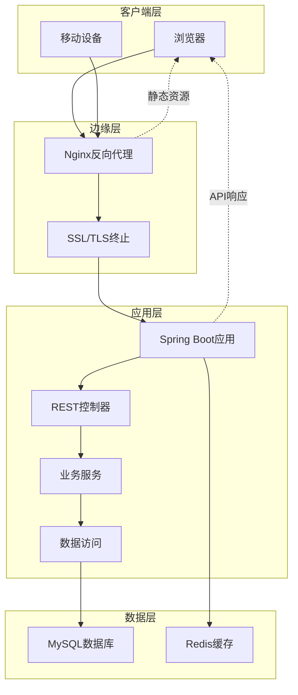

**图表来源**
- [README.deploy.md:29-50](file://README.deploy.md#L29-L50)
- [application.yml:1-18](file://backend/src/main/resources/application.yml#L1-L18)

## 详细组件分析

### 数据库配置优化

当前配置存在安全风险，需要进行生产环境优化：

#### 安全加固措施

1. **数据库密码修改**
   - 将root用户密码修改为强密码
   - 创建专用的应用数据库用户
   - 限制数据库用户的访问权限

2. **JPA配置优化**
   - 关闭show-sql功能
   - 将DDL自动更新改为validate模式
   - 使用Flyway进行数据库迁移

3. **连接池配置**
   ```yaml
   spring:
     datasource:
       hikari:
         maximum-pool-size: 20
         minimum-idle: 5
         connection-timeout: 30000
         idle-timeout: 600000
         max-lifetime: 1800000
   ```

**章节来源**
- [application.yml:4-17](file://backend/src/main/resources/application.yml#L4-L17)
- [README.deploy.md:522](file://README.deploy.md#L522)

### HTTPS证书配置

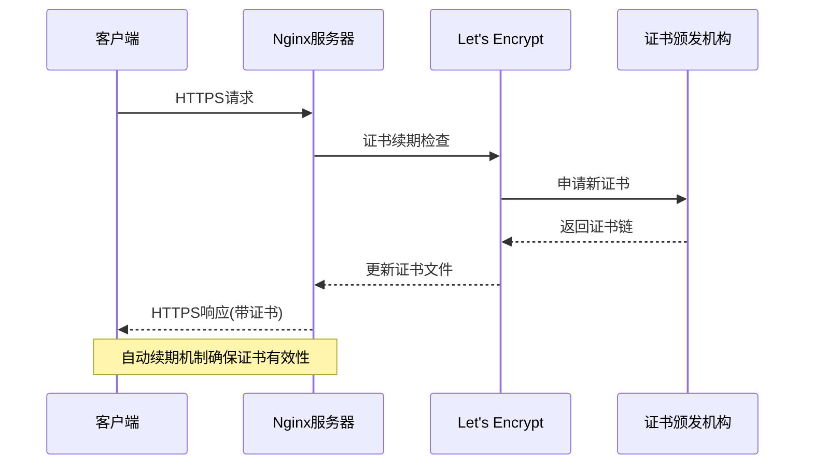

**图表来源**
- [README.deploy.md:441-452](file://README.deploy.md#L441-L452)

### 防火墙设置

生产环境需要严格的网络访问控制：

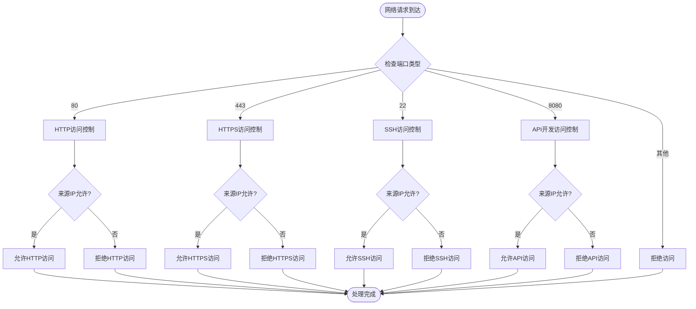

**图表来源**
- [README.deploy.md:56-68](file://README.deploy.md#L56-L68)

**章节来源**
- [README.deploy.md:56-68](file://README.deploy.md#L56-L68)

### 性能优化配置

#### 连接池设置

```yaml
spring:
  datasource:
    hikari:
      maximum-pool-size: 20
      minimum-idle: 5
      connection-timeout: 30000
      idle-timeout: 600000
      max-lifetime: 1800000
      leak-detection-threshold: 60000
      pool-name: ApplicationHikariCP
```

#### 缓存策略

```yaml
spring:
  cache:
    type: redis
    redis:
      time-to-live: 600000
      key-prefix: app:
  redis:
    host: localhost
    port: 6379
    lettuce:
      pool:
        max-active: 20
        max-idle: 10
        min-idle: 5
```

#### 日志级别调整

```yaml
logging:
  level:
    root: WARN
    com.example.demo: INFO
    org.springframework.web: WARN
    org.hibernate: ERROR
    org.apache: WARN
  file:
    name: /opt/demo/logs/app.log
    max-size: 100MB
    max-history: 30
    total-size-cap: 3GB
```

**章节来源**
- [application.yml:268-273](file://backend/src/main/resources/application.yml#L268-L273)

### 监控配置建议

#### 应用性能监控

```yaml
management:
  endpoints:
    web:
      exposure:
        include: health,info,metrics,prometheus
  endpoint:
    health:
      show-details: always
  metrics:
    export:
      prometheus:
        enabled: true
    distribution:
      percentiles-histogram:
        http:
          enabled: true
```

#### 数据库监控

```yaml
spring:
  datasource:
    hikari:
      pool-name: MonitoringPool
      register-mbeans: true
  jpa:
    open-in-view: false
```

#### 系统资源监控

```yaml
# JVM监控配置
management:
  health:
    db:
      enabled: true
  metrics:
    tags:
      application: demo-app
      environment: production
```

**章节来源**
- [README.deploy.md:485-508](file://README.deploy.md#L485-L508)

### 备份恢复方案

#### 数据库备份策略

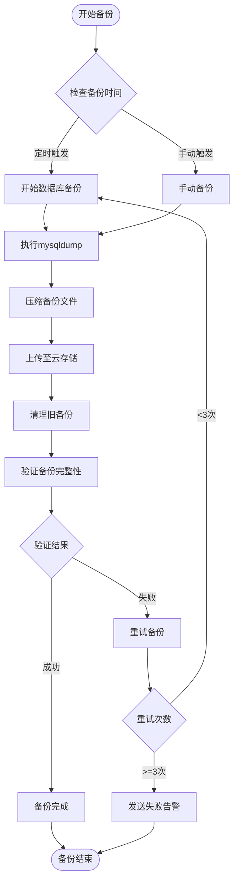

**图表来源**
- [README.deploy.md:521](file://README.deploy.md#L521)

#### 灾难恢复计划

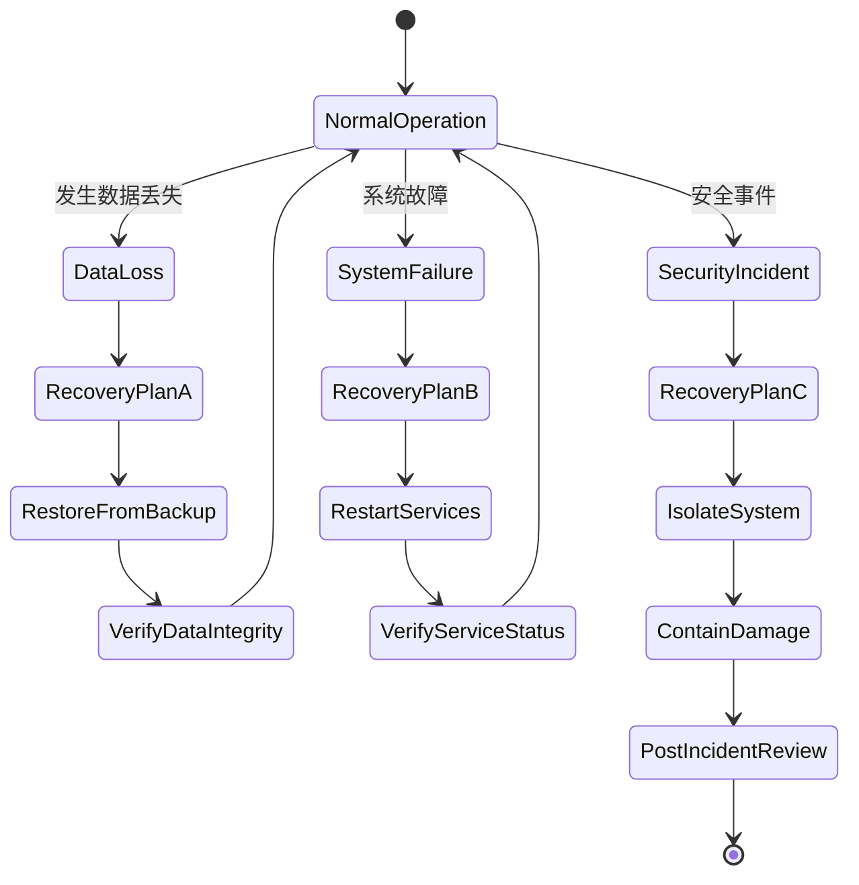

**图表来源**
- [README.deploy.md:521](file://README.deploy.md#L521)

### 应急响应流程

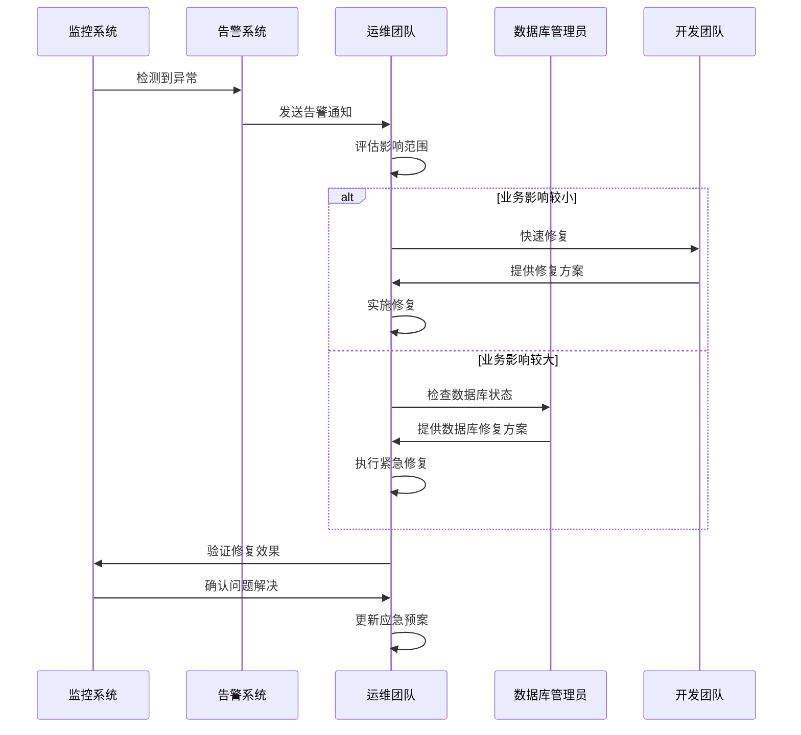

**图表来源**
- [README.deploy.md:485-508](file://README.deploy.md#L485-L508)

## 依赖关系分析

项目采用Spring Boot生态系统，主要依赖关系如下：

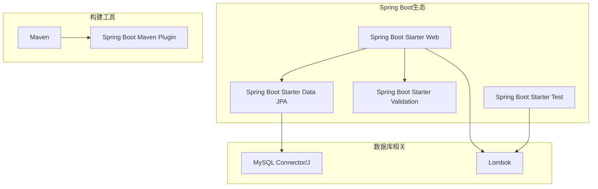

**图表来源**
- [pom.xml:24-51](file://backend/pom.xml#L24-L51)

**章节来源**
- [pom.xml:1-71](file://backend/pom.xml#L1-L71)

## 性能考虑

### JVM内存优化

基于2GB内存的ECS实例，建议的JVM配置：

```bash
# 最大堆内存512MB，初始堆256MB
-Xms256m -Xmx512m

# 垃圾回收器选择
-XX:+UseG1GC
-XX:MaxGCPauseMillis=200

# 元空间大小
-XX:MetaspaceSize=128m
-XX:MaxMetaspaceSize=256m
```

### 数据库性能优化

```sql
-- MySQL性能优化参数
[mysqld]
innodb_buffer_pool_size = 256M
performance_schema = OFF
max_connections = 50
query_cache_type = 0
innodb_flush_log_at_trx_commit = 2
```

### 缓存策略

```yaml
spring:
  cache:
    type: SIMPLE
    cache-names: items-cache
  cache:
    caches:
      items-cache:
        ttl: 300000
        get:
          cache-null-values: false
```

## 故障排除指南

### 常见问题诊断

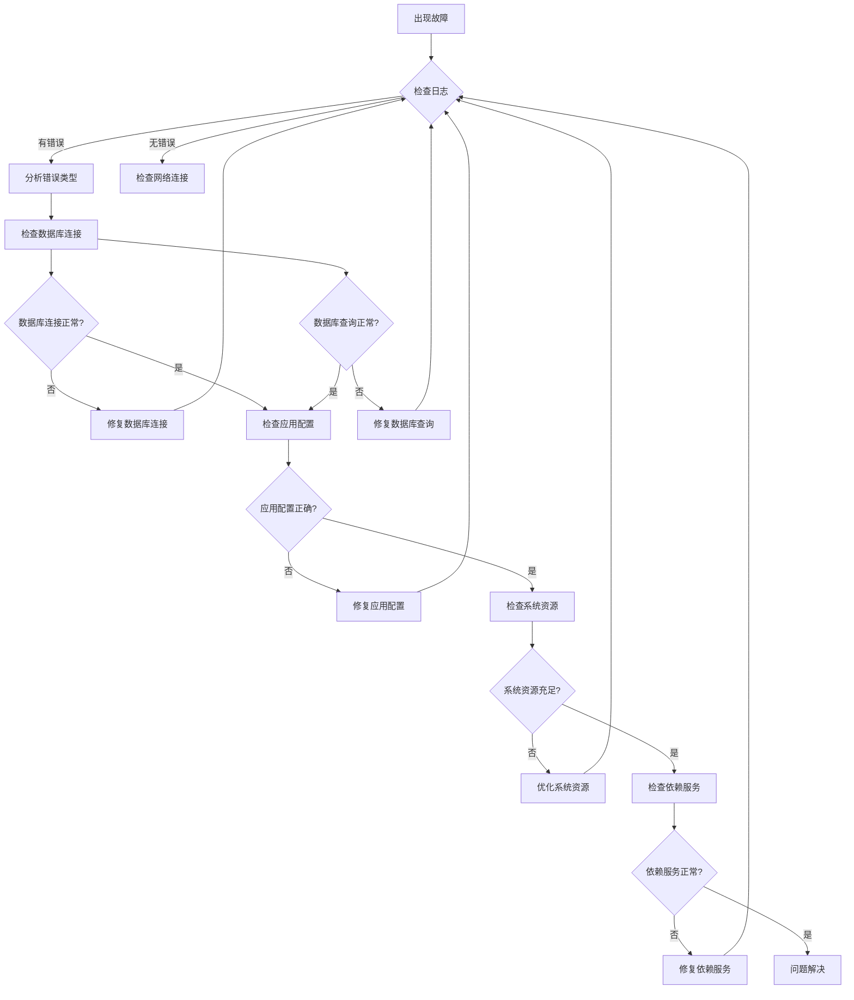

**图表来源**
- [README.deploy.md:485-508](file://README.deploy.md#L485-L508)

### 排障命令清单

```bash
# 检查服务状态
systemctl status demo-backend
journalctl -u demo-backend -n 200 --no-pager

# 检查端口监听
ss -tlnp | grep -E '80|8080|3306'

# 检查内存使用
free -h
ps -p $(pgrep -f demo-0.0.1) -o pid,rss,vsz,cmd

# 检查磁盘空间
df -h
du -sh /opt/demo/logs/*

# 检查数据库连接
mysql -udemo -p demo_db -e "SHOW DATABASES;"
```

**章节来源**
- [README.deploy.md:485-508](file://README.deploy.md#L485-L508)

## 结论

本生产环境配置指南涵盖了从基础架构到高级运维的完整方案。通过实施这些配置和最佳实践，可以显著提升系统的安全性、稳定性、性能和可维护性。建议按照优先级逐步实施各项改进措施，并建立完善的监控和告警体系，确保系统在生产环境中的可靠运行。

## 附录

### 安全加固清单

- [ ] 修改数据库root密码为强密码
- [ ] 创建专用应用数据库用户
- [ ] 关闭JPA自动建表功能
- [ ] 配置HTTPS证书
- [ ] 限制SSH访问来源
- [ ] 配置防火墙规则
- [ ] 设置日志轮转
- [ ] 配置备份策略

### 性能基准测试

建议在生产部署前进行以下性能测试：
- 压力测试：模拟高并发场景
- 延迟测试：测量API响应时间
- 内存泄漏检测：长时间运行稳定性
- 数据库连接池测试：验证连接池配置