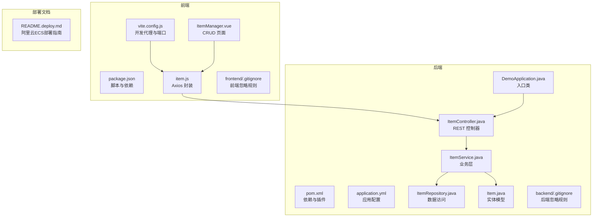
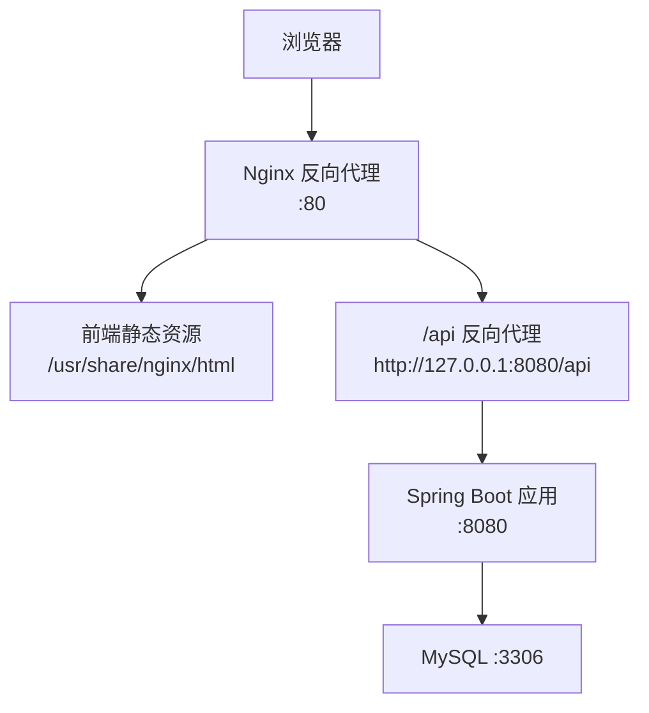
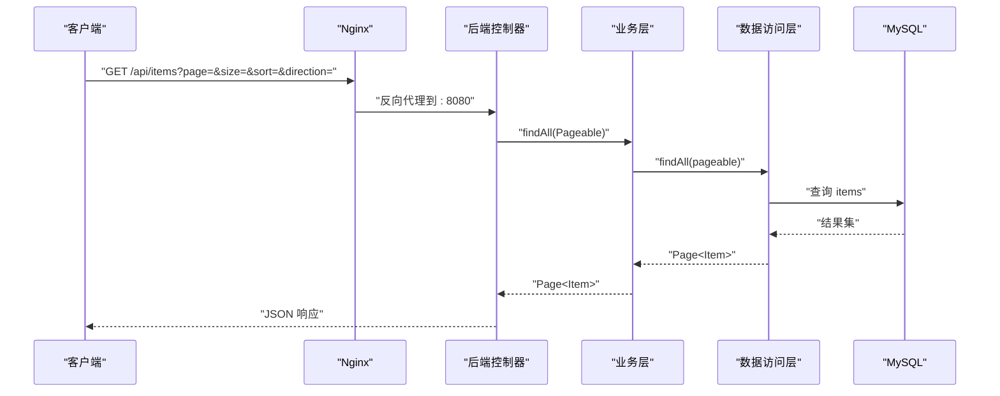
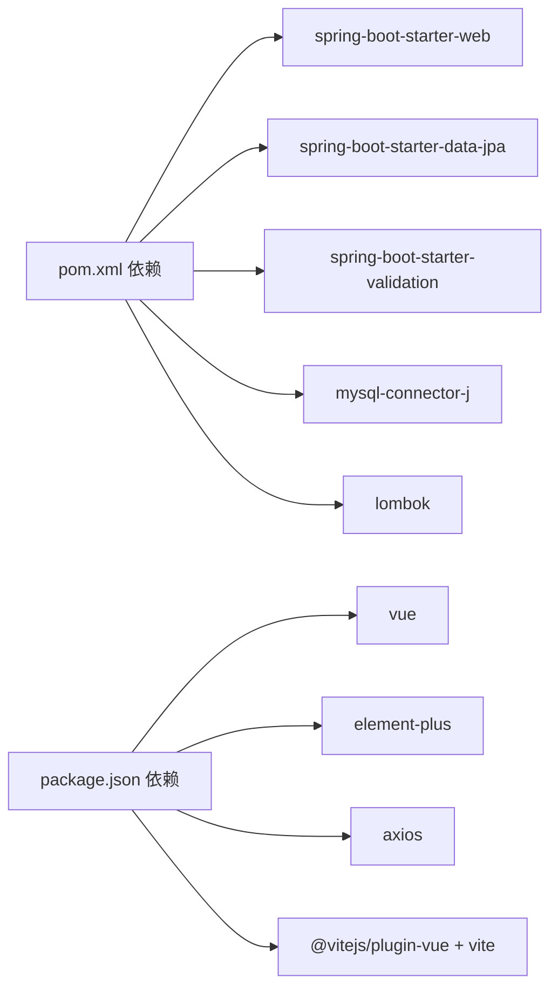

# 部署指南

<cite>
**本文引用的文件**
- [backend/.gitignore](file://backend/.gitignore)
- [frontend/.gitignore](file://frontend/.gitignore)
- [pom.xml](file://backend/pom.xml)
- [application.yml](file://backend/src/main/resources/application.yml)
- [DemoApplication.java](file://backend/src/main/java/com/example/demo/DemoApplication.java)
- [ItemController.java](file://backend/src/main/java/com/example/demo/controller/ItemController.java)
- [ItemService.java](file://backend/src/main/java/com/example/demo/service/ItemService.java)
- [ItemRepository.java](file://backend/src/main/java/com/example/demo/repository/ItemRepository.java)
- [Item.java](file://backend/src/main/java/com/example/demo/entity/Item.java)
- [package.json](file://frontend/package.json)
- [vite.config.js](file://frontend/vite.config.js)
- [item.js](file://frontend/src/api/item.js)
- [ItemManager.vue](file://frontend/src/components/ItemManager.vue)
- [README.deploy.md](file://README.deploy.md)
</cite>

## 更新摘要
**所做变更**
- 新增版本控制系统基础设施章节，详细说明Git忽略配置
- 更新部署文档以反映完整的阿里云ECS部署流程
- 增强本地开发与生产部署的最佳实践指导
- 完善CI/CD流水线与自动化部署策略

## 目录
1. [简介](#简介)
2. [版本控制系统基础设施](#版本控制系统基础设施)
3. [项目结构](#项目结构)
4. [核心组件](#核心组件)
5. [架构总览](#架构总览)
6. [详细组件分析](#详细组件分析)
7. [依赖关系分析](#依赖关系分析)
8. [性能考虑](#性能考虑)
9. [故障排除指南](#故障排除指南)
10. [结论](#结论)
11. [附录](#附录)

## 简介
本指南面向不同规模与技术背景的团队，提供从本地开发到生产部署的完整路径，涵盖：
- 本地开发部署
- Docker 容器化部署
- 传统服务器部署
- 云平台部署
- CI/CD 流水线配置与自动化测试
- 生产环境优化（性能、监控、日志）
- 故障排除、备份恢复与灾难恢复
- 安全加固与合规要求

本项目为基于 Spring Boot 的 CRUD 示例后端与 Vue 前端，后端使用 MySQL 存储，前后端通过反向代理统一对外提供服务。项目现已建立完整的版本控制系统基础设施，包含标准的Git忽略配置和部署文档。

## 版本控制系统基础设施

### Git忽略配置
项目已建立完善的Git忽略配置，确保开发环境与生产环境的整洁分离：

#### 后端Git忽略规则
后端项目遵循标准的Maven项目忽略规则：
- **构建产物**：`/target/` 目录及其内容
- **IDE配置**：IntelliJ IDEA、Eclipse、VS Code等IDE相关文件
- **日志文件**：`*.log` 和 `logs/` 目录
- **操作系统文件**：`.DS_Store`、`Thumbs.db` 等系统文件
- **编译文件**：`*.class` 文件
- **本地配置**：`application-local.yml`、`application-dev.yml` 等本地配置文件
- **测试输出**：`/test-output/` 目录

#### 前端Git忽略规则
前端项目遵循Vue/Vite项目的标准忽略规则：
- **依赖包**：`/node_modules/` 目录
- **构建输出**：`/dist/`、`/dist-ssr/` 目录
- **IDE配置**：各种IDE的项目配置文件
- **日志文件**：npm、yarn、pnpm等包管理器的日志文件
- **操作系统文件**：`.DS_Store`、`Thumbs.db` 等
- **环境文件**：`.env`、`.env.local` 等环境配置文件
- **覆盖率报告**：`/coverage/` 目录
- **缓存文件**：`.cache/`、`.temp/` 等临时文件

### 版本控制最佳实践
- **分支管理**：采用Git Flow工作流，主分支保护，功能分支隔离
- **提交规范**：遵循Conventional Commits规范，确保自动化工具识别
- **标签管理**：使用语义化版本标签，便于发布管理
- **敏感信息**：通过`.gitignore`排除配置文件，使用环境变量管理敏感信息

**章节来源**
- [backend/.gitignore:1-44](file://backend/.gitignore#L1-L44)
- [frontend/.gitignore:1-43](file://frontend/.gitignore#L1-L43)

## 项目结构
- 后端采用 Spring Boot 3.2.5 + Java 17，使用 Maven 构建，集成 Spring Web、JPA、MySQL Connector、Lombok、Validation 等依赖。
- 前端采用 Vite + Vue 3 + Element Plus，通过 Axios 发起 API 请求，开发时通过 Vite 代理将 /api 请求转发至后端。
- 部署参考文档提供了阿里云 ECS 的完整部署流程，包含安全组配置、JDK/MySQL/Nginx 安装、systemd 管理、反向代理与静态资源托管等。

**图表来源**
- [pom.xml:1-71](file://backend/pom.xml#L1-L71)
- [application.yml:1-18](file://backend/src/main/resources/application.yml#L1-L18)
- [DemoApplication.java:1-13](file://backend/src/main/java/com/example/demo/DemoApplication.java#L1-L13)
- [ItemController.java:1-59](file://backend/src/main/java/com/example/demo/controller/ItemController.java#L1-L59)
- [ItemService.java:1-50](file://backend/src/main/java/com/example/demo/service/ItemService.java#L1-L50)
- [ItemRepository.java:1-13](file://backend/src/main/java/com/example/demo/repository/ItemRepository.java#L1-L13)
- [Item.java:1-30](file://backend/src/main/java/com/example/demo/entity/Item.java#L1-L30)
- [package.json:1-21](file://frontend/package.json#L1-L21)
- [vite.config.js:1-16](file://frontend/vite.config.js#L1-L16)
- [item.js:1-31](file://frontend/src/api/item.js#L1-L31)
- [ItemManager.vue:1-220](file://frontend/src/components/ItemManager.vue#L1-L220)
- [backend/.gitignore:1-44](file://backend/.gitignore#L1-L44)
- [frontend/.gitignore:1-43](file://frontend/.gitignore#L1-L43)
- [README.deploy.md:1-575](file://README.deploy.md#L1-L575)

**章节来源**
- [pom.xml:1-71](file://backend/pom.xml#L1-L71)
- [application.yml:1-18](file://backend/src/main/resources/application.yml#L1-L18)
- [package.json:1-21](file://frontend/package.json#L1-L21)
- [vite.config.js:1-16](file://frontend/vite.config.js#L1-L16)
- [README.deploy.md:1-575](file://README.deploy.md#L1-L575)

## 核心组件
- 后端应用入口与配置
  - 应用入口类负责启动 Spring Boot 应用。
  - 应用配置文件定义了服务器端口、数据库连接、JPA 行为与 SQL 输出等。
- 控制器层
  - 提供 /api/items 的分页查询、搜索、详情、创建、更新、删除接口。
- 业务层
  - 统一封装数据访问与事务处理，提供分页、搜索、CRUD 方法。
- 数据访问层
  - 基于 Spring Data JPA，提供按名称模糊查询与分页查询能力。
- 实体模型
  - 定义 items 表字段与创建时间自动注入逻辑。
- 前端
  - 通过 Axios 封装请求，Vite 开发时通过代理将 /api 转发至后端，构建产物交由 Nginx 托管。

**章节来源**
- [DemoApplication.java:1-13](file://backend/src/main/java/com/example/demo/DemoApplication.java#L1-L13)
- [application.yml:1-18](file://backend/src/main/resources/application.yml#L1-L18)
- [ItemController.java:1-59](file://backend/src/main/java/com/example/demo/controller/ItemController.java#L1-L59)
- [ItemService.java:1-50](file://backend/src/main/java/com/example/demo/service/ItemService.java#L1-L50)
- [ItemRepository.java:1-13](file://backend/src/main/java/com/example/demo/repository/ItemRepository.java#L1-L13)
- [Item.java:1-30](file://backend/src/main/java/com/example/demo/entity/Item.java#L1-L30)
- [item.js:1-31](file://frontend/src/api/item.js#L1-L31)
- [ItemManager.vue:1-220](file://frontend/src/components/ItemManager.vue#L1-L220)

## 架构总览
下图展示了典型的生产部署架构：浏览器通过 Nginx 接收请求，静态资源由 Nginx 直接提供，/api 前缀的动态请求被反向代理到后端服务，后端服务访问本地 MySQL 数据库。

**图表来源**
- [README.deploy.md:28-50](file://README.deploy.md#L28-L50)
- [application.yml:1-18](file://backend/src/main/resources/application.yml#L1-L18)
- [vite.config.js:1-16](file://frontend/vite.config.js#L1-L16)

## 详细组件分析

### 后端应用与数据库配置
- 应用端口与数据库连接
  - 服务器端口默认 8080，数据库连接字符串指向本地 MySQL，使用 JDBC 驱动。
- JPA 行为
  - Hibernate DDL 自动更新，SQL 输出开启，方言为 MySQL。
- 生产配置差异
  - 生产 profile 中关闭 SQL 输出，指定日志文件路径，数据库凭据与 URL 更换为生产值。

**章节来源**
- [application.yml:1-18](file://backend/src/main/resources/application.yml#L1-L18)
- [README.deploy.md:267-296](file://README.deploy.md#L267-L296)

### 控制器与业务层交互
- 控制器提供标准 CRUD 接口，支持分页、排序与关键词搜索。
- 业务层封装事务与数据访问，异常处理返回运行时错误。
- 数据访问层提供分页与名称模糊查询。

**图表来源**
- [ItemController.java:23-31](file://backend/src/main/java/com/example/demo/controller/ItemController.java#L23-L31)
- [ItemService.java:19-21](file://backend/src/main/java/com/example/demo/service/ItemService.java#L19-L21)
- [ItemRepository.java:9-12](file://backend/src/main/java/com/example/demo/repository/ItemRepository.java#L9-L12)

**章节来源**
- [ItemController.java:1-59](file://backend/src/main/java/com/example/demo/controller/ItemController.java#L1-L59)
- [ItemService.java:1-50](file://backend/src/main/java/com/example/demo/service/ItemService.java#L1-L50)
- [ItemRepository.java:1-13](file://backend/src/main/java/com/example/demo/repository/ItemRepository.java#L1-L13)

### 前端开发与构建
- 开发代理
  - Vite 开发服务器默认端口 5173，将 /api 代理到后端 8080。
- Axios 封装
  - 基础路径为 /api/items，统一超时与请求方法。
- 页面组件
  - ItemManager.vue 实现分页、搜索、新增/编辑弹窗、删除确认与消息提示。

**章节来源**
- [vite.config.js:1-16](file://frontend/vite.config.js#L1-L16)
- [item.js:1-31](file://frontend/src/api/item.js#L1-L31)
- [ItemManager.vue:1-220](file://frontend/src/components/ItemManager.vue#L1-L220)

## 依赖关系分析
- 后端依赖
  - Spring Boot Starter Web、Data JPA、Validation、MySQL Connector、Lombok、Test。
- 前端依赖
  - Vue 3、Element Plus、Axios、Vite 插件与开发工具。
- 构建与打包
  - Maven 插件用于打包 Spring Boot 可执行 JAR，包含 Lombok 排除配置。

**图表来源**
- [pom.xml:24-51](file://backend/pom.xml#L24-L51)
- [package.json:11-19](file://frontend/package.json#L11-L19)

**章节来源**
- [pom.xml:1-71](file://backend/pom.xml#L1-L71)
- [package.json:1-21](file://frontend/package.json#L1-L21)

## 性能考虑
- JVM 内存限制
  - 在 2GB 内存的服务器上，systemd 服务中限制堆内存以避免 OOM。
- MySQL 优化
  - 针对小内存服务器调整缓冲池、最大连接数与性能模式。
- 日志与监控
  - 生产关闭 SQL 输出，集中输出到文件；建议接入日志服务进行采集与分析。
- 前端静态资源缓存
  - Nginx 对静态资源设置长缓存与 immutable 标记，提升加载速度。

**章节来源**
- [README.deploy.md:315-319](file://README.deploy.md#L315-L319)
- [README.deploy.md:409-413](file://README.deploy.md#L409-L413)
- [application.yml:12](file://backend/src/main/resources/application.yml#L12)

## 故障排除指南
- 常用排查命令
  - 查看后端服务状态与日志、查看 Nginx 访问/错误日志、检查端口监听、查看内存与 Swap、查看 Java 进程内存占用。
- 常见问题定位
  - 端口冲突：确认 80/8080/3306 是否被占用。
  - 权限问题：确认 /opt/demo 与日志目录属主属组正确。
  - 数据库连接：核对生产配置中的用户名、密码与 URL。
  - CORS 与代理：确认 Nginx 反向代理头设置与前端代理配置一致。

**章节来源**
- [README.deploy.md:524-548](file://README.deploy.md#L524-L548)

## 结论
本指南提供了从本地到生产的完整部署路径与运维建议。结合系统化的 CI/CD、监控与日志体系，以及安全加固与合规实践，可确保应用在不同环境下稳定运行与持续交付。项目现已建立完整的版本控制系统基础设施，为长期维护和团队协作奠定了坚实基础。

## 附录

### 本地开发部署
- 后端
  - 使用 Maven 打包生成可执行 JAR，本地运行时可切换 dev/prod profile。
- 前端
  - 使用 npm 脚本启动开发服务器，默认端口 5173，/api 代理到后端 8080。

**章节来源**
- [pom.xml:54-69](file://backend/pom.xml#L54-L69)
- [package.json:6-10](file://frontend/package.json#L6-L10)
- [vite.config.js:6-14](file://frontend/vite.config.js#L6-L14)

### Docker 容器化部署
- 建议步骤
  - 构建后端镜像：基于官方 OpenJDK 17 镜像，复制可执行 JAR，暴露 8080。
  - 构建前端镜像：基于 Nginx，复制构建产物，配置反向代理与静态资源缓存。
  - 编排：使用 docker-compose 启动后端、数据库与 Nginx，设置网络与卷。
  - 环境变量：通过环境变量传递数据库连接参数与日志路径。
- 注意事项
  - 数据持久化：挂载 MySQL 数据卷与后端日志卷。
  - 健康检查：为后端与数据库配置健康检查探针。
  - 端口映射：避免与宿主机端口冲突。

### 传统服务器部署
- 参考阿里云 ECS 部署流程
  - 安全组开放必要端口，创建部署用户并配置 SSH 密钥登录。
  - 安装 JDK、MySQL、Nginx，创建数据库与用户。
  - 后端：本地打包后上传 JAR，systemd 管理，生产配置与日志文件路径。
  - 前端：本地构建后上传至 Nginx 根目录，配置反向代理与缓存。
  - HTTPS 与域名：可选配置阿里云免费证书或 Let's Encrypt。

**章节来源**
- [README.deploy.md:54-81](file://README.deploy.md#L54-L81)
- [README.deploy.md:221-350](file://README.deploy.md#L221-L350)
- [README.deploy.md:352-434](file://README.deploy.md#L352-L434)
- [README.deploy.md:437-472](file://README.deploy.md#L437-L472)

### 云平台部署
- 推荐架构升级
  - 数据库：RDS 替代自建 MySQL，具备自动备份与高可用。
  - 应用：ECS + SLB 负载均衡，多实例部署后端。
  - 前端：OSS 静态网站托管 + CDN 加速。
  - CI/CD：云效 Flow 或 Jenkins 实现自动化流水线。
  - 日志：SLS 集中收集分析。

**章节来源**
- [README.deploy.md:566-575](file://README.deploy.md#L566-L575)

### CI/CD 流水线配置与自动化测试
- 建议阶段
  - 代码检出 → 依赖安装 → 单元测试 → 构建后端 JAR → 构建前端产物 → 镜像构建 → 部署到目标环境 → 健康检查 → 回滚策略。
- 触发条件
  - Git 推送触发流水线；PR 合并后自动部署到预发布环境。
- 测试策略
  - 后端：单元测试与集成测试；前端：组件测试与 E2E 测试。
- 部署策略
  - 蓝绿/金丝雀发布，结合健康检查与回滚机制。

### 生产环境优化
- 性能调优
  - JVM 参数：根据实例规格设置堆大小与 GC 策略。
  - 数据库：合理设置连接池、索引与慢查询日志。
  - Nginx：启用 gzip、缓存与限流。
- 监控与日志
  - 集中日志：SLS 或 ELK；指标监控：Prometheus/Grafana。
- 备份与恢复
  - 数据库定时备份并异地存储；制定恢复演练计划。

### 安全加固与合规
- SSH 与系统
  - 禁止 root 登录、启用密钥认证、限制来源 IP。
- 网络与数据库
  - MySQL 仅本地访问，安全组不开放 3306；数据库密码强度达标。
- 应用与配置
  - 上线后将 JPA DDL 自动建表改为校验，使用迁移工具管理变更。
- 合规
  - 国内服务器提供 HTTPS 必须完成 ICP 备案。

**章节来源**
- [README.deploy.md:552-563](file://README.deploy.md#L552-L563)
- [application.yml:12](file://backend/src/main/resources/application.yml#L12)