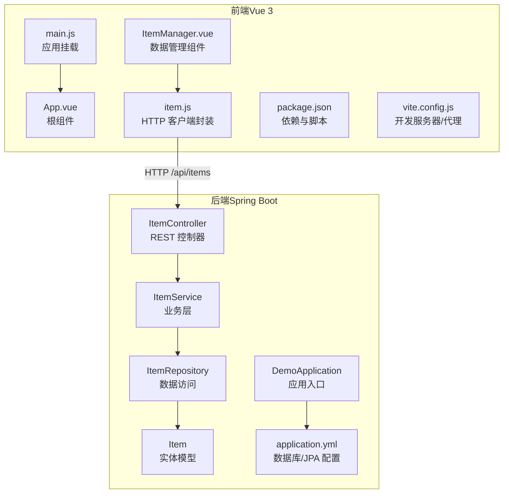
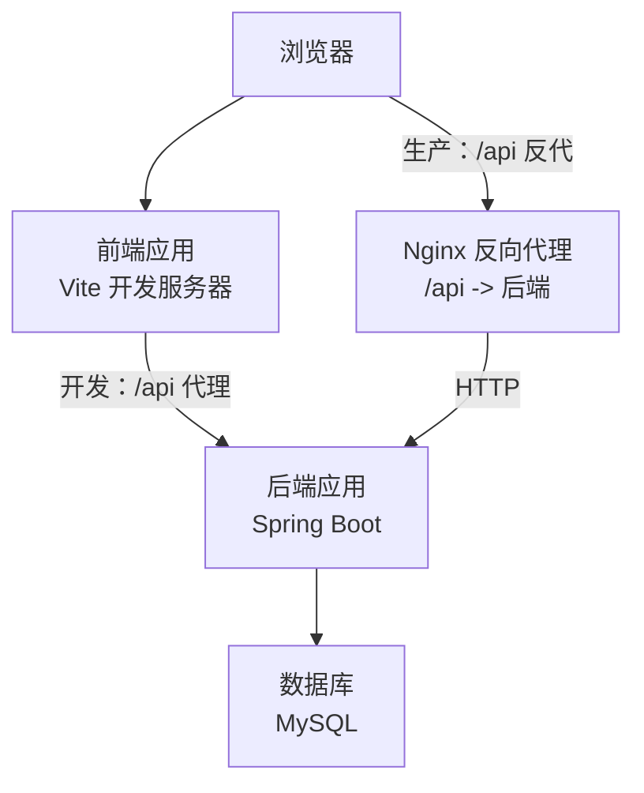
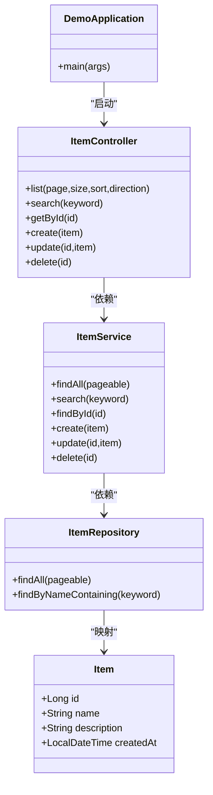
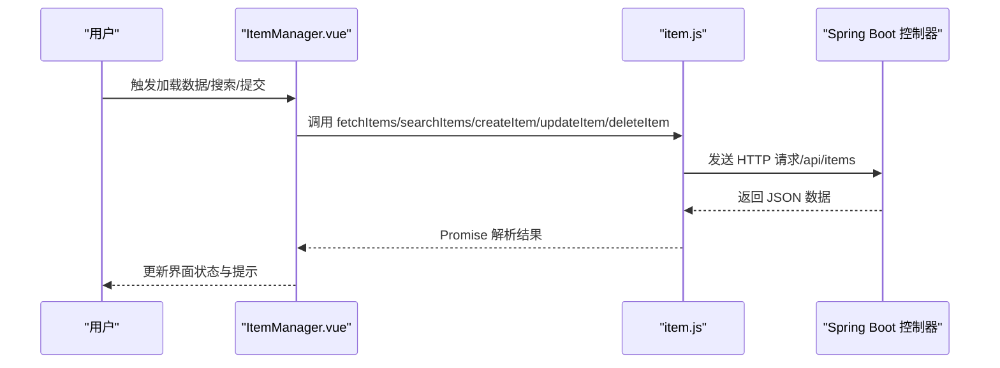
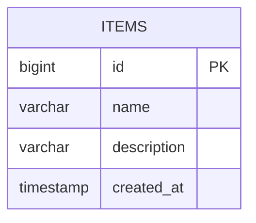
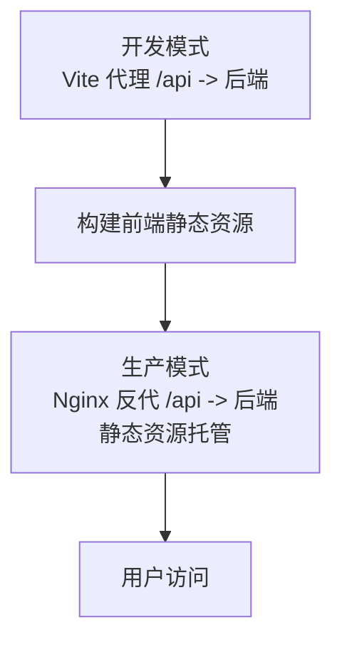
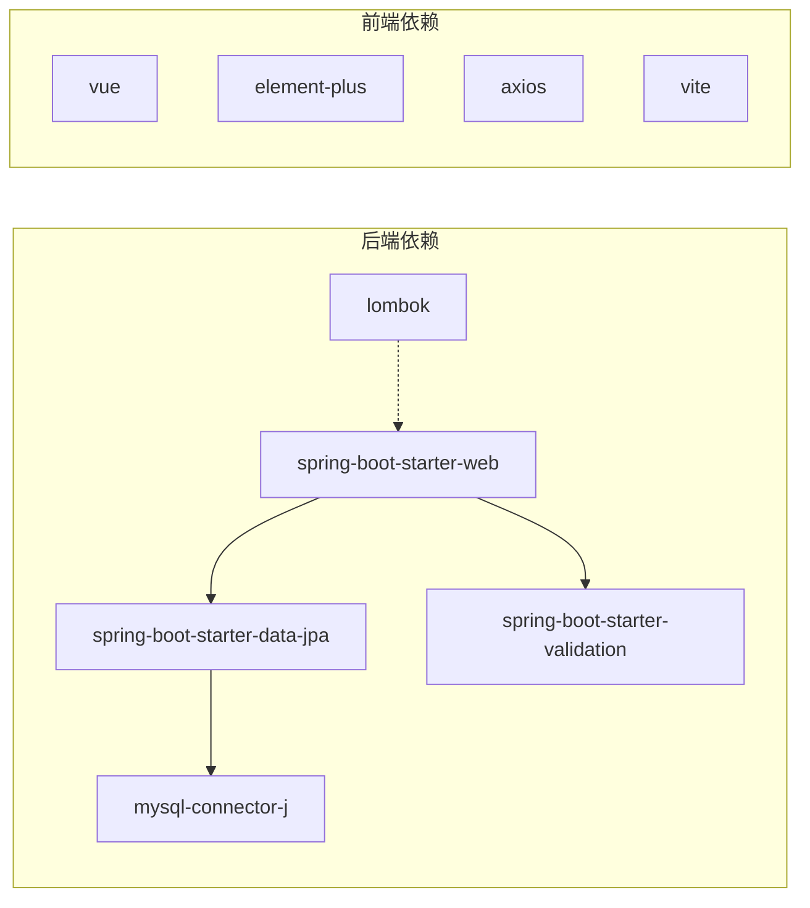

# 项目概述

<cite>
**本文引用的文件**
- [DemoApplication.java](file://backend/src/main/java/com/example/demo/DemoApplication.java)
- [ItemController.java](file://backend/src/main/java/com/example/demo/controller/ItemController.java)
- [ItemService.java](file://backend/src/main/java/com/example/demo/service/ItemService.java)
- [ItemRepository.java](file://backend/src/main/java/com/example/demo/repository/ItemRepository.java)
- [Item.java](file://backend/src/main/java/com/example/demo/entity/Item.java)
- [application.yml](file://backend/src/main/resources/application.yml)
- [pom.xml](file://backend/pom.xml)
- [item.js](file://frontend/src/api/item.js)
- [ItemManager.vue](file://frontend/src/components/ItemManager.vue)
- [App.vue](file://frontend/src/App.vue)
- [main.js](file://frontend/src/main.js)
- [package.json](file://frontend/package.json)
- [vite.config.js](file://frontend/vite.config.js)
- [README.deploy.md](file://README.deploy.md)
</cite>

## 目录
1. [简介](#简介)
2. [项目结构](#项目结构)
3. [核心组件](#核心组件)
4. [架构总览](#架构总览)
5. [详细组件分析](#详细组件分析)
6. [依赖关系分析](#依赖关系分析)
7. [性能考虑](#性能考虑)
8. [故障排查指南](#故障排查指南)
9. [结论](#结论)
10. [附录](#附录)

## 简介
本项目是一个基于前后端分离思想的轻量级 CRUD 应用，目标是演示现代 Web 应用中常见的数据管理能力：列表分页、条件搜索、新增、编辑与删除。后端采用 Spring Boot + Spring Data JPA + MySQL，前端采用 Vue 3 + Vite + Element Plus，通过 RESTful API 进行数据交互。项目既适合初学者快速理解 CRUD 的完整链路，也为有经验的开发者提供了可扩展的技术栈与部署参考。

## 项目结构
项目采用典型的“后端独立工程 + 前端独立工程”的组织方式：
- 后端位于 backend 目录，包含 Spring Boot 应用、实体、仓库、服务与控制器，以及数据库连接与 JPA 配置。
- 前端位于 frontend 目录，包含 Vue 组件、API 封装、入口与构建配置，通过代理将 /api 请求转发到后端。

图表来源
- [DemoApplication.java:1-13](file://backend/src/main/java/com/example/demo/DemoApplication.java#L1-L13)
- [ItemController.java:1-59](file://backend/src/main/java/com/example/demo/controller/ItemController.java#L1-L59)
- [ItemService.java:1-50](file://backend/src/main/java/com/example/demo/service/ItemService.java#L1-L50)
- [ItemRepository.java:1-13](file://backend/src/main/java/com/example/demo/repository/ItemRepository.java#L1-L13)
- [Item.java:1-30](file://backend/src/main/java/com/example/demo/entity/Item.java#L1-L30)
- [application.yml:1-18](file://backend/src/main/resources/application.yml#L1-L18)
- [App.vue:1-18](file://frontend/src/App.vue#L1-L18)
- [main.js:1-9](file://frontend/src/main.js#L1-L9)
- [ItemManager.vue:1-220](file://frontend/src/components/ItemManager.vue#L1-L220)
- [item.js:1-31](file://frontend/src/api/item.js#L1-L31)
- [package.json:1-21](file://frontend/package.json#L1-L21)
- [vite.config.js:1-16](file://frontend/vite.config.js#L1-L16)

章节来源
- [DemoApplication.java:1-13](file://backend/src/main/java/com/example/demo/DemoApplication.java#L1-L13)
- [application.yml:1-18](file://backend/src/main/resources/application.yml#L1-L18)
- [pom.xml:1-71](file://backend/pom.xml#L1-L71)
- [App.vue:1-18](file://frontend/src/App.vue#L1-L18)
- [main.js:1-9](file://frontend/src/main.js#L1-L9)
- [ItemManager.vue:1-220](file://frontend/src/components/ItemManager.vue#L1-L220)
- [item.js:1-31](file://frontend/src/api/item.js#L1-L31)
- [package.json:1-21](file://frontend/package.json#L1-L21)
- [vite.config.js:1-16](file://frontend/vite.config.js#L1-L16)

## 核心组件
- 后端核心层次
  - 控制器层：提供 REST 接口，负责请求参数解析、分页排序与跨域配置。
  - 业务层：封装事务性逻辑，协调实体读写与查询。
  - 数据访问层：基于 Spring Data JPA 提供分页查询与关键字检索。
  - 实体层：定义持久化字段与生命周期事件。
  - 配置层：数据库连接、JPA 方言与 DDL 行为等。
- 前端核心模块
  - 组件：集中展示与管理数据，包含搜索、分页、增删改弹窗。
  - API 封装：统一的 HTTP 客户端，集中处理 /api/items 前缀。
  - 入口与挂载：应用初始化、UI 组件注册与样式注入。
  - 构建与代理：Vite 开发服务器与反向代理配置。

章节来源
- [ItemController.java:1-59](file://backend/src/main/java/com/example/demo/controller/ItemController.java#L1-L59)
- [ItemService.java:1-50](file://backend/src/main/java/com/example/demo/service/ItemService.java#L1-L50)
- [ItemRepository.java:1-13](file://backend/src/main/java/com/example/demo/repository/ItemRepository.java#L1-L13)
- [Item.java:1-30](file://backend/src/main/java/com/example/demo/entity/Item.java#L1-L30)
- [application.yml:1-18](file://backend/src/main/resources/application.yml#L1-L18)
- [ItemManager.vue:1-220](file://frontend/src/components/ItemManager.vue#L1-L220)
- [item.js:1-31](file://frontend/src/api/item.js#L1-L31)
- [main.js:1-9](file://frontend/src/main.js#L1-L9)

## 架构总览
该系统遵循前后端分离架构，前端通过 /api 前缀调用后端接口，后端以 JSON 形式返回数据。开发阶段前端通过 Vite 代理将 /api 请求转发到后端，生产环境则由 Nginx 反向代理实现。

图表来源
- [vite.config.js:1-16](file://frontend/vite.config.js#L1-L16)
- [README.deploy.md:275-312](file://README.deploy.md#L275-L312)

## 详细组件分析

### 后端：Spring Boot 层次结构
- 应用入口：启动类负责引导 Spring Boot 应用。
- 控制器：提供 /api/items 的完整 CRUD 接口，支持分页、排序与关键字搜索。
- 服务：封装业务逻辑，处理事务与异常。
- 仓库：继承 JPA 与 Specification，提供分页与关键字查询。
- 实体：定义字段、约束与创建时间自动填充。

图表来源
- [DemoApplication.java:1-13](file://backend/src/main/java/com/example/demo/DemoApplication.java#L1-L13)
- [ItemController.java:1-59](file://backend/src/main/java/com/example/demo/controller/ItemController.java#L1-L59)
- [ItemService.java:1-50](file://backend/src/main/java/com/example/demo/service/ItemService.java#L1-L50)
- [ItemRepository.java:1-13](file://backend/src/main/java/com/example/demo/repository/ItemRepository.java#L1-L13)
- [Item.java:1-30](file://backend/src/main/java/com/example/demo/entity/Item.java#L1-L30)

章节来源
- [DemoApplication.java:1-13](file://backend/src/main/java/com/example/demo/DemoApplication.java#L1-L13)
- [ItemController.java:1-59](file://backend/src/main/java/com/example/demo/controller/ItemController.java#L1-L59)
- [ItemService.java:1-50](file://backend/src/main/java/com/example/demo/service/ItemService.java#L1-L50)
- [ItemRepository.java:1-13](file://backend/src/main/java/com/example/demo/repository/ItemRepository.java#L1-L13)
- [Item.java:1-30](file://backend/src/main/java/com/example/demo/entity/Item.java#L1-L30)

### 前端：Vue 组件与 API 封装
- 组件职责：渲染表格、分页、搜索、对话框与表单校验；统一调用 API 封装函数。
- API 封装：集中定义 baseURL 与请求方法，屏蔽具体路径差异。
- 入口与挂载：注册 Element Plus，挂载根组件。

图表来源
- [ItemManager.vue:121-154](file://frontend/src/components/ItemManager.vue#L121-L154)
- [item.js:8-30](file://frontend/src/api/item.js#L8-L30)
- [ItemController.java:23-57](file://backend/src/main/java/com/example/demo/controller/ItemController.java#L23-L57)

章节来源
- [ItemManager.vue:1-220](file://frontend/src/components/ItemManager.vue#L1-L220)
- [item.js:1-31](file://frontend/src/api/item.js#L1-L31)
- [main.js:1-9](file://frontend/src/main.js#L1-L9)

### 数据模型与持久化
- 实体字段：主键、名称、描述、创建时间。
- 生命周期：保存前自动填充创建时间。
- 查询能力：分页查询与按名称关键字匹配。

图表来源
- [Item.java:10-28](file://backend/src/main/java/com/example/demo/entity/Item.java#L10-L28)

章节来源
- [Item.java:1-30](file://backend/src/main/java/com/example/demo/entity/Item.java#L1-L30)
- [ItemRepository.java:9-12](file://backend/src/main/java/com/example/demo/repository/ItemRepository.java#L9-L12)

### 开发与生产部署流程
- 开发：前端通过 Vite 代理将 /api 请求转发到后端，便于联调。
- 生产：后端打包为 Spring Boot 可执行 JAR，前端构建静态资源，Nginx 反向代理 /api 到后端，SPA 路由回退到 index.html。

图表来源
- [vite.config.js:6-14](file://frontend/vite.config.js#L6-L14)
- [README.deploy.md:275-312](file://README.deploy.md#L275-L312)

章节来源
- [vite.config.js:1-16](file://frontend/vite.config.js#L1-L16)
- [README.deploy.md:1-422](file://README.deploy.md#L1-L422)

## 依赖关系分析
- 技术栈概览
  - 后端：Spring Boot、Spring Data JPA、MySQL Connector、Lombok、JUnit。
  - 前端：Vue 3、Element Plus、Axios、Vite。
- 关键依赖
  - 后端通过 Maven 管理依赖，使用 Spring Boot Starter Web、Data JPA、Validation 与测试。
  - 前端通过 npm 管理依赖，使用 Vue、Element Plus、Axios 与 Vite 插件。

图表来源
- [pom.xml:24-51](file://backend/pom.xml#L24-L51)
- [package.json:11-19](file://frontend/package.json#L11-L19)

章节来源
- [pom.xml:1-71](file://backend/pom.xml#L1-L71)
- [package.json:1-21](file://frontend/package.json#L1-L21)

## 性能考虑
- 分页与排序：后端提供分页与排序参数，前端按需请求，避免一次性加载大量数据。
- 查询优化：使用关键字匹配与分页结合，减少数据库压力。
- 前端交互：加载与提交状态控制，提升用户体验。
- 生产优化：建议在生产环境关闭 JPA 自动建表，使用迁移工具管理 Schema；限制 JVM 与数据库内存占用，必要时增加 Swap。

## 故障排查指南
- 后端常见问题
  - 数据库连接失败：检查 application.yml 中的数据库 URL、用户名与密码。
  - JPA 方言或方言不匹配：确认 Hibernate 方言配置与数据库类型一致。
  - 端口冲突：确认后端端口未被占用。
- 前端常见问题
  - /api 请求跨域：开发阶段已允许跨域，生产环境需确保 Nginx 反代正确。
  - 代理失效：检查 vite.config.js 中的代理配置是否指向正确的后端地址。
- 运维与监控
  - 使用 systemd 管理后端进程，查看日志定位问题。
  - 使用 journalctl 与 tail 查看日志输出。
  - 使用 ss 查看端口监听状态，确认服务正常运行。

章节来源
- [application.yml:1-18](file://backend/src/main/resources/application.yml#L1-L18)
- [vite.config.js:6-14](file://frontend/vite.config.js#L6-L14)
- [README.deploy.md:377-397](file://README.deploy.md#L377-L397)

## 结论
本项目以最小可行的方式展示了现代 Web 应用的 CRUD 能力与前后端协作模式。后端通过 Spring Boot 快速搭建 REST 服务，前端通过 Vue 3 提供直观的交互体验。配合 Nginx 反代与 systemd 管理，具备良好的可部署性与可维护性。对于初学者，这是一个理解数据流与组件职责的良好起点；对于有经验的开发者，可在现有基础上扩展认证授权、缓存策略、监控告警与自动化部署等能力。

## 附录
- 业务价值与应用场景
  - 适用于后台管理系统、内容管理、产品目录、用户管理等场景的数据增删改查需求。
- 关键特性
  - 分页与排序：支持多字段排序与分页展示。
  - 搜索：按名称关键字进行模糊匹配。
  - 增删改：完整的 CRUD 操作，包含表单校验与错误提示。
  - 前后端分离：清晰的接口边界与职责划分，便于团队协作与扩展。